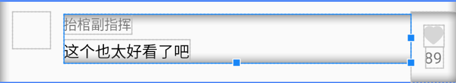
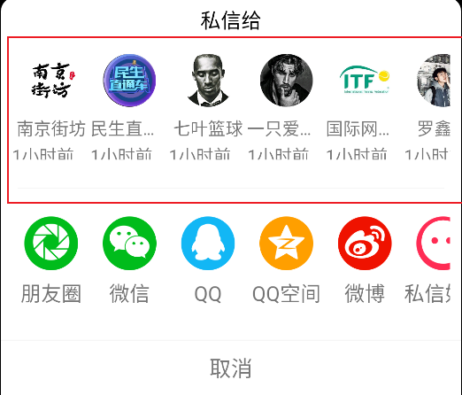
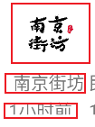
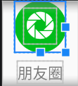

[toc]

## 00.来源

- 在likeShareEvent中我们会为ControllerView设置事件监听器，为它的四个视图，头像，喜爱，评论，分享分别设置一个点击方法。在点击事件中调用。

- 而我们为评论和分享设置的点击方法就是show一个Dialog。展示评论弹窗和分享弹框。

- ```
  private fun likeShareEvent(controllerView: ControllerView) {
          controllerView.setListener(object : OnVideoControllerListener {
              override fun onHeadClick() {
                  RxBus.getDefault().post(MainPageChangeEvent(1))
              }
  
              override fun onLikeClick() {}
              override fun onCommentClick() {
                  val commentDialog = CommentDialog()
                  commentDialog.show(childFragmentManager, "")
              }
  
              override fun onShareClick() {
                  ShareDialog().show(childFragmentManager, "")
              }
          })
      }
  ```

## 01.BaseBottomSheetDialog

- CommentDialog是评论弹框，ShareDialog是分享弹框。他们都继承自自定义的BaseBottomSheetDialog底部弹框类。

- BaseBottomSheetDialog继承自BottomSheetDialogFragment，这说明它是一个底部弹窗对话框的Fragment实现。

- 它包含onCreate和onStart两个重要生命周期方法

- 它在onCreate阶段设置了对话框的样式。

  - 调用了setStyle(STYLE_NORMAL, R.style.MyDialog)，设置了对话框的样式为R.style.MyDialog。

  - isCancelable设为true允许用户通过点击外部关闭弹窗。

  - ```
    override fun onCreate(savedInstanceState: Bundle?) {
            super.onCreate(savedInstanceState)
            setStyle(STYLE_NORMAL, R.style.MyDialog)
            isCancelable = true
        }
    
    ```

    > 这个自定义的对话框样式是什么样的呢？
    >
    > - 我们在对话框样式里设置其为禁止浮动窗口，允许占据整个屏幕。
    > - 自定义了进入和退出动画。
    >
    > 这里的进入和退出动画是什么样的呢？
    >
    > - 进入动画
    >
    >   - 对话框从屏幕底部向上滑动进入
    >
    >   - ```
    >     <translate
    >             android:fromYDelta="100%p" //动画起始位置为父容器高度的 100%（即完全位于屏幕底部之外）。
    >             android:toYDelta="0" //动画结束位置为原始位置（完全显示在屏幕中）。
    >             android:duration="250" /> //动画持续 250 毫秒。
    >     ```
    >
    > - 退出动画
    >
    >   - 对话框向下滑动到底部之外消失，与进入动画对称。
    >
    >   - ```
    >     <set xmlns:android="http://schemas.android.com/apk/res/android">
    >         <translate
    >             android:fromYDelta="0"
    >             android:toYDelta="100%p" 
    >             android:duration="250" />
    >     </set>
    >     ```
    >
    >     

- 在onStart阶段设置对话框高度，初始化其为展开状态。也就是show的时候，会通过进入动画展开到对应的高度，显示出来。

  - ```
    override fun onStart() {
        super.onStart()
        val dialog = dialog as BottomSheetDialog
        // 获取 BottomSheet 的根视图
        bottomSheet = dialog.delegate.findViewById(com.google.android.material.R.id.design_bottom_sheet)
        if (bottomSheet != null) {
            // 动态设置高度
            val layoutParams = bottomSheet!!.layoutParams as CoordinatorLayout.LayoutParams
            layoutParams.height = height // 自定义高度（例如屏幕高度）
            bottomSheet!!.layoutParams = layoutParams
            
            // 控制 BottomSheet 行为
            behavior = BottomSheetBehavior.from(bottomSheet!!)
            behavior?.peekHeight = height // 设置拖动时的“悬停”高度
            behavior?.state = BottomSheetBehavior.STATE_EXPANDED // 初始展开状态
        }
    }
    ```

    > 这里的高度是多高？
    >
    > - 默认通过displayMetrics获取全屏高度heightPixels，也就是全屏
    >
    >   - ```
    >     protected open val height: Int
    >         protected get() = resources.displayMetrics.heightPixels
    >     ```
    >
    > - 但是在评论弹框中，我们复写了该方法
    >
    >   - ```
    >     protected override val height: Int
    >         protected get() = resources.displayMetrics.heightPixels - 600
    >     ```
    >
    > - 而对于分享Dialog
    >
    >   - ```
    >     protected override val height: Int
    >         protected get() = dp2px(requireContext(), 355f)
    >             
    >     protected fun dp2px(context: Context, dpValue: Float): Int {
    >             val scale = context.resources.displayMetrics.density
    >             return (dpValue * scale + 0.5f).toInt() // +0.5f 是为了四舍五入
    >         }
    >     ```
    >
    > - dp和px是什么？
    >
    >   - `px` 是屏幕上的实际物理像素点。例如，一个 `100px × 100px` 的图片，在屏幕上会占据 100 个水平像素点和 100 个垂直像素点。
    >   - `dp` 是 Android 设计的抽象单位，用于在不同屏幕密度的设备上保持一致的物理尺寸。具体来说：使用 `dp` 可以确保一个 `10dp × 10dp` 的按钮，在低密度屏幕（如 320×480px）和高密度屏幕（如 1440×2560px）上**物理尺寸几乎相同**（约 1.6mm × 1.6mm）。
    >   - 所以我们通常设置dp，再将其转换为px，保证在不同像素密度的设备上有着相同的物理尺寸。

## 02.CommentDialog

- 布局逻辑：

  - CommentDialog是评论弹框。它是一个垂直的LinearLayout，高度是500dp，内部包裹一个tv_title的TextView显示评论数和一个RecyclerView显示评论。

    - RecyclerView高度设为0dp，并且设置了权重，那么系统会根据权重分配剩余空间。权重为1表示这个视图将占据所有剩余的空间。

    - ```
      android:layout_height="0dp"
      android:layout_weight="1"
      ```

- 代码逻辑：

  - CommentDialog在onCreateView阶段进行视图绑定

    - ```
      override fun onCreateView(inflater: LayoutInflater, container: ViewGroup?, savedInstanceState: Bundle?): View? {
              binding = DialogCommentBinding.inflate(inflater, container, false)
              return binding.root
          }
      ```

  - 在onViewCreated阶段调用init进行初始化，该方法会设置recyclerView的布局管理器，适配器，并初始化数据。

    - 布局管理器：`binding.recyclerView!!.layoutManager = LinearLayoutManager(context)`

    - 设置适配器：`binding.recyclerView!!.adapter = commentAdapter`

- 子视图布局逻辑：

  - 这里的子条目类型View是一个水平布局的LinearLayout，内部主要分为三个部分。

    - 自定义的CircleImageView类型iv_head。用于显示头像。
    - 垂直布局的LinearLayout，包含tv_nickname和tv_content两个TextView。用于显示昵称和评论。
    - 垂直布局的LinearLayout，包含IconFontTextView和tv_likecount TextView，用于显示爱心图片和评分点赞数。
    - 

- 子视图代码逻辑：

  - 其在onBindViewHolder进行ViewHolder的复用。具体是

    - 从数据源中获取数据

    - 设置条目视图的头像，昵称，评论，点赞数量。

    - ```
      override fun onBindViewHolder(holder: CommentViewHolder, position: Int) {
          holder?.binding?.let {
              /**
               * 从数据源中取得数据，并设置到条目中
               */
              var commentBean = mList[position]
              it.ivHead!!.setImageResource(commentBean?.userBean!!.head)
              it.tvNickname!!.text = commentBean?.userBean!!.nickName
              it.tvContent!!.text = commentBean?.content
              it.tvLikecount!!.text = numberFilter(commentBean.likeCount)
          }
      }
      ```

      

  > 这个数据从哪来的？
  >
  > ```
  > loadData()
  > commentAdapter.appendList(datas)
  > ```
  >
  > 
  >
  > 那么这个loadData是什么？
  >
  > - 它就是用来初始化评论数据集的。
  >
  > - 首先我们有如下成员变量
  >
  >   - 评论数据集，评论内容预置数组，点赞数预置数组。
  >
  >   - ```
  >     private val datas = ArrayList<CommentBean>()
  >     private val likeArray = intArrayOf(4919, 334, 121, 423, 221, 23)
  >     private val commentArray = arrayOf("我就说左脚踩右脚可以上天你们还不信！", "全是评论点赞，没人关注吗", "哈哈哈哈", "像谁，没看出来", "你这西安话真好听")
  >     ```
  >
  >   - 以及DataCreate类的userList表示用户信息 `var userList = ArrayList<UserBean>()`
  >
  > - 然后我们遍历用户信息列表，为每个用户构建单条评论并加入到评论数据集中。评论内容从预置数组随机选取，点赞数从预置数组随机选取
  >
  >   - ```
  >     private fun loadData() {
  >         for (i in DataCreate.userList.indices) {
  >             val commentBean = CommentBean()
  >             commentBean.userBean = DataCreate.userList[i]
  >             commentBean.content = commentArray[(Math.random() * commentArray.size).toInt()]
  >             commentBean.likeCount = likeArray[(Math.random() * likeArray.size).toInt()]
  >             datas.add(commentBean)
  >         }
  >         
  >     ```

## 03.ShareDialog

- 布局逻辑：

  - ShareDialog是分享弹框。它是一个LinearLayout线性垂直布局，分为四个部分

    - TextView，显示文字：私信给
    - RecyclerView和一个分隔符View，显示私信对象和分隔符，也就是红框部分
      - 

    - RecyclerView和一个分隔符View，显示下面的分享方式和分隔符
    - TextView，显示文字：取消。

  - 代码逻辑：

    - ShareDialog在onCreateView阶段进行视图绑定

      - ```
        override fun onCreateView(inflater: LayoutInflater, container: ViewGroup?, savedInstanceState: Bundle?): View? {
                binding = DialogShareBinding.inflate(inflater, container, false)
                return binding.root
            }
        ```
    
    - 在onViewCreated阶段调用init进行初始化，该方法会设置两个recyclerView的布局管理器，适配器。
    
      - 布局管理器
    
        - ```
          binding.rvPrivateLetter!!.layoutManager = LinearLayoutManager(context, LinearLayoutManager.HORIZONTAL, false)
          
          binding.rvShare!!.layoutManager = LinearLayoutManager(context, LinearLayoutManager.HORIZONTAL, false)
          ```
    
      - 设置适配器
    
        - ```
          binding.rvPrivateLetter!!.adapter = privateLetterAdapter
          
          binding.rvShare!!.adapter = shareAdapter
          ```

  - 私信对象的子视图逻辑：

    - 我们来看它的子条目视图，其子条目是一个垂直方向的LinearLayout，包含：

      - 自定义的CircleImageView类型iv_head显示头像
      - tv_nickname，TextView显示昵称
      - TextView显示多久之前在线，固定为一小时前。
      - 

  - 私信对象的代码逻辑：

    - 来看onBindViewHolder

      - 设置头像和tv_nickname

      - ```
        override fun onBindViewHolder(holder: PrivateLetterViewHolder, position: Int) {
            var userBean = mList[position]
            holder?.binding?.ivHead!!.setImageResource(userBean!!.head)
            holder?.binding.tvNickname!!.text = userBean?.nickName
        }
        ```

  - 分享方式的子视图逻辑：

    - 我们来看它的子条目视图，其子条目是一个垂直方向的LinearLayout，包含：

      - CardView卡片式布局容器，其为wrap_content，设置了24dp的圆角裁剪，内部有

        - View类型view_bg，背景，默认为绿色。（固定48x48dp），这里使用View是因为仅需绘制纯色背景，无需复杂功能（如文本、图片加载），`View` 是最简单的选择。它的渲染开销最低。
        - 居中显示的IconFontTextView，用于显示图标。
        - 主要是：创建一个 **纯色背景方块**，并在其上方居中显示一个图标

        > 什么是CardView？
        >
        > CardView作为一个FrameLayout，其子视图会按照顺序叠加，后面的视图覆盖在前面的视图之上。因此，背景View应该先定义，图标View后定义，以确保图标显示在背景之上。

      - tv_text，TextView，显示分享方式的名称

      - 

  - 分享方式的代码逻辑

    - 来看onBindViewHolder

      - 设置图标，文字和背景颜色

      - ```
        override fun onBindViewHolder(holder: ShareViewHolder, position: Int) {
            var shareBean = mList[position]
            holder?.binding?.tvIcon!!.setText(shareBean!!.iconRes)
            holder?.binding?.tvText!!.text = shareBean?.text
            holder?.binding?.viewBg!!.setBackgroundResource(shareBean!!.bgRes)
        }
        
        ```

      > 怎么理解这里的图标和背景，以及cardView的圆角裁切？
      >
      > - 我现在有一个字体图标，对应为：白色企鹅
      >   - 
      > - 我期待的效果是：圆形的蓝色背景的白色企鹅。
      >   - 
      > - 所以我设置它的是背景是蓝色48*48dp，这样我得到一个正方形蓝色背景，上层是该图标的cardView，然后通过圆角裁切，得到了圆形蓝色背景，上面是白色企鹅的图标。


- 我们至此就完成了评论和分享方式的显示逻辑，但是缺乏与用户的交互逻辑，如果想交互的话也很简单，比如评论条目中，用户点击爱心显示爱心动画，然后写回本地数据，同时通过DiffUtil进行局部的评论数的更新，但是这些技术我们之前的代码中都有所体现，因此没必要再做这些逻辑了。