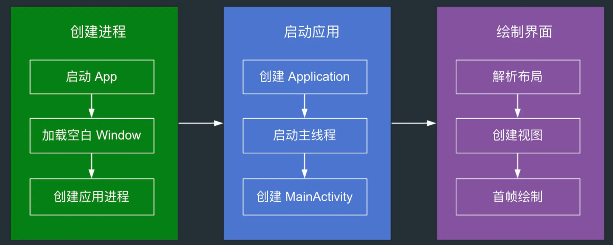
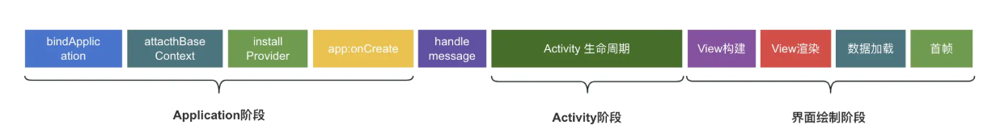

[toc]

## 01.Android性能优化介绍

- 性能优化是指提高应用程序的流畅度，给用户更好的视图和交互体验。
- 性能优化主要有以下几个方面
  - APP启动优化
  - UI绘制优化
  - 内存使用优化
  - 电量等用户次要感知项优化
  - APK瘦身

## 02.APP启动优化

### 2.1 启动优化介绍

- **启动是指用户从点击 icon 到看到页面首帧的整个过程**，启动优化的目标就是**减少**这一过程的**耗时**。启动性能是 APP 使用体验的关键点，启动过程耗时较长很可能导致用户使用 APP 的兴趣骤减。

### 2.2 启动流程介绍

- 启动流程分为系统启动流程，创建应用进程，启动应用，绘制界面。

- 我们先来看系统启动流程
  - 我们长按手机电源键开机，引导芯片代码加载引导程序 BootLoader 到 RAM 中去执行。
  - BootLoader 把操作系统拉起来。
  - Linux 启动过程中会创建init进程
  - init 解析init.rc文件，创建Zygote 进程。
  - Zygote 开始创建 JVM 并注册 JNI 方法，创建SystemServer,SystemServer并启动各种服务（AMS，PMS，WMS，PMS等）。
- 接着是应用进程的创建过程
  - 我们点击桌面APP图标，走到 Launcher应用的 onClick 方法。其会调用**startActivity(intent)** ，通过Binder机制向AMS发起请求
  - AMS 会调用`Process.start()` 方法，先收集 uid、gid 等参数，然后通过 Socket 方式发送给 Zygote 进程，请求创建新进程。
  - Zygote 进程接收到创建新进程的请求后，调用 `ZygoteInit.main()` 方法进行 `runSelectLoop()` 循环体内，当有客户端连接时执行 `ZygoteConnection.runOnce()` 方法，再经过层层调用后 fork 出新的应用进程。

- 最后是进程创建后内部的启动流程，其主要分为三步：**启动主线程，创建 Application，创建 MainActivity**。
  - 进程创建后会先调用 `ActivityThread#main()` 方法，这个ActivityThread 就相当于我们的主线程。我们在 `main()` 方法里对主线程 Handler 进行初始化
  - 我们在内部通过反射去创建 Application 并 调用其生命周期。
  - 然后通过主线程 Handler，回到主线程中执行 Activity 的创建和启动，然后执行 Activity 的相关生命周期函数。在 Activity LifeCycle 结束之后，**就会执行到 ViewRootImpl，这时才会进行真正的页面的绘制**。
- 具体流程如下：
  - 

### 2.3 应用启动状态

- 应用有三种启动状态：**冷启动、温启动和热启动**。在冷启动中，应用从头开始启动。在另外两种状态中，系统需要将后台运行的应用带入前台。启动优化一般是在冷启动的基础上进行优化，当然这样做也可以提升温启动和热启动的性能。
- 冷启动
  - **冷启动是指应用从头开始启动，也就是用户点击桌面 Icon 到应用创建完成的过程**。常见的场景是 APP 首次启动或 APP 被完全杀死后重新启动。
  - 冷启动包含以下事件序列的总经过时间：
    - 创建进程；
    - 启动主线程ActivityThread；
    - 创建Application。
    - 创建启动主 Activity；
    - 解析布局，视图绘制。
- **温启动**：
  - **温启动只是冷启动操作的一部分**。当启动应用时，后台已有该应用的进程，但是 **Activity 需要重新创建**。这样系统会从已有的进程中来启动这个 Activity，这个启动方式叫温启动。
  - 温启动常见的场景有两种：
    - 用户在退出应用后又重新启动应用。进程可能还在运行，但应用必须通过调用 `onCreate()` 重新创建 Activity。
    - 系统因内存不足等原因将应用回收，然后用户又重新启动这个应用。Activity 需要重启，但传递给 `onCreate()` 的 state bundle 已保存相关数据。
- 热启动：
  - **在热启动中，系统的工作就是将 Activity 带到前台**。只要应用的所有 Activity 仍留在内存中，就不会重复执行进程，应用以及 Activity 的创建
  - 热启动常见的场景: 当我们按了 Home 键或其它情况 App 被切换到后台，再次启动 App 的过程。

### 2.4 启动优化阶段分析

- 进程创建和主线程创建阶段都是系统做的。创建 Application 和 Activity 以及视图绘制才和我们的代码有一定的关系。所以我们可以干预的就是这方面的。具体如下：
  - 
- Application阶段：在 Application阶段，可以在 attachBaseContext，installProvider 和 app:onCreate 三个时间段进行相关优化。
  - **bindApplication**：APP 进程由 zygote 进程 fork 出来后会执行 ActivityThread 的 main 方法，该方法最终触发执行 `bindApplication()`，这也是 Application 阶段的起点；
  - **attachBaseContext**：在应用中最早能触达到的生命周期，本阶段也是最早的预加载时机；
  - **installProvider**：很多三方 sdk 借助该时机来做初始化操作，很可能导致启动耗时的不可控情形，需要按具体 case 优化；
  - **onCreate**：这里有很多三方库和业务的初始化操作，是通过异步、按需、预加载等手段做优化的主要时机，它也是 Application 阶段的末尾。
- Activity阶段：主要是其生命周期方法，最关键的是onCreate。
  - `onCreate()`，这个阶段中包含了大量的 UI 构建、对象初始化等耗时任务，是我们在优化启动过程中非常重要的一环，我们可以通过异步、预加载、延迟执行等手段做各方面的优化。
- 界面绘制阶段：**View 的整体渲染阶段**，涵盖 measure、layout、draw 三部分，这里可尝试从层级、布局、渲染上取得优化收益。

### 2.5 统计启动耗时

- Displayed：

  - 在 Android Studio Logcat 中过滤关键**Displayed**，可以看到对应的冷启动耗时日志值。**此值代表从启动进程到在屏幕上完成对应 Activity 的绘制所用的时间**。

  - ```
    Displayed com.sum.tea/com.sum.main.MainActivity: +2s141ms
    ```

  - **这种方式最简单，适用于收集 App 与竞品 App 启动耗时对比分析**。

- adb shell命令

  - 通过 `adb` shell activity Manager 命令运行应用来测量耗时时间。

  - ```
    adb shell am start -W [packageName]/[启动Activity的全路径]
    adb shell am start -W com.sum.tea/com.sum.main.MainActivity
    
    Starting: Intent { act=android.intent.action.MAIN cat=[android.intent.category.LAUNCHER] cmp=com.sum.tea/com.sum.main.MainActivity }
    Status: ok
    Activity: com.sum.tea/com.sum.main.MainActivity
    ThisTime: 1913
    TotalTime: 1913
    WaitTime: 2035
    ```

  - 这种方式缺点是不能带到线上而且不能**精确**控制启动时间的开始和结束，**数据不够严谨**。

- 其它还有自定义埋点等。

### 2.6 APP启动白屏问题

- 在应用启动过程中会出现一段时间显示白屏，它是因为系统默认使用 `windowBackground` 属性作为临时背景，若未定制则显示空白。

- 解决方案：

  - 设置 windowbackgroud 为透明的

    - 通过设置windowIsTranslucent属性为true实现

    - ```
      <item name="android:windowIsTranslucent">true</item>
      ```

    - 它有一个缺点，会导致所有Activity都应用这个主题，这可能不是理想的，我们只希望入口界面是这个样子。所以我们来看另一个方法

  - 定制启动主题

    - style中设置主题

      - ```
        <!-- styles.xml -->
        <style name="AppTheme.Launcher">
            <item name="android:windowFullscreen">true</item>
            <item name="android:windowBackground">@drawable/splash_background</item>
            <item name="android:windowTranslucentStatus">true</item>
        </style>
        ```

    - 配置启动页主题

      - ```
        <activity 
            android:name=".SplashActivity"
            android:theme="@style/AppTheme.Launcher">
            <intent-filter>
                <action android:name="android.intent.action.MAIN"/>
                <category android:name="android.intent.category.LAUNCHER"/>
            </intent-filter>
        </activity>
        ```

    - **Activity 中设置和恢复主题**

      - ```
        @Override
        protected void onCreate(Bundle savedInstanceState) {
            setTheme(R.style.AppTheme);  // 必须放在 super 之前调用
            super.onCreate(savedInstanceState);
            setContentView(R.layout.activity_main);
        }
        ```


## 03.UI绘制优化

为了加速你的View，你要做到符合如下要求：

- **扁平化视图层级**：每个视图层级都会增加 `measure` 和 `layout` 的复杂度。扁平化视图层级可以减少measure和layout的调用

- **自定义 ViewGroup 优化布局逻辑**：默认的 `ViewGroup` 测量逻辑会遍历所有子视图，可能造成性能浪费。我们可以 通过自定义ViewGroup的测量逻辑来优化性能

- **避免在 `onDraw` 中分配对象**：这会导致频繁的内存分配和垃圾回收（GC）。

- **优化`invalidate`**：调用 `invalidate()` 会触发 `onDraw`，过于频繁的 `invalidate()` 调用会增加 CPU 和 GPU 的负担。因此要符合如下要求：

  - 避免不必要的 `invalidate()` 调用。
  - 如果只需要更新部分区域，使用带四个参数的 `invalidate(left, top, right, bottom)` 方法，限制重绘区域。
- 除此之外，在使用ViewHolder的时候。我们可以通过diffUtil进行条目级别视图的更新。

## 04.内存使用优化

### 4.1 内存问题和现象分析

- 内存问题主要是有内存抖动、内存泄露、内存溢出这三类问题。
- 内存抖动
  - 内存抖动指的是在短时间内频繁地创建和销毁对象，导致垃圾回收（GC）频繁触发，而GC执行时会暂停主线程（Stop-The-World事件）。持续的卡顿会影响用户体验，甚至导致应用无响应（ANR）。
  - 它会产生雪崩效应，你GC次数越多，产生的内存碎片越多，虽然可以内存整体上足够对象分配，但是都是碎片的，单个碎片不支持，导致后续GC更频繁。
  - 很多时候是由于我们在onDraw这种频繁调用的方法中创建对象导致的。
- 内存泄漏：
  - 内存泄漏是指：本该被回收的对象没有被回，继续停留在内存空间中，比如：Activity引用被静态变量持有，导致Activity销毁后无法回收。它是由于持有引用者的生命周期 > 被持有引用者的生命周期造成的。
- 内存溢出：
  - 每个Android应用独立运行在虚拟机中，系统在堆中为其分配的进程私有空间有大小限制。假如应用申请的内存**超过系统分配给它的内存上限**，导致虚拟机（如Android的ART/Dalvik VM）无法继续分配所需内存，最终触发崩溃（Crash）。
  - 常见原因：
    - **瞬时内存需求过大**：一次性加载超大资源（如未压缩的高分辨率图片）。
    - 内存泄漏累积：Activity因被静态引用无法回收，多次泄漏后堆内存耗尽。
    - 资源不释放：未关闭文件流、数据库游标或网络连接。

### 4.2 内存优化方法

- 可以在合适的时候适当采用软引用和弱引用来替代强引用。软引用在内存不足时，进行GC会回收。弱引用只要GC就会回收。
- 避免在onDraw这种频繁调用的方法里创建对象。这些方法会被多次调用，在其内部创建对象会导致系统频繁申请存储空间并触发 GC，导致内存抖动。
- 尽量使用IntentService替代Service。启动一个 Service 时，系统会倾向于将这个 Service 所依赖的进程进行保留，这样就会导致这个进程变得非常**消耗内存**。因此我们最好使用IntentService，其在后台任务执行结束后会自动停止。
- 第三方库可能会影响应用的内存用量。可以通过从代码中移除冗余、不必要或臃肿的组件、资源和库，降低应用的内存用量。
- 在 Activity 的 `onPause()`，`onStop()`，`onDestory()` 中根据场景释放其引用到的 Bitmap、DrawingCache 等资源，以降低发生内存泄漏时对应用内存的压力。
