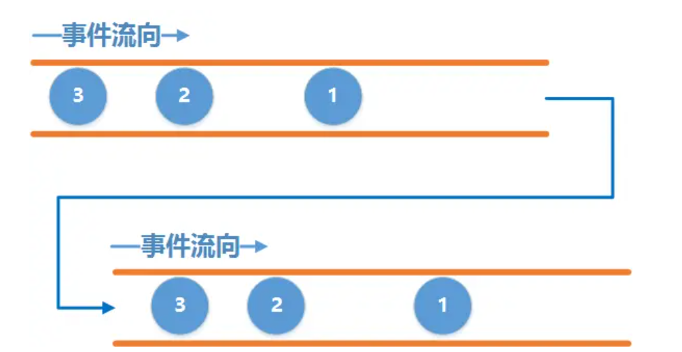

[toc]

## 00.RxJava介绍

- RxJava是用来实现异步操作的库，类似于Handler的作用，它是基于事件流的链式调用。

- 那么问题来了，我们有Handler，为什么需要RxJava呢？它由什么优越的地方吗？

  - 传统的消息队列（例如 Android 的 `Handler` + `Looper`）本质是一个 **任务分发机制**，用于将任务投递到指定线程执行。但是它无法处理复杂的异步操作流，比如我们要进行两个网络请求的串行执行

    - 启动一个子线程执行第一个网络请求 `fetchDataFromNetwork1()`。

    - 执行完成后，通过post，发送一个异步任务给主线程。

    - 在主线程中启动第二个子线程，执行第二个网络请求。

    - 完成第二个网络请求后，根据结果更新UI

    - ```
      new Thread(() -> {
          // 子线程执行第一个网络请求
          String result1 = fetchDataFromNetwork1();
          
          // 切换到主线程处理结果
          Handler mainHandler = new Handler(Looper.getMainLooper());
          mainHandler.post(() -> {
              // 主线程中启动第二个子线程
              new Thread(() -> {
                  // 第二个网络请求（依赖第一个请求的结果）
                  String result2 = fetchDataFromNetwork2(result1);
                  
                  // 再次切回主线程更新UI
                  mainHandler.post(() -> updateUI(result2));
              }).start();
          });
      }).start();
      ```

  - RxJava将异步操作抽象为 **事件流**（Observable Stream），通过链式调用组合操作符，解决复杂异步场景的问题。

    - **fetchData1()**：发起第一个网络请求（自动在 `Schedulers.io()` 线程执行）。

    - **flatMap**：将第一个请求的结果 `result1` 作为输入，发起第二个请求 `fetchData2(result1)`。

    - **subscribeOn**：指定整个链式调用在IO线程执行。

    - **observeOn**：切换结果处理到主线程。

    - **subscribe**：最终消费结果或处理错误。

    - ```
      apiService.fetchData1()
          .flatMap(result1 -> apiService.fetchData2(result1))
          .subscribeOn(Schedulers.io())
          .observeOn(AndroidSchedulers.mainThread())
          .subscribe(result2 -> updateUI(result2), error -> handleError(error));
      ```

  - 对比过会，我们发现

    - | **特性**     | **Handler方案**          | **RxJava方案**                         |
      | :----------- | :----------------------- | :------------------------------------- |
      | **代码结构** | 嵌套层级深，可读性差     | 链式调用，线性展开                     |
      | **线程管理** | 手动创建线程，易出错     | 自动通过 `Scheduler` 管理              |
      | **错误处理** | 分散在各层回调中         | 统一通过 `onError` 处理                |
      | **资源释放** | 需手动关闭线程和Handler  | 通过 `Disposable` 自动管理             |
      | **扩展性**   | 添加新操作需修改嵌套结构 | 只需插入新操作符（如 `filter`、`map`） |

## 01.RxJava原理

### 1.1 RxJava各个组件

- RxJava主要包含4个角色

  - |          角色          | 作用                                    |
    | :--------------------: | --------------------------------------- |
    | 被观察者（Observable） | 产生事件                                |
    |   观察者（Observer）   | 接收事件，并给出响应动作                |
    |   订阅（Subscribe）    | 连接 被观察者 & 观察者， 相当于注册监听 |
    |     事件（Event）      | 被观察者 & 观察者 沟通的载体            |

- 这里用两根水管代替观察者和被观察者, 先假设有两根水管：上面一根水管为事件产生的水管，叫它`上游`吧，下面一根水管为事件接收的水管叫它`下游`吧。两根水管通过一定的方式连接起来，使得上游每产生一个事件，下游就能收到该事件。 这里的`上游`和`下游`就分别对应着RxJava中的`Observable`和`Observer`，它们之间的连接就对应着`subscribe()`

  - 

- 我们来举实例说明上面的关系

  - 这里创建一个被观察者，在被订阅后会发送3个next事件，一个complete事件。

  - 这个被观察者同时也是一个观察者，他订阅自身，然后执行对应事件的操作。

  - 当上游和下游建立连接之后，上游才会发送事件，也就是调用了`subscribe()` 方法之后才开始发送事件.

  - ```
    public static void case1() {
        Observable.create(new ObservableOnSubscribe<Integer>() {
            @Override
            public void subscribe(ObservableEmitter<Integer> emitter) throws Exception {
                emitter.onNext(1);
                emitter.onNext(2);
                emitter.onNext(3);
                emitter.onComplete();
            }
        }).subscribe(new Observer<Integer>() {
            @Override
            public void onSubscribe(Disposable d) {
                Log.d(TAG, "onSubscribe");
            }
    
            @Override
            public void onNext(Integer value) {
                Log.d(TAG, "onNext: value = " + value);
            }
    
            @Override
            public void onError(Throwable e) {
                Log.d(TAG, "onError: " + e.toString());
            }
    
            @Override
            public void onComplete() {
                Log.d(TAG, "onComplete");
            }
        });
    }
    ```

  - ```
    08-05 17:00:05.072 24086 24086 D ChapterOne: onSubscribe
    08-05 17:00:05.073 24086 24086 D ChapterOne: onNext: value = 1
    08-05 17:00:05.073 24086 24086 D ChapterOne: onNext: value = 2
    08-05 17:00:05.073 24086 24086 D ChapterOne: onNext: value = 3
    08-05 17:00:05.073 24086 24086 D ChapterOne: onComplete
    ```

### 1.2 `ObservableEmitter`和`Disposable`.

- 接下来解释一下其中两个陌生的玩意：`ObservableEmitter`和`Disposable`.

  -  ObservableEmitter： Emitter是发射器的意思，那就很好猜了，这个就是用来发出事件的，它可以发出三种类型的事件，通过调用emitter的`onNext(T value)`、`onComplete()`和`onError(Throwable error)`就可以分别发出next事件、complete事件和error事件。
  - 但是，请注意，并不意味着你可以随意乱七八糟发射事件，需要满足一定的规则：
    - 上游可以发送无限个onNext, 下游也可以接收无限个onNext.
    -  当上游发送了一个onComplete后, 上游onComplete之后的事件将会`继续`发送, 而下游收到onComplete事件之后将`不再继续`接收事件.
    - 当上游发送了一个onError后, 上游onError之后的事件将`继续`发送, 而下游收到onError事件之后将`不再继续`接收事件.
    - 上游可以不发送onComplete或onError.
    - 最为关键的是onComplete和onError必须唯一并且互斥, 即不能发多个onComplete, 也不能发多个onError, 也不能先发一个onComplete, 然后再发一个onError, 反之亦然
  - 介绍了ObservableEmitter, 接下来介绍Disposable, 这个单词的字面意思是一次性用品,用完即可丢弃的. 那么在RxJava中怎么去理解它呢, 对应于上面的水管的例子, 我们可以把它理解成两根管道之间的一个机关, 当调用它的`dispose()`方法时, 它就会将两根管道切断, 从而导致下游收不到事件. 相当于我们平时注册监听后，用完了，要反注册监听。
    - 注意: 调用dispose()并不会导致上游不再继续发送事件, 上游会继续发送剩余的事件.

- 我们来举实例说明

  - 这里我们会在onNext处理方法中，发现mCount == 2的时候，也就是接收到两条消息的时候，调用Disposable.dispose();断开连接。所以我们期望的结果是，观察者只能接收到两条消息，后续被观察者发送的消息我们无法获取。

  - ```
    public static void case2() {
        Observable.create(new ObservableOnSubscribe<Integer>() {
            @Override
            public void subscribe(ObservableEmitter<Integer> emitter) throws Exception {
                Log.d(TAG, "emit 1");
                emitter.onNext(1);
                Log.d(TAG, "emit 2");
                emitter.onNext(2);
                Log.d(TAG, "emit 3");
                emitter.onNext(3);
                Log.d(TAG, "emit onComplete");
                emitter.onComplete();
                Log.d(TAG, "emit 4");
                emitter.onNext(4);
            }
        }).subscribe(new Observer<Integer>() {
            private Disposable mDisposable;
            private int mCount = 0;
    
            @Override
            public void onSubscribe(Disposable d) {
                Log.d(TAG, "onSubscribe");
                mDisposable = d;
            }
    
            @Override
            public void onNext(Integer value) {
                Log.d(TAG, "onNext: value = " + value);
                mCount++;
                if (mCount == 2) {
                    Log.d(TAG, "dispose");
                    mDisposable.dispose();
                    Log.d(TAG, "isDisposed : " + mDisposable.isDisposed());
                }
            }
    
            @Override
            public void onError(Throwable e) {
                Log.d(TAG, "onError: " + e.toString());
            }
    
            @Override
            public void onComplete() {
                Log.d(TAG, "onComplete");
            }
        });
    }
    ```

  - ```
    08-05 17:06:53.809 24399 24399 D ChapterOne: onSubscribe
    08-05 17:06:53.809 24399 24399 D ChapterOne: emit 1
    08-05 17:06:53.809 24399 24399 D ChapterOne: onNext: value = 1
    08-05 17:06:53.809 24399 24399 D ChapterOne: emit 2
    08-05 17:06:53.809 24399 24399 D ChapterOne: onNext: value = 2
    08-05 17:06:53.809 24399 24399 D ChapterOne: dispose
    08-05 17:06:53.809 24399 24399 D ChapterOne: isDisposed : true
    08-05 17:06:53.809 24399 24399 D ChapterOne: emit 3
    08-05 17:06:53.809 24399 24399 D ChapterOne: emit onComplete
    08-05 17:06:53.809 24399 24399 D ChapterOne: emit 4
    ```

## 02.线程调度

- 我们之前设置的是上游和下游是工作在同一个线程中的, 也就是说上游在哪个线程发事件, 下游就在哪个线程接收事件. 

- 但是，我们有其它需求场景，比如常见的，需要在子线程中实现耗时的操作；然后回到主线程实现 `UI`操作。怎么办？

  -  解决方案：采用 `RxJava`内置的线程调度器（ `Scheduler` ），即通过 功能性操作符`subscribeOn（）` & `observeOn（）`实现。

  - 作用：线程控制，即指定 被观察者 `（Observable）` / 观察者`（Observer）` 的工作线程类型。

  - 线程类型：

  - | 类型                           | 含义                  | 应用场景                         |
    | ------------------------------ | --------------------- | -------------------------------- |
    | Schedulers.immediate()         | 当前线程 = 不指定线程 | 默认                             |
    | AndroidSchedulers.mainThread() | Android主线程         | 操作UI                           |
    | Schedulers.newThread()         | 常规新线程            | 耗时等操作                       |
    | Schedulers.io()                | io操作线程            | 网络请求、读写文件等io密集型操作 |
    | Schedulers.computation()       | CPU计算操作线程       | 大量计算操作                     |

  > 补充：
  >
  >  若`Observable.subscribeOn（）`多次指定被观察者 生产事件的线程，则只有第一次指定有效，其余的指定线程无效。
  >
  > 若Observable.observeOn（）多次指定观察者 接收 & 响应事件的线程，则每次指定均有效，即每指定一次，就会进行一次线程的切换。

- ok，我们来看一下具体实例

  - 首先创建一个被观察者，指定他在Schedulers.io()类型线程中执行。

  - 第二次subscribeOn(Schedulers.newThread())指定失败

  - 调用doOnNext，在Schedulers.io()类型线程中打印

  - 切换线程到Schedulers.computation()中

  - 再次切换到AndroidSchedulers.mainThread()中

  - 在里面执行subscribe订阅操作，订阅被观察者，打印信息

  - ```
    Observable.create(emitter -> {
        Log.d("Emitter Thread: " + Thread.currentThread().getName()); // 代码1
        emitter.onNext(1);
    })
    .subscribeOn(Schedulers.io())          // 第一次指定生产线程
    .subscribeOn(Schedulers.newThread())   // 无效（仅第一次生效）
    .doOnNext(i -> 
        Log.d("doOnNext Thread: " + Thread.currentThread().getName())) // 代码2
    .observeOn(Schedulers.computation())   // 第一次切换消费线程
    .observeOn(AndroidSchedulers.mainThread()) // 第二次切换消费线程
    .subscribe(i -> 
        Log.d("Subscribe Thread: " + Thread.currentThread().getName())); // 代码3
    ```

  - ```
    Emitter Thread: RxCachedThreadScheduler-1  // 代码1
    doOnNext Thread: RxCachedThreadScheduler-1  // 代码2
    onNext: accept: thread: main  // 代码3
    ```

## 03.底层原理

### 3.1 底层原理

- 线程的切换依赖于任务调度器，事件的传递依赖于消息队列。

- 考虑一个带复杂的线程调度的情况

  - 我们subscribeOn(Schedulers.io()) 指定生产线程，从任务调度器的io线程池中取出一个作为生产线程，切换运行，后续的上游发布事件的操作在里面进行。
  - 在生产线程中我们通过next发布一个事件，然后通过observeOn(Schedulers.computation())指定消费线程，从任务调度器的CPU计算操作线程池中取出一个作为消费线程，把这个事件封装成一个msg，发到这个消费线程的消息队列中。然后切换线程，由其进行消费。

  > **主线程**：通过 `Handler.post()` 将任务封装为 `Message`，投递到 `Looper` 的消息队列。
  >
  > **线程池（如 `io()`、`computation()`）**：通过 `Executor.execute()` 将任务提交到线程池的任务队列，**不涉及 `Message`**。

  - 代码如下：

  - ```
    Observable.create(emitter -> {
        Log.d("Emitter Thread: " + Thread.currentThread().getName()); // 代码1
        emitter.onNext(1);
    })
    .subscribeOn(Schedulers.io())          // 第一次指定生产线程
    .subscribeOn(Schedulers.newThread())   // 无效（仅第一次生效）
    .observeOn(Schedulers.computation())   // 第一次切换消费线程
    .subscribe(i -> 
        Log.d("Subscribe Thread: " + Thread.currentThread().getName())); // 代码3
    ```

- 任务调度器：包含线程池和线程切换逻辑。

  - | **Scheduler类型**                | **底层实现**                                                 |
    | :------------------------------- | :----------------------------------------------------------- |
    | `Schedulers.io()`                | 基于 `ExecutorService` 的动态线程池（`CachedThreadScheduler`），适合IO密集型任务 |
    | `Schedulers.computation()`       | 固定大小的线程池（线程数=CPU核心数），适合计算密集型任务     |
    | `AndroidSchedulers.mainThread()` | 通过 `Handler` 绑定到主线程的 `Looper`（本质是向主线程的消息队列发送任务） |

### 3.2 Executor

- Executor：消息队列是Android特有的机制看，在此无需多言。只讲**Executor.execute()**，它是Java标准库，用来管理线程池，执行异步操作。

- Executor.execute()执行流程：

  - ```
    [调用 execute(Runnable task)]  
        → 线程池检查核心线程数  
            → 若核心线程未满，创建新线程执行任务  
            → 若核心线程已满，将任务加入队列  
                → 队列满时，根据策略拒绝任务或扩容线程  
    ```

- 以 `ThreadPoolExecutor` 为例

  - 若核心线程未满，创建新线程执行当前任务

  - 若线程池已满  ，将任务加入队列  。当有线程执行完自身任务后，会从中取出任务继续执行。

  - 若没任务，那么线程池中线程会被睡眠，等待任务的到来。

  - ```
    public class ThreadPoolExecutor extends AbstractExecutorService {
        private final BlockingQueue<Runnable> workQueue; // 任务队列
        private final ReentrantLock mainLock = new ReentrantLock();
        private final HashSet<Worker> workers = new HashSet<>(); // 工作线程集合
    
        public void execute(Runnable command) {
            if (workerCount < corePoolSize) {
                addWorker(command, true); // 创建新线程
            } else if (workQueue.offer(command)) { // 任务入队
                // ...
            } else {
                reject(command); // 拒绝策略
            }
        }
    }
    ```

- Executor和消息机制的差异

  - 使用场景
    - **Executor**：适合 **无状态任务**（如网络请求、计算），无需关心执行顺序。
    - **Handler**：适合 **有状态通信**（如UI更新），需要保证时序和线程安全。
  - **线程管理方式不同**
    - **Executor**：通过线程池复用线程，自动管理生命周期。
    - **Handler**：依赖 `Looper` 的消息循环，线程持续存活等待消息。
