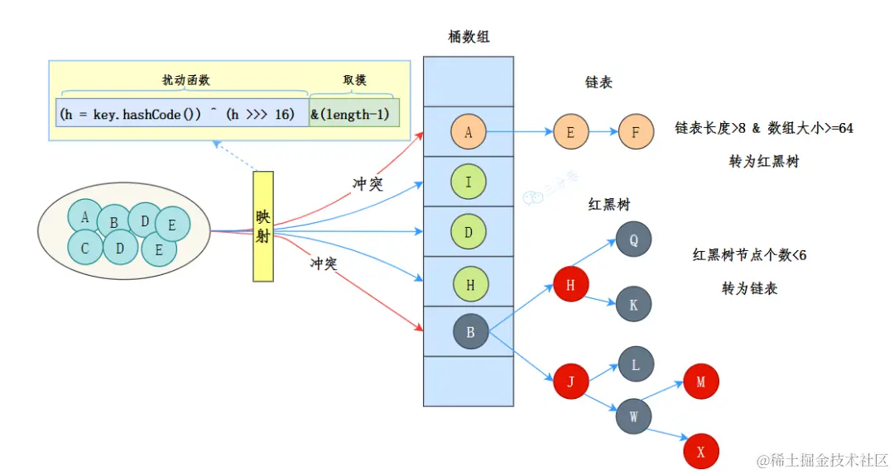
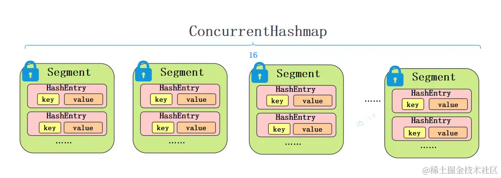
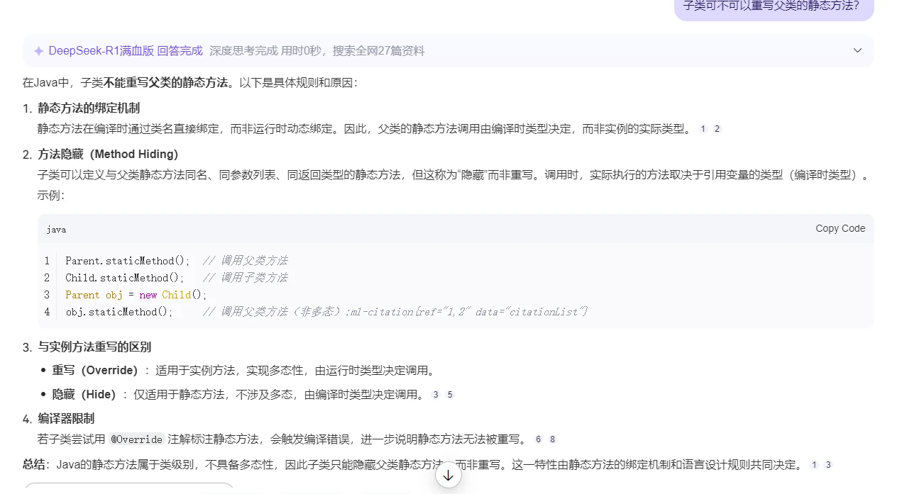

[toc]

## 00.问题分析

\- tcp是哪个层，和udp区别

\- http get 和 post 

 GET和POST的区别？


\- 平衡二叉树的概念 

、


在项目中的任务？（我是页面加联网请求数据）
 \- 页面用到了哪些组件？
 \-
 \- 进程和线程了解吗？（这个问题我卡住了一下，线程一时想不起描述，后来面试官提示了一点就接着往下说）
 \- Andriod四大组件？每一个是干什么的（除了Activity之外其实都不是很了解，，我就重点说了Activity）


- 


二分查找

了解排序算法吗？讲讲快排。把一个完全有序的序列排序时间代价最小的是哪种？（插入排序）


-我们假设一个经常发生的场景，某个前台UI需要通过[服务器](https://cloud.tencent.com/product/cvm/?from_column=20065&from=20065)获取数据，比如获取今天的天气情况。

 讲讲Android进程。前台进程、后台进程……这块不大会

有开发经验的同学立马就知道必须开子线程去进行网络操作，再通过线程间交互把数据回传。我们贴两段简单的代码吧~

```
Thread getWeather = new Thread(){
    @Override
    public void run() {
        //获取天气数据
        ...
        handler.sendMessage(result);
    }
};

Handler handler = new Handler(Looper.getMainLooper()) {
    @Override
    public void handleMessage(Message msg) {
        //处理天气数据
        ...
    }
};
```


- 

- 各种Layout差别，性能差别，特性差别
- RecyclerView 这玩意儿太重要了铁子们，关于这个东西的缓存机制，分段加载，等等问的非常多，直接就能看出来你的实战经验丰不丰富
- AsyncTask
- HandlerThread，IntentService
- LruCache：这里就可以引入LinkedHashMap
- Activity、Window、DecorView、ViewRootImpl、AMS ...这些个东西之间的关系，一定要捋清楚。
- View的Measure，Layout，Draw。这部分内容概念很简单，但是面试不会问你简单的概念，都是通过场景来问你怎么处理，所以结合一定的实践需要深刻理解。
- IPC通信方法以及Binder机制 重中之重 基本必问，内容很多，大家自行选择学习方法。
- Bitmap压缩
- 动画 动画这部分也是看你有没有实战过的常问问题，被问了几次都不是常规的概念问题。
- dp sp px
- sharePreferences

### Android进阶相关：

- Android多线程端点续传
- 全局异常捕获过吗，怎么搞的
- MVC，MVP，MVVM
- Binder原理，架构
- Activity启动流程
- 内存泄漏优化，布局优化
- 组件化，热修复热更新原理
- 权限机制
- RequestLayout/Invalidate区别
- LayoutInflater
- 框架原理：okhttp，Retrofit，Glide，Arouter

### 计算机网络以及操作系统：

- 
- 线程进程 重点，包括区别，通信等等
- 内存管理
- 死锁，异步同步等概念

作者：牛牛！向前冲！
链接：https://www.nowcoder.com/discuss/356113120136318976?sourceSSR=search
来源：牛客网


线程池

线程的状态

线程的同步和异步。

**同步**：A线程要请求某个资源，但是此资源正在被B线程使用中，因为同步机制存在，A线程请求

不到，怎么办，A线程只能等待下去,等待B完成后进行操作。

**异步**：A线程要请求某个资源，但是此资源正在被B线程使用中，因为没有同步机制存在，A线程

仍然请求的到。

​     线程同步最最安全，最保险的，但是性能会有所下降。

​     线程的同步和异步既有好处也有坏处我们一定要分情况，适当的使用。

5.1.那么我们如何实现线程的同步呢？

​     **答案是：Synchronized**

  **5.1.1:方式一：**

​    **同步代码块：  synchronized(同步对象)｛ 需要同步的代码 ｝**

 回到我们的代码中如图：

## 01.JAVA方面

### 1.1 Java语言和Kotlin语言的区别

- Kotlin的存在是考虑到Java语言在当今现代开发中的缺陷。它具备简洁的语法和现代化的语法特性，与 Java 相比，用 Kotlin 编写的代码块更小。

- Kotlin 将代码编译为可以在 JVM 中执行的字节码。因此，所有用 Java 制作的库和框架都在 Kotlin 项目中都通用

- Kotlin有如下优点：

  - 类型推断，我们只需要通过val text = 10。//无需显示变量类型，Kotlin 自动识别为 Int 类型 

  - 智能类型转换：Kotlin 的编译器能够自动进行类型转换。在许多情况下，不需要在 Kotlin 中使用显式转换运算符 ` print(x.length) *// x 自动转换为字符串*`

  - 扩展函数：Kotlin 允许我们在不继承现有类的情况下扩展现有类的功能。声明一个扩展函数，需要在它的名字前面加上一个接收器类型，即被扩展的类型。

    - 下面为 MutableList 添加了一个用于指定下标进行数值交换的函数：

    - ```
      fun MutableList <Int> .swap(index1: Int, index2: Int) { 
        val tmp = this[index1] 
        this[index1] = this[index2] 
        this[index2] = tmp 
      }
      ```
  
  - 数据类：使用 Java 编写数据类，通常开发者需要定义一个构造函数、几个存储数据的字段、每个字段的 getter 和 setter 函数，以及 equals()、hashCode() 和 toString() 函数。Kotlin 有一种非常简单的方法来创建这样的类。开发者只需要在类定义中包含 data 关键字，编译器将自行处理整个任务。 `data class Book(var title: String, var author: Author)`

### 1.2 HashMap

- 说一下HashMap怎么实现的，扩容机制

  - HashMap 基于 **数组 + 链表/红黑树** 实现：

    - **数组（桶）**：存储链表的头节点或红黑树的根节点。
    - **链表**：哈希冲突时，键值对以链表形式存储（Java 8 前）。也就是说，链表是用来处理散列冲突的。

    - **红黑树**：当链表长度超过阈值（默认8），链表转为红黑树（Java 8+）。

      

    - 

  - 当元素数量 > `容量 * 负载因子`（默认负载因子 0.75）时，触发扩容，首先将数组容量翻倍，然后重新计算所有元素的索引拷贝到新数组中。

- HashMap是线程安全的吗？为什么？线程不安全会导致哪些后果？

  - HashMap 是非 线程安全的的，因为他的核心方法，put，get等未加锁。
  - 会导致：并发插入导致部分键值对未被保存产生数据丢失。

- 如何解决HashMap线程不安全的问题？

  - 使用**ConcurrentHashMap**。

  - 它最开始采用分段锁实现

    - 它的内部结构可以理解为一个包含多个 `Segment` 的数组，每个 `Segment` 类似于一个小型的 `HashMap`。每个 `Segment` 都可以独立加锁。
    - 

    - 它的get操作：将 Key 通过 Hash 之后定位到具体的 Segment ，再通过一次 Hash 定位到具体的元素上即可。

  - 后续使用**CAS + synchronized** 精细化锁实现

    - 无冲突时通过 CAS 更新头节点。
    - 有冲突时通过synchronized锁住单个桶的头节点。
    - 我是这么理解的，1.8后其使用更细粒度的锁，由之前的段，改为必要时对每个桶上锁，不必要时通过CAS进行直接写入操作。

-  hashmap 扩容，为啥是 2 倍，为啥 size 是 2 的幂次方  

  - 为啥 size 是 2 的幂次方 ：主要是为了哈希计算的优化

    - 正常获取桶索引，我们通过hash % n，对吧。但是如果size 是 2 的幂次方。那么size - 1的二进制全为1，如 `16 → 15 → 1111`。这样我们可以通过 hash & (size - 1)进行位运算计算索引

    - ```
      // 计算索引（假设 n=16，hash=25）
      index = (16-1) & 25 → 1111 & 11001 → 1001 → 9
      ```

  - 为什么扩容是2倍？

    - 为了扩容后旧表中的元素更容易确定自己在新表中的位置
    - 扩容时（如 `16 → 32`），元素的新位置要么在**原索引**，要么在**原索引 + 旧容量**。无需重新计算哈希，直接通过位运算确定位置。


### 1.3 基础部分

- Java四大数据类型：数据类型的分类可以总结为 **“基本数据类型”** 和 **“引用数据类型”** 两大类。其中，**基本数据类型** 进一步分为 **4 类 8 种**，而引用数据类型则包含 **类、接口、数组** 等。

  - 整型数据：

    - | 类型    | 大小（字节） | 取值范围                  | 默认值 |
      | :------ | :----------- | :------------------------ | :----- |
      | `byte`  | 1            | -128 ~ 127                | 0      |
      | `short` | 2            | -32768 ~ 32767            | 0      |
      | `int`   | 4            | -2³¹ ~ 2³¹-1（约 ±21 亿） | 0      |
      | `long`  | 8            | -2⁶³ ~ 2⁶³-1              | 0L     |

  - 浮点型：

    - | 类型     | 大小（字节） | 精度                | 默认值 |
      | :------- | :----------- | :------------------ | :----- |
      | `float`  | 4            | 单精度（约 6-7 位） | 0.0f   |
      | `double` | 8            | 双精度（约 15 位）  | 0.0d   |

  - 字符型：

    - | 类型   | 大小（字节） | 取值范围                  | 默认值   |
      | :----- | :----------- | :------------------------ | :------- |
      | `char` | 2            | Unicode 字符（0 ~ 65535） | '\u0000' |

  - 布尔型：

    

    - | 类型      | 大小（字节）  | 取值范围       | 默认值 |
      | :-------- | :------------ | :------------- | :----- |
      | `boolean` | 1（实际按需） | `true`/`false` | false  |

  - 引用数据类型存储的是对象的引用（内存地址），而非实际数据。包括：

    - **类（Class）**：如 `String`、自定义类（如 `Person`）。
    - **接口（Interface）**：如 `List`、`Runnable`。
    - **数组（Array）**：如 `int[]`、`String[][]`。

    ```
    String name = "Java";    // String 是类
    int[] numbers = {1, 2, 3}; // 数组
    List<String> list = new ArrayList<>(); // 接口实现类
    ```

- 接口和抽象类的区别

  - 接口的设计目的是定义行为规范，也就是能做什么。抽象类的设计目的是提供模板，也就是是什么。比如：老虎和狮子都是猫科动物，这个猫科就是抽象类。而老虎，狗都可以咬，这个咬就是接口。

- stringbuider，stringbuffer区别

  - `StringBuffer` 和 `StringBuilder` 是 Java 中用于处理可变字符串的类。
  - 底层机制
    - 他们使用 `可扩容的char[]` 数组来存储字符串。当字符串内容发生变化时，不会创建新的对象，改变的是数组中的值，因此对象引用保持不变。
    - **数组扩容**：他们在创建时，默认分配一个初始容量的字符数组。当加入的字符数量超过数组的容量时，会创建一个新的、更大的数组，并将原有的字符数组内容复制到新数组中，随后丢弃旧数组。

  - `StringBuffer` 和 `StringBuilder` 的区别
    - `StringBuffer` 是线程安全的，它的所有方法都使用了 `synchronized` 关键字来确保同步，性能相对较低。
    - `StringBuilder` 不是线程安全的，它没有使用同步机制，性能相对较好。

- java有哪些特性（继承、封装、多态）

  - 封装：将数据（私有成员变量）和操作属性的方式（public的方法）封装在一个类中，用户看不到具体的实现细节，只能接触暴露出来的接口，也就是可以通过public方法操作数据，不知道具体的原理。

    - ```
      public class Student {
          // 私有属性（封装数据）
          private String name;
          private int age;
      
          // 公开方法（提供安全访问）
          public String getName() {
              return name;
          }
      
          public void setAge(int age) {
              if (age > 0) {  // 通过方法控制逻辑
                  this.age = age;
              }
          }
      }
      ```

  - 继承：子类（派生类）**继承父类（基类）的属性和方法**，并可以扩展或重写父类功能，实现代码的复用。

    - 比如，dog类继承自父类，可以扩展新功能，bark，或者重写方法eat。

  - 多态：多态分为静态多态和动态多态。

    - 静态多态就是方法重载，方法名相同，但参数列表不同

      - ```
        class Calculator {
            int add(int a, int b) { return a + b; }
            double add(double a, double b) { return a + b; }  // 重载
        }
        ```

    - 动态多态就是子类重写父类方法，通过父类引用调用实际子类方法。这是在方法运行过程中，我们会将符号引用转化为实际要执行方法的直接引用，获取要执行的子类方法的字节码的地址，去执行。

- Java类加载机制是如何实现的？如果自定义一个String类，会怎么加载？自定义的String类会编译成功吗？

  - 编译阶段：

    - **场景1：包名非`java.lang`**

      ```
      package com.example;
      public class String {  // 合法，类名相同但包不同
          // ...
      }
      ```

      - **结果**：编译成功，但使用时需全限定名（`com.example.String`）。

    - **场景2：包名为`java.lang`**

      ```
      package java.lang;
      public class String {  // 试图覆盖核心类
          // ...
      }
      ```

      - **结果**：编译失败，报错，Java禁止用户定义`java.*`包下的类，防止核心库被篡改。

  - 加载阶段：此时包名合法

    - **加载流程**：
      - `Application ClassLoader`收到加载`com.example.String`的请求。
      - 父类加载器（`Extension`→`Bootstrap`）无法找到该类。
      - `Application ClassLoader`自行加载用户类路径中的`String`。
    - **结果**：正常加载，但使用时需注意与`java.lang.String`的区分。

- 讲讲你对注解的理解。你刚刚提到的哪些注解都是编译时还是运行时的？这些注解都是通过反射实现的吗？

  - 注解是 `java.lang.annotation.Annotation` 接口的实现类。

  - 它分为编译时注解，运行时注解。以及注解处理器。
    - 编译时注解仅在源码阶段保留，编译后丢弃。如： `@Override`编译时 验证方法重写。

    - 运行时注解会保留到运行时，然后可以通过 **反射（Reflection）** 在运行时获取注解信息，并动态执行逻辑。。如：JUnit 的 `@Test`：由测试框架通过反射识别并执行测试方法。

    - 注解处理器是指：注解保留到编译后的 `.class` 文件中，但运行时不可见（默认值）。比如： `@Data`：编译时生成 getter/setter 方法。 `@BindView`：生成代码实现视图绑定。它在编译阶段通过 **注解处理器（Annotation Processing Tool）** 生成新代码，不依赖反射。

  - 只有运行时注解通过反射获取注解信息，并动态执行逻辑。

- 泛型机制讲一下。

  - **泛型（Generics）**：我们允许在定义类、接口或方法时使用**类型参数（Type Parameters）**，从而实现代码**重用性**。其主要作用是**编写通用代码**：如集合框架（`List<T>`、`Map<K,V>`）可操作任意类型。

    - 泛型类：

      - ```
        public class Box<T> {
            private T content;
        
            public void setContent(T content) {
                this.content = content;
            }
        
            public T getContent() {
                return content;
            }
        }
        
        ```

    - 泛型接口：

      - ```
        public interface Comparator<T> {
            int compare(T o1, T o2);
        }
        
        // 实现类
        public class StringComparator implements Comparator<String> {
            @Override
            public int compare(String s1, String s2) {
                return s1.length() - s2.length();
            }
        }
        ```

    - 泛型方法：

      - ```
        public static <T> void printArray(T[] array) {
            for (T element : array) {
                System.out.print(element + " ");
            }
        }
        ```


- 泛型原理：Java 泛型在编译时通过**类型擦除**实现，也就是说泛型类型参数在运行时会被替换为**原始类型（Raw Type）** 或**边界类型（Bound Type）**。

    - **无边界类型参数**：替换为 `Object`。

      ```
      // 编译前
      public class Box<T> { /*...*/ }
      
      // 编译后（类型擦除）
      public class Box {
          private Object content;
          public void setContent(Object content) { /*...*/ }
          public Object getContent() { /*...*/ }
      }
      ```

    - **有边界类型参数**：替换为边界类型（如 `T extends Number` → `Number`）。

      ```
      // 编译前
      public class NumericBox<T extends Number> { /*...*/ }
      
      // 编译后
      public class NumericBox {
          private Number content;
          public void setContent(Number content) { /*...*/ }
          public Number getContent() { /*...*/ }
      ```

- 保证线程安全可以用哪些方法？

  - synchronized 关键字
  -  CAS（Compare-And-Swap）操作保证原子性，无需锁。
  - 并发容器，ConcurrentHashMap

- synchronized 用在方法上，是怎么锁住的？

  - 它有两种锁方式，一个是对实例方法加锁，也就是锁住当前对象的实例（this）。一个是对静态方法加锁，也就是锁住类的 `Class` 对象。此时所有实例的静态方法共享同一锁。
  - 锁的实现原理：JVM 通过对象头的 `Mark Word` 记录锁状态：
    - **无锁状态**：对象未被锁定。
    - **偏向锁**：优化单线程重复访问。
    - **轻量级锁**：通过 CAS 竞争锁。
    - **重量级锁**：竞争激烈时升级为操作系统级互斥量（Mutex）。

- Java面向对象体现在哪些方面？

- 对象的几种不同引用了解吗？

  - 强引用就是对象的地址，当我们使用`new`关键字创建一个对象时，默认情况下，我们得到的就是一个强引用。
  - 软饮用当虚拟机内存不足时，将会回收它指向的对象
  - 弱引用是比软引用更弱的一种引用类型。如果一个对象只被弱引用引用，那么无论当前内存是否足够，一旦垃圾回收器运行，这个对象都会被回收。
  - 虚引用是所有引用类型中最弱的一个。因为一个持有虚引用的对象，和没有引用几乎是一样的。它只是用于跟踪对象的垃圾回收活动。

- **`==` 与 `.equals()` 的区别**


      - ==比较**对象的引用地址**是否相同


      - **`.equals()`**比较**对象的内容**是否逻辑相等

- String的引用问题


      - ```
        String a = new String("test");  // a 指向堆中的 String 对象
        String b = a;                   // b 和 a 指向同一对象
        a = null;                       // a 断开引用，b 仍指向原对象
        System.out.println(b);          // 输出 "test"
        ```


- String的不可变有什么好处？


    - **线程安全**：不可变对象天然线程安全。


    - **哈希缓存**：`hashCode()` 计算结果可缓存，提升性能（如作为 HashMap 的键）。


    - **字符串池优化**：避免重复创建相同字符串。

- 子类能否重写父类的静态方法？
  - 
  
  - 

## 02.Android部分

### 2.1 Activity

- 在a Activity中启动b Activity，生命周期如何变化？从b返回a，又如何变化？

  - a启动b时：Activity A的onPause()被调用。Activity B的onCreate(), onStart(), onResume()依次执行。

  - b返回a时：当用户按返回键时，系统会先暂停B，然后恢复A，接着停止并销毁B。所以正确的顺序应该是：

    - 当B返回时，B的onPause()首先被调用。

    - 然后A的onRestart()（如果之前被stop了）、onStart(), onResume()。

    - 之后，B的onStop()和onDestroy()会被执行。

- Activity和Fragment的区别，生命周期

  - 首先，我们知道Activity和Fragment都可以显示用户界面。但是，Activity更像是一个独立的一块屏幕。而`Fragment` 是屏幕中的某一块区域，所以Fragment不能独立存在，必须依赖于Activity，它也可以依赖于其它fragment。
  - 比如：我们的项目，里面有一个MainActivity，内部包含两个Fragment，首页fragment和个人主页fragment。首页fragment中有推荐页fragment和附近的人页fragment。
  - Fragment除了拥有基础的和Activity一样的生命周期以外。它还拥有许多与视图相关的生命周期：
    - `onAttach()`：绑定到宿主Activity。
    - `onCreateView()`：创建Fragment的视图（返回View）。
    - `onViewCreated()`：视图创建完成，可初始化UI组件。
    - `onDestroyView()`：视图被移除，但Fragment实例仍存在。
    - `onDetach()`：与宿主Activity解绑。
  
- Activity和Fragment如何通信？

  - eventBus：通过事件总线实现跨组件通信。

    - Fragment用post发送一个MessageEvent，我在Activity中接收就好了啊。
  
    - ```
      // 定义事件类
      public class MessageEvent {
          public final String message;
          public MessageEvent(String message) { this.message = message; }
      }
      
      // Fragment 发送事件
      EventBus.getDefault().post(new MessageEvent("Event from Fragment"));
      
      // Activity 接收事件
      @Subscribe(threadMode = ThreadMode.MAIN)
      public void onMessageEvent(MessageEvent event) {
          // 处理事件
      }
      ```

  - 通过共享 ViewModel 实现数据通信。
  
    - 借助一个统一的ViewModel ，SharedViewModel 1。我们在Activity中通过setData设置ViewModel内部的数据data。在Fragment中通过data.observe去获取数据。
  
  - 除此之外还有Bundle，直接方法调用，和接口回调
  
    - 接口回调：Fragment 定义接口，Activity 实现接口并处理回调。
    - Bundle：通过 `setArguments()` 在创建 Fragment 时传递数据。
    - 直接方法调用： `getActivity()` 或 `findFragmentById()` 直接访问对方实例。

### 2.2 内存泄漏：

- 说一下内存泄漏，安卓中常见内存泄漏场景

  - 内存泄漏是指：程序中已不再使用的对象因错误引用无法被GC回收，导致内存占用持续增长，最终引发OOM（OutOfMemoryError）。比如：Activity引用被静态变量持有，导致Activity销毁后无法回收。它是由于持有引用者的生命周期 > 被持有引用者的生命周期造成的。
  - 常见的：Activity引用被静态变量持有，注册的广播未在生命周期结束时unregister销毁，视频播放器在生命周期结束时未release。
- Hanlder为什么会导致内存泄漏？

  - 通常来说是延迟消息造成的。Handler持有外部类的引用，然后若Handler发送延迟消息（如`postDelayed()`），消息会驻留在消息队列中，直到延迟结束。若Activity在消息处理前销毁，Handler未被消费，仍存在，持有activity的引用，导致内存泄漏。


### 2.3消息队列

- handler机制讲一下，looper最多能开几个线程？

  - 每个线程最多**1个Looper**（通过ThreadLocal存储），**Looper数量 = 线程数量**

- ThreadLocal

  - 本质上是一个每个Thread对象内部维护的Map，为每个线程提供独立的变量副本，避免多线程竞争

  - ```
    public class ThreadLocal<T> {
        // 每个Thread对象内部维护的Map
        static class ThreadLocalMap {
            Entry[] table;
            static class Entry extends WeakReference<ThreadLocal<?>> {
                Object value;
            }
        }
    }
    ```

  - **get()**：获取当前线程的ThreadLocalMap → 查找Entry → 返回value

  - **set(T)**：获取当前线程的ThreadLocalMap → 插入/更新Entry

-  一个线程中的loop是否可以对应多个Handler 

  - 多个Handler可绑定到同一个Looper

  - ```
    // 主线程创建多个Handler
    val handler1 = Handler(Looper.getMainLooper())
    val handler2 = Handler(Looper.getMainLooper())
    ```

- Handler实现方式，post一个runnable与sendMessage有什么不同？

  - `post(Runnable)`最终封装成Message（`msg.callback = Runnable`）

  - ```
    // 消息分发逻辑
    public void dispatchMessage(Message msg) {
        if (msg.callback != null) {
            // post(Runnable)走这里
            handleCallback(msg);
        } else {
            // sendMessage走这里
            if (mCallback != null) {
                if (mCallback.handleMessage(msg)) return;
            }
            handleMessage(msg);
        }
    }
    ```

- 实现多线程通信的方式有哪些。

  - Handler消息队列
  - 共享内存 + 锁
  - RxJava / RxBus
  - **协程Channel**

- **消息机制：必问！**handler原理以及里面的各种小细节，这个点可以说问的问题太多了，你想象不到的问题

  - Handler持有Activity引用，延迟消息未处理导致Activity无法回收

    - ```
      class MyActivity : Activity() {
          private val handler = object : Handler(Looper.getMainLooper()) {
              // 使用弱引用
              private val weakRef = WeakReference<MyActivity>(this@MyActivity)
              
              override fun handleMessage(msg: Message) {
                  weakRef.get()?.run { /*...*/ }
              }
          }
      }
      ```

  - 同步屏障

    - 向消息队列插入一条特殊消息（`target=null`），拦截后续所有**同步消息**，仅允许**异步消息**通过

    - ```
      // MessageQueue.java
      int postSyncBarrier() {
          Message msg = Message.obtain();
          msg.when = SystemClock.uptimeMillis();
          msg.arg1 = token;  // 唯一标识符
          synchronized (this) {
              // 插入屏障到合适位置（按时间排序）
              Message prev = null;
              Message p = mMessages;
              while (p != null && p.when <= msg.when) {
                  prev = p;
                  p = p.next;
              }
              // 插入操作...
          }
          return token;
      }
      ```

  - **Message复用机制**

    - 全局维护一个消息链表（最大容量50），避免频繁GC

    - 每次使用时，尝试从池中获取，而非创建消息对象

    - ```
      // 正确：从池中获取
      val msg = Message.obtain().apply {
          what = MSG_UPDATE
          obj = data
      }
      handler.sendMessage(msg)
      
      // 错误：直接创建新对象（内存浪费）
      Message msg = new Message();  // 不要这样做！
      ```


### 2.4 视图部分

- linearlayout和relativelayout哪个加载会更费时间

- MVC结构

  - MVC的全称是Model-View-Controller，是一种设计模式。

  - Model用来存储，检索和验证数据。

  - View是用户界面，显示数据给用户，并且接收用户的输入。这里需要强调View的被动性，它不应该包含业务逻辑，只是展示数据。

  - Controller作为中间人，接收用户的输入，处理数据并写回model，然后从model中拿到新数据，去更新View。

  - 这里的Model包含三个部分，假如我们进行网络通信，获取远端的数据，那么这里首先有服务器本地的数据库存放数据。然后是JSON格式数据在网络中传输，最后是我们解析键值对JSON形成的收机中应用程序内部的本地对象。

    


## 03.网络部分

- Http协议是可靠的吗？

  - HTTP协议是应用层协议，本身**不直接提供可靠性保证**，但它传输层基于TCP协议**，而TCP是可靠的，因此HTTP可以**间接实现可靠的数据传输。（若TCP层丢包，会自动重传）

- TCP为什么是可靠的？

  - 其可靠依赖于如下：
    - 三次握手建立连接确保双方通信能力正常，四次挥手释放连接确保双方数据收发完全结束，没有残留数据。
    - 数据分段和序列号：数据被分割为**Segment**，每个Segment分配唯一**序列号**。接收方按序列号**重组数据**，保证顺序正确。
    - 确认应答ACK机制：接收方收到数据后发送**ACK确认报文**，包含**下一个期望的序列号**。若发送方未收到ACK，触发**超时重传**。
    - 滑动窗口和流量控制：通过**窗口大小**动态调整发送速率，防止接收方缓冲区溢出。

- TCP三次握手，四次挥手过程：

  - 三次握手是为了建立链接并确认双方连接稳定

    - Client发送SYN报文，携带自身初始化序列化seq = 100
    - Server接受到后，发送SYN-ACK响应报文，包含ACK = 101，也就是确认了你的序列号，同时携带自身初始序列化seq = 200
    - 客户端接受到server的确认报文后，发送ack报文，包含ack = 201，确认好友的序列号为200

  - 为什么是三次？

    - 假设你之前发送过SYN报文，但是未接通，也就是旧 `SYN` 在网络中延迟。此时某个时间段，Server接受到然后回应，导致你误以为新连接建立。三次握手确保双方都知道这是最新的请求。而非无效的旧连接。

  - 四次挥手是为了结束连接，确保没有残留数据

    - 主动方发出FIN报文，携带序列号 `seq=500`，表示打算挂断。
    - **被动方**接收到后发送ACK报文，ack = 501，表示我确认收到了你的挂断请求，但是我可能还有数据要发送。
    - 被动方在最后残余数据发送完后，会发送FIN报文，携带序列化seq = 300，表示我也打算挂断了。
    - 主动方最终确认，发送ACK报文，ack = 301表示收到确认，最终挂断。

    >  **Synchronize Sequence Numbers** 的缩写，表示同步序列编号
    >
    > ACK （Acknowledge character）即是确认字符

  - 为什么必须四次？

    - TCP 是全双工的，你的挂断只代表“不再发送”，但可能还需接收好友的数据。好友确认后，需独立关闭自己的发送通道。

- http和https的区别

  - http是应用层协议，https是http + SSL。这个SSL/TLS是加密传输机制，位于传输层与应用层之间。
  - 加密传输机制依赖于CA颁发的SSL证书。也因此，其有加密开销，传输速度慢于http，但是安全性更强。
  - HTTP 像寄明信片，内容公开可见，运输它的人都能看到；HTTPS 像用密封信封寄信，只有收件人能打开。

- HTTPS的具体实现

  - 客户端发送支持的TLS版本，随机数
  - 服务端选择TLS版本，返回随机数和SSL证书
  - 客户端通过CA验证证书的有效性。
  - 双方通过一系列步骤生成对称密钥，Session Key。然后使用Session Key进行对称加密数据传输，如AES。

- TCP 和 UDP的区别

  - TCP有三次握手，保证连接建立。有数据分段和序列号保证数据传输的可靠性，也就是数据顺序、完整性和重传机制。也因此需要复杂的数据包头，传输较慢，它支持流量控制。适合网页浏览等可靠性场景
  - UDP，不保证连接建立，不可靠传输，不保证顺序或丢包重传，包头较小（8字节），仅含源端口和目标端口，速度快，没有流量控制，适合直播实时性要求高的。

- 


## 04.操作系统部分

- 线程和进程的区别？他们之间切换成本
  - **进程**是资源分配的基本单位，**线程**是CPU调度的基本单位。
  - 每个进程拥有独立的虚拟地址空间，进程之间相互隔离，所以IPC通信困难
  - 同一进程内的线程共享内存和文件资源。他们之间通信相对简单，困难的是如何处理同步和互斥。

- 多个线程处理数据会不会出现问题，如何解决
- 进程间通信技术
- 管道的实现
- 什么是死锁？怎么预防？
- 项目中是否用到线程，线程池

## 05.流行框架

### 5.1 OKHttp

- 2.项目中使用了哪种网络请求框架？
- 3.OKhttp如何使用？拦截器是怎么用的？说一下OKhttp内部的五大拦截器
- 4.OKhttp缓存策略？
- 5.文件下载和普通的接口请求有什么不同？


## 06.算法

- 二分查找

  - 二分查找（Binary Search）是一种在**有序数组**中查找特定元素的高效算法。其核心思想是每次将搜索范围缩小一半，时间复杂度为 **O(log n)**。

    - **初始化**：定义左指针 `left = 0` 和右指针 `right = arr.length - 1`。

    - **循环查找**：

      - 计算中间索引 `mid = left + (right - left) / 2`（避免整数溢出）。
      - 若 `arr[mid] == target`，返回 `mid`。
      - 若 `arr[mid] < target`，调整左边界 `left = mid + 1`。
      - 若 `arr[mid] > target`，调整右边界 `right = mid - 1`。

    - **终止条件**：若 `left > right`，表示未找到，返回 `-1`。

    - ```
      public int binarySearch(int[] arr, int target) {
          int left = 0, right = arr.length - 1;
          while (left <= right) {
              int mid = left + (right - left) / 2;
              if (arr[mid] == target) {
                  return mid;
              } else if (arr[mid] < target) {
                  left = mid + 1;
              } else {
                  right = mid - 1;
              }
          }
          return -1;
      }
      ```

- 了解排序算法吗？讲讲快排。把一个完全有序的序列排序时间代价最小的是哪种？（插入排序）

  - 排序算法（sorting algorithm）用于对一组数据按照特定顺序进行排列，排序后的数据通常能够被更高效地查找、分析和处理。

  - 评价维度

    - 时间复杂度
    - **就地性**：顾名思义，原地排序通过在原数组上直接操作实现排序，无须借助额外的辅助数组，从而节省内存。
    - **稳定性**：稳定排序在完成排序后，相等元素在数组中的相对顺序不发生改变。
    - **是否基于比较**：基于比较的排序依赖比较运算符（<、=、>）来判断元素的相对顺序，从而排序整个数组，理论最优时间复杂度为 O(nlog⁡n) 。而非比较排序不使用比较运算符，时间复杂度可达 O(n) ，但其通用性相对较差。

  - 快速排序（quick sort）是一种基于分治策略的排序算法，运行高效，应用广泛。

    - 快速排序的核心操作是“哨兵划分”，其目标是：选择数组中的某个元素作为“基准数”，将所有小于基准数的元素移到其左侧，而大于基准数的元素移到其右侧。

    - 哨兵划分完成后，原数组被划分成三部分：左子数组、基准数、右子数组，且满足“左子数组任意元素 ≤ 基准数 ≤ 右子数组任意元素”。因此，我们接下来只需对这两个子数组进行排序。哨兵划分的代码如下：

      - ```
        /* 元素交换 */
        void swap(int[] nums, int i, int j) {
            int tmp = nums[i];
            nums[i] = nums[j];
            nums[j] = tmp;
        }
        
        /* 哨兵划分 */
        int partition(int[] nums, int left, int right) {
            // 以 nums[left] 为基准数
            int i = left, j = right;
            while (i < j) {
                while (i < j && nums[j] >= nums[left])
                    j--;          // 从右向左找首个小于基准数的元素
                while (i < j && nums[i] <= nums[left])
                    i++;          // 从左向右找首个大于基准数的元素
                swap(nums, i, j); // 交换这两个元素
            }
            swap(nums, i, left);  // 将基准数交换至两子数组的分界线
            return i;             // 返回基准数的索引
        }
        ```

    - 那么整体过程呢？

      - 首先，对原数组执行一次“哨兵划分”，得到未排序的左子数组和右子数组。

      - 然后，对左子数组和右子数组分别递归执行“哨兵划分”。

      - 持续递归，直至子数组长度为 1 时终止，从而完成整个数组的排序。

      - ```
        /* 快速排序 */
        void quickSort(int[] nums, int left, int right) {
            // 子数组长度为 1 时终止递归
            if (left >= right)
                return;
            // 哨兵划分
            int pivot = partition(nums, left, right);
            // 递归左子数组、右子数组
            quickSort(nums, left, pivot - 1);
            quickSort(nums, pivot + 1, right);
        }
        ```

  - 选择排序：开启一个循环，**每轮从未排序区间选择最小的元素，将其放到已排序区间的末尾。**

    - ```
      /* 选择排序 */
      void selectionSort(int[] nums) {
          int n = nums.length;
          // 外循环：未排序区间为 [i, n-1]
          for (int i = 0; i < n - 1; i++) {
              // 内循环：找到未排序区间内的最小元素
              int k = i;
              for (int j = i + 1; j < n; j++) {
                  if (nums[j] < nums[k])
                      k = j; // 记录最小元素的索引
              }
              // 将该最小元素与未排序区间的首个元素交换
              int temp = nums[i];
              nums[i] = nums[k];
              nums[k] = temp;
          }
      }
      ```

  - 冒泡排序：将未排序区间 [0, i] 中的最大元素交换至该区间的最右端，这个过程就像气泡从底部升到顶部一样，因此得名冒泡排序。

    - 从数组最左端开始向右遍历，依次比较相邻元素大小，如果“左元素 > 右元素”就交换二者。遍历完成后，最大的元素会被移动到数组的最右端。

    - ```
      /* 冒泡排序 */
      void bubbleSort(int[] nums) {
          // 外循环：未排序区间为 [0, i]
          for (int i = nums.length - 1; i > 0; i--) {
              // 内循环：将未排序区间 [0, i] 中的最大元素交换至该区间的最右端
              for (int j = 0; j < i; j++) {
                  if (nums[j] > nums[j + 1]) {
                      // 交换 nums[j] 与 nums[j + 1]
                      int tmp = nums[j];
                      nums[j] = nums[j + 1];
                      nums[j + 1] = tmp;
                  }
              }
          }
      }
      ```

  - 归并排序：是一种基于分治策略的排序算法，包含图 11-10 所示的“划分”和“合并”阶段。

    - **划分阶段**：通过递归不断地将数组从中点处分开，将长数组的排序问题转换为短数组的排序问题。
    - **合并阶段**：当子数组长度为 1 时终止划分，开始合并，持续地将左右两个较短的有序数组合并为一个较长的有序数组，直至结束。

    - ```
      /* 合并左子数组和右子数组 */
      void merge(int[] nums, int left, int mid, int right) {
          // 左子数组区间为 [left, mid], 右子数组区间为 [mid+1, right]
          // 创建一个临时数组 tmp ，用于存放合并后的结果
          int[] tmp = new int[right - left + 1];
          // 初始化左子数组和右子数组的起始索引
          int i = left, j = mid + 1, k = 0;
          // 当左右子数组都还有元素时，进行比较并将较小的元素复制到临时数组中
          while (i <= mid && j <= right) {
              if (nums[i] <= nums[j])
                  tmp[k++] = nums[i++];
              else
                  tmp[k++] = nums[j++];
          }
          // 将左子数组和右子数组的剩余元素复制到临时数组中
          while (i <= mid) {
              tmp[k++] = nums[i++];
          }
          while (j <= right) {
              tmp[k++] = nums[j++];
          }
          // 将临时数组 tmp 中的元素复制回原数组 nums 的对应区间
          for (k = 0; k < tmp.length; k++) {
              nums[left + k] = tmp[k];
          }
      }
      
      /* 归并排序 */
      void mergeSort(int[] nums, int left, int right) {
          // 终止条件
          if (left >= right)
              return; // 当子数组长度为 1 时终止递归
          // 划分阶段
          int mid = left + (right - left) / 2; // 计算中点
          mergeSort(nums, left, mid); // 递归左子数组
          mergeSort(nums, mid + 1, right); // 递归右子数组
          // 合并阶段
          merge(nums, left, mid, right);
      }
      ```

      

## 07.Framework层押题

- Binder：√

- 消息机制：同步屏障（SyncBarrier）如何实现消息优先级调度？

  - 本质是向消息队列插入一条特殊消息（`target=null`），消息队列会跳过所有同步消息（即使其时间已到），仅处理异步消息。

  - 为什么要有同步消息屏障？：**确保高优先级任务及时执行**：例如在UI渲染时，系统通过同步屏障优先处理VSYNC信号触发的界面绘制消息，避免因同步消息堆积导致界面卡顿。

  - 执行过程：

    - 我们通过queue.postSyncBarrier()，插入一个`target`字段为`null`的Message（屏障标记）。

    - ```
      // MessageQueue.java
      int postSyncBarrier() {
          Message msg = Message.obtain();
          msg.when = SystemClock.uptimeMillis();
          msg.arg1 = token;  // 唯一标识符
          synchronized (this) {
              // 插入屏障到合适位置（按时间排序）
              Message prev = null;
              Message p = mMessages;
              while (p != null && p.when <= msg.when) {
                  prev = p;
                  p = p.next;
              }
              // 插入操作...
          }
          return token;
      }
      ```

    - 在`MessageQueue.next()`中，若检测到当前消息是同步屏障（`target == null`），则跳过后续所有同步消息，仅处理异步消息。

    - ```
      Message next() {
          for (;;) {
              //...
              synchronized (this) {
                  Message prevMsg = null;
                  Message msg = mMessages;
                  if (msg != null && msg.target == null) {
                      // 遇到同步屏障，寻找下一个异步消息
                      do {
                          prevMsg = msg;
                          msg = msg.next;
                      } while (msg != null && !msg.isAsynchronous());
                  }
      ```

    - 标记异步消息：Message通过`setAsynchronous(true)`标记为异步。

    - 移除方式：**移除方式**：调用`MessageQueue.removeSyncBarrier(token)`，根据插入时返回的`token`移除屏障。

- ActivityThread：

  - `ActivityThread` 和 `AMS` 如何协作启动 Activity？

    - 启动请求发起：当前 Activity 调用 `startActivity()`

      - ```
        // Activity.java
        startActivity() → startActivityForResult() → 
        Instrumentation.execStartActivity() → 
        // 通过Binder调用AMS的startActivity
        ActivityManager.getService().startActivity()
        ```

      - `ActivityManager.getService()` 获取 AMS 的 Binder 代理对象（`IActivityManager`），通过 `transact()` 将启动请求发送到 AMS。

    - AMS处理请求：

      - **权限与合法性校验**：AMS 检查目标 Activity 是否存在、权限是否满足等。
      - **创建ActivityRecord**：记录 Activity 信息，并确定目标进程：
        - **若目标进程未启动**：通过 `Process.start()` 请求 Zygote 创建新进程。
        - **若进程已存在**：直接复用。
      - **暂停当前Activity**：若需要，AMS 通知当前 Activity 进入 `onPause()`。

    - 应用进程初始化：我们前面只是创建了进程，并没有创建Activity啊？

      - Zygote 创建进程后，执行 `ActivityThread.main()`。，创建一个主线程

        - ```
          // ActivityThread.java
          public static void main(String[] args) {
              Looper.prepareMainLooper();
              ActivityThread thread = new ActivityThread();
              thread.attach(false); // 关键：绑定到AMS
              Looper.loop();
          }
          ```

      - **绑定到AMS**：调用IActivityManager 代理对象的 `attach()` 方法，将应用进程的 `ApplicationThread`（Binder对象）注册到 AMS：

        - ```
          // ActivityThread.java → attach()
          final IActivityManager mgr = ActivityManager.getService();
          mgr.attachApplication(mAppThread); // mAppThread是ApplicationThread实例
          ```

      - AMS触发Activity启动

        - **发送启动指令**：AMS 通过 `ApplicationThread` 的 Binder 代理，调用 `scheduleLaunchActivity()`：

          - ```
            // ApplicationThread.java
            public void scheduleLaunchActivity(Intent intent, IBinder token, 
                int ident, ActivityInfo info, Configuration curConfig, ...) {
                // 封装参数为ActivityClientRecord
                ActivityClientRecord r = new ActivityClientRecord();
                r.token = token;
                r.activityInfo = info;
                r.intent = intent;
                // 发送消息到主线程Handler
                sendMessage(H.LAUNCH_ACTIVITY, r);
            }
            ```

      - **应用进程处理启动（ActivityThread主线程）**

        - 主线程的 `H`（Handler）收到 `LAUNCH_ACTIVITY` 消息，调用 `handleLaunchActivity()`：

          ```
          // ActivityThread.java
          private void handleLaunchActivity(ActivityClientRecord r, Intent customIntent) {
              // 1. 创建Activity实例
              Activity activity = performLaunchActivity(r, customIntent);
              if (activity != null) {
                  // 2. 执行生命周期：onCreate(), onStart(), onResume()
                  handleResumeActivity(r.token, false, r.isForward, ..., r.activity);
              }
          }
          ```

        - **创建Activity**：通过反射调用 `Activity` 的构造函数，并关联 `Context`。

        - **生命周期调用**：依次触发 `onCreate()` → `onStart()` → `onResume()`。

  - `ApplicationThread` 的作用是什么？

    - **跨进程通信的桥梁**
      AMS（运行在`system_server`进程）通过 `ApplicationThread` 的 Binder 接口，向应用进程发送指令（如启动 Activity、绑定 Service、处理广播等）。
    - **封装 AMS 的请求**
      将 AMS 的跨进程调用封装为消息（`Message`），通过 `Handler` 发送到应用主线程执行，**确保 UI 操作和生命周期的线程安全**。

  - 为何需要 Binder 线程到主线程的切换？

    - **Binder 调用默认在 Binder 线程池执行**：当 AMS 通过 `ApplicationThread` 的 Binder 接口调用应用进程时，请求会进入应用进程的 Binder 线程池（非主线程）。
    - **UI 操作的线程限制**：Android 要求 UI 操作（如更新控件、处理生命周期）必须在主线程执行，直接在其他线程操作 UI 会抛出 `CalledFromWrongThreadException`。

- 冷启动：冷启动优化的关键手段？如何检测启动耗时？

  - 冷启动优化的核心目标是减少从用户点击应用图标到首帧渲染完成的时间。那么请问，整个过程是什么样的？它分为系统阶段和程序员写的代码阶段

  - 首先，应用进程的创建，到ActivityThread方法的执行，到主线程的创建，都是系统阶段。到了Application的onCreate，主Activity的onCreate阶段是我们可以控制的了。

  - 那么我们该怎么处理呢，常规优化是什么样子？

    - 我们首先可以减少不必要的三方库的加载。
    - 或者开个工作线程后台执行数据的初始化工作。
    - 我们可以减少Activity的嵌套层级和显示逻辑，只采用简单的SplashActivity进行启动页的显示。
    - 除此之外呢？我们有没有更优雅的形式，更底层的形式？

  - 我们可以优化代码和资源的物理布局。

    - 我们知道代码执行，首先是从内存中取出一个块放到cache中。假如，他们很分散，cache命中率会很低，我们就会cache miss，不断访问内存。

    - 所以我们可以通过**PGO（Profile Guided Optimization）** 优化代码顺序，将高频执行的启动代码集中在连续内存页，减少 **Cache Miss**。

    - 我们还可以优化Dex文件的结构，

      - ##### **Dex 文件的结构与问题**

        - **Dex 文件**：Android 将 Java/Kotlin 代码编译为 Dex（Dalvik Executable）文件，包含类、方法、字段等信息。
        - **类加载顺序**：默认情况下，Dex 文件中的类按编译顺序排列，若启动阶段用到的类分散在 Dex 不同位置，会导致：
          - **磁盘 I/O 效率低**：需要多次随机读取才能加载所有启动类。
          - **内存碎片化**：加载后的类在内存中不连续，增加 CPU 缓存失效（Cache Miss）的概率。

        ##### **优化原理：类重新排列**

        - **目标**：将启动阶段高频使用的类集中在 Dex 文件的前部，并尽量在内存中连续存放。
        - **效果**：
          - **减少 Page Fault**：连续读取类数据，减少磁盘寻址次数。
          - **提升缓存命中率**：CPU 缓存更可能命中连续内存块。

    - 还有呢，`read()` 调用需将文件数据从 **磁盘 → 内核缓冲区 → 用户空间缓冲区**，存在两次拷贝。我们通过mmap 加载 Dex，替代传统的 `read`，这样我们访问只需要一次了，对吧。

    - 我还听过一种方法，但是我没去实际了解过。就是大页内存，

      - **传统分页（4KB）**：
        操作系统将物理内存划分为 4KB 的页，通过 **页表** 记录虚拟地址到物理地址的映射。
      - **TLB（Translation Lookaside Buffer）**：
        CPU 缓存页表项的硬件组件，加速地址转换。若 TLB 未命中（TLB Miss），需从内存加载页表项，增加延迟。

      ##### **(2) 大页内存的优势**

      - **大页尺寸**：2MB 或 1GB（对比传统 4KB）。

      - **减少 TLB Miss**：
        单页覆盖更大内存范围，相同 TLB 容量下可映射更多物理内存。

        ```
        示例：TLB 有 512 项
        - 4KB 页 → 覆盖 512 * 4KB = 2MB
        - 2MB 页 → 覆盖 512 * 2MB = 1GB
        ```

    - 我记得底层的surfaceFlinger会采取这种措施，他需要内核的优化。

- 内存优化：

  - 如何定位内存泄漏？LeakCanary 原理？
  - 如何优化大图加载？

- 卡顿优化：

  - 如何监控主线程卡顿？Choreographer 的作用？

    - 主线程卡顿的根源是 **主线程（UI 线程）的消息处理耗时过长**，导致无法及时响应 UI 渲染（16.6ms/帧）。以下是一种核心监控方案：

    - 主线程的 `Looper` 在处理每条消息（`Message`）前后会打印日志，通过替换 `Looper` 的 `Printer`，计算消息处理的耗时。**实现步骤**：**Hook Looper 的 Printer**：

      ```
      // 获取主线程的 Looper
      Looper.getMainLooper().setMessageLogging(new Printer() {
          private long mStartTime = 0;
          @Override
          public void println(String log) {
              if (log.startsWith(">>>>> Dispatching")) {
                  mStartTime = SystemClock.uptimeMillis();
              } else if (log.startsWith("<<<<< Finished")) {
                  long cost = SystemClock.uptimeMillis() - mStartTime;
                  if (cost > 16) { // 阈值设为 16ms（一帧时间）
                      reportBlock(cost); // 上报卡顿
                  }
              }
          }
      });
      ```

    - `Looper` 类提供了 **`setMessageLogging(Printer printer)`** 方法，允许设置一个日志打印机。该打印机在 **消息处理前** 和 **消息处理后** 会输出特定日志，用于调试消息处理流程。

    - 用户提供的代码通过 **替换主线程 Looper 的 Printer**，监控每条消息的处理耗时：

    - 当检测到日志以 `>>>>> Dispatching` 开头时，记录当前时间戳（`mStartTime`）。

    - 当检测到日志以 `<<<<< Finished` 开头时，计算耗时（当前时间 - `mStartTime`）。

    - 若耗时超过阈值（如 16ms），触发卡顿上报（`reportBlock`）。

- GC机制源码：

  - GC机制的触发

    - 内存分配失败：当应用线程尝试分配对象（如 `new Object()`）时，若当前堆空间不足，会进入 `Heap::AllocateInternalWithGc()` 方法，触发 GC

      - ```
        mirror::Object* Heap::AllocateInternalWithGc(...) {
          // 尝试分配内存
          obj = TryToAllocate(...);
          if (obj == nullptr) {  // 分配失败
            CollectGarbageInternal(...);  // 触发GC
          }
          return obj;
        }
        ```

    - 根据堆内存状态选择 GC 类型（分代回收策略）：

      - ```
        void Heap::CollectGarbageInternal(GCType type, GcCause cause) {
          if (type == kGcTypeSticky) {  // 年轻代GC
            young_collector_->Run();    // 使用 Generational Concurrent Copying
          } else {                      // 全堆GC
            concurrent_copying_->Run(); // 使用 Concurrent Copying GC
          }
        }
        ```

  - 并发标记阶段：

    - STW和工具整理：

      - **比喻**：大扫除前的准备工作，想象你是一个清洁队长（GC），要给整个房子（堆内存）做大扫除（垃圾回收）。但房子里有很多人（Mutator 线程）在活动。

      - **STEP 1 暂停所有人（STW）**

        ```
        Locks::mutator_lock_->ExclusiveLock(self);
        ```

        → 你吹哨子让所有人暂停动作，避免他们一边扔垃圾一边打扫（保证内存状态稳定）。

      - **STEP 2 准备工具**

        ```
        mark_stack_ = heap_->GetMarkStack();
        mark_stack_->Reset();
        is_marking_ = true;
        ```

        asdfsdaf→ 你拿出一个「待检查物品清单」（mark_stack_），并挂上「正在打扫」的牌子（is_marking_）。mark_stack中初始化有GC_root作为灰色标签。

      - **STEP 3 恢复活动**

        ```
        Locks::mutator_lock_->ExclusiveUnlock(self);
        ```

        → 大家继续活动，但你已经开始打扫（并发标记）。

        **关键点**：STW 时间非常短（仅吹哨子的时间），实际打扫工作和大家的活动是并行的。

    - 三色标记法：

      - **比喻**：整理房间的优先级标签

        - **白色标签（未处理）**：所有物品初始状态，暂时当作「垃圾」候选。
        - **灰色标签（待处理）**：放在「待检查清单」（mark_stack_）里的物品，需要检查它内部是否引用了其他物品。
        - **黑色标签（已处理）**：确认是「有用物品」，且其内部引用都已检查完毕。
  
      - **标记过程**：

        ```
        void ProcessMarkStack() {
          while (!mark_stack_->IsEmpty()) {
            ObjectReference ref = mark_stack_->PopBack(); // 取出一个灰色物品
            for (每个子引用) {                     // 检查它内部包含的物品
              if (子物品是白色) {                 
                标记为灰色;                       // 改为灰色
                Push到mark_stack_;                // 加入待检查清单
              }
            }
            标记为黑色;                          // 此物品处理完毕
          }
        }
        ```
  
        **示例流程**：
  
        - 从根对象（如全局变量）出发，标记为灰色，压入栈
        - 弹出灰色对象A，检查其引用了对象B和C
           - B是白色 → 标灰，入栈
           - C是白色 → 标灰，入栈
           - A处理完 → 标黑
        - 弹出B，检查无引用 → 标黑
        - 弹出C，检查引用D → D标灰，入栈
        - 最终所有可达对象都会被标黑，白色对象即垃圾
  
      - 写屏障：
  
        - 考虑一种情况，当并发标记时，你（GC）正在标记对象A为黑色（已处理），某人（Mutator 线程）偷偷把对象A的引用指向了一个新的白色对象X
  
        - 此时会触发写屏障

          - ```
            void WriteBarrier::Mark(Object* obj) {
              if (正在标记阶段 && 对象未被标记) {
                标记为灰色;
                压入标记栈;
              }
            }
            ```
  
          - 每当有人修改引用关系（`objA.field = objX`），写屏障会强制检查：
  
            - 如果 X 是白色 → 立即标灰，加入待检查清单
            - 保证不会漏掉这种「新增的引用」
  
      - **STW 初始化**：快速冻结世界，建立初始标记状态
  
      - **三色标记**：以「灰色清单」为驱动，波浪式推进标记
  
      - **写屏障**：在并发阶段实时监控引用变化，避免漏标
  
      - 这种组合使得 ART 的 GC 能够：
  
        - 极短暂停（通常 1-5ms）
        - 高并发效率（标记与 Mutator 线程并行）
        - 安全可靠（写屏障兜底）
  
  - 引用处理
  
    - Java 有四种引用类型，GC 对它们的处理策略不同：
  
      | 引用类型 | 比喻                     | 回收策略               |
      | :------- | :----------------------- | :--------------------- |
      | 强引用   | 必需品（如冰箱里的食物） | 绝不回收               |
      | 软引用   | 可丢弃的备用物资         | 内存不足时回收         |
      | 弱引用   | 临时借用物品             | 本轮GC立即回收         |
      | 虚引用   | 物品领取通知单           | 回收后通知（用于跟踪） |
  
    - ```
      void ProcessReferences() {
        // 1. 处理软引用：根据内存压力决定是否回收
        soft_reference_queue_.ForwardSoftReferences(&visitor);
        
        // 2. 处理弱/虚引用：直接回收未被标记的对象
        weak_reference_queue_.ClearWhiteReferences(...);
        phantom_reference_queue_.ClearWhiteReferences(...);
        
        // 3. 将回收的引用加入队列（开发者可通过 ReferenceQueue 感知）
        EnqueueClearedReferences();
      }
      ```
  
    - 软饮用：若堆空闲 50%，`SoftRefLRUPolicyMSPerMB=1000ms`，则保留最近 500ms 内访问过的软引用
  
    - **弱引用与虚引用**：如果引用的对象未被标记（白色），直接加入待清理队列，若拥有finalize方法
  
      - ```
        if (object->HasFinalizer()) {    // 如果对象有 finalize() 方法
          AddToFinalizationQueue(object); // 延迟到下次GC回收
        }
        ```
  
  - 空间压缩：
  
    - 存活对象定位：
  
      - ```
        void ComputeLiveWords() {
          for (每个内存区域 region) {
            for (region 中的每个存活对象 obj) {
              live_words_bitmap_.Set(obj的偏移量); // 标记存活位置
            }
          }
        }
        ```
  
      - **位图作用**：快速定位哪些内存块需要保留（类似书架上的书签）
  
    - 对象移动：
  
      - ```
        void MoveObjects() {
          for (每个存活对象 obj) {
            new_addr = 计算新位置;        // 向堆起始端靠拢
            memcpy(new_addr, obj, size); // 拷贝对象
            UpdateReferences(obj, new_addr); // 更新所有指向它的指针
          }
        }
        ```
  
      - ```
        void UpdateReferences(Object* old, Object* new) {
          atomic_store_release(&pointer, new); // 原子写入
          RememberOldAddress(old, new);        // 维护旧地址映射
        }
        ```
  
      - 原子操作：保证其他线程看到的是更新后的指针。
  
  - 并发与线程管理
  
    - **实现原理**：
      线程在安全点会主动检查是否需要暂停（类似红绿灯）：
  
      ```
      void Thread::CheckSuspend() {
        if (suspend_count_ > 0) {  // 收到暂停信号
          EnterSuspendedState();   // 进入暂停状态
        }
      }
      ```


Android八股：

1、了解过扩展函数吗，原理是什么

2、协程和线程有什么区别

3、可以说一下安卓的主要四大组件吗，service 的作用，和我起一个线程有什么区别（另起线程能否代替service）

4、之前有了解过内存泄漏吗，安卓中常见的内存泄漏有哪些呢，有自己尝试定位过这种这一类的问题吗？有看过内存泄露的日志吗

5、MVVM架构和MVP架构的区别

6、为什么要用组件化呢？它有什么优势

7、在 Android 中如何实现异步的任务，有哪些方式可以实现异步的任务， Loop 具体作用是什么

8、Surfaceview 和普通的 view 有什么区别吗

9、可以说一下获取 view 的宽高的方法吗

10、Activity 的 onCreate 和 onResume 有什么区别

11、安卓中的 context 是什么、有什么作用，application 里面的 context 和其他四大组件里面的 context 有什么区别

Java八股：

1、 Java 在传递参数的时候传递的是值还是引用，能具体说一下为什么吗

2、静态内部类和非静态内部类有什么区别

3、什么是面向接口编程，和抽象类有什么区别

4、可以说下 Hashmap 的 pop 函数的原理吗，它是如何扩容的，它里面是数组还是树还是链表

5、Java 引入泛型的目的是什么，泛型擦除有用过吗

6、假设我有两个Arraylist，然后里面分别传入 int 类型和 string 类型，最终获取这两个对象的class，如何比较它们（我说取里面的元素比较，面试官不太满意）

7、synchronized 修饰普通方法和静态方法的区别，还有其他方式保证线程安全吗，和synchronized有什么区别吗

8、有了解过原子性和可见性吗，可见性能够保证线程安全吗

9、项目过程中有用到单例模式，那单例模式过程中实现了双重检索，如果说它能保证关键信息安全的话，那我为什么还要再加一个关键字去修饰。（没想起来）

10、Java中的引用有哪些，分别介绍一下

11、描述一下类的加载过程

计算机网络：

1、TCP 和 UDP 有什么区别


- 增加 API_DeviceTreeDevGetMatchData 接口，用于获取设备树的匹配表数据；
- 修正设备树初始化过程中的错误地址访问问题。
- 1、修正设备树与 SPI 控制器相关的接口，支持创建控制器时传入控制器名称。
- 修正了设备树 I2C 设备、SPI 设备的注册接口；
- 修复设备树时钟设备中的错误。


l S - 背景（Situation）

n 为了满足短视频社交平台的市场需求，开发了一款仿抖音的短视频应用。该项目主要实现了短视频播放、用户互动、以及个人主页展示等核心功能，旨在为用户提供流畅的短视频观看体验，同时提升用户对视频内容的互动性和社交性。

l T - 任务（Task）

n 作为项目的整体开发负责人，我的任务是：

n 设计并实现启动页、首页和个人主页的完整功能。

n 确保推荐页和附近页的视频播放、用户交互动画以及页面滚动的流畅性

n 实现用户信息展示、点赞评论交互以及高效的数据更新机制。

n 解决组件间通信问题，确保各功能模块协同工作。

l A - 行动（Action）

n 启动页：实现了启动图标的显示与本地数据初始化逻辑。

n 首页中推荐页：

u 使用 ExoPlayer 实现视频播放功能，确保视频加载与播放的流畅性。

u 自定义 CircleImageView 用于显示圆形用户头像，并实现头像按压效果。

自定义 LikeView，支持双击屏幕显示点赞动画。

u 自定义 ControllerView，在首页左下角显示昵称、文案（跑马灯效果），右下角显示头像、爱心、评论和分享按钮，并实现点击动画效果。

u 通过 RecyclerView  + ViewHolder 管理推荐页上下滚动的视频列表，并结合 DifUtil 提升条目更新

n 首页中附近页：实现了附近用户发布视频的缩略图展示功能，支持点击进入视频播放页面。

n 技术优化： 使用 ViewBinding 进行视图绑定，减少冗余代码，提高开发效率。 通过 RxBus 实现组件间的高效通信，确保各模块协作无缝衔接。

l R - 结果（Result）

n 推荐页和附近的人页基本功能具备，页面切换流程。

推荐页中视频播放功能和点赞交互动画显示流畅，做到了近似抖音的效果。


现在的需求是什么呢？就是我们现在有一个无人机集群。内部有多架从无人机，也就是打手无人机。然后有一架核心无人机，就是管理无人机。

现在需要管理无人机需要获取这些从无人机的状态信息。现在的需求是，在高空，通信复杂的情况下，通过串口进行他们之间数据的通信。


首先我们有无人机机体，然后有飞控卡获取无人机的飞行状态信息，姿态，飞行俯仰角，速度等。

飞控获取到后，会将重量级别的数据保持在本地，也就是飞控进程中。然后将轻量级的数据通过本地网络回环发送给我们这个消息中间件。消息中间件接受到消息，保持在进程内部。然后每隔一段时间，将这个消息转换为串口数据通过射频模块发送出去，管理无人机接收到后，会解析并保存数据（在北航实际测试的时候，这个管理无人机是一个远端在电脑上的服务，获取数据，然后显示在界面上，模拟各个无人机的飞行过程）。

假如我们需要控制这些无人机，那么我们发送控制指令，携带参数，经过串口，像是代理请求一样，我这边的串口接收到消息后，处理这个代理请求，调用本地的消息中间件相应方法，然后数据处理，再去控制飞控卡，设置无人机机体的飞行模式。
