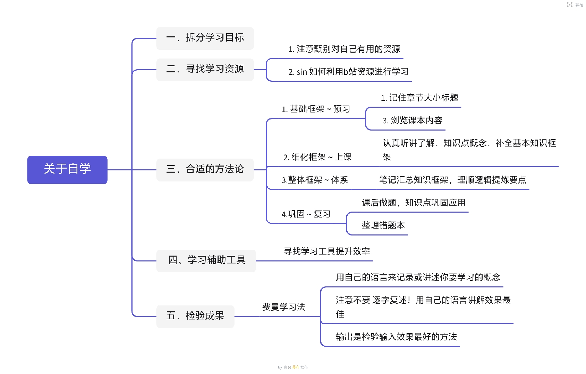
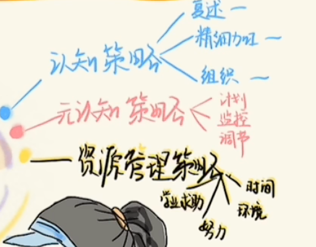

[toc]

## 01. 学习体系

- 学习体系详细如下：

-  这里的难点是预习，上课和体系。
- 其中，上课部分的认真听讲理解，这是差异最大的地方。

## 02. 怎么理解学习策略？

- 首先是学习,学习本质是理解，记忆和应用的过程。
- 学习策略是为了提供学习效率，而有目的，有意识的指定学习过程的复杂方案。包含下面几个部分：

## 2.1 学习策略

- 认知策略：对信息的理解和记忆的方法。包含如下：
  - **复述**：通过重复信息巩固记忆。
  - **精细加工**：将新信息与已有知识联系。
  - **组织**：重新整理信息结构，例如制作思维导图。

- 元认知策略：对学习过程的认知与调控能力。
  - **计划**：设定学习目标、分配资源、制定学习计划。
  - **监控**：在学习过程中评估学习方法和效果，例如是否理解内容、学习进度是否合理。
  - **调节**：根据监控结果调整学习方法或策略，例如改用更高效的学习方法或调整学习节奏。

- 资源管理策略：是指学习者对内部和外部资源的合理利用与调控，以提升学习效率。包括：
  - **时间管理**：合理安排学习时间，优先处理重要任务。
  - **环境管理**：优化学习环境，例如减少干扰、选择安静的学习空间。
  - **情绪与动机管理**：调节学习中的情绪，增强学习动力。
  - **技术工具与外部资源**：使用学习工具（如笔记软件、在线课程）和寻求帮助（如请教老师或同伴）。

