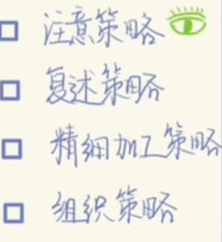
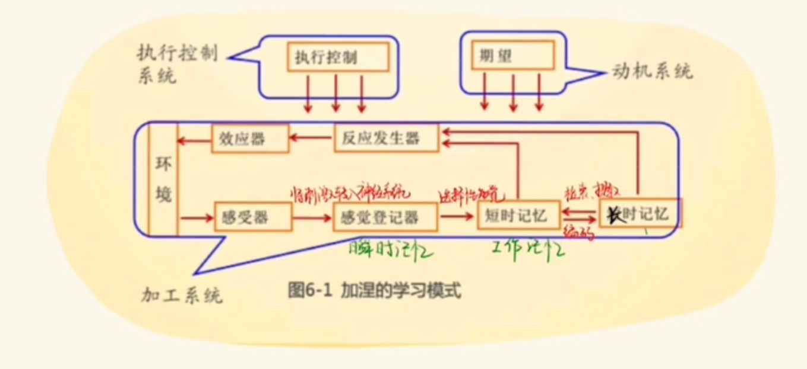
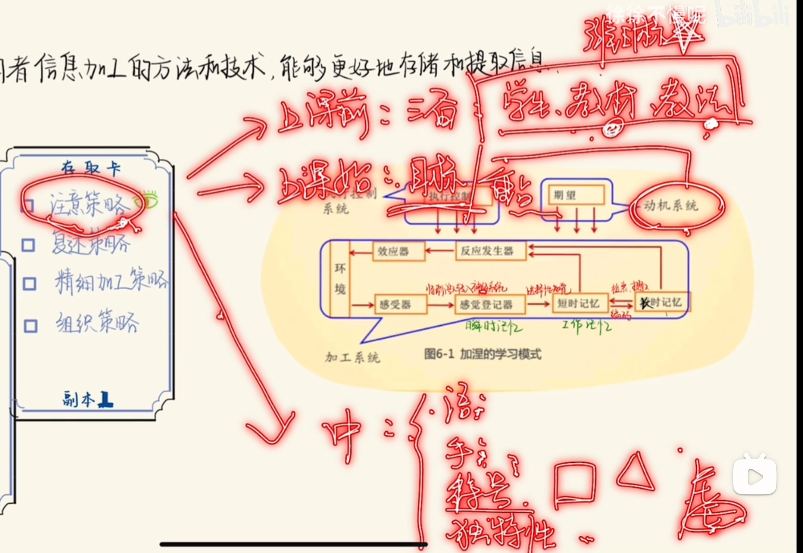
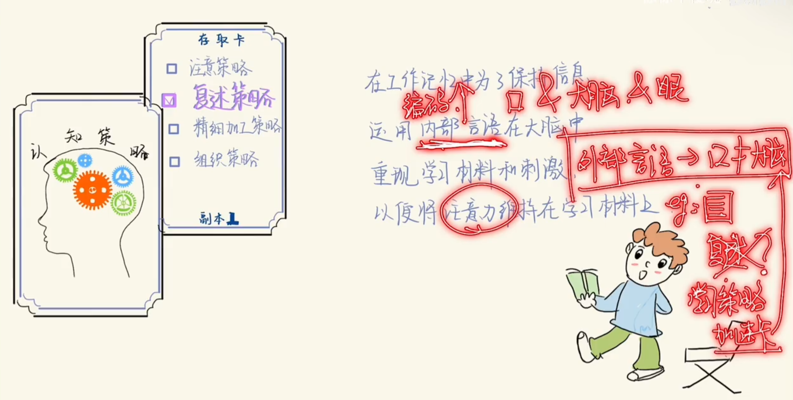
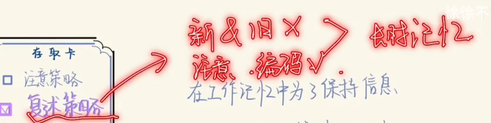
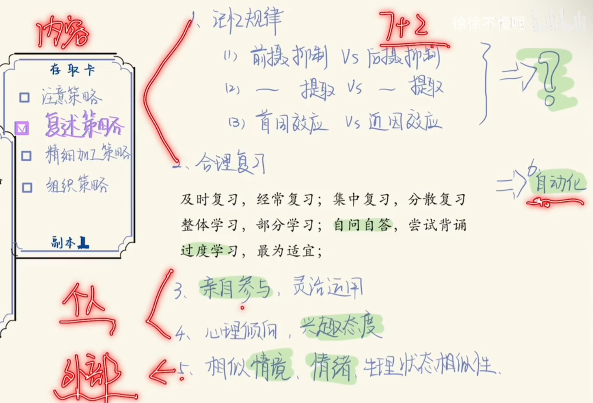
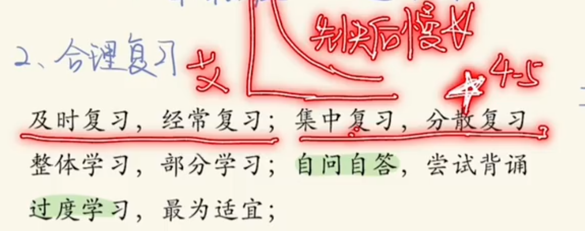

[toc]

## 02.注意策略

注意是一种心理状态，不是一种心里过程，伴随整个学习阶段

## 03.复述策略

### 3.1 什么是复述策略

- 为什么大声朗读不能算是复述策略，不能提高自己的效率呢？
- 为什么复述策略特定在工作记忆中？它不能用在长时记忆中吗？

### 3.2 几种复述策略

### 3.3 记忆规律

#### 1.如何理解这些名词

介绍一下：前摄抑制，后摄抑制，前摄提取，后摄提取。首因效应，近因效应

**1. 前摄抑制（Proactive Interference）**

**定义：**
先前学习的信息干扰后续学习的信息的记忆或提取。
**特点：**

- 旧信息对新信息产生干扰，使新信息难以记住。
  **例子：**
- 学习了法语后再学习西班牙语时，可能会用法语单词替代西班牙语单词。

------

**2. 后摄抑制（Retroactive Interference）**

**定义：**
后续学习的信息干扰先前学习的信息的记忆或提取。
**特点：**

- 新信息对旧信息产生干扰，使旧信息难以记住。
  **例子：**
- 学习西班牙语后，之前学习的法语单词记不清了。

------

**3. 前摄提取（Proactive Retrieval）**

**定义：**
通过利用先前学到的信息，来更好地提取当前需要的信息。
**特点：**

- 旧信息为新信息的理解或回忆提供帮助。
  **例子：**
- 已掌握的数学公式帮助理解新的数学定理。

------

**4. 后摄提取（Retroactive Retrieval）**

**定义：**
通过后续学习的信息，来更好地提取之前学到的信息。
**特点：**

- 新信息为旧信息的理解或回忆提供帮助。
  **例子：**
- 学习了复杂的经济学概念后，更容易理解基础的经济学原理。

------

**5. 首因效应（Primacy Effect）**

**定义：**
人更容易记住信息序列中的开头部分。
**特点：**

- 开始的信息被优先编码，记忆更牢固。
  **原因：**
- 开始的信息通常得到更多注意和复述（复习）。
  **例子：**
- 听到一长串名字时，往往更容易记住第一个名字。

------

**6. 近因效应（Recency Effect）**

**定义：**
人更容易记住信息序列中的结尾部分。
**特点：**

- 近期的信息更容易被提取，因为仍在短时记忆中。
  **例子：**
- 听到一长串名字时，往往更容易记住最后一个名字。

#### 2.学习过程中如何利用

**1. 针对前摄抑制和后摄抑制**

**策略：避免信息干扰，分清学习阶段**

- **避免连续学习相似内容**
  前后学习相似内容容易导致干扰。例如，不要连续学习两门相近的语言（如法语和西班牙语）。可以在两者之间加入一段不相关的休息或切换到完全不同的学科。
- **间隔重复学习（间隔效应）**
  学习后隔一段时间再复习，减少新旧信息的干扰。
- **结构化学习**
  在学习过程中，给不同内容分类，并建立联系，比如先掌握基础知识，再学习高级内容，逐步深入。

------

**2. 针对首因效应和近因效应**

**策略：优化学习顺序和时间分配**

- 重视开始和结束

  开始时的学习精力最充沛，结束时记忆效果最好，可以在这两个时间段学习最重要或最难的内容。

  示例方法：

  - 学习一节课前5分钟预习重点内容。
  - 结束前5分钟快速回顾核心知识点。

- **分块学习（Chunking）**
  把学习内容分成多个小单元，每个单元安排首尾清晰的学习内容，从而多次利用首因效应和近因效应。

- **间隔休息**
  在学习中定时休息，重新开始新的“首因”，使每段学习都有一个新的开头。

------

**3. 针对前摄提取和后摄提取**

**策略：利用关联记忆强化学习**

- **关联旧知识学习新知识**
  学习新知识时，主动与已掌握的知识建立联系。例如，学习新的编程语言时，和已掌握的语言的语法进行对比。

- 反向提取旧知识

  在学习新知识后，尝试复习与之相关的旧知识，以强化两者的记忆。

  示例方法：

  - 学习新公式后，尝试用它来推导旧公式。
  - 学习新概念后，尝试回顾之前的知识框架，看如何融入新的内容。

### 合理复习

### 自动化

随着你的熟悉，需要的注意力越来越少。