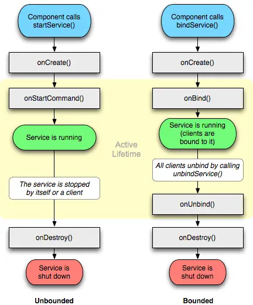

[toc]


问题：

- 目录
- Service介绍
  - 什么是Service
  - 怎么理解
  - 启动服务和绑定服务的概念。
- IntentService
  - 传统service的缺点。

## 01. Service介绍

### 1.1 Service是什么

- **什么是 Service**：

  - `Service` 是一个运行在后台，执行不需要和用户交互的耗时任务的 Android 组件。比如后台播放音乐和后台下载。

- **如何理解“不与用户交互”和“后台运行”**：
  - **不与用户交互**：指服务无需显示 UI 界面，也不需要直接响应用户的点击或输入事件。
    
  - **后台运行**：指服务在后台任务栈中运行，优先级较低，可能被系统回收。
    
    

### 1.2 分类

它分为两种类型，**启动服务和绑定服务**。

**启动服务**是指其它应用组件通过 `startService()` 启动一个服务，一旦启动，服务将在后台运行，直到主动调用 `stopService()` 停止。否则即使启动服务的组件（如 `Activity`）被销毁，服务也会继续运行，不受影响。

> **示例**：音乐播放器可以在后台播放，即使用户关闭了播放器的界面，音乐依然在后台播放。

**绑定服务**通过 `bindService()` 启动。绑定服务的生命周期与绑定它的组件相关联。当所有绑定到服务的组件都解绑后，服务就会销毁。

- 启动服务是一对一的关系，但是即使这个一不stop，即使死了，也不影响另一个一。
- 绑定服务是多对一的关系，多中只要有一个存在，那么这个一就存在。


### 1.3 服务运行在哪

服务通常运行在主线程（UI线程）中，所以说它不能做耗时操作。如果你在 `Service` 中执行耗时的任务，会导致主线程阻塞，最终可能引发 "Application Not Responding"（ANR）。


## 02. Service生命周期



**两种不同类型的bind生命周期不同。**

通过 `startService`，`Service` 会经历 `onCreate` 到 `onStartCommand` ，然后处于运行状态，Service在被自身stop和启动它的组件stop的时候调用 `onDestroy` 方法。

通过 `bindService`，`Service` 会运行 `onCreate` ，然后是调用 `onBind` ， 这个时候调用者和 `Service` 绑定在一起。当所有调用者都解绑了，`Srevice` 就会调用 `onUnbind` -> `onDestroyed` 方法。


## 03. IntentService

### 3.1 什么是IntentService

`Service` 默认运行在应用的主线程中，因此如果你在 `Service` 中执行耗时的任务，会导致主线程阻塞，最终可能引发 "Application Not Responding"（ANR）。

`IntentService` 是自带独立工作线程的Service。这些耗时的任务会在工作线程中执行。本质是一个Handle工作线程

### 3.2 IntentService原理

其在OnCreate时会启动HandlerThread工作线程，其内部包含Looper和MsgQueue。

当组件调用startService(intent1)来启动service时，在`onStartCommand()` 生命周期中会将每个 `Intent` 转换为一个消息 (`Message`)，并放入消息队列中。

当服务进行运行状态时，其工作线程在消息循环中取出消息任务，然后进行消息任务异步的处理。

当消息队列已空，所有任务都处理完毕时，`IntentService` 会自动调用 `stopSelf()`，停止循环，并最终停止服务。

### 3.3 IntentService案例演示

我们有一个 `IntentService`，用于执行两个独立的后台任务，比如从服务器下载数据。这两个任务通过传递不同的 `Intent` 来启动。

1. **主线程启动 `IntentService`**：

   - 应用中的 `Activity` 调用 `startService(intent1)` 来启动 `IntentService`。此时，`Intent` 对象 `intent1` 传递给 `IntentService`，包含要执行的第一个任务（如从服务器下载文件1）。
   - 紧接着，主线程又调用了 `startService(intent2)`，传递了第二个 `Intent` 对象 `intent2`，代表另一个任务（如下载文件2）。

   ```java
   // 主线程中，用户点击按钮，启动服务
   Intent intent1 = new Intent(this, MyIntentService.class);
   intent1.putExtra("task", "download_file1");
   startService(intent1);
   
   Intent intent2 = new Intent(this, MyIntentService.class);
   intent2.putExtra("task", "download_file2");
   startService(intent2);
   ```

2. **`IntentService` 开始工作（onCreate）**：

   - 当 `IntentService` 第一次启动时，`onCreate()` 被调用。此时，`IntentService` 会创建一个 `HandlerThread`，该线程会自动创建一个 `Looper`，使工作线程能够持续循环处理消息。
   - 然后，`Handler` 被创建，并与该 `Looper` 关联，用于接收传递进来的 `Intent`（作为消息的一部分）。

   ```java
   @Override
   public void onCreate() {
       super.onCreate();
       HandlerThread thread = new HandlerThread("IntentServiceThread");
       thread.start();
   
       mServiceLooper = thread.getLooper();
       mServiceHandler = new ServiceHandler(mServiceLooper);
   }
   ```

3. **Intent 被添加到消息队列中**：

   - `startService(intent1)` 和 `startService(intent2)` 被调用后，`IntentService` 的 `onStartCommand()` 方法会将每个 `Intent` 转换为一个消息 (`Message`)，并放入消息队列中。`Handler` 会处理这些消息。

   ```java
   @Override
   public int onStartCommand(Intent intent, int flags, int startId) {
       Message msg = mServiceHandler.obtainMessage();
       msg.arg1 = startId;
       msg.obj = intent;
       mServiceHandler.sendMessage(msg);
       return START_NOT_STICKY;
   }
   ```

   动态过程：

   - `intent1`（下载文件1的任务）被封装为消息1，放入消息队列中。
   - `intent2`（下载文件2的任务）被封装为消息2，放入消息队列中。

4. **`Looper` 循环读取消息队列**：

   - `Looper` 在工作线程中保持循环，它依次从消息队列中读取消息（每个 `Intent`），并通过 `Handler` 传递给 `onHandleIntent()` 方法处理。
   - 第一个消息 `intent1` 被读取，调用 `onHandleIntent()` 方法，开始处理任务1（下载文件1）。

   ```java
   @Override
   protected void onHandleIntent(Intent intent) {
       if (intent != null) {
           String task = intent.getStringExtra("task");
           if (task.equals("download_file1")) {
               // 模拟下载文件1的任务
               downloadFile("file1_url");
           } else if (task.equals("download_file2")) {
               // 模拟下载文件2的任务
               downloadFile("file2_url");
           }
       }
   }
   ```

5. **所有任务完成后，自动停止服务**：

   - 当 `Looper` 检测到消息队列已空，所有任务都处理完毕时，`IntentService` 会自动调用 `stopSelf()`，停止循环，并最终停止服务。

## 其他介绍

### 01.关于我的博客

- csdn：http://my.csdn.net/qq_35829566

- 掘金：https://juejin.im/user/499639464759898

- github：https://github.com/jjjjjjava

- 简书：http://www.jianshu.com/u/92a2412be53e

- 邮箱：[934137388@qq.com](mailto:934137388@qq.com)

  
