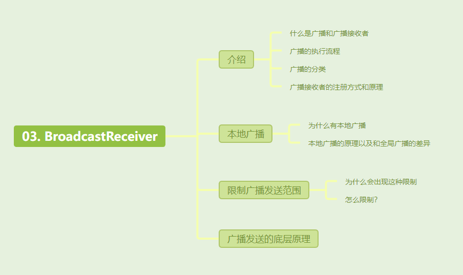

[toc]



## 01. Broadcast介绍

### 1.1 什么是广播

- 在 Android 系统中，广播（Broadcast）是一种用于Android系统不同组件间的通信机制。Android中不同组件间通信分为两种情况，一个种是不同进程间通信，一种是进程内部通信。

  - 当其为全局广播时，进行跨进程组件通信时，依赖于Activity Manager Service（AMS）来管理广播的发送和接收，底层通信机制使用Binder。

  - 当其为本地广播时，进行进程内部组件通信时，依赖于`LocalBroadcastManager`通过一个局部的广播管理器在应用进程内部直接传递广播，避免了跨进程的开销。


- **BroadcastReceiver** 则是对发送出来的**Broadcast**进行接受和响应的组件。

### 1.2 广播执行流程

那么广播执行的流程是什么样的呢？

- 发送-匹配-接收

  - 首先将要发送的消息和过滤信息装入一个 **Intent**对象，然后通过调用**Context.sendBroadcast()**或**sendOrderedBroadcast()**方法把 Intent 对象以广播形式发送出去。 

  - 广播发送出去后，所以AMS会检查已注册的 BroadcastReceiver 的 **IntentFilter** 是否与发送的 Intent 相匹配，若匹配则会将广播传递给其Activity，其Activity会调用**onReceiver()** 方法进行接收和响应。


### 1.3 广播分类

- Android中的广播分为两种类型，标准广播和有序广播
  - 标准广播：标准广播是一种完全异步执行的广播，在广播发出后所有的广播接收器会在同一时间接收到这条广播，之间没有先后顺序，效率比较高，且无法被截断。
  - 有序广播：有序广播是一种同步执行的广播，在广播发出后同一时刻只有一个广播接收器能够接收到， 优先级高的广播接收器会优先接收，当优先级高的广播接收器的 onReceiver() 方法运行结束后，广播才会继续传递，且前面的广播接收器可以选择截断广播，这样后面的广播接收器就无法接收到这条广播了。

- 当然也可以分为全局广播和本地广播。


### *1.4 广播接收器的注册方式

- 那么，我该怎样使用广播接收器，换句话，我该怎么启动它呢？广播接收器有两种注册方式，一种是静态，一种是动态。

  - **静态注册的接收器**是在 `AndroidManifest.xml` 中声明的，再编写它对应的类。此时即使应用未启动，甚至应用没有运行过，只要广播发出，静态注册的接收器就能响应并处理广播。具体原理是：当广播到达并匹配时，系统会自动创建广播接收器的实例，并调用其 `onReceive()` 方法。完成接收处理后被销毁。

    - ```
      <application>
          <receiver android:name=".NormalReceiver">
              <intent-filter>
                  <action android:name="com.example.normal.receiver" />
              </intent-filter>
          </receiver>
      </application>
      
      public class NormalReceiver extends BroadcastReceiver {
          @Override
          public void onReceive(Context context, Intent intent) {
              String msg = intent.getStringExtra("Msg");
              Log.i("NormalReceiver", "接收到消息: " + msg);
          }
      }
      ```

  - **动态注册的接收器**则需要我们创建 IntentFilter，指定要监听的广播事件，再new BroadcastReceiver()创建实例，实现其onReceive方法，并调用`registerReceiver()` 将receiver和intentFilter注册到AMS 中，之后才能接收到广播。它的实例在 `registerReceiver()` 注册时就已经创建好，后续才进行广播的匹配。而静态的先进行匹配，只有在匹配成功时才创建。

    - ```
      @Override
          public void onCreate() {
              // 创建 IntentFilter，指定要监听的广播事件
              IntentFilter intentFilter = new IntentFilter();
              intentFilter.addAction(MainActivity.ACTION);
              
              // 动态创建 BroadcastReceiver 实例并实现 onReceive() 方法
              receiver = new BroadcastReceiver() {
                  @Override
                  public void onReceive(Context context, Intent intent) {
                      Log.e(TAG, "BroadcastService 接收到广播");
                  }
              };
              
              // 注册 BroadcastReceiver
              registerReceiver(receiver, intentFilter);
              Log.e(TAG, "BroadcastService 注册了接收器");
              super.onCreate();
              
          }
          
          在OnDestory时调用unregisterReceiver(receiver);取消注册 BroadcastReceiver，避免内存泄漏
      ```


## 02. 案例演示

### 2.1 静态注册广播接收器

- 要首先在 `AndroidManifest.xml` 文件中声明，然后代码中给出对应的类，内部重写 `onReceive()`即可。

  - 当广播事件发生时，Android 系统会检查该广播的 `Intent` 是否与任何静态注册的 `BroadcastReceiver` 的 `intent-filter` 匹配。如果匹配成功，Android 系统会根据 `<receiver>` 标签中的 `android:name` 属性自动创建对应类的 `BroadcastReceiver` 实例。

  - 当广播匹配时，系统会调用该接收器的 `onReceive()` 方法，并将广播的 `Intent` 传递给它。一旦 `onReceive()` 方法执行完毕，接收器实例会被系统自动销毁，不再占用资源。


- **案例演示如下**：

  - **静态注册 `BroadcastReceiver` 的定义与配置**：

    - 使用 `<receiver>` 标签声明。

    - 使用 `<intent-filter>` 标签来设置接收器的过滤器，使接收器能够接收到特定的广播事件。

    - ```
      <application>
          <receiver android:name=".NormalReceiver">
              <intent-filter>
                  <action android:name="com.example.normal.receiver" />
              </intent-filter>
          </receiver>
      </application>
      ```


  - **标准广播的发送与接收**：

    - **标准广播**：使用 `sendBroadcast(Intent)` 发送普通广播。

    - **Receiver 的定义**：

      - ```
        public class NormalReceiver extends BroadcastReceiver {
            @Override
            public void onReceive(Context context, Intent intent) {
                String msg = intent.getStringExtra("Msg");
                Log.i("NormalReceiver", "接收到消息: " + msg);
            }
        }
        ```


    - **发送广播**：	
    
      - ```
        public void sendBroadcast(View view) {
            Intent intent = new Intent("com.example.normal.receiver");
            intent.putExtra("Msg", "Hello");
            sendBroadcast(intent);
        }		
        ```

  - **有序广播的发送与接收**：

    - **有序广播**：通过 `sendOrderedBroadcast(Intent, String)` 方法发送广播，可以指定接收的顺序。

    - 不同的 `BroadcastReceiver` 可以设置不同的优先级（`priority` 属性），优先级高的接收器先接收到广播并可以传递数据给下一个接收器。

    - **有序广播接收器定义**：

      - ```java
        public class OrderReceiver_1 extends BroadcastReceiver {
        
            private final String TAG = "OrderReceiver_1";
        
            public OrderReceiver_1() {
            }
        
            @Override
            public void onReceive(Context context, Intent intent) {
                Log.e(TAG, "OrderReceiver_1被调用了");
        
                //取出Intent当中传递来的数据
                String msg = intent.getStringExtra("Msg");
                Log.e(TAG, "OrderReceiver_1接收到的值： " + msg);
        
                //向下一优先级的Receiver传递数据
                Bundle bundle = new Bundle();
                bundle.putString("Data", "（Hello）");
                setResultExtras(bundle);
            }
        }
        
        public class OrderReceiver_2 extends BroadcastReceiver {
        
            private final String TAG = "OrderReceiver_2";
        
            public OrderReceiver_2() {
            }
        
            @Override
            public void onReceive(Context context, Intent intent) {
                Log.e(TAG, "OrderReceiver_2被调用了");
        
                //取出上一优先级的Receiver传递来的数据
                String data = getResultExtras(true).getString("Data");
                Log.e(TAG, "从上一优先级的Receiver传递来的数据--" + data);
        
                //向下一优先级的Receiver传递数据
                Bundle bundle = new Bundle();
                bundle.putString("Data", "（叶应是叶）");
                setResultExtras(bundle);
            }
        }
        
        public class OrderReceiver_3 extends BroadcastReceiver {
        
            private final String TAG = "OrderReceiver_3";
        
            public OrderReceiver_3() {
            }
        
            @Override
            public void onReceive(Context context, Intent intent) {
                Log.e(TAG, "OrderReceiver_3被调用了");
        
                //取出上一优先级的Receiver传递来的数据
                String data = getResultExtras(true).getString("Data");
                Log.e(TAG, "从上一优先级的Receiver传递来的数据--" + data);
            }
        }	
        ```

    - **发送有序广播**：

      - ```
        public void sendOrderBroadcast(View view) {
            Intent intent = new Intent("com.example.order.receiver");
            intent.putExtra("Msg", "Hello");
            sendOrderedBroadcast(intent, null);
        }
        ```

    - **在清单文件中配置**：

      - ```
        <receiver android:name=".OrderReceiver_1">
            <intent-filter android:priority="100">
                <action android:name="com.example.order.receiver" />
            </intent-filter>
        </receiver>
        
        <receiver android:name=".OrderReceiver_2">
            <intent-filter android:priority="99">
                <action android:name="com.example.order.receiver" />
            </intent-filter>
        </receiver>
        
        <receiver android:name=".OrderReceiver_3">
            <intent-filter android:priority="98">
                <action android:name="com.example.order.receiver" />
            </intent-filter>
        </receiver>
        ```

### 2.2 动态注册广播接收器

- 动态注册 BroadcastReceiver 是在代码中定义并设置好一个 **IntentFilter** 对象，然后在需要注册的地方调用 **Context.registerReceiver()** 方法，调用 **Context.unregisterReceiver()** 方法取消注册，此时就不需要在清单文件中注册 Receiver 了

- **案例演示**：

  - **在 `Service` 中动态注册 `BroadcastReceiver`：**

  - ```
    public class BroadcastService extends Service {
    
        private BroadcastReceiver receiver;
        private final String TAG = "BroadcastService";
    
        @Override
        public void onCreate() {
            // 创建 IntentFilter，指定要监听的广播事件
            IntentFilter intentFilter = new IntentFilter();
            intentFilter.addAction(MainActivity.ACTION);
            
            // 动态创建 BroadcastReceiver 实例并实现 onReceive() 方法
            receiver = new BroadcastReceiver() {
                @Override
                public void onReceive(Context context, Intent intent) {
                    Log.e(TAG, "BroadcastService 接收到广播");
                }
            };
            
            // 注册 BroadcastReceiver
            registerReceiver(receiver, intentFilter);
            Log.e(TAG, "BroadcastService 注册了接收器");
            super.onCreate();
            
        }
    
        @Override
        public void onDestroy() {
            // 取消注册 BroadcastReceiver，避免内存泄漏
            unregisterReceiver(receiver);
            Log.e(TAG, "BroadcastService 取消注册接收器");
            super.onDestroy();
        }
    
        @Override
        public IBinder onBind(Intent intent) {
            return null;
        }
    }
    ```

  - **在 `Activity` 中启动、停止 `Service` ：**

    - ```
      public class MainActivity extends AppCompatActivity {
      
          public final static String ACTION = "com.example.receiver";
      
          @Override
          protected void onCreate(Bundle savedInstanceState) {
              super.onCreate(savedInstanceState);
              setContentView(R.layout.activity_main);
          }
      
          // 启动服务
          public void startService(View view) {
              Intent intent = new Intent(this, BroadcastService.class);
              startService(intent);
          }
      
          // 停止服务
          public void stopService(View view) {
              Intent intent = new Intent(this, BroadcastService.class);
              stopService(intent);
          }
      }
      ```

  - 动态广播最好在Activity的onResume()注册、onPause()注销。
    - 原因：对于动态广播，有注册就必然得有注销，否则会导致**内存泄露**
    - 重复注册、重复注销也不允许

## 03. 本地广播

之前发送和接收到的广播全都是属于系统全局广播，即发出的广播可以被其他应用接收到，而且也可以接收到其他应用发送出的广播，这样可能会有不安全因素

因此，在某些情况下可以采用本地广播机制，使用这个机制发出的广播只能在应用内部进行传递，而且广播接收器也只能接收本应用内自身发出的广播。本地广播需要借助LocalBroadcastManager进行管理注册和销毁。同时发送时也要借助localBroadcastManager进行发送

什么意思呢：

- 注册时，使用`localBroadcastManager.registerReceiver(localReceiver, filter);`向LocalBroadcastManager注册。而全局广播则是`registerReceiver(Receiver, filter)`向AMS注册。
- 发送时，使用`localBroadcastManager.sendBroadcast(intent);`借助LocalBroadcastManager进行发送。而全局广播则是`sendBroadcast(intent);`发送给AMS。

### **3.1 API**：

| 函数                                                         | 作用               |
| ------------------------------------------------------------ | ------------------ |
| `LocalBroadcastManager.getInstance(this).registerReceiver(BroadcastReceiver, IntentFilter)` | 注册本地广播接收器 |
| `LocalBroadcastManager.getInstance(this).unregisterReceiver(BroadcastReceiver)` | 注销本地广播接收器 |
| `LocalBroadcastManager.getInstance(this).sendBroadcast(Intent)` | 发送异步本地广播   |
| `LocalBroadcastManager.getInstance(this).sendBroadcastSync(Intent)` | 发送同步本地广播   |

### **3.2  本地广播的使用步骤**：

1. **创建广播接收器**：

   - 创建一个继承自 `BroadcastReceiver` 的接收器类，用于处理本地广播。

   ```java
   public class LocalReceiver extends BroadcastReceiver {
       private final String TAG = "LocalReceiver";
   
       @Override
       public void onReceive(Context context, Intent intent) {
           Log.e(TAG, "接收到了本地广播");
       }
   }
   ```

2. **注册与解除注册本地广播**：

   - 在 `Activity` 或 `Service` 中，通过 `LocalBroadcastManager` 注册和解除注册广播接收器。

   ```java
   private LocalBroadcastManager localBroadcastManager;
   private LocalReceiver localReceiver;
   private final String LOCAL_ACTION = "com.example.local.receiver";
   
   @Override
   protected void onCreate(Bundle savedInstanceState) {
       super.onCreate(savedInstanceState);
       setContentView(R.layout.activity_main);
   
       // 获取 LocalBroadcastManager 实例
       localBroadcastManager = LocalBroadcastManager.getInstance(this);
       
       // 创建并注册本地广播接收器
       localReceiver = new LocalReceiver();
       IntentFilter filter = new IntentFilter(LOCAL_ACTION);
       localBroadcastManager.registerReceiver(localReceiver, filter);
   }
   
   @Override
   protected void onDestroy() {
       super.onDestroy();
       // 注销本地广播接收器
       localBroadcastManager.unregisterReceiver(localReceiver);
   }
   ```

3. **发送本地广播**：

   - 使用 `localBroadcastManager.sendBroadcast(Intent)` 方法发送本地广播。

   ```java
   public void sendLocalBroadcast(View view) {
       Intent intent = new Intent(LOCAL_ACTION);
       localBroadcastManager.sendBroadcast(intent);
   }
   ```

## 04. 限制广播发送范围（私有权限）

上面的广播存在一个问题，对于全局广播虽然只有匹配到才能接收广播，但是它可以监听到任何应用发送的广播。这样很不安全，可能会有恶意应用监听敏感广播。

对于本地广播，虽然限制了发送范围在本地，但是无法满足跨应用通信的需求。我们需要一种更好的方式，让广播又安全，又满足跨应用通信的需求。

这里我们的方法是给全局广播设置权限。通过主动设置的权限，对于我们发出的广播，只有相应权限的应用才能进行监听，当他们有监听权限并且匹配成功时才可以收到广播。代码示例如下：

- ```
  private final String PERMISSION_PRIVATE = "com.example.permission.receiver";
  
  sendBroadcast(new Intent("Hi"), PERMISSION_PRIVATE);
  
  // 使用自定义权限注册广播接收器
  registerReceiver(permissionReceiver, intentFilter, PERMISSION_PRIVATE, null);
  ```

### **4.1 定义权限**

首先，我们要为广播创建一个自定义权限，这个权限用于限制谁可以发送或接收广播。

```xml
<manifest xmlns:android="http://schemas.android.com/apk/res/android"
    package="com.example.broadcast">

    <permission android:name="com.example.broadcast.SEND_BROADCAST"
        android:protectionLevel="signature" />

    <application>
        <!-- 广播接收器 -->
        <receiver android:name=".MyReceiver">
            <intent-filter>
                <action android:name="com.example.broadcast.MY_ACTION" />
            </intent-filter>
            <meta-data android:name="android:exported" android:value="false"/>
        </receiver>
    </application>
</manifest>

```

- `protectionLevel="signature"` 的意思是，**只有和声明这个权限的应用签名相同的应用**，才能使用这个权限（即发送或接收广播）。

通常会用到两种保护级别：

- **normal**：普通权限，只要在安装时声明即可，通常用于较低风险的功能。
- **signature**：签名权限，只允许由相同证书签名的应用才能使用。

### **4.2 发送广播时限定权限**

在代码中，发送广播时使用 `sendBroadcast(Intent, String)` 方法，第二个参数是你刚刚定义的自定义权限。这个权限限制了**只有拥有这个权限的接收器**才能接收到广播。

```java
private final String PERMISSION_PRIVATE = "com.example.permission.receiver";

public void sendPermissionBroadcast(View view) {
    // 发送广播时使用自定义权限，只有具备该权限的应用能接收到广播
    sendBroadcast(new Intent("Hi"), PERMISSION_PRIVATE);
}
```

这样，只有拥有 `com.example.permission.receiver` 权限的应用，才能接收到这个广播。

### **4.3 动态注册广播接收器时声明权限**

在注册广播接收器时，你可以通过 `registerReceiver()` 来声明该接收器可以接收的广播范围。

```java
private final String PERMISSION_PRIVATE = "com.example.permission.receiver";
private PermissionReceiver permissionReceiver;

@Override
protected void onCreate(Bundle savedInstanceState) {
    super.onCreate(savedInstanceState);
    setContentView(R.layout.activity_main);

    // 创建 IntentFilter 用于匹配广播
    IntentFilter intentFilter = new IntentFilter("Hi");
    permissionReceiver = new PermissionReceiver();

    // 使用自定义权限注册广播接收器
    registerReceiver(permissionReceiver, intentFilter, PERMISSION_PRIVATE, null);
}
```

在这个例子中，只有发送广播时带有 `com.example.permission.receiver` 权限的广播，才能被这个接收器接收。

## 05. 广播发送的原理

Android中的广播底层基于Binder机制，借助AMS进行消息的存储转发。

### 5.1 消息模型

- 模型中有3个角色：
  - 1.消息订阅者（广播接收者）
  - 2.消息发布者（广播发布者）
  - 3.消息中心（`AMS`，即`Activity Manager Service`）
  - 

### 5.2 原理描述

- 原理描述：

  1. 广播接收者 通过 `Binder`机制在 `AMS` 注册
  
  2. 广播发送者 通过 `Binder` 机制向 `AMS` 发送广播
  3. AMS根据 广播发送者 要求，在已注册列表中，寻找合适的广播接收者，寻找依据：`IntentFilter / Permission`
  
  4. AMS 通过 Binder 机制将广播传递给目标应用进程，目标应用进程的在主线程中调用广播接收者的 `onReceive()` 方法。
- 本地广播就是把中间的AMS修改为LocalBroadcastManager。


- **特别注意**：默认情况下，广播接收器运行在UI线程，因此，onReceive方法不能执行耗时操作，否则将导致ANR。那如果我非要执行耗时操作呢？建议开启一个 IntentService 将耗时操作交给 Service

## 其他介绍

### 01.关于我的博客

- csdn：http://my.csdn.net/qq_35829566

- 掘金：https://juejin.im/user/499639464759898

- github：https://github.com/jjjjjjava

- 简书：http://www.jianshu.com/u/92a2412be53e

- 邮箱：[934137388@qq.com](mailto:934137388@qq.com)

  
