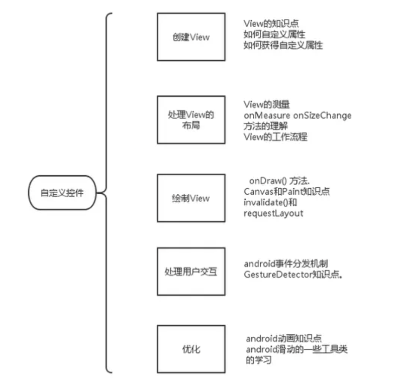

[toc]

## 01.自定义控件整体流程

- 自定义控件你需要以下的步骤。
  - 创建自定义View，并获取自定义属性。
  - 内部处理View的测量
  - 绘制View
  - 与用户进行交互
  - 优化已定义的View
- 上面列出的五项就是android官方给出的自定义控件的步骤。根据你的需要，某些步骤可以省略。

## 02.创建自定义View，并获取自定义属性

- 首先我们要自定义一个View的代码，它要继承自某个已有的View父类，他需要有成员变量来描述自身的自定义属性，同时在代码中可以解析xml文件去设置自身的属性。最好还可以暴露某些属性让外部可以在代码运行过程中动态的访问和修改它的属性。
- 然后我们要定义xml中可以配置它的哪些自定义属性，接着我们在xml中配置它的自定义属性。

### 2.1 创建自定义View类

- 继承自已有的View类，覆写构造方法。接收context和AttributeSet参数，内部调用init设置自身属性。

  - ```
    class CircleImageView : AppCompatImageView {
        constructor(context: Context) : super(context) {
            init(context, null)
        }
    
        constructor(context: Context, attrs: AttributeSet?) : super(context, attrs) {
            init(context, attrs)
        }
    
        constructor(context: Context, attrs: AttributeSet?, defStyleAttr: Int) : super(context, attrs, defStyleAttr) {
            init(context, attrs)
        }
    }
    ```

- 它要有某些属性值，比如说：shapeType形状。

  - ```
    // rectangle or round, 1 is circle, 2 is rectangle
    private var shapeType = 0
    ```

- 然后我们要有方法在类的创建过程中获取自定义属性

  - 这里是init方法，也就是构造函数中调用的，其传入context和attrs。

  - 然后在init方法中，首先可以为属性直接设置初始值，也就是没在xml文件中配置的时候给出默认值。然后可以调用context.obtainStyledAttributes()方法，**从 attrs，XML 属性集合中提取对应的CircleImageView的属性值容器array**。

  - 再通过array.getColor()等方法获取对应的属性设置给自身属性成员变量

  - ```
    在init方法中
    //init the value
        borderWidth = 0
        borderColor = -0x22000001
        pressAlpha = 0x42
        pressColor = 0x42000000
        radius = 16
        shapeType = 0
    
    // get attribute of EaseImageView
        if (attrs != null) {
            val array = context.obtainStyledAttributes(attrs, R.styleable.CircleImageView)
            borderColor = array.getColor(R.styleable.CircleImageView_ease_border_color, borderColor)
            borderWidth = array.getDimensionPixelOffset(R.styleable.CircleImageView_ease_border_width, borderWidth)
            pressAlpha = array.getInteger(R.styleable.CircleImageView_ease_press_alpha, pressAlpha)
            pressColor = array.getColor(R.styleable.CircleImageView_ease_press_color, pressColor)
            radius = array.getDimensionPixelOffset(R.styleable.CircleImageView_ease_radius, radius)
            shapeType = array.getInteger(R.styleable.CircleImageView_es_shape_type, shapeType)
            array.recycle()
        }
    ```

- getter，setter方法暴露某些属性，让外部可以在代码运行过程中动态的访问和修改它的属性。

  - ```
    fun setBorderColor(borderColor: Int) {
        this.borderColor = borderColor
        invalidate()
    }
    ```


### 2.2 定义自定义属性

- 我们要定义xml中可以配置它的哪些自定义属性，自定义属性通常写在在res/values/attrs.xml文件中 下面是自定义属性的标准写法

  - 首先设置declare-styleable name，这对应自定义View类的类名。表示这个类有哪些可以自定义的属性。

  - 然后设置attr name，属性，以及属性的format格式。
  
  - ```
    <!--圆角或者圆形图片组件-->
        <declare-styleable name="CircleImageView">
            <attr name="ease_border_color" format="color" />
            <attr name="ease_border_width" format="dimension" />
            <attr name="ease_press_alpha" format="integer" />
            <attr name="ease_press_color" format="color" />
            <attr name="ease_radius" format="dimension" />
            <attr name="es_shape_type" format="enum">
                <enum name="none" value="0" />
                <enum name="round" value="1" />
                <enum name="rectangle" value="2" />
            </attr>
        </declare-styleable>
    ```

- 在xml中使用这些自定义属性。

  ```
  <com.bytedance.tiktok.view.CircleImageView
      android:id="@+id/ivHead"
      android:layout_width="52dp"
      android:layout_height="52dp"
      app:es_shape_type="round"
      android:scaleType="centerCrop"/>
  
  ```

- 接着就是上面代码的解析流程了。

## 03.处理View的测量

- 然后我们需要处理Measure的测量过程，我们最终都会通过setMeasuredDimension()来完成测量，设置自身的宽高信息，所以关键是宽高值的获取。我们通过getDefaultSize获取，在内部根据mode设置。


### 3.1 重写onMeasure代码

- 下面是一个重写onMeasure中获取宽高的的固定伪代码写法：

  ```
  if mode is EXACTLY{
       也就是父布局已经告诉了我们当前布局应该是多大的宽高,直接使用父布局给的size； 所以我们直接返回从measureSpec中获取到的size
  }else{
       计算出希望的desiredSize，我们期望的desiredSize很可能时getSuggestedMinimumWidth + padding
       if mode is AT_MOST
           这时候View的尺寸不能超过父布局给定的specSize，所以取两者中的较小值。 返回desireSize和specSize当中的最小值
       else:
           而UNSPECIFIED的情况，父布局没有限制，所以直接返回desiredSize
  }
  ```

- 那么这里的desiredSize如何计算呢？

  - 可以getSuggestedMinimumWidth() + padding。
  
- 实际案例中代码

  ```
  @Override
  protected void onMeasure(int widthMeasureSpec, int heightMeasureSpec) {
      int width = getDefaultSize(getSuggestedMinimumWidth(), widthMeasureSpec);
      int height = getDefaultSize(getSuggestedMinimumHeight(), heightMeasureSpec);
      //指定View的宽高，完成测量工作
      setMeasuredDimension(width,height);
  }
  
  public static int getDefaultSize(int measureSpec, boolean isWidth) {
      int result;
      int mode = MeasureSpec.getMode(measureSpec);
      int size = MeasureSpec.getSize(measureSpec);
      int padding = isWidth ? getPaddingLeft() + getPaddingRight() : getPaddingTop() + getPaddingBottom();
      
      if (mode == MeasureSpec.EXACTLY) {
          result = size;
      } else {
          result = isWidth ? getSuggestedMinimumWidth() : getSuggestedMinimumHeight();
          result += padding;
          if (mode == MeasureSpec.AT_MOST) {
              result = Math.min(result, size);
          }
      }
      return result;
  }
  ```

  - **计算出height和width之后在onMeasure中别忘记调用setMeasuredDimension()方法。否则会出现运行时异常。**

### 3.3 onSizeChange()作用

- 别忘记onSizeChange()，他在view的大小发生改变时会被调用。
  
  - ```
    @Override
    protected void onSizeChanged(int w, int h, int oldw, int oldh) {
        super.onSizeChanged(w, h, oldw, oldh);
        mViewWidth = w;
        mViewHeight = h;
    }
    
    ```

## 04.绘制View(Draw)

- 一旦自定义控件被创建并且测量代码写好之后，接下来你就可以实现onDraw()来绘制View。
  - onDraw方法包含了一个Canvas叫做画布的参数，onDraw()简单来说就两点：
    - Canvas决定要去画什么
    - Paint决定怎么画
  - 比如，Canvas提供了画线方法，Paint就来决定线的颜色。Canvas提供了画矩形，Paint又可以决定让矩形是空心还是实心。
  - ```
    @Override
    protected void onDraw(Canvas canvas) {
        super.onDraw(canvas);
        // 绘制逻辑
        mPaint.setColor(mColor);
        canvas.drawRect(0, 0, mViewWidth, mViewHeight, mPaint);
    }
    
    ```
- 在onDraw方法中开始绘制之前
  - 你应该让画笔Paint对象的信息初始化完毕。这是因为View的重新绘制是比较频繁的，这就可能多次调用onDraw，所以初始化的代码不应该放在onDraw方法里。

## 05.与用户进行交互

- 也许某些情况你的自定义控件不仅仅只是展示一个漂亮的内容，还需要支持用户点击，拖动。这时候自定义控件就需要做用户交互这一步骤了。

- 在Android系统中最常见的事件就是触摸事件了，它会调用view的onTouchEvent(android.view.MotionEvent).重写这个方法去处理我们的事件逻辑。

- 现在的触控有了更多的手势，比如轻点，快速滑动等等，所以在支持特殊用户交互的时候你需要用到android提供的GestureDetector.你只需要实现GestureDetector中相对应的接口，并且处理相应的回调方法。然后在onTouchEvent中调用GestureDetector.onTouch即可。

## 06.优化自定义View

- 在上面的步骤结束之后，其实一个完善的自定义控件已经出来了。接下来你要做的只是确保自定义控件运行得流畅，官方的说法是：为了避免你的控件看得来迟缓，确保动画始终保持每秒60帧。

- 下面是优化建议：
  - 避免不必要的代码
  - 在onDraw()方法中不应该有会导致垃圾回收的代码。
  - 尽可能少让onDraw()方法调用，大多数onDraw()方法调用都是手动调用了invalidate()的结果，所以如果不是必须，不要调用invalidate()方法。
  
- 总结

  - 

    

