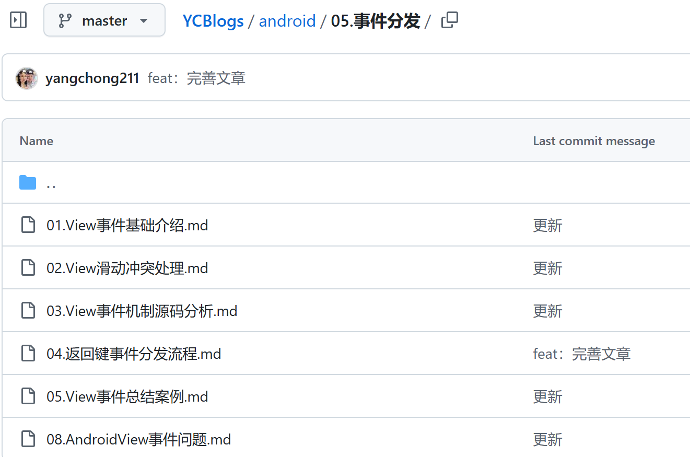

[toc]

## 事件分发机制

**事件分发机制** 是 Android 中的一套处理用户输入事件（如触摸、滑动、点击等）的机制，决定了用户的操作（如触摸屏幕）如何在视图层次结构中传递和处理。

在 Android 中，触摸事件（如点击、滑动）会按照一定的规则在 **Activity、ViewGroup 和 View** 之间传递，事件分发机制的核心就是通过一系列的回调方法控制事件的分发、拦截和处理。

## 滑动冲突处理

**滑动冲突** 是指当两个视图（通常是父视图和子视图）同时处理滑动手势时，系统不知道该将用户的滑动事件交给哪一个视图处理，导致手势行为异常的现象。例如：

- 父视图希望处理整个屏幕的滑动（如 `ScrollView`）。
- 子视图希望处理局部的滑动（如内部的 `RecyclerView` 或横向滑动的 `ViewPager`）。

如果父视图和子视图都试图消费滑动事件，但没有合理协调，就会产生滑动冲突。

## 学习的框架结构

首先是事件分发基础介绍，然后是处理滑动冲突，然后是事件分发机制的源码。

接着是深入理解事件分发的流程（涉及到安卓底层框架），然后是事件分发的实战案例。最后一个不清楚。
