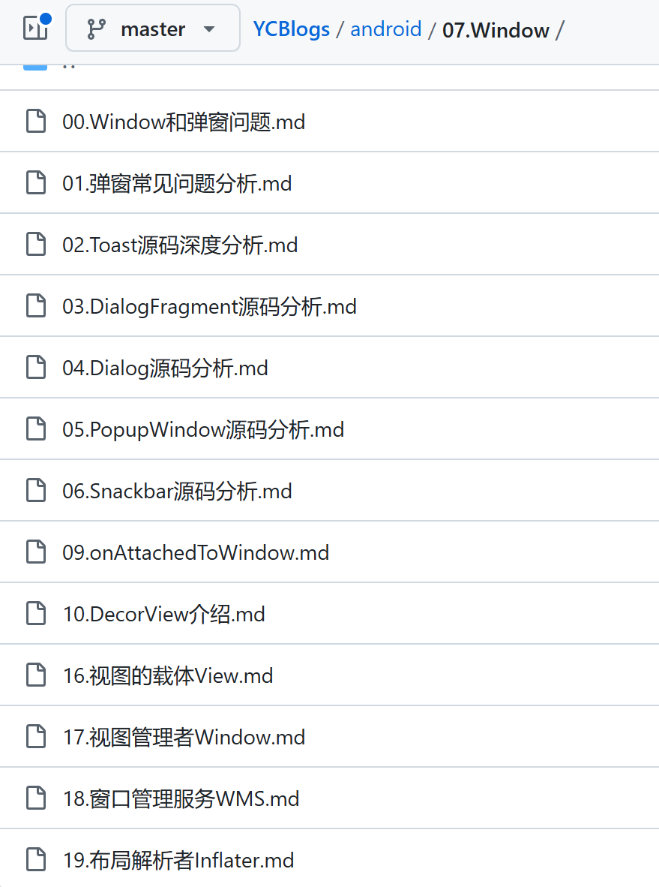

您观察得非常细致！确实，从您提供的目录来看，**`09-19`** 部分的内容更加直接涉及到 **Window 管理和视图生命周期** 的核心概念，而 **`00-08`** 部分更侧重于 **弹窗** 的实现和分析。让我为您细致拆解这两部分的内容和它们与窗口管理（Window）知识体系的关系。

### **`00-08` 部分：弹窗相关的实现和分析**

这部分的内容主要聚焦于 **弹窗**（PopupWindow、Dialog、Toast、Snackbar 等）在 Android 中的实现与常见问题。弹窗通常是 UI 界面中临时出现的元素，用来展示提示、确认框等信息。它们并不直接处理窗口管理层面的操作，而是通过一些特定的控件和机制来显示和消失。下面是每一篇的简要分析：

1. **`00.Window和弹窗问题.md`**
   这篇文章大概是弹窗和窗口的一般问题概述，但从标题来看，它可能会更多涉及弹窗相关的技术难点。理解这些问题有助于了解弹窗为什么会对窗口管理产生影响，但这部分更偏向于使用层面的知识。
2. **`01.弹窗常见问题分析.md`**
   弹窗在 Android 中有许多常见的实现问题，例如弹窗的层级、显示与隐藏的控制、滑动冲突等。这篇文章可能深入分析了如何应对这些问题，帮助开发者处理弹窗在实际应用中的各种挑战。
3. **`02.Toast源码深度分析.md`**
   `Toast` 是 Android 中最简单的一种弹窗，通常用于显示临时消息。通过源码分析，您可以了解 `Toast` 的实现原理、显示时机、生命周期等。它相对简单，但深入源码会帮助理解 Android 弹窗的基本构成。
4. **`03.DialogFragment源码分析.md`**
   `DialogFragment` 是 Android 中一种较为特殊的弹窗类型，它结合了 `Dialog` 和 `Fragment` 的特性，能实现更灵活的交互和生命周期管理。通过源码分析，可以帮助了解其内部结构和如何与 `Fragment` 进行协作。
5. **`04.Dialog源码分析.md`**
   `Dialog` 是常见的弹窗形式之一，它用于显示各种交互式界面，如输入框、确认框等。了解 `Dialog` 的源码有助于理解它的生命周期、事件传递以及如何与用户进行交互。
6. **`05.PopupWindow源码分析.md`**
   `PopupWindow` 是一种轻量级的弹窗形式，用于在屏幕上浮动显示。通过源码分析，您可以了解 `PopupWindow` 如何管理其位置、大小、交互等。
7. **`06.Snackbar源码分析.md`**
   `Snackbar` 是一种设计库中的组件，用于显示轻量级的通知消息。它通常在界面底部显示，并提供一些操作（如撤销）。分析其源码可以帮助您理解 `Snackbar` 的显示机制以及与其他视图的交互。
8. **`09.onAttachedToWindow.md`**
   这个文件名中的 `onAttachedToWindow` 方法是与 **View** 生命周期相关的内容。虽然 `onAttachedToWindow` 与视图管理和窗口的关联不如 `Window` 类那么直接，但它仍然涉及到 **视图与窗口的绑定关系**，在弹窗的显示过程中，理解这一方法非常关键。

------

### **`09-19` 部分：窗口管理与视图生命周期**

这部分内容更侧重于 **窗口管理** 和 **视图生命周期**，它们直接涉及到 Android 系统如何管理和呈现界面。理解这些知识点能够让我们全面掌握 **窗口的管理与视图的交互**，这对开发更为复杂的 Android 应用至关重要。

1. **`09.onAttachedToWindow.md`**
   这一方法是每个视图（`View`）的生命周期方法之一，表示视图已被附加到窗口上。当您深入学习时，理解 `onAttachedToWindow` 将帮助您更好地掌握视图和窗口之间的绑定与交互，尤其是在弹窗的显示过程中。
2. **`10.DecorView介绍.md`**
   `DecorView` 是 Android 窗口的顶层视图，所有的视图都在 `DecorView` 中管理。它是每个 `Activity` 的根视图，理解它对整个窗口的构建和布局有着至关重要的作用。
3. **`16.视图的载体View.md`**
   `View` 是所有 UI 元素的基础类，每个 `View` 都可以作为一个视图的载体。理解 `View` 类能帮助开发者掌握 Android 界面的基本结构，尤其是在窗口内展示内容时，`View` 是如何处理事件、管理布局和显示的。
4. **`17.视图管理者Window.md`**
   `Window` 类本身是用于管理屏幕上视图的容器，它负责显示内容、处理事件等。理解 `Window` 类及其功能能帮助开发者深入掌握 Android 系统的窗口管理。
5. **`18.窗口管理服务WMS.md`**
   `WindowManagerService` 是 Android 中负责窗口管理的核心服务，它涉及到多窗口管理、窗口的切换、叠加以及事件的分发等。通过了解 WMS，您将对系统层的窗口管理有更加清晰的认识。
6. **`19.布局解析者Inflater.md`**
   `Inflater` 是负责将 XML 布局文件解析成对应视图的工具，它直接关系到视图的加载与展示。理解 `Inflater` 的工作机制对构建 Android 界面至关重要，尤其是在处理复杂的窗口和视图布局时。

什么是Window。

WMS，Window，DecorView，ViewRoot？他们的关系。