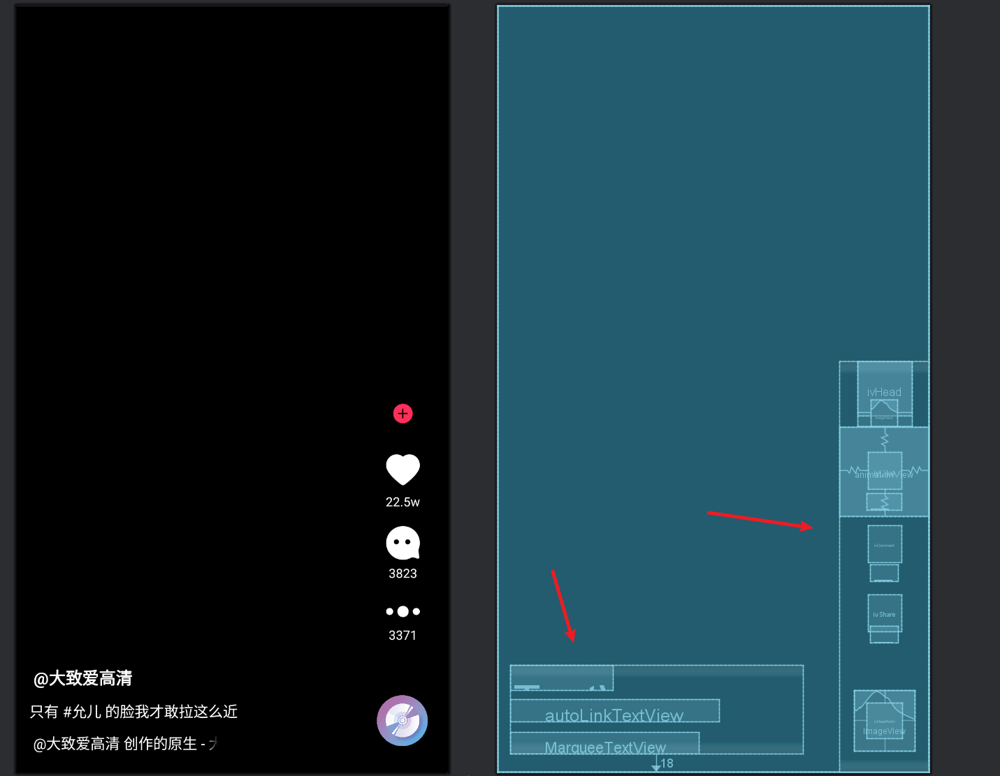

[toc]

## 00.来源

- ControllerView继承自RelativeLayout，并实现了View.OnClickListener接口。是用于显示复合UI的自定义View，它位于推荐页的ViewHolder子视图内部。

## 01.View_Controller

- ControllerView继承自RelativeLayout。可是RelativeLayout只是布局类，无法显示具体View啊？

- 具体的View其实是它的子视图View_Controller的布局。这个子视图View_Controller会通过视图绑定，通过inflate，指定parent为this，attachToParent为true，将自身挂载到ControllerView的RelativeLayout中。

- 好的，那么View_Controller视图到底是什么样的呢？

- 其主要分为左下方横着的和右下方竖着的两个部分，他们都是LinearLayout

  - 

- 先介绍左下方横着的，其包含：

  - NickName_TextView：显示昵称

  - 简介_TextView：显示内容简介。

  - 自定义的继承自TextView的MarqueeTextView，用于显示跑马灯textView

    > - 这个自定义的MarqueeTextView是什么？
    >
    > - 首先，要理解：Android 原生 TextView 支持跑马灯效果，但是存在局限性，就是需控件 **持续获得焦点** 才能滚动。
    >
    > - 因此我们构建一个简要的，TextView的子类，内部重写isFocused方法，一直return true，让控件一直处于获得焦点状态。
    >
    > - xml则设置：
    >
    >   - 控件宽度固定为 180dp，超出部分的文本会触发滚动。
    >   - 超出部分设置为跑马灯效果。
    >   - 强制文本单行显示。
    >   - 设置为无限滚动循环。
    >
    > - 但是会存在两个问题：
    >
    >   - 如果页面中有其他需要焦点的控件（如 EditText），由于 `MarqueeTextView` 始终声明自己拥有焦点，其他控件可能无法正常获取焦点。
    >   - 即使控件不可见（如页面切到后台），跑马灯仍在消耗资源。
    >
    > - 首先，第一个怎么解决：
    >
    >   - 我们修改方法，提供startMarquee()和stopMarquee()方法，可以手动启动和停止
    >
    >   - ```
    >     private var marqueeEnabled = true
    >           
    >     override fun isFocused(): Boolean {
    >         return marqueeEnabled // 通过变量控制是否“假装有焦点”
    >     }
    >           
    >     // 手动启停跑马灯
    >     fun startMarquee() {
    >         marqueeEnabled = true
    >         invalidate()
    >     }
    >           
    >     fun stopMarquee() {
    >         marqueeEnabled = false
    >         invalidate()
    >     }
    >     ```
    >
    > - 那么第二个呢？
    >
    >   - 我们监听生命周期，在不可见时暂停滚动：
    >
    >   - ```
    >     override fun onWindowVisibilityChanged(visibility: Int) {
    >         super.onWindowVisibilityChanged(visibility)
    >         if (visibility != VISIBLE) {
    >             stopMarquee()
    >         } else {
    >             startMarquee()
    >         }
    >     }
    >     ```

- 再介绍右下方竖着的，其包含：头像，爱心，评论，分享

  - 头像是一个RelativeLayout，其包含如下：

    - CircleImageView自定义类型的iv_head，显示圆形头像
    - ImageView类型的ivFocus显示focus按钮

  - 爱心包含两部分，RelativeLayout和TextView

    - 由RelativeLayout包裹的，IconFontTextView类型iv_like显示爱心图形，LottieAnimationView类型animationView播放点赞例子动画
    - tvLikecount_TextView显示点赞数

    > IconFontTextView是什么？
    >
    > 它是一个 TextView，但它却用来显示图形，达成类似ImageView的情况。
    >
    > 这怎么实现的？
    >
    > 首先，我们有一个ttf类型文件，它有Unicode字符和矢量图形的映射。
    >
    > 接着，我们在实际使用的时候，输入对应的Unicode字符，他就会被映射为对应的矢量图形进行显示。
    >
    > 比如：Unicode 字符 &#xe621 在普通字体中可能显示为乱码，但在图标字体中会被渲染为某个图形（如评论图标）。
  
  - 评论包含如下：
  
    - IconFontTextView显示评论图形
    - tvCommentcount__TextView显示评论数
  
  - 分享包含如下：
  
    - IconFontTextView显示评论图形
    - tvSharecount__TextView显示评论数

## 02.init函数

- init函数是ControllerView类的内部逻辑。

- ControllerView在init块中调用init函数，其在里面为头像，爱心，评论，分享，关注按钮设置了点击事件。

- ```
  init {
          init()
      }
  
      private fun init() {
          binding.ivHead!!.setOnClickListener(this)
          binding.ivComment!!.setOnClickListener(this)
          binding.ivShare!!.setOnClickListener(this)
          binding.rlLike!!.setOnClickListener(this)
          binding.ivFocus!!.setOnClickListener(this)
      }
  ```

## 03.onClick点击事件监听

- 我们在init方法中为各个组件设置了点击事件，对应的就是这个onClick方法

- 内部根据视图 ID 分发事件，调用对应的回调方法

  - 头像，评论和分享都是执行listener的方法

  - 点赞则执行like()本地点赞逻辑（listener.onLikeClick为空实现）

  - 关注则会写回本地数据，并让关注按钮隐藏。

  - ```
    override fun onClick(v: View) {
        if (listener == null) return // 无监听器时直接返回
    
        when (v.id) {
            R.id.ivHead -> listener!!.onHeadClick() // 点击头像
            R.id.rlLike -> { // 点赞
                listener!!.onLikeClick()
                like() // 本地点赞逻辑（如 UI 更新）
            }
            R.id.ivComment -> listener!!.onCommentClick() // 评论
            R.id.ivShare -> listener!!.onShareClick() // 分享
            R.id.ivFocus -> { // 关注按钮逻辑
                if (!videoData!!.isFocused) {
                    videoData!!.isLiked = true
                    binding.ivFocus!!.visibility = GONE
                }
            }
        }
    }
    ```

    > 这里的回调方法都出自listener，请问listener是什么？
    >
    > 
    >
    > - listener是事件回调接口的实例，通过setListener进行赋值。
    >
    >   - ```
    >     //事件回调接口的实例
    >     private var listener: OnVideoControllerListener? = null
    >       
    >     fun setListener(listener: OnVideoControllerListener?) {
    >         this.listener = listener
    >     }
    >     ```
    >
    > - OnVideoControllerListener是视频控制器事件回调接口，有四个点击方法，分别是头像，爱心，评论，分享
    >
    >   - ```
    >     //视频控制器事件回调接口
    >     interface OnVideoControllerListener {
    >       
    >         fun onHeadClick()
    >       
    >         fun onLikeClick()
    >       
    >         fun onCommentClick()
    >       
    >         fun onShareClick()
    >     }
    >     ```
    >
    > - 我们在RecommendFragment的playCurVideo中通过likeShareEvent为其设置评论点赞等事件
    >
    >   - 对于头像点击，会发送一个MainPageChangeEvent，在MainActivity中会订阅这个事件，收到时，进行页面的切换，即：将MainActivity内部的MainFragment切换为PersonalHomeFragment
    >
    >   - onCommentClick和onShareClick是弹出两个dialog。
    >
    >   - onlikeClick则没有实现，依赖于本地实现。
    >
    >   - ```
    >     /**
    >      * 处理用户的操作事件，比如点击头像、点赞、评论和分享。
    >      * 这里通过ControllerView设置监听器，并将事件通过RxBus发送出去，或者显示对话框。
    >      */
    >     private fun likeShareEvent(controllerView: ControllerView) {
    >         controllerView.setListener(object : OnVideoControllerListener {
    >             override fun onHeadClick() {
    >                 RxBus.getDefault().post(MainPageChangeEvent(1))
    >             }
    >         
    >             override fun onLikeClick() {}
    >             override fun onCommentClick() {
    >                 val commentDialog = CommentDialog()
    >                 commentDialog.show(childFragmentManager, "")
    >             }
    >         
    >             override fun onShareClick() {
    >                 ShareDialog().show(childFragmentManager, "")
    >             }
    >         })
    >     }
    >     ```
    >
    > 

## 04.like点赞动作

- like点赞动作，用于显示爱心动画以及爱心颜色的。

  - 如果未点赞，那么此次点击动作就要触发点赞，我们要设置动画视图可见，执行动画，设置ivLike图片为红色

  - ```
    if (!videoData!!.isLiked) {
        //点赞
        binding.animationView!!.visibility = VISIBLE
        binding.animationView!!.playAnimation()
        binding.ivLike!!.setTextColor(resources.getColor(R.color.color_FF0041))
    }
    ```

  - 如果点赞了，那么此次动作就是取消点赞，只需要设置动画视图不可见，同时设置ivLike图标为白色即可

  - ```
    else {
        //取消点赞
        binding.animationView!!.visibility = INVISIBLE
        binding.ivLike!!.setTextColor(resources.getColor(R.color.white))
    }
    ```

  - 最后将数据写回VideoBean。即：原本本地数据是点赞，但是经过此次点击后，其为未点赞状态。`videoData!!.isLiked = !videoData!!.isLiked`

- 点赞按钮的点击动画效果是由JSON文件配置的Lottie动画。内部主要有以下内容：

  > 什么是Lottie动画：
  >
  > Lottie使用JSON格式来描述动画，通常包含图层（layers）、资源（assets）、时间轴（关键帧）、变换属性（如位置、缩放、旋转）等。用户提供的JSON文件看起来比较复杂，有很多层和形状图层，需要逐一解析。

  - "ip":0`和`"op":120`表示动画的起始帧和结束帧，`"fr":60`说明帧率是60fps，整个动画时长应该是120/60=2秒。
  - `"w":192`和`"h":192`表示动画的宽度和高度都是192像素，说明这是一个正方形的动画。
  - `"assets":[]`，这里为空，说明动画没有使用外部资源，所有图形都是通过矢量路径绘制的。
  - 主要的内容在`"layers"`数组中，共有17个图层（从索引0到16）。每个图层有不同的类型（`"ty":4`表示形状图层），并包含形状（shapes）、变换（ks）等信息。

- 其动画效果包含以下核心元素：

  - **心形主体**：通过矢量路径绘制，旋转、缩放并填充红色。
  - **粒子扩散效果**：多个椭圆图层模拟粒子向外扩散，伴随透明度变化。
  - **层次化动画**：心形主体和粒子扩散效果这17 个图层按时间轴错开播放，形成连贯的视觉反馈。

- ##### **(1) 心形主体（图层 0）**

  - **名称**：`“like_fill copy”轮廓`
  - **形状**：自定义心形路径（贝塞尔曲线控制点）。
  - **填充颜色**：RGBA(1, 0, 0.25, 1) → 亮红色。
  - **动画**：
    - **旋转**：从 0° 到 359°，持续 8 秒（循环）。
    - **缩放**：初始放大（2倍 → 1倍），随后再次放大至 1.8 倍。
    - **透明度**：淡入（0 → 1）后淡出（1 → 0）。

  ##### **(2) 粒子扩散图层（图层 1-16）**

  - **形状**：多个椭圆（`"ty":"el"`），尺寸从 16x16 动态缩放至 162x162。
  - **动画特性**：
    - **位置移动**：从中心点向外不同方向偏移（如左上、右下）。
    - **缩放**：从 0% 逐渐放大至 100%-169%。
    - **透明度**：从 100% 渐变为 0%（粒子消失）。
    - **时间错开**：各图层动画起始时间不同（如 2ms、7ms、18ms），形成波浪式扩散。

  ------

  #### **4. 动画时间轴**

  | **阶段**     | **时间范围（ms）** | **行为描述**                                                 |
  | :----------- | :----------------- | :----------------------------------------------------------- |
  | **心形出现** | 0-100ms            | 心形快速放大（2 → 1 倍）并淡入，伴随随机角度旋转。           |
  | **粒子扩散** | 2-87ms             | 多个椭圆粒子从中心向外扩散，伴随放大和透明度衰减。           |
  | **心形强化** | 300-800ms          | 心形再次放大（1 → 1.8 倍）并淡出，向上位移 400px，形成飘散效果。 |
  | **循环**     | 8秒/周期           | 心形持续旋转（通过代码设置无限循环）。                       |

## 05.setVideoData 

- 在VideoAdapter的onBindViewHolder中会调用 `holder.binding.controller.setVideoData(it)` 进行控制器数据的设置

- 具体来说就是传递视频实体类作为方法参数，内部调用视频实体类的数据进行各组件数据的初始化

  - ```
    fun setVideoData(videoData: VideoBean) {
    //设置头像，昵称，点赞数等
            this.videoData = videoData
            binding.ivHead!!.setImageResource(videoData.userBean!!.head)
            binding.tvNickname!!.text = "@" + videoData.userBean!!.nickName
            AutoLinkHerfManager.setContent(videoData.content, binding.autoLinkTextView)
            binding.ivHeadAnim!!.setImageResource(videoData.userBean!!.head)
            binding.tvLikecount!!.text = NumUtils.numberFilter(videoData.likeCount)
            binding.tvCommentcount!!.text = NumUtils.numberFilter(videoData.commentCount)
            binding.tvSharecount!!.text = NumUtils.numberFilter(videoData.shareCount)
    //这里设置了动画为"like.json"
            binding.animationView!!.setAnimation("like.json")
    
    //如果是点赞状态，那么设置ivLike为红色，否则为白色
            //点赞状态
            if (videoData.isLiked) {
                binding.ivLike!!.setTextColor(resources.getColor(R.color.color_FF0041))
            } else {
                binding.ivLike!!.setTextColor(resources.getColor(R.color.white))
            }
    
    //如果是关注状态，设置头像下面的关注图标不可见
            //关注状态
            if (videoData.isFocused) {
                binding.ivFocus!!.visibility = GONE
            } else {
                binding.ivFocus!!.visibility = VISIBLE
            }
        }
    ```

