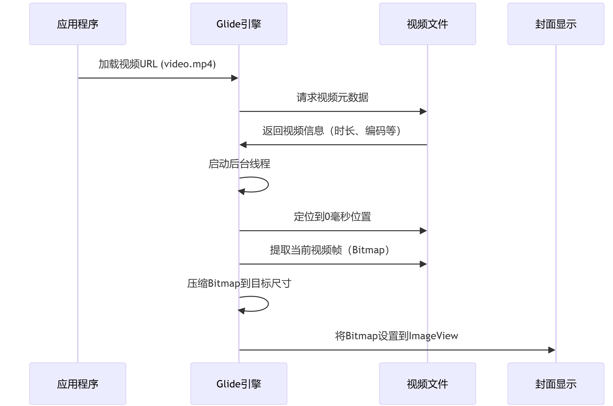
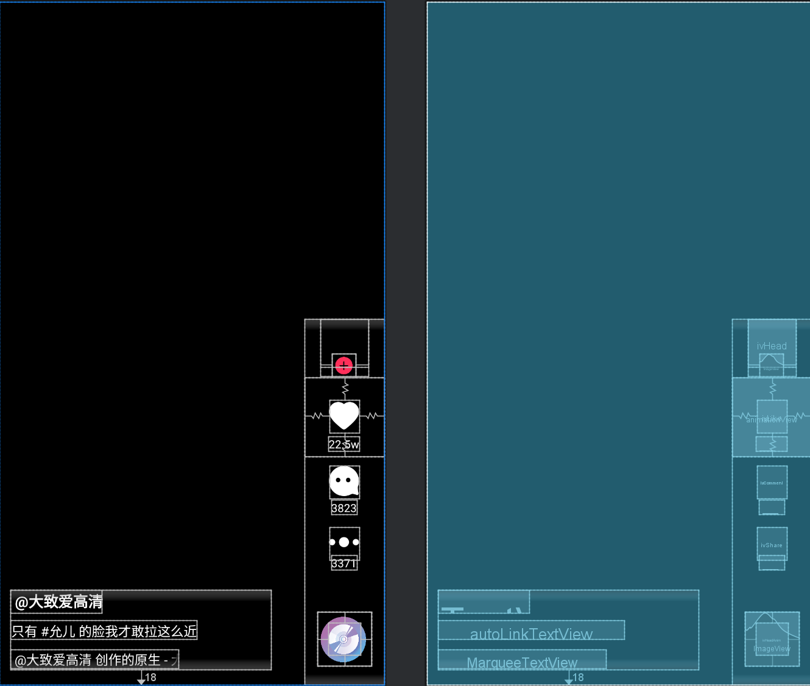

### 2.1 BaseBindingActivity

- SplashActivity继承自BaseBindingActivity，BaseBindingActivity则继承自BaseActivity类，BaseBindingActivity是抽象类，主要是用于统一Activity中视图绑定的规范。BaseActivity用于统一Activity类的创建，初始化和退出的规范。

- 其是一个泛型类，接收ViewBinding类型，同时在构造函数中通过一个变量block，用其接收布局初始化逻辑

  - ```
    abstract class BaseBindingActivity<VB : ViewBinding>(
        val block: (LayoutInflater) -> VB
    ) 
    val block: (LayoutInflater) -> VB
    ```

- 然后它在内部设计了双binding变量

  - ```
    private var _binding: VB? = null
    protected val binding: VB get() = requireNotNull(_binding)
    ```

  - 一个是private的私有变量_binding

  - 一个是protected的变量`binding`。

  - 其中，protected的变量是对外暴露非空访问入口。每次调用binding时都需要执行get（）重新获取_binding，实际上获取的是__binding的副本，我们对这个binding修改不会影响到上面一个，这就保证了数据的安全性，以及整个生命周期中的不可变性，同时还能很容易的操作他。

- 最终的视图初始化逻辑是在OnCreate阶段调用，通过上面block保存的初始化逻辑为_binding初始化，并通过setContentView设置布局界面。

  - ```
    override fun onCreate(savedInstanceState: Bundle?) {
            _binding = block(layoutInflater)
            setContentView(binding.root)
            super.onCreate(savedInstanceState)
        }
    
    ```

  - block保存的逻辑相当于：ActivitySplashBinding调用的inflate

  - ```
    _binding = ActivitySplashBinding.inflate(it)
    // 自动生成的Binding类
    public final class ActivitySplashBinding {
        public static ActivitySplashBinding inflate(LayoutInflater inflater) {
            View root = inflater.inflate(R.layout.activity_splash, null);
            return new ActivitySplashBinding(root);
        }
    }
    ```

  - ActivitySplashBinding是由ViewBinding解析SplashActivity的xml布局文件生成的视图绑定类。

### 2.2 BaseActivity类

- BaseBindingActivity继承自BaseActivity类，BaseActivity类也是抽象类，它主要用于统一Activity类的创建，初始化和退出的规范

- 具体如下：

  ```
  abstract class BaseActivity : AppCompatActivity() {
  
      override fun onCreate(savedInstanceState: Bundle?) {
          super.onCreate(savedInstanceState)
          init()
      }
  
      protected abstract fun init()
      
      /**
       * 全屏
       */
      protected fun setFullScreen() {
          ImmersionBar.with(this).init()
      }
  ```

### 2.3 SplashActivity逻辑

- ok,我们讲解了SplashActivity继承的两个关键类，一个是BaseBindingActivity，一个是BaseActivity，他们分别用来统一Activity中视图绑定的操作以及统一Activity的创建，初始化和退出的规范。接下来我们来讲一下SplashActivity独有的逻辑。

- SplashActivity内部其实就是一个ImageView，它会首先执行BaseBindingActivity的OnCreate，将_binding进行初始化，并设置布局View，此时项目的启动界面就显示出来了，也就是抖音的加载界面。背景全黑，中间一个抖音的图表。

- 然后其通过super.OnCreate在调用父类，也就是BaseActivity中的OnCreate，在里面调用init方法，也就是自身重写的init方法。

- 其在init方法中进行数据的初始化，并通过计时器等待显示界面显示300ms后启动MainActivity并关闭SplashActivity，init方法具体代码如下：

  - ```
    override fun init() {
    //        Log.d("pan","SplashActivity Init");
            /*进入全屏模式*/
            setFullScreen()
            /*进行数据的初始化， DataCreate() 表示调用其构造函数来实例化一个对象。*/
            DataCreate()
    
            /**
             * 等待300s后启动MainActivity并关闭SplashActivity
             *
             * CountDownTimer 是一个用于实现倒计时功能的抽象类。
             * 在这个例子中，我们使用匿名对象来实现 CountDownTimer，并提供倒计时完成和每个时间间隔事件的处理方法。
             *
             * object : CountDownTimer(300, 300)：
             * 创建一个 CountDownTimer 类的匿名对象。
             *
             * onTick和onFinish是对抽象方法的实现
             */
            object : CountDownTimer(300, 300) {
                /**
                 * 定时器，不做任何事情
                 */
                override fun onTick(millisUntilFinished: Long) {}
                override fun onFinish() {
                    startActivity(Intent(this@SplashActivity, MainActivity::class.java))
                    finish()
                }
            }.start()
            /**
             * 调用匿名对象的.start方法，启动计时器。
             */
        }
    ```


### 2.4 DataCreate() 逻辑

- 接着是init中数据初始化的逻辑，数据初始化是依靠DataCreate类实现的。

- DataCreate() 是DataCreate类的默认构造函数。该类内部包含一个init（）初始化块，以及一个companion object（）伴生对象

- companion object（）伴生对象是跟类本身相关联的对象，可以包含类的静态成员，其可以被理解为一个包含类的静态成员的集合。其会在类第一次被加载时创建，也就是上面调用的时候创建

  - 包含两个变量，分别是ArrayList类型的VideoBean集合datas，代表要播放的视频的信息。以及ArrayList类型的UserBean集合userList，代表视频的发布者，也就是用户的系你想。其中UserBean是VideoBean的内部类。用于将视频和视频发布者关联起来

  - ```
    companion object {
            @JvmField
            var datas = ArrayList<VideoBean>()
            @JvmField
            var userList = ArrayList<UserBean>()
        }
    ```

  - 这两个类的定义如下：

  - ```
    /**
     * create by libo
     * create on 2020-06-03
     * description 视频实体类
     */
    class VideoBean {
        var videoId = 0
    
        /** 视频播放资源  */
        var videoRes = ""
    
        /** 封面图片资源  */
        var coverRes = 0
    
        /** 视频文案内容  */
        var content: String? = null
            get() = if (field == null) "" else field
    
        /** 作者  */
        var userBean: UserBean? = null
    
        /** 是否已点赞  */
        var isLiked = false
    
        /** 与视频发布距离  */
        var distance = 0f
    
        /** 是否已关注  */
        var isFocused = false
    
        /** 点赞数  */
        var likeCount = 0
    
        /** 评论数  */
        var commentCount = 0
    
        /** 转发数  */
        var shareCount = 0
    
        /** 本地文件缓存资源 */
        var mediaSource: BaseMediaSource?= null
    
        class UserBean {
            var uid = 0
            var nickName: String? = null
                get() = if (field == null) "" else field
            var head = 0
    
            /** 座右铭  */
            var sign: String? = null
                get() = if (field == null) "" else field
    
            /** 是否已关注  */
            var isFocused = false
    
            /** 获赞数量  */
            var subCount = 0
    
            /** 关注数量  */
            var focusCount = 0
    
            /** 粉丝数量  */
            var fansCount = 0
    
            /** 作品数量  */
            var workCount = 0
    
            /** 动态数量  */
            var dynamicCount = 0
    
            /** 喜欢数量  */
            var likeCount = 0
        }
    }
    ```

- 在init块中，我们创建VideoBean对象和UserBean对象，设置好他们的属性，将它们关联起来并分别添加到两个集合中。

  - ```
    init {
    	/**
             * 创建 VideoBean 对象：设置视频内容、资源 URL、距离、是否关注、是否喜欢、喜欢数、评论数和分享数。
             */
            val videoBeanOne = VideoBean()
            videoBeanOne.content = "#街坊 #颜值打分 给自己颜值打100分的女生集合"
            videoBeanOne.videoRes = "https://library.animatron.io/templates/55e10d63d9e310c8d54e48e0/instagram_story_hd720.mp4"
            videoBeanOne.distance = 7.9f
            videoBeanOne.isFocused = false
            videoBeanOne.isLiked = true
            videoBeanOne.likeCount = 226823
            videoBeanOne.commentCount = 3480
            videoBeanOne.shareCount = 4252
            
            /**
             * 创建 UserBean 对象：设置用户 ID、头像资源、昵称、签名、订阅数、关注数、粉丝数、作品数、动态数和喜欢数。
             */
            val userBeanOne = UserBean()
            userBeanOne.uid = 1
            userBeanOne.head = R.mipmap.head1
            userBeanOne.nickName = "南京街坊"
            userBeanOne.sign = "你们喜欢的话题，就是我们采访的内容"
            userBeanOne.subCount = 119323
            userBeanOne.focusCount = 482
            userBeanOne.fansCount = 32823
            userBeanOne.workCount = 42
            userBeanOne.dynamicCount = 42
            userBeanOne.likeCount = 821
            /**
             * 关联视频和用户：将 UserBean 对象设置为 VideoBean 的属性。
             */
            videoBeanOne.userBean = userBeanOne
            
            /**
             * 添加用户到 userList：将 UserBean 对象添加到 userList。
             */
            userList.add(userBeanOne)
            /**
             * 将 VideoBean 对象添加到 datas 列表
             */
            datas.add(videoBeanOne)
    }
    ```

- 至此，我们完成了启动界面的显示和数据的初始化，接着我们进入定时器调用的MainActivity的逻辑中

## 03.MainActivity流程

- 初始流程和SplashActivity一样，通过ViewBinding进行视图的初始化。

### 3.1 Fragment的初始化和显示

- MainActivity内部是一个ViewPager，容纳两个fragment。分别是mainFragment和personalHomeFragment。就是抖音中的视频播放页和用户主页。

- fragment的管理我们通过pagerAdapter实现。并将其和ViewPager关联，最终在ViewPager中显示出来。

  - 具体来说是先将他们加入到ArrayList类型Fragment集合中。

  - 然后调用pagerAdapter的构造函数，构造pagerAdapter。

  - 将视图中的viewPager的adapter设置为该pagerAdapter，并设置默认界面为0，也就是mainFragment

  - ```
    private var pagerAdapter: CommPagerAdapter? = null
    private val fragments = ArrayList<Fragment>()
    private val mainFragment = MainFragment()
    private val personalHomeFragment = PersonalHomeFragment()
    
    override fun init() {
            /**
             * 添加mainFragment 和 personalHomeFragment：两个具体的 Fragment 实例，分别表示主页面和个人主页。
             */
            fragments.add(mainFragment)
            fragments.add(personalHomeFragment)
           
            pagerAdapter = CommPagerAdapter(supportFragmentManager, fragments, arrayOf("", ""))
            binding.viewPager!!.adapter = pagerAdapter
            binding.viewPager.currentItem = 0   //设置默认页面
    
    }
    ```

### 3.2 CommPagerAdapter

- pagerAdapter是一个CommPagerAdapter类型，这是我们自定义的继承自FragmentStatePagerAdapter的类型，FragmentStatePagerAdapter则继承了PagerAdapter类。

- 适配器：现在有视图，视图中需要显示内容，如果我们有多个内容，怎么吧这个放到这个视图里呢？要一个个放吗？当然不，我们可以倚赖适配器，具体来说我们给适配器传递内容数据，将适配器绑定到这个视图上，这样适配器会自动进行视图内容的管理填充。

- CommPagerAdapter类的构造函数接受三个参数，分别是FragmentManager，items ：ArrayList< Fragment>，mTitles：Array<String>。

  - FragmentManager被用来传递给父类FragmentStatePagerAdapter进行父类的构造，它用于管理Fragment事务。

  - ```kotlin
    class CommPagerAdapter(fm: FragmentManager?, private val items: ArrayList<out Fragment>, private val mTitles: Array<String>) : FragmentStatePagerAdapter(fm!!) 
    ```

- 其内部主要有getItem方法，也就是获取ArrayList集合中的对应的Fragment。

  - ```
    override fun getItem(position: Int): Fragment {
            return items[position]
        }
    ```

> 为什么选用PagerAdapter，不选用

### 3.3 RxBus监听

- 我们在上面通过一个自定义的pagerAdapter类完成了ViewPager视图内部Fragment的填充和管理。

- 为了完成ViewPager内部的Fragment的切换，我们还在init中使用RxBus订阅 MainPageChangeEvent 类型的事件，并通过设置ViewPager的当前项来进行页面的切换。

  - ```
    override fun init() {
        RxBus.getDefault().toObservable(MainPageChangeEvent::class.java)
            .subscribe(Action1 { event: MainPageChangeEvent ->
                // 当接收到事件时，执行此块中的代码
                if (binding.viewPager != null) {
                    // 设置 ViewPager 的当前页面为事件中的 page 属性
                    binding.viewPager!!.currentItem = event.page
                }
            } as Action1<MainPageChangeEvent>)
    }
    ```

> RxBus原理

### 3.4 onPageSelected页面切换时暂停和恢复视频播放

- 当用户在ViewPager中进行滑动，导致Fragment从视频播放页切换到用户主页，那么我们要暂停视频的播放。当切入到视频播放页，我们要继续视频的播放。请问此时我们该怎么处理？

- 简要来说是在页面切换监听器的onPageSelected逻辑中根据页面位置通过RxBus发送一个PauseVideoEvent，步骤如下：

  - viewPager注册addOnPageChangeListener页面切换监听器

  - 页面切换监听器的onPageSelected页面选中方法中，判断页面改变后是否为0（视频播放页），如果不是，那么通过RxBus发送一个PauseVideoEvent事件，参数为false，表示暂停视频。如果是，那么发送一个参数为true的PauseVideoEvent事件表示继续视频的播放。

  - ```
    override fun init() {
        	 **
             * 添加页面切换监听器:点击头像进行的页面切换，或者左拉，右拉超出范围
             *
             * onPageScrolled：页面滚动时调用，这里未实现任何逻辑。
             * onPageSelected：页面选中时调用，更新 curMainPage，并根据页面位置发送 PauseVideoEvent 事件控制视频的播放或暂停。
             * onPageScrollStateChanged：页面滚动状态改变时调用，这里未实现任何逻辑。
             */
            binding.viewPager.addOnPageChangeListener(object : OnPageChangeListener {
    
                override fun onPageScrolled(position: Int, positionOffset: Float, positionOffsetPixels: Int) {}
    
                /**
                 * 这里根据当前页面的位置发送不同的事件。
                 * RxBus.getDefault().post(PauseVideoEvent(true))：当 position 为 0 时，发布一个 PauseVideoEvent 事件并传递 true，通常表示恢复或继续播放视频。
                 * RxBus.getDefault().post(PauseVideoEvent(false))：当 position 为 1 时，发布一个 PauseVideoEvent 事件并传递 false，通常表示暂停视频。
                 */
                override fun onPageSelected(position: Int) {
                    Log.d("pan","Parent onPageSelected, position: $position" );
                    curMainPage = position
                    if (position == 0) {
                        RxBus.getDefault().post(PauseVideoEvent(true))
                    } else if (position == 1) {
                        RxBus.getDefault().post(PauseVideoEvent(false))
                    }
                }
    
                override fun onPageScrollStateChanged(state: Int) {}
            })
    }
    ```

### 3.5 返回和退出逻辑

- 用户可能需要通过点击进行界面返回或应用程序退出的逻辑

  - 我们通过覆写Activity类中onBackPressed方法实现，具体来说，我们记录上次点击返回键的时间，并给出一个连续按返回键退出的阈值时间

  - 我们每次点击时检测当前时间与上次按下返回键的时间差是否超过了设定的阈值 EXIT_TIME。

  - 如果没超过，那么直接关闭程序。

  - 如果超过，并且 ViewPager 当前显示的是第二个页面（索引为 1），将 ViewPager 切换回第一个页面（索引为 0）。

  - 如果超过，但是当前页面是第一个界面，弹出一个 Toast 提示用户再次按下返回键以退出应用，并更新 lastTime 为当前时间。

  - ```
    /** 上次点击返回键时间  */
    private var lastTime: Long = 0
    
    /** 连续按返回键退出时间  */
    private val EXIT_TIME = 2000
    
    
    override fun init() {
    	    /**
         * onBackPressed 是 Activity 类中的一个方法，当用户按下设备上的返回键时会被调用。默认实现是结束当前 Activity，返回到上一个 Activity 或退出应用。
         *
         *
         */
        override fun onBackPressed() {
            //双击返回退出App
            /**
             * 这行代码检查当前时间与上次按下返回键的时间差是否超过了设定的阈值 EXIT_TIME。
             * System.currentTimeMillis() 返回当前时间的毫秒值。
             * lastTime 记录了上次按下返回键的时间。
             * EXIT_TIME 是一个预定义的时间间隔，表示用户需要在这个时间间隔内再次按下返回键才能退出应用。
             */
            if (System.currentTimeMillis() - lastTime > EXIT_TIME) {
                /**
                 * 如果 ViewPager 当前显示的是第二个页面（索引为 1），将 ViewPager 切换回第一个页面（索引为 0）。
                 * 如果当前页面不是第二个页面，弹出一个 Toast 提示用户再次按下返回键以退出应用，并更新 lastTime 为当前时间。
                 */
                if (binding.viewPager.currentItem == 1) {
                    binding.viewPager.currentItem = 0
                } else {
                    Toast.makeText(applicationContext, "再按一次退出", Toast.LENGTH_SHORT).show()
                    lastTime = System.currentTimeMillis()
                }
            } else {
                /**
                 * 如果两次按下返回键的时间差在 EXIT_TIME 以内，则调用父类的 onBackPressed 方法，执行默认的返回操作，这通常意味着关闭当前 Activity 或退出应用。
                 */
                super.onBackPressed()
            }
        }
    }
    ```

## 04.MainFragment

- 上面的只是整体的显示框架，具体的显示和交互逻辑在Fragment中进行。

- 还记得我们上面说的BaseBindingActivity吗？MainFragment同样继承自BaseBindingFragment，他们作用基本一致，都是规范化视图绑定的操作，不过这个是用来规范化Fragment的，在此不做过多赘述。

- MainFragment内部则是一个ViewPager，以及上下两个复合布局构成。

  - 中间的ViewPager用来显示视频。

  - 上面的布局用来显示直播，本地，推荐，搜索框按钮。

  - 下面的布局用来显示首页，好友，发布视频，消息，我的按钮。

  

  

### 4.1 setFragments

- MainFragment内部是的ViewPager，容纳两个fragment。分别是CurrentLocationFragment和RecommendFragment。就是抖音中的视频播放页中的附近区域以及推荐页。

- 这个逻辑其实和MainActivity中通过PageAdapter进行管理一样，都是创建实例，假如到fragments内容列表中，然后用其创建PageAdapter管理内容数据，并和ViewPager关联起来，进行视图和内容的交互。

  - ```
    private fun setFragments() {
            currentLocationFragment = CurrentLocationFragment()
            recommendFragment = RecommendFragment()
            fragments.add(currentLocationFragment!!)
            fragments.add(recommendFragment!!)
            
            /**
             * 初始化 CommPagerAdapter，将其设置为 ViewPager 的适配器。
             */
            pagerAdapter = CommPagerAdapter(childFragmentManager, fragments, arrayOf("海淀", "推荐"))
            binding.viewPager!!.adapter = pagerAdapter
           
        }
    ```

- 不过它内部还进行了上方布局中的标题的设置，通过addTab，我们将上面设置为广州，推荐。

  - ```
    private fun setFragments() {
    		/**
             * 为 TabLayout 添加 Tab，并设置标题。
             */
            binding.tabTitle!!.addTab(binding.tabTitle!!.newTab().setText("海淀"))
            binding.tabTitle!!.addTab(binding.tabTitle!!.newTab().setText("推荐"))
    }
    ```

- 同时它还通过tabTitle的setupWithViewPager将这两个标题组件和ViewPager管理起来，使得其可以随着 ViewPager 的页面变化而更新，同时也可以通过点击 TabLayout 的选项卡来切换 ViewPager 的页面。

  - ```
    private fun setFragments() {
    		/**
             * 将 TabLayout 与 ViewPager 关联起来，使得 TabLayout 可以随着 ViewPager 的页面变化而更新，同时也可以通过点击 TabLayout 的选项卡来切换 ViewPager 的页面。
             *
             *
             * 设置默认页为推荐页。
             */
            binding.tabTitle!!.setupWithViewPager(binding.viewPager)
            binding.tabTitle!!.getTabAt(1)!!.select()
    
    }
    
    ```

- 最后还设置了页面切换时视频的播放和暂停流程

  - 跟上面的逻辑一样，不过上面是MainActivity和personalHomeFragment之间，这是MainActivity内部的CurrentLocationFragment和RecommendFragment之间。

  - 具体就是，在推荐页面的视频播放时，右滑进入的是personalHomeFragment，调用的是上面的，左滑，进入的是CurrentLocationFragment，调用的是这里的。

  - ```
    private fun setFragments() {
    
            /**
             * 页面切换监听器：
             */
            binding.viewPager!!.addOnPageChangeListener(object : OnPageChangeListener {
                override fun onPageScrolled(position: Int, positionOffset: Float, positionOffsetPixels: Int) {}
                override fun onPageSelected(position: Int) {
                    Log.d("pan", "child onPageSelected")
                    curPage = position
                    if (position == 1) {
                        //继续播放
                        RxBus.getDefault().post(PauseVideoEvent(true))
                    } else {
                        //切换到其他页面，需要暂停视频
                        RxBus.getDefault().post(PauseVideoEvent(false))
                    }
                }
    
                override fun onPageScrollStateChanged(state: Int) {}
            })
    
    }
    ```

### 4.2 setMainMenu

- 最后，为下面的布局栏添加五个标题，不过没有对应的逻辑实现，只是单纯的显示

  - ```
        /**
         * 使用 TabLayout 添加五个 Tab。
         *
         * 使用with作用域函数，减少了重复引用 binding.tabMainMenu，使代码更简洁。
         * with 通常用于需要对同一个对象执行多个操作的场景
         */
        private fun setMainMenu() {
            with(binding.tabMainMenu) {
                addTab(newTab().setText("首页"))
                addTab(newTab().setText("好友"))
                addTab(newTab().setText(""))
                addTab(newTab().setText("消息"))
                addTab(newTab().setText("我"))
            }
        }
    ```

## 05.CurrentLocationFragment

- 附近的人fragment内部是一个由SwipeRefreshLayout布局类包裹的RecyclerView。
  -  SwipeRefreshLayout （滑动刷新）继承自 ViewGroup,是一个布局，用于实现下拉刷新功能。它通常包裹一个可滚动的视图（如 RecyclerView 或 ListView），当用户下拉时，会显示一个刷新指示器，并触发OnRefreshListener 的 onRefresh() 刷新回调方法。

- 它同样继承自BaseBindingFragment，实行规范化的视图绑定操作。同时其会在onViewCreated阶段调用init()方法进行数据的初始化

### 5.1 init方法

- 该方法中首先设置RecyclerView的布局方式。

  - ```
    fun init() {
            //设置布局管理器,两列，垂直       
            binding.recyclerView.layoutManager = StaggeredGridLayoutManager(2, StaggeredGridLayoutManager.VERTICAL)
    }
    ```

- 然后会进行适配器的初始化，以便将视频源经由适配器导入到设置好的布局中。

  - ```
    fun init() {
            //初始化适配器
            adapter = GridVideoAdapter(requireContext())
            adapter?.appendList(DataCreate.datas)
            binding.recyclerView.adapter = adapter
    }
    ```

- 最后其会处理下拉刷新操作

  - 设置下拉刷新指示器的颜色

  - 设置下拉刷新监听器，当用户下拉时触发，这里这是简单模拟刷新操作，内部有一个定时器，定时1000ms，在定时器结束时将binding.refreshLayout的isRefreshing属性设置为false，停止刷新。

  - ```
    fun init() {
           binding.refreshLayout.setColorSchemeResources(R.color.color_link)
           
           /**
             * setOnRefreshListener：设置下拉刷新监听器，当用户下拉刷新时触发。
             * CountDownTimer(1000, 1000)：创建一个倒计时计时器。
             * 1000：总时间为 1000 毫秒（1 秒）。
             * 1000：计时间隔为 1000 毫秒（1 秒）。
             * onTick：计时过程中每个计时间隔触发的操作，这里为空。
             * onFinish：计时结束时触发的操作，这里是停止刷新动画 binding.refreshLayout!!.isRefreshing = false。
             */
            binding.refreshLayout.setOnRefreshListener {
                object : CountDownTimer(1000, 1000) {
                    override fun onTick(millisUntilFinished: Long) {}
                    override fun onFinish() {
                        binding.refreshLayout!!.isRefreshing = false
                    }
                }.start()
            }
    }
    ```

### 5.2 GridVideoAdapter网格视频适配器

- 我们上面创建的适配器是RecyclerView的Adapter，不是之前的PageAdapter了，其继承链为：GridVideoAdapter-->BaseAdapter-->ListAdapter

- 我们在其内部覆写了onCreateViewHolder方法和onBindViewHolder方法，也就是ViewHolder的创建和复用方法。

- 在onCreateViewHolder方法中，我们会创建GridVideo的子条目类型。

  - ```
    override fun onCreateViewHolder(parent: ViewGroup, viewType: Int): GridVideoViewHolder {
        return GridVideoViewHolder(ItemGridvideoBinding.inflate(LayoutInflater.from(parent.context)))
    }
    inner class GridVideoViewHolder(val binding: ItemGridvideoBinding) : RecyclerView.ViewHolder(binding.root) {
    
    }
    ```

  - 怎么理解这里的条目？详见下面的RecyclerView介绍。

- GridVideo的RecyclerView内部的子条目视图view由一个RelativeLayout和一个TextView组成

  - RelativeLayout内部有三个组成部分，分别是上层的视频缩略图，左下层的LinearLayout显示距离图标和距离文字，右下角的作品发布者小头像。
  - TextView则是视频的简略介绍
  - 他们对应如下：
  - 


- 在onBindViewHolder方法中，我们会进行ViewHolder的复用。

  - 首先是Glide提取视频首帧作为封面图。

  - 然后设置视频文案，距离，用户头像

  - 最后设置条目的点击事件，启动一个PlayListActivity进行视频的播放。

  - ```
        override fun onBindViewHolder(holder: GridVideoViewHolder, @SuppressLint("RecyclerView") position: Int) {
            /**
             * 使用 holder.adapterPosition 获取当前 ViewHolder 的位置，从 mList 中获取对应的数据项，并使用 let 函数在非空情况下执行以下代码。
             */
            mList[holder.adapterPosition]?.let {
                /**
                 * 使用 Glide 加载视频的第一帧作为封面图。
                 * Glide.with(context): 使用 Glide 加载图像，并绑定到上下文。
                 * .asBitmap(): 将加载的内容转换为位图。
                 * .load(it.videoRes): 加载视频资源。
                 * .apply(RequestOptions.frameOf(0)): 设置加载的选项，从视频的第一帧开始。
                 * .into(holder.binding.ivCover): 将加载的图像绑定到 ivCover 视图。
                 */
                Glide.with(context)
                    .asBitmap()
                    .load(it.videoRes)
                    .apply(RequestOptions.frameOf(0))  // 从第一帧开始
                    .into(holder.binding.ivCover)
                /**
                 * 设置视频内容、距离和用户头像。
                 */
                holder?.binding?.tvContent?.text = it.content
                holder?.binding?.tvDistance!!.text = it.distance.toString() + " km"
                holder?.binding?.ivHead!!.setImageResource(it.userBean!!.head)
                /**
                 * 为整个ViewHolder子条目View设置点击监听                       
                 */
                holder?.binding?.root?.setOnClickListener { v: View? ->
                	/**
                	PlayListActivity.initPos 是一个静态变量，用于记录在 PlayListActivity 中需要播放的初始视频位置。
                	**/
                    PlayListActivity.initPos = position         
                    /*
                    启动播放列表活动。
                    */
                    context.startActivity(Intent(context, PlayListActivity::class.java))
                }
            }
    ```

- Glide视频帧提取逻辑

  - Glide组件会启动后台线程通过load加载视频资源
  - 然后通过apply(RequestOptions.frameOf(0))，我们定位到这个视频的0ms位置
  - 并通过asBitmap将当前视频的0ms位置输出为位图（图片的形式）
  - 最后通过into设置到目标ImageView。
  - 

### 5.3 BaseAdapter

- BaseAdapter是所有RecyclerView的Adapter的父类，他是一个抽象类，用来定义设置监听器，设置条目监听器，设置新的数据列表，追加新的数据列表的标准规范。

### 5.4 PlayListActivity

- 他是一个单独的Activity，也继承自BaseBindingActivity。当其启动后，内部有一个FrameLayout。

- 然后他会执行内部覆写的init方法

  - 具体来说是将 RecommendFragment 添加到指定的容器视图（framelayout）中，然后进入到推荐页面的逻辑中。

  - ```
    override fun init() {
        supportFragmentManager.beginTransaction( ).add(R.id.framelayout, RecommendFragment()).commit()
    }
    ```

- 所以，我们点击本地页面网格视图的视频缩略时，实际上时创建一个新的PlayListActivity，其在内部执行RecommendFragment，所以可以理解为跳转到新Activity中的RecommendFragment下播放对应视频。

## 06.RecommendFragment

- 推荐页fragment内部是一个由SwipeRefreshLayout布局类包裹的ViewPager2。它同样继承自BaseBindingFragment，实行规范化的视图绑定操作。同时其会在onViewCreated阶段执行复杂的操作。它的主要操作有五个以下五个：

  - initRecyclerView(初始化 RecyclerView 并设置适配器。

  - initVideoPlayer() 初始化视频播放器。

  - setViewPagerLayoutManager（）设置ViewPager2 的布局管理器。

  - setRefreshEvent（）设置下拉刷新事件。

  - observeEvent（）订阅PauseVideoEvent事件，控制视频的暂停和播放。

  - ```
    override fun onViewCreated(view: View, savedInstanceState: Bundle?) {
        super.onViewCreated(view, savedInstanceState)
    
        initRecyclerView()
        initVideoPlayer()
        setViewPagerLayoutManager()
        setRefreshEvent()
        observeEvent()
    }
    ```

- 其中setRefreshEvent（）操作和上面一样，都是一个定时器，模拟刷新操作。在此不过多赘述。

- initRecyclerView()和上面操作一样，不同的是其是VideoAdapter类型。

  - ```
    private fun initRecyclerView() {
        adapter  = VideoAdapter(requireContext(), binding.recyclerView.getChildAt(0) as RecyclerView)
        adapter?.appendList(DataCreate.datas)
        binding.recyclerView.adapter = adapter
    }
    ```

### 6.1 VideoAdapter的onCreateViewHolder和DiffUtil

- 它和上面的GridVideoAdapter网格视频适配器一样，都是RecyclerView的Adapter。除了基础的ViewHolder的绑定和建立之外，它内部多出了**ExoPlayer 视频播放器缓存配置**逻辑以及DiffUtil数据更新逻辑。

- 先看相同的部分。

  - ```
    override fun onCreateViewHolder(parent: ViewGroup, viewType: Int): VideoViewHolder {
            return VideoViewHolder(ItemVideoBinding.inflate(LayoutInflater.from(parent.context), parent, false))
        }
        
    inner class VideoViewHolder(val binding: ItemVideoBinding) : RecyclerView.ViewHolder(binding.root) {
    
        }
    ```


  - ViewHolder持有的ViewPager2中的子View视图布局为：


    - RelativeLayout内部包裹如下：
    
      - Image_cover，代表封面。
      - likeview，自定义类，双击视频时的喜欢爱心。
      - Image_player，代表播放按钮。
      - ControllerView，复杂的自定义View，包含如下：
    
        - 

- 再看一个新的问题，假如用户在当前子View中进行了点赞操作，导致后台数据库中视频列表的点赞数更新，那么我们如何更新这个子View呢？是使用notifyDataSetChanged回调吗？这不是最笨的方法吗？有其它更好的吗？有的，我们通过DiffUtil 类实现。

  - 有两个方法，`areItemsTheSame()`通过比较 `userBean.uid` 的相等性，判断两个项是否代表同一数据实体

  - `areContentsTheSame()`通过同时检查 `videoRes`（视频资源标识）和 `userBean.uid`，判断同一数据实体的内容是否有变化

  - ```
    class VideoDiff : DiffUtil.ItemCallback<VideoBean>() {
        override fun areItemsTheSame(oldItem: VideoBean, newItem: VideoBean): Boolean {
            return (oldItem.userBean!!.uid == newItem.userBean!!.uid)
        }
    
        override fun areContentsTheSame(oldItem: VideoBean, newItem: VideoBean): Boolean {
            return (oldItem.videoRes == newItem.videoRes && oldItem.userBean!!.uid == newItem.userBean!!.uid)
        }
    }
    ```

  - 它的工作流程如下：

    - 当数据源变更（如用户点赞后 `datas` 更新）
    - DiffUtil 对比新旧数据列表差异，发现数据更新。
    - 触发 `onBindViewHolder(holder, position)`进行整个的重绘。

- **DiffUtil闪光点**：

  - 首先从notifyDataSetChanged更改为VideoDiff，每次数据更新都触发完整的onBindViewHolder。

  - 全局notifyDataSetChanged是什么样的？为什么使用VideoDiff相对于它的提升这么大？

    - DiffUtil只涉及条目级别的更新，以及使用payload进行更细粒度的更新。需要举例说明，比如一个有1000项的列表，只有一项变化时，DiffUtil只会更新那一项，而notifyDataSetChanged会触发全部1000项的重新绑定。

  - 再优化：通过getChangePayload，实现仅更新点赞数字，而不重绘整个Item

  - ```
    // 在 VideoDiff 中添加
    override fun getChangePayload(oldItem: VideoBean, newItem: VideoBean): Any? {
        return if (oldItem.likeCount != newItem.likeCount) {
            Bundle().apply { putInt("LIKE_COUNT", newItem.likeCount) }
        } else {
            super.getChangePayload(oldItem, newItem)
        }
    }
    
    // 在 Adapter 中处理局部更新
    override fun onBindViewHolder(holder: ViewHolder, position: Int, payloads: List<Any>) {
        if (payloads.isNotEmpty()) {
            (payloads[0] as? Bundle)?.getInt("LIKE_COUNT")?.let { 
                holder.updateLikeCount(it) // 仅更新点赞数视图
            }
        } else {
            super.onBindViewHolder(holder, position, payloads)
        }
    }
    ```

  - | **刷新方式**                | 1000 条数据刷新耗时 | 内存波动 |
    | --------------------------- | ------------------- | -------- |
    | 全局 `notifyDataSetChanged` | 120 ms              | 高       |
    | 使用 `VideoDiff`            | 15 ms               | 低       |

### 6.2 VideoAdapter中ViewHolder逻辑

- 接下来是ViewHolder的绑定逻辑，它相对比较复杂，因此单拿出来说

  - ```
    override fun onBindViewHolder(holder: VideoViewHolder, position: Int) {
        mList[position]?.let {
            // 1. 填充自定义视图
            holder.binding.controller.setVideoData(it)
            
            // 2. 加载视频封面
            Glide.with(context)
                .asBitmap()
                .load(it.videoRes)
                .apply(RequestOptions.frameOf(0)) // 从第一帧开始
                .into(holder.binding.ivCover)
    
            // 3. 设置点赞监听器
            holder?.binding?.likeview?.setOnLikeListener(object : OnLikeListener {
                override fun onLikeListener() {
                    if (!it.isLiked) {
                        holder?.binding?.controller!!.like()
                    }
                }
            })
    
            // 4. 设置播放按钮透明度
            holder.binding.ivPlay.alpha = 0.4f
        }
        
        // 5. 预加载媒体资源
        mList[position].mediaSource = buildMediaSource(mList[position].videoRes)
    }
    
    ```

- 首先是填充自定义视图，controller是RecommendFragment中的一个子视图，是我们自定义的子视图。

  - ```
    <com.bytedance.tiktok.view.ControllerView
               android:id="@+id/controller"
               android:layout_width="match_parent"
               android:layout_height="wrap_content"
               android:layout_alignParentBottom="true"/>
    ```

  - 它对应ControllerView类，具体后面介绍。


### 6.3 ControllerView类

- ControllerView类对应下面几个重要功能

  - 视图的初始绑定和组件监听设置

  - 组件数据绑定

  - 点击事件的分发

  - 点赞功能

- 视图的初始绑定和组件监听设置功能

  - RecommendFragment，拥有一个RelativeLayout，在RelativeLayout内部有一个ControllerView。而ControllerView绑定的是view_controller。

  - 继承 `RelativeLayout` 实现自定义视图

  - 通过 **视图绑定** 获取布局中的控件引用

  - 初始化时为按钮统一设置点击监听

  - ```
    class ControllerView : RelativeLayout, View.OnClickListener {
        // 数据
        private var videoData: VideoBean?  
        // 视图绑定（自动生成类，对应布局控件）
        private val binding: ViewControllerBinding
    
        // 构造函数
        constructor(context: Context, attrs: AttributeSet?) {
            binding = inflate布局()  // 绑定布局文件 R.layout.view_controller
            init()  // 初始化点击监听
        }
        
    	//init块
    	init {
            init()
        }
        private fun init() {
            // 为多个按钮设置点击监听（最终由onClick处理）
            binding.ivHead.setOnClickListener(this)
            binding.ivComment.setOnClickListener(this)
            // ...其他按钮
        }
    }
    
    ```

  - 该init块调用时机为：`创建 ControllerView 实例 → 主构造函数执行 → init{} 代码块自动执行 → init() 方法被调用。`

  - 其绑定的是view_controller布局，是自定义的ViewGroup，我们在其它章节中讨论。


- 组件数据绑定

  - ```
    fun setVideoData(videoData: VideoBean) {
        this.videoData = videoData
        // 绑定用户头像
        binding.ivHead.setImageResource(videoData.userBean!!.head)
        // 显示昵称（格式：@昵称）
        binding.tvNickname.text = "@${videoData.userBean!!.nickName}"
        // 使用第三方库处理文本中的超链接
        AutoLinkHerfManager.setContent(videoData.content, binding.autoLinkTextView)
        // 显示点赞、评论、分享数量（带格式化，如1.2w）
        binding.tvLikecount.text = NumUtils.numberFilter(videoData.likeCount)
        // ...其他数量绑定
    
        // 根据数据状态更新UI
        if (videoData.isLiked) {
            binding.ivLike.setTextColor(红色)
        } else {
            binding.ivLike.setTextColor(白色)
        }
    
        // 关注按钮显隐控制
        binding.ivFocus.visibility = if (videoData.isFocused) GONE else VISIBLE
    }
    ```

  - 将 `VideoBean` 数据对象映射到各个 UI 控件

  - 根据 `isLiked` 等状态动态调整颜色/显隐

  - 这个就是上面onBindViewHolder中setVideoData(it)填充自定义视图的逻辑了。我们在上面的视图绑定中获取到了视图组件，这里进行视图组件数据的设置。

- 点击事件分发

  - ```
    override fun onClick(v: View) {
        when (v.id) {
            R.id.ivHead -> listener!!.onHeadClick()  // 头像点击
            R.id.rlLike -> {  // 点赞区域点击
                listener!!.onLikeClick()
                like()  // 执行点赞动画/状态切换
            }
            R.id.ivComment -> listener!!.onCommentClick()  // 评论
            R.id.ivShare -> listener!!.onShareClick()  // 分享
            R.id.ivFocus -> {  // 关注按钮
                if (!videoData!!.isFocused) {
                    videoData!!.isLiked = true  //
                    binding.ivFocus.visibility = GONE
                }
            }
        }
    }
    ```

  - 用户点击 → 根据 ID 识别控件 → 调用对应 `listener` 方法（将事件抛给外部）

  - **例外**：关注按钮直接修改数据并隐藏自身

- 点赞功能

  - ```
    fun like() {
        if (!videoData!!.isLiked) {
            // 点赞：播放动画 + 红色文字
            binding.animationView.visibility = VISIBLE
            binding.animationView.playAnimation()
            binding.ivLike.setTextColor(红色)
        } else {
            // 取消点赞：隐藏动画 + 白色文字
            binding.animationView.visibility = INVISIBLE
            binding.ivLike.setTextColor(白色)
        }
        videoData!!.isLiked = !videoData!!.isLiked  // 切换状态
    }
    
    ```

  - 使用 Lottie 的 `animationView` 播放 JSON 动画，如果之前是未点赞的状态，现在点赞，那么会播放动画。

- Lottie 

  - 它是通过 JSON 文件定义的矢量动画

  - 工作流程：

    - 设计师导出 JSON 动画文件 → 放入 app `assets` 目录
    - 布局文件中定义 `<LottieAnimationView>` 并指定`binding.animationView!!.setAnimation("like.json")`
    - 代码中通过 `playAnimation()` 控制播放

  - 该动画主要分为两层

    - **主心形填充层**，心形从48%缩放到160%再回弹，形成膨胀动画。

- **粒子扩散层** ，圆形粒子从中心向外扩散，伴随透明度变化。

  - | 时间区间 | 主要效果                      |
    | -------- | ----------------------------- |
    | 0-0.5s   | 心形快速膨胀 + 粒子向外喷射   |
    | 0.5-1s   | 心形轻微回弹 + 粒子透明度降低 |
    | 1-2s     | 残留粒子继续扩散至消失        |

  - 


### 6.4 VideoAdapter中ExoPlayer 视频播放器缓存配置

- 配置缓存cache

  - 我们在这一步配置了我们的本地缓存，它记录了缓存的路径，缓存的淘汰策略。

  - ```
    val cache: SimpleCache by lazy {
        val cacheFile = context.cacheDir.resolve("tiktok_cache_file$this.hashCode()")
        SimpleCache(
            cacheFile,
            LeastRecentlyUsedCacheEvictor(VideoPlayer.MAX_CACHE_BYTE),
            StandaloneDatabaseProvider(context)
        )
    ```

  - | `cacheFile`                     | 缓存文件路径：`/data/data/<包名>/cache/tiktok_cache_file@123456` |
    | ------------------------------- | ------------------------------------------------------------ |
    | `LeastRecentlyUsedCacheEvictor` | LRU缓存淘汰策略，当缓存超过`MAX_CACHE_BYTE`时清理最旧数据    |
    | `StandaloneDatabaseProvider`    | 独立数据库存储缓存元信息                                     |

- 媒体源构建

  - 我们在这一步构建了视频媒体的来源。它的来源为：

    - 播放器优先从`Cache`查询数据
    - 缓存未命中时通过`DefaultDataSource`加载网络数据
    - 新数据自动写入缓存。
    - LRU策略在缓存满时清理最久未使用内容

  - ```
    private fun buildMediaSource(url: String): ProgressiveMediaSource {
        val mediaItem = MediaItem.fromUri(url)
        val dataSourceFactory = CacheDataSource.Factory()
            .setCache(cache)
            .setUpstreamDataSourceFactory(DefaultDataSource.Factory(context))
        return ProgressiveMediaSource.Factory(dataSourceFactory).createMediaSource(mediaItem)
    }
    ```

- 至此，我们暂时看完了VideoAdapter相关的操作。

### 6.5 initVideoPlayer

- 让我们回到RecommendFragment中

- 