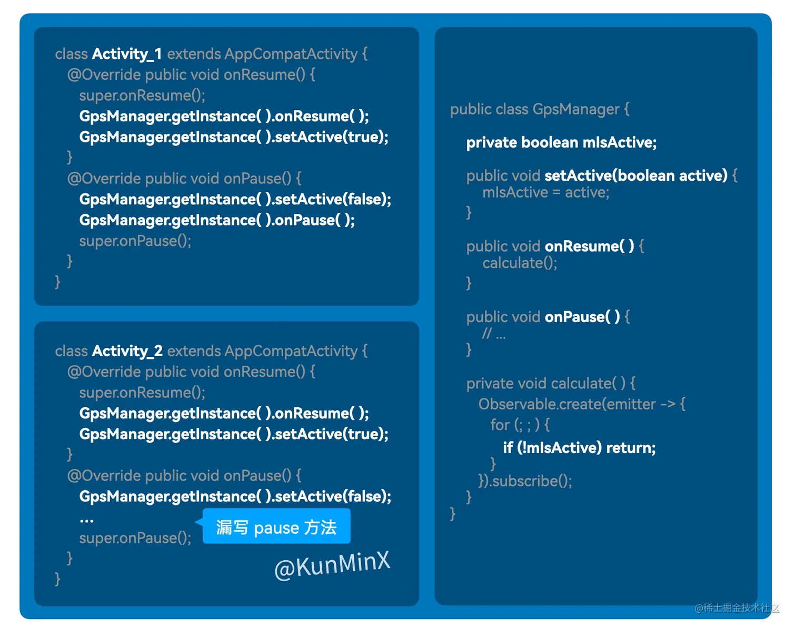
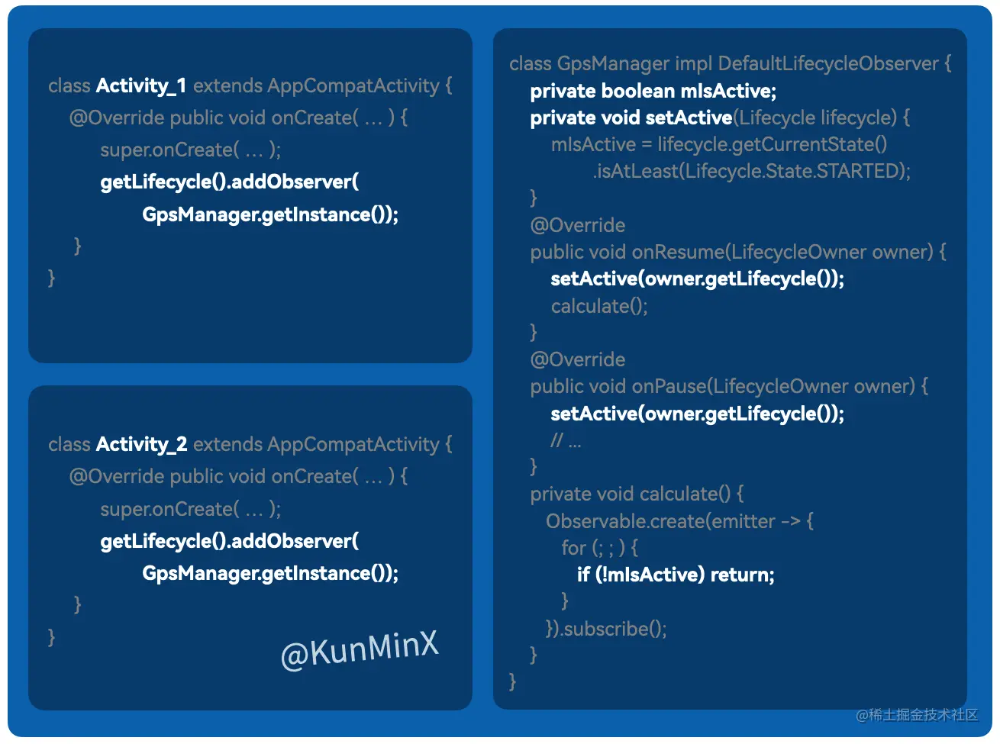

[toc]

## 01.Jetpack介绍


## 02.Lifecycle

### 2.1 lifecycle存在之前

- Lifecycle 面市前，“生命周期管理” 全靠手工维持。
- 例如跨页面共享 GpsManager 组件，需要分别在每个宿主 Activity 的 onResume 和 onPause 中 **手动激活和叫停**。
  - 

- 它存在哪些问题呢？
  - 一方面，凡需手工维持，开发者皆易疏忽，特别是工作交接给其他同事时，同事并不能及时注意到这些细节。
  - 另一方面，分散的代码不利于修改，日后除了激活、叫停，若有其他操作补充，则每个宿主 Activity 都需额外书写一遍。

### 2.2 Lifecycle如何解决这个问题

- Lifecycle 通过 “模板方法模式” 和 “观察者模式”，将生命周期管理的复杂操作，全在 LifecycleOwner（如 Activity、Fragment 等 “视图控制器” 基类）中封装好
- 开发者因而得以在 “视图控制器” 子类中只需一句 `getLifecycle().addObserver(GpsManager.getInstance)` ，优雅完成 “第三方组件” 在自己内部对 LifecycleOwner 生命周期 “感知”。
  - 

- 如此，它解决了一致性的问题。

## 03.LiveData

- 

### 3.1 LiveData出现之前

- **场景：音乐播放器的播放/暂停状态管理**
- 假设需要实现以下功能：
- 1. 主界面（`MainActivity`）控制播放/暂停按钮。
  2. 通知栏（`NotificationPlayer`）显示播放状态并提供控制按钮。
  3. 播放详情页（`PlayerDetailActivity`）显示当前播放状态。

- LiveData 面市前，我们在 “网络请求回调、跨页面通信” 等场景分发消息，多是通过 EventBus 或 Java Interface 完成。而EventBus存在以下问题：

  - EventBus 作为全局事件总线，允许任何组件随意发布和订阅事件，缺乏统一的数据源管理。多个组件可能同时修改同一数据并发送事件，导致数据来源不明、逻辑混乱。

    - ```
      // 主界面发送播放事件
      public class MainActivity extends AppCompatActivity {
          private void onPlayButtonClick() {
              EventBus.getDefault().post(new PlayEvent()); // 来源1：主界面
          }
      }
      
      // 通知栏发送播放事件
      public class NotificationPlayer {
          private void onPlayButtonClick() {
              EventBus.getDefault().post(new PlayEvent()); // 来源2：通知栏
          }
      }
      
      // 播放详情页订阅事件
      public class PlayerDetailActivity extends AppCompatActivity {
          @Override
          protected void onCreate(Bundle savedInstanceState) {
              super.onCreate(savedInstanceState);
              EventBus.getDefault().register(this); // 注册订阅
          }
      
          @Subscribe
          public void onPlayEvent(PlayEvent event) {
              // 问题：无法区分事件来源，可能重复处理逻辑
              updateUI("播放中");
          }
      }
      ```

    - 播放事件可能来自多个地方（主界面、通知栏），导致 `PlayerDetailActivity` 无法判断事件来源，可能重复执行逻辑（如多次请求网络）。
    - 调试困难，难以追踪事件触发源头。

  - EventBus 需要手动注册（`register`）和注销（`unregister`）订阅者。如果组件销毁时未及时注销，EventBus 会持有其引用，导致内存泄漏。

    - ```
      // 通知栏发送播放事件
      public class NotificationPlayer {
          private void onPlayButtonClick() {
              EventBus.getDefault().post(new PlayEvent()); // 来源2：通知栏
          }
      }
      
      
      public class PlayerDetailActivity extends AppCompatActivity {
          @Override
          protected void onCreate(Bundle savedInstanceState) {
              EventBus.getDefault().register(this); // 注册订阅
          }
      
          @Override
          protected void onDestroy() {
              // 开发者忘记调用 unregister(this)，导致 EventBus 持有 Activity 引用
              super.onDestroy();
          }
      
          @Subscribe
          public void onPlayEvent(PlayEvent event) {
              // 若 Activity 已销毁，此处可能触发 NPE
              textView.setText("播放中");
          }
      }
      ```

    - 用户退出`PlayerDetailActivity` 但未注销订阅，后续播放事件仍会触发 `onPlayEvent`，导致：

      - 内存泄漏（Activity 无法回收）。
      - 更新已销毁的 UI 引发崩溃（`NullPointerException`）。

  - **数据过时：新订阅者无法获取最新状态**

    - ```
      // 后台服务发送播放事件
      public class MusicService {
          public void startPlay() {
              EventBus.getDefault().post(new PlayEvent());
          }
      }
      
      // 用户稍后进入播放详情页
      public class PlayerDetailActivity extends AppCompatActivity {
          @Override
          protected void onCreate(Bundle savedInstanceState) {
              EventBus.getDefault().register(this); // 注册订阅
          }
      
          @Subscribe
          public void onPlayEvent(PlayEvent event) {
              // 问题：如果 PlayEvent 之前已发送过，这里不会触发
              updateUI("播放中");
          }
      
          // 需要手动拉取最新状态
          private void fetchLatestState() {
              // 额外请求接口获取当前播放状态
          }
      }
      ```

    - 新打开的 `PlayerDetailActivity` 无法自动获取当前播放状态，需手动同步数据，增加代码复杂度。

### 3.2 **LiveData 的解决方案**

- 使用ViewModel作为唯一可信源，统一通过 ViewModel 修改状态，这样确保数据来源唯一，避免多源头冲突。

  - 我们首先有一个自定义的ViewModel，拥有两个变量，一个是私有可写的playState，另一个是对外只读的playstate。

  - ```
    // ViewModel 统一管理播放状态
    class MusicPlayerViewModel : ViewModel() {
        private val _playState = MutableLiveData<Boolean>() // 私有可写
        val playState: LiveData<Boolean> = _playState       // 对外只读
    
        fun setPlaying(isPlaying: Boolean) {
            _playState.value = isPlaying
        }
    }
    ```

  - 我们在不同组件中发布事件统一通过ViewModel修改这个私有可写的变量实现

    - ```
      // 主界面更新状态
      class MainActivity : AppCompatActivity() {
          private val viewModel: MusicPlayerViewModel by viewModels()
      
          private fun onPlayButtonClick() {
              viewModel.setPlaying(true) // 统一通过 ViewModel 修改状态
          }
      }
      
      // 通知栏更新状态
      class NotificationPlayer {
          private val viewModel: MusicPlayerViewModel by viewModels()
      
          private fun onPlayButtonClick() {
              viewModel.setPlaying(true) // 统一通过 ViewModel 修改状态
          }
      }
      ```

  - 我们订阅事件，则是统一通过获取ViewModel中这个对外只读的变量实现。

    - ```
      // 自动绑定生命周期，无需手动注销
      viewModel.playState.observe(this) { isPlaying ->
          if (isPlaying) {
              textView.text = "播放中"
          } else {
              textView.text = "已暂停"
          }
      }
      ```

- 自动绑定生命周期，无需手动注销，避免内存泄漏

  - ```
    // 播放详情页观察状态
    class PlayerDetailActivity : AppCompatActivity() {
        private val viewModel: MusicPlayerViewModel by viewModels()
    
        override fun onCreate(savedInstanceState: Bundle?) {
            super.onCreate(savedInstanceState)
            // 自动绑定生命周期，无需手动注销
            viewModel.playState.observe(this) { isPlaying ->
                if (isPlaying) {
                    textView.text = "播放中"
                } else {
                    textView.text = "已暂停"
                }
            }
        }
    }
    ```

  - 我们在onCreate阶段观察事件，而LiveData 会自动在 `onDestroy` 时移除观察者，避免内存泄漏和崩溃风险。

- 新订阅者（如 `PlayerDetailActivity`）首次观察 LiveData 时，立即收到最新数据，无需手动同步。

### 3.3 总结：

- **EventBus** 的缺陷本质是缺乏 **数据源约束** 和 **生命周期管理**，导致代码维护成本高。
- **LiveData + ViewModel** 通过约束数据流向、绑定生命周期、保障数据一致性，提供更健壮的解决方案。

## 04.ViewModel

- ViewModel 的存在，主要为了解决 “状态管理” 和 “页面通信” 问题。
  - 状态管理是指：托管与视图（Activity/Fragment）相关的数据，避免因配置变更（如屏幕旋转）导致数据丢失。
  - 页面通信是指：在同一个Activity内部的不同Fragment之间共享数据，简化跨页面通信。

### 4.1 ViewModel存在之前

- **MVP 的 Presenter 或传统 MVVM 的 ViewModel**：生命周期与视图控制器绑定，视图销毁时数据丢失，需要进行数据恢复。而且关键是数据恢复效率低下，通过 `saveInstanceState` 保存重量级数据需序列化，性能差且复杂。

  - ```
    // MVP 中 Presenter 的生命周期与 Activity 绑定
    public class UserPresenter {
        private UserData userData; // Activity 旋转后数据丢失
    
        public void fetchUserData() {
            // 重新请求网络数据
        }
    }
    ```

### 4.2 ViewModel如何解决

- 首先是视图销毁重建后数据的恢复。对于轻量级数据，仍采用saveInstanceState恢复。对于重量级的，由 ViewModel 托管（如网络请求结果）。

  - ```
    // ViewModel 托管用户列表数据
    class UserViewModel : ViewModel() {
        private val _userList = MutableLiveData<List<User>>()
        val userList: LiveData<List<User>> = _userList
    
        fun loadUsers() {
            // 模拟网络请求
            _userList.value = listOf(User("Alice"), User("Bob"))
        }
    }
    
    // Activity 中使用 ViewModel
    class UserActivity : AppCompatActivity() {
        private val viewModel: UserViewModel by viewModels()
    
        override fun onCreate(savedInstanceState: Bundle?) {
            super.onCreate(savedInstanceState)
            viewModel.loadUsers()
            viewModel.userList.observe(this) { users ->
                // 更新 UI
            }
        }
    }
    ```

  - 此时Activity 旋转后，也就是销毁重建后，只需要从ViewModel中读取托管的数据即可。

- 其次是作用域共享，同一 Activity 的多个 Fragment 共享 ViewModel：

  - ```
    // 共享的 ViewModel
    class SharedViewModel : ViewModel() {
        val selectedItem = MutableLiveData<String>()
    }
    
    // Fragment A 设置数据
    class FragmentA : Fragment() {
        private val sharedViewModel: SharedViewModel by activityViewModels()
    
        fun onItemClick(item: String) {
            sharedViewModel.selectedItem.value = item
        }
    }
    
    // Fragment B 接收数据
    class FragmentB : Fragment() {
        private val sharedViewModel: SharedViewModel by activityViewModels()
    
        override fun onViewCreated(view: View, savedInstanceState: Bundle?) {
            sharedViewModel.selectedItem.observe(viewLifecycleOwner) { item ->
                // 更新 UI
            }
        }
    }
    ```

  - 传统Fragment 间通信通过接口或EventBus。我们这里可以通过ViewModel共享数据。可以设置它的数据，也可以通过它的observe去获取数据。

## 05.DataBinding

- ADS

### 5.1 DataBinding存在之前

- 假如我们横竖屏布局控件不一致，竖屏布局中有TextView，横屏中没有。那么我们需要去里面手动判断TextView是否为空。

  - ```
    public class MainActivity extends AppCompatActivity {
        private TextView textView;
    
        @Override
        protected void onCreate(Bundle savedInstanceState) {
            super.onCreate(savedInstanceState);
            setContentView(R.layout.activity_main);
            textView = findViewById(R.id.text_view); // 横屏布局中可能为 null
    
            // 更新 UI 时需手动判空
            if (textView != null) {
                textView.setText("Hello World");
            }
        }
    }
    ```

### 5.2 DataBinding存在之后

- 我们无需 “手工调用 View 实例” 来 set 新状态，我们将 “控件” 与 “可观察数据” 进行绑定，你只需 set 可观察数据本身，那么被绑定该数据的控件即可被通知和刷新。

- 具体示例如下：

  - **步骤1：启用 DataBinding**，在 `build.gradle` 中启用：

    - ```
      android {
          dataBinding {
              enabled = true
          }
      }
      ```

  - **步骤2：定义数据类**

    ```
    data class User(val name: String, val age: Int)
    ```

  - **步骤3：布局文件中绑定数据**

    ```
    <layout xmlns:android="http://schemas.android.com/apk/res/android">
        <data>
            <variable name="user" type="com.example.User"/>
        </data>
        <TextView
            android:id="@+id/text_view"
            android:text="@{user.name}" /> <!-- 直接绑定数据 -->
    </layout>
    ```

  - **步骤4：在代码中绑定数据**

    ```
    class MainActivity : AppCompatActivity() {
        override fun onCreate(savedInstanceState: Bundle?) {
            super.onCreate(savedInstanceState)
            val binding: ActivityMainBinding = DataBindingUtil.setContentView(this, R.layout.activity_main)
            binding.user = User("Alice", 25) // 数据变更自动更新 UI
        }
    }
    ```

  - 此时我们去操作的不是组件，组件在xml中和数据绑定了，我们这里binding.user是实际的数据。我们操作的是数据。

- ok，他有什么优点？

  - 自动处理控件是否存在，避免空指针。
  - 消除 `findViewById` 和判空逻辑，减少模板代码。
  - UI 状态由数据变化自动触发，无需手动操作 View。
  - 不同布局（横竖屏）共用同一数据绑定逻辑，维护成本低。

## 06.总结

- ifecycle 的存在，主要是为了解决 **生命周期管理 的一致性问题**。
- LiveData 的存在，主要是为了帮助 新手老手 都能不假思索地 **遵循 通过唯一可信源分发状态 的标准化开发理念**，从而在快速开发过程中 规避一系列 **难以追溯、难以排查、不可预期** 的问题。
- ViewModel 的存在，主要是为了解决 **状态管理 和 页面通信 的问题**。
- DataBinding 的存在，主要是为了解决 **视图调用 的一致性问题**。