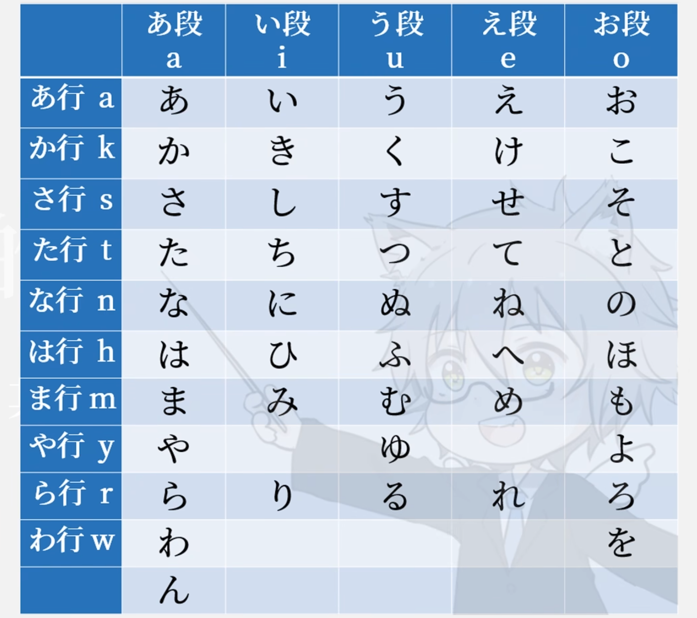

[toc]

五十音图是日语的基本音节表，它将平假名按照发音规律进行排列，每一行和每一列都有特定的发音规律。下面是对这张表格的详细解释：

### 五十音图的结构

五十音图由行和段组成：

1. **行（列）**：
   - 每一行以一个辅音开头，依次是「あ行」（a列）、「か行」（k列）、「さ行」（s列）、「た行」（t列）、「な行」（n列）、「は行」（h列）、「ま行」（m列）、「や行」（y列）、「ら行」（r列）和「わ行」（w列）。
2. **段（行）**：
   - 每一段以一个元音开头，依次是「あ段」（a段）、「い段」（i段）、「う段」（u段）、「え段」（e段）和「お段」（o段）。

第一列：我开桑塔纳，蛤蟆也来玩

### 表格解释

图片中的表格按照上面所述的规律排列，每个假名代表一个特定的音节。以下是每行和每列的具体解释：

- **あ行（a行）元音行**：u嘴回收，e,o不要拉长。
  - あ (a)
  - い (i)
  - う (u)
  - え (e)
  - お (o)
- **か行（k行）**：k+a行元音行
  - か (ka)
  - き (ki)
  - く (ku)
  - け (ke)
  - こ (ko)
- **さ行（s行）**：
  - さ (sa)
  - し (shi)
  - す (su)
  - せ (se)
  - そ (so)
- **た行（t行）**：
  - た (ta)
  - ち (chi)
  - つ (tsu)
  - て (te)
  - と (to)
- **な行（n行）**：
  - な (na)
  - に (ni)
  - ぬ (nu)
  - ね (ne)
  - の (no)
- **は行（h行）**：
  - は (ha)
  - ひ (hi)
  - ふ (fu)
  - へ (he)
  - ほ (ho)
- **ま行（m行）**：
  - ま (ma)
  - み (mi)
  - む (mu)
  - め (me)
  - も (mo)
- **や行（y行）**：
  - や (ya)
  - ゆ (yu)
  - よ (yo)
- **ら行（r行）**：
  - ら (ra)
  - り (ri)
  - る (ru)
  - れ (re)
  - ろ (ro)
- **わ行（w行）**：
  - わ (wa)
  - を (wo)
  - ん (n)