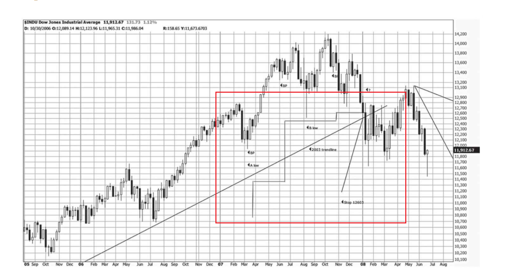

[toc]

## 前言

> 学习要符合如下的标准化链条：了解概念->探究原理->深入思考->总结提炼->底层实现->延伸应用"

## 01.学习概述

- **学习主题**：
- **知识类型**：
  - [ ] ✅Android/ 
    - [ ] ✅01.基础组件与机制 
      - [ ] ✅四大组件
      - [ ] ✅IPC机制
      - [ ] ✅消息机制
      - [ ] ✅事件分发机制
      - [ ] ✅View与渲染体系（含Window、复杂控件、动画）
      - [ ] ✅存储与数据安全（SharedPreferences/DataStore/Room/Scoped Storage）
    - [ ] ✅02. 架构与工程化
      - [ ] ✅架构模式（MVC/MVP/MVVM/MVI）
      - [ ] ✅依赖注入（Koin/Hilt/Dagger）
      - [ ] ✅路由与模块化（ARouter、Navigation）
      - [ ] ✅Gradle与构建优化
      - [ ] ✅插件化与动态化
      - [ ] ✅插桩与监控框架
    - [ ] ✅03.性能优化与故障诊断
      - [ ] ✅ANR分析与优化
      - [ ] ✅启动耗时优化
      - [ ] ✅内存泄漏监控
      - [ ] ✅监控与诊断工具
    - [ ] ✅04.Jetpack与生态框架
      - [ ] ✅Room
      - [ ] ✅Paging
      - [ ] ✅WorkManager
      - [ ] ✅Compose
    - [ ] ✅05.Framework与系统机制
      - [ ] ✅ActivityManagerService (含ANR触发机制)
      - [ ] ✅Binder机制
  - [ ] ✅音视频开发/
    - [ ] ✅01.基础知识
    - [ ] ✅02.OpenGL渲染视频
    - [ ] ✅03.FFmpeg音视频解码
  - [ ] ✅ Java/
    - [ ] ✅01.基础知识
    - [ ] ✅02.集合框架
    - [ ] ✅03.异常处理
    - [ ] ✅04.多线程与并发
    - [ ] ✅06.JVM
  - [ ] ✅ Kotlin/
    - [ ] ✅01.基础语法
    - [ ] ✅02.高阶扩展
    - [ ] ✅03.协程和流
  - [ ] ✅ Flutter/
    - [ ] ✅01.基础知识
      - [ ] ✅Dart 语言基础
      - [ ] ✅Widget 基础与生命周期
      - [ ] ✅Flutter 基础组件
      - [ ] ✅布局与约束
      - [ ] ✅绘制与渲染体系
      - [ ] ✅状态管理
      - [ ] ✅事件处理与手势系统
      - [ ] ✅原生通信
    - [ ] ✅02.路由与导航
    - [ ] ✅03.性能优化与故障诊断
    - [ ] ✅04.异步编程
    - [ ] ✅05.项目经验与案例沉淀
  - [ ] ✅ 自我管理/
    - [ ] ✅01.内观
  - [ ] ✅ 项目经验/
    - [ ] ✅01.启动逻辑
    - [ ] ✅02.云值守
    - [ ] ✅03.智控平台
- **学习来源**：
- **重要程度**：⭐⭐⭐⭐⭐
- **学习日期**：2025.
- **记录人**：@panruiqi

### 1.1 学习目标

- 了解概念->探究原理->深入思考->总结提炼->底层实现->延伸应用"

### 1.2 前置知识

- [ ] 

## 02.核心概念

### 2.1 是什么？

### 2.2 解决什么问题？

### 2.3 基本特性

## 03. 投资理论介绍

### 3.1 基本面分析和技术面分析

基本面分析

- 他们关注的是影响公司价值的 内在因素，包括：公司层面 ；行业层面；宏观经济
- 投资决策：通过分析所有这些信息，得出一个他们认为的股票的“ 内在价值 ”(Intrinsic Value)。如果当前市场价格 低于 他们计算出的内在价值，他们就会认为这只股票被低估了，是买入的好时机。
- 好，我们举个例子来理解：
  - 当前有一家公司，整体盈利能力不强。但是它所在的行业未来可期，比如：AI、然后它目前是这个行业中的领头者。所以，我们综合评估行业和公司，判断它的潜力很大，会给一个较高的估值，因此我们投资决策买入。我们赚的就是内在价值和当前市场价值的差值的钱

技术面分析

- 只研究 市场行为本身 ，研究股票的图形（价格变动，成交量变动）
- 核心理念 ：
  - 市场包容一切信息 ：技术分析师相信，任何影响股价的因素（包括基本面信息、新闻、投资者情绪等）都已经 反映 在了它的价格和成交量上。价格是所有信息的最终体现。
  - 价格沿趋势变动 ：他们认为价格的变动不是随机的，而是会形成趋势，并且会沿着趋势持续一段时间。
  - 历史会重演 ：通过分析历史图表（K线图等），他们寻找特定的 形态 （Patterns），因为他们相信这些形态在过去预示了某种走势，那么在未来也可能再次出现。
- 投资决策：
  - 通过分析图表上的趋势和形态，来预测价格 未来最有可能的走向 ，并据此做出买卖决策。
  - 在买入时，就已经根据图表上的支撑位，明确知道了自己的止损点。比如，在突破颈线时买入，那么颈线下方就是他的止损位。一旦跌破，说明这次突破是假的，他会立即离场，损失非常小。
  - 用很多次小的、可控的亏损，去换取少数几次大的盈利。

两者对比：

- 基本面 = 侦探 ：需要极强的专业知识，深入细节，调查取证，最终给出一个“这家公司值多少钱”的结论。
- 技术面 = 天气预报员 ：他不去研究大气的化学成分，而是看云图（K线图）、气压（成交量）、风向（趋势），然后告诉你“明天上涨的 概率 是70%”。
- 技术分析交易的精髓是：“ 通过概率取胜。做到：赢就赚很多，输就通过支撑位来减小损失 ”。我们称之为“ 正向的盈亏比 ”。这也是为什么技术分析者如此看重止损的原因。

### 3.2 技术分析真的正确吗？

我有一个疑问：

- 在一个行业基本面即将反转（如光伏去库存结束）的场景下，基本面分析可以提前“左侧交易”埋伏。而技术分析似乎无法判断买点。
  - 模拟一个场景，当前光伏处于一个去库存周期，导致整个的行业的公司股价承压。处于一个较低的水平。现在去库存周期即将过去。光伏行业公司的净利润开始上扬。如果是基本面分析，那么我们可以确定公司的净资产，以及整个行业的变化。所以我们会左侧交易提前埋伏。而如果是技术面分析，我们可能没法去正确判断买点啊。
- 在当前场景中，一个技术分析师会观察以下信号，来寻找那个“买点”：
  - 下跌趋势的终结 ：首先，股价会停止创出新低。原来的下降趋势线会被突破，这是一个“刹车”信号。
  - 底部形态的构筑 ：股价不会立即飞涨，而是在底部区域反复震荡，形成一个“ 底部形态 ”，比如 圆弧底 、 双重底（W底） ，或是更复杂的“ 头肩底 ”。这个震荡区域，正是早期知情资金在**吸筹（Accumulation）**的阶段。他们不希望价格涨得太快，以便自己能买到更多便宜的筹码。
  - 成交量的变化 ：在底部区域，我们常常会看到“ 价跌量缩，价涨量增 ”的现象。即下跌时成交量很小（说明抛压穷尽），而温和上涨时成交量在放大（说明有资金在买入）。
  - 确认性的突破 ：当吸筹阶段接近尾声，股价会以一根 放量的大阳线 ，向上 突破 这个底部形态的“颈线”（关键阻力位）。

## 04. 道氏理论

### 4.1 道氏理论的起源：道琼斯平均指数

道氏理论不关注个股，而是关注 平均指数 。为什么呢？

- 因为一个早已被普遍接受的事实是： 绝大多数股票会同涨同跌 ( charpter03.md:22-23 )。牛市来临时，大部分船都会被潮水抬高；熊市来临时，也鲜有股票能独善其身。

- 因此，想要把握市场的整体脉搏，观察单一股票是片面的，甚至会产生误导。最有效的方法，就是选取一组具有代表性的股票，计算它们的平均价格，形成一个 指数 。这个指数就成了衡量市场整体趋势的标尺。

道氏理论倚赖的平均指数有哪些？

- 在1897年，道氏确定了两个指数作为他分析的基石，道琼斯工业平均指数；道琼斯铁路业平均指数

为什么选这两个呢？

- 工业指数 代表了商品的 生产者 。运输指数 代表了商品的 运输者 。
- 一个健康的牛市，必然是生产繁荣（工业指数上涨），同时运输也同样繁忙（运输指数上涨），这表明生产出来的商品被顺利地运往市场销售。
- 如果只有工业指数上涨，而运输指数没有跟上，这可能是一个危险的信号：商品可能只是被生产出来，但并没有被有效运输和销售，正积压在仓库里。反之亦然。
- 只有当两个指数都表现出强劲的上涨（或下跌）趋势时，这个趋势才被认为是健康和可持续的。

### 4.2 道氏理论_市场趋势

道氏理论相信，市场由三种趋势构成：潮汐、波浪与涟漪，为了更好地理解这三种趋势，道氏理论的追随者们使用了一个非常经典的比喻： 海洋的运动

- 长线趋势 (Primary Trend) - 如同“潮汐”

   - 定义 ：这是市场最主要、最根本的运动方向，是整体向上（牛市）或向下（熊市）的大趋势。
   - 时间 ：通常持续 一年以上 ，甚至长达数年。
   - 重要性 ：这是长期投资者唯一需要关心的趋势。他们的策略是在牛市初期买入并持有，直到熊市来临的明确信号出现。
- 中线趋势 (Secondary Trend) - 如同“波浪”

   - 定义 ：这是对长线趋势的 修正或回调 。在牛市的上涨大潮中，会有向下的调整波浪；在熊市的下跌大潮中，也会有向上的反弹波浪。
   - 时间 ：通常持续 三周到数月 。
   - 幅度 ：一般会回调前一波长线趋势涨跌幅的 1/3 到 2/3 。这是一个非常重要的参考法则，但并非绝对。
   - 重要性 ：这是短线交易者关注的焦点，他们试图在这些“波浪”中获利。及时识别中线趋势是道氏理论中最困难的部分。
- 短线趋势 (Minor Trend) - 如同“涟漪”

   - 定义 ：这是每日的价格波动。
   - 时间 ：通常持续 不到三周 ，大多在几天之内。
   - 重要性 ：道氏理论认为，短线趋势本身 没有分析意义 ，因为它充满了各种“噪音”，甚至可能被短暂操纵。试图根据每日的“涟漪”来预测市场方向，极易被误导。但是，多个短线趋势可以共同构成一个中线趋势。

在道氏理论的视角下，我们来看看 什么是牛市和熊市

先看看牛市的三个阶段

- 第一阶段：建仓期 (Accumulation)
  - 市场情绪 ：悲观弥漫。此时刚经历完熊市的末期，大多数人对股市不感兴趣，坏消息不断。
  - 投资者行为 ：大众并不关心，导致热钱进入较少，但是有远见的投资者（常被称为“聪明的钱”）开始悄悄买入，他们认为最坏的时期已经过去，股票价值被低估，因此仍然有一些钱进入。
  - 市场表现 ：成交量低迷，但价格不再创新低，并开始缓慢回升。
- 第二阶段：稳步上涨期 (Public Participation)
  - 市场情绪 ：开始转暖。公司业绩改善，经济数据好转，公众开始重新关注股市。
  - 投资者行为 ：技术派投资者看到趋势形成，开始积极参与。大众中的部分人也开始逐步意识到市场的赚钱效应，入场的钱增加。
  - 市场表现 ：入场钱增加，价格稳步上涨，成交量温和放大。这是牛市中持续时间最长、涨幅最稳健的阶段。

- 第三阶段：投机狂热期 (Speculation / Excess)
  - 市场情绪 ：极度乐观，全民狂热。媒体大肆宣传，各种“股神”涌现。
  - 投资者行为 ：几乎所有大众都参与进来，这些新加入的都是投机者。人们追求快速致富。
  - 市场表现 ：股价加速上涨，甚至出现“鸡犬升天”的普涨格局。成交量巨大。垃圾股可能被炒上天，而绩优股涨幅反而落后。 这是牛市的最后一棒，也是最危险的阶段。（因为绩优的股在上一轮中期已经被大家合伙拉升，导致赚钱效应不符合投机者的需求，所以他们会拉低价的小盘垃圾股）

熊市的三个阶段

- 第一阶段：出货期 (Distribution)
  - 市场情绪 ：依然乐观，但开始出现不安。人们觉得获利变得越来越困难。（因为此时，再也没有多余的热钱可以进来了，没有钱，那么就没有买盘，这导致整体股价很难被抬升。）
  - 投资者行为 ：曾经在建仓期买入的“聪明的钱”开始悄悄卖出，他们认为企业盈利已达顶峰，股价被高估。
  - 市场表现 ：价格上涨乏力，每次上涨成交量都无法有效放大。市场在高位反复震荡，形成顶部。
- 第二阶段：恐慌期 (Panic)
  - 市场情绪 ：恐慌蔓延。买盘消失，卖盘汹涌而出。
  - 投资者行为 ：没有赚钱效应时甚至产生亏钱效应时，投机者开始恐慌，大家开始争先恐后的抛出去，恐慌就此开始。
  - 市场表现 ：股价几乎是垂直下跌，成交量放出天量。这个阶段通常很短暂，但破坏力极强。（但此时还没有到底部。因为还有一部分投机者，抄底的在强撑着。）

- 第三阶段：绝望期 (Despair)
  - 市场情绪 ：彻底绝望。投资者对市场心灰意冷。
  - 投资者行为 ：之前被套牢或在恐慌期抄底失败的投资者，由于财务压力或彻底失去信心而开始“割肉”卖出。
  - 市场表现 ：股价持续阴跌，成交量萎缩。坏消息不断，但股价已经不再对利空消息做出激烈反应（所谓的“利空出尽”）。 熊市往往在最坏的消息公布之前就已经见底。

这里还有个熊转牛 

- 市场在“半死不活”之后，可能会经历一个漫长的 底部横盘震荡 （这就是牛市的建仓期）。而确认牛市真正开启的信号是什么？是价格突破这个横盘区间的上限，并且出现更高的高点和更高的低点，并且最终得到 两大指数的相互印证 。在这些信号出现前，任何“感觉市场要回暖”的想法都只是猜测。

### 4.3 道氏理论_三大原则

相互印证原则

- 定义：任何一个有效的、预示着 主要趋势发生转变 的信号，都必须由 道琼斯工业平均指数 和 道琼斯运输业平均指数 （原文是铁路业指数） 共同确认 。一个指数发出的信号是无效的
- 我们举个例子：
  - 背景 ：假设市场之前处于一个熊市（长期下跌趋势）中。
  - a点 ：市场见底，两个指数开始了一波中级反弹。
  - b点 ：两个指数同时到达反弹的高点。
  - c点 ：随后市场出现回调。
    - 工业平均指数 ：回调的低点 c 高于 之前的低点 a 。这是一个看涨的迹象。
    - 铁路业平均指数 ：回调的低点 c 低于 之前的低点 a 。这是一个看跌的迹象。 分歧出现！
  - d点 ：市场再次上涨。
    - 工业平均指数 ：价格上涨突破了前一个高点 b ，到达了 d 。根据我们之前学到的牛市定义（高点和低点不断抬高）， 仅看工业指数，它已经发出了一个明确的牛市信号 。
    - 铁路业平均指数 ：价格上涨到 d ，但这个高点 远低于 前一个高点 b 。它完全没有确认工业指数的强势。
- 根据道氏理论的相互印证原则，尽管工业指数看起来已经进入了牛市，但由于没有得到运输指数的确认，这个 牛市信号是无效的、不可靠的 。此时，最明智的判断是： 市场的长期趋势仍然是向下的（熊市），或者至少是“趋势不明” 。
- 投资者应该保持耐心，继续等待，直到运输指数也同样突破其前一个高点 b，才能确认牛市的到来。在此之前，工业指数很可能会上涨失败，重新与运输指数一起下跌。

成交量验证原则

- 定义：成交量应该顺应主要趋势的方向。
- 具体表现为：

  - 在牛市中 ：价格上涨时，成交量趋于放大 ；价格 回调 时，成交量趋于缩小 。这表明市场的买入意愿强烈，而回调时的卖出压力不大，趋势是健康的。
  - 在熊市中 ：价格下跌时，成交量趋于放大 ；价格反弹时，成交量趋于缩小 。这表明市场的抛售压力沉重，而反弹只是暂时的，缺乏买盘支撑。
- 记住：在道氏理论中，成交量的地位是 次要的、验证性的 。关于市场趋势的最终决定性信号，永远来自于 价格本身的行为，如果价格发出了一个趋势反转信号，但成交量没有验证（例如，牛市突破新高但成交量萎缩），这会使得信号的可靠性打折扣，但并不能完全否定价格信号。分析师会因此更加警惕，但最终的判断仍然以价格为准。

“横盘”形态及其意义

- 定义：横盘”（Line）是一种特殊的市场形态，它可以 取代中线趋势
- 形态特征 ：

  - 价格 ：在一个狭窄的区间内（通常不超过5%）来回波动。
  - 时间 ：持续两三周，有时甚至长达数月。
- 形态解读 ：横盘的出现，意味着市场中的 买方力量和卖方力量达到了暂时的平衡 。多空双方势均力敌，谁也无法占据上风，价格因此陷入僵局。
  - 如果 卖方的力量耗尽 ，买方为了买到股票，就必须出更高的价格，从而推动价格 向上突破 横盘区间的上限。
  - 如果 买方的力量耗尽 ，卖方为了卖出股票，就必须接受更低的价格，从而导致价格 向下跌破 横盘区间的下限。
- 横盘形态可以出现在趋势的任何位置：

  - 在熊市末期出现，可能是牛市的“ 建仓 ”阶段。
  - 在牛市末期出现，可能是熊市的“ 出货 ”阶段。
  - 在上涨或下跌趋势的中途出现，则是一种“ 休整 ”或“ 巩固 ”，是原有趋势的延续。

## 05.道氏理论的缺陷

### 5.1 道氏理论有什么缺陷

道氏理论的核心缺陷是存在滞后性：

- 道氏理论的买卖信号，由于需要等待趋势的层层确认，必然会 错过趋势的开头和结尾 。有人尖锐地指出，道氏理论让投资者“赚不到市场长线涨幅的前1/3和后1/3，而有些时候，市场并没有中间这1/3”

但是，即使如此，道氏理论仍旧很出色

- 理查德·杜兰特和杰克·施纳普等人做的长达113年的模拟交易记录
- 模拟规则
  - 初始资金 ：100美元
  - 起始时间 ：1897年
  - 道氏理论策略 ：仅在道氏理论 确认牛市 时买入道琼斯工业平均指数，在 确认熊市 时卖出，并空仓等待。期间满仓操作。
  - 买入并持有策略 ：在1896年的最低点买入，并一直持有到2010年。 惊人的结果
- 60年记录 (表4-1 )
   - 道氏理论 ：从1897年到1956年，100美元增值为 $11,228.43 。
   - 买入并持有 ：从1896年到1956年，100美元增值为 $1,757.93 。
   - 结论 ：道氏理论的收益是“买入并持有”的 6倍以上 。
- 113年记录 (表4-2 )
   - 道氏理论 ：从1897年到2010年，100美元增值为 $492,597.38 。
   - 买入并持有 ：从1896年到2010年，100美元增值为 $25,952.72 。
   - 结论 ：道氏理论的收益是“买入并持有”的 19倍左右 ！ 结果背后的深刻含义，这个长达百年的数据显示了一个颠覆很多人直觉的结论： 择时是有效的，而且非常重要。

为什么“买入并持有”这个被很多人奉为圭臬的策略，长期来看会远远跑输道氏理论？

- 关键在于 熊市的巨大杀伤力 。
- “买入并持有”策略的投资者，必须用自己的账户 硬抗 每一次熊市的巨大回撤。书中提到，1929-1932年大萧条，道指跌幅高达 89% ；2000年科网泡沫破裂，跌幅 39% 。一次89%的下跌，需要后续上涨约 9倍 才能回本。
- 而道氏理论策略的核心优势在于 风险控制 。它通过在熊市确认时卖出并 空仓 ，成功地 避开了熊市主要的下跌阶段 。虽然它会因此错过熊市末期到牛市初期的反弹，但它保全了本金，使得在下一轮牛市中可以以更高的起点重新出发。

所以，引出道氏理论的优点：整体方向的把控，带来的是优秀的风险控制

### 5.2 道氏理论的边界

道氏理论是一个工具，我们用它可以做什么？又不能做什么？

道氏理论可以做的：

- 大方向的把控，判断市场主要趋势 (Primary Trend)。

道氏理论不能做的：

- 不能用于个股选择，个股有其自身的涨跌逻辑（公司基本面、行业消息等），可能会与大盘走势完全相悖。
- 不能用于预测趋势的持续时间或幅度 ：道氏理论可以告诉你“牛市已经确认”，但它 无法告诉你 这个牛市会持续多久，或者会上涨多少点。
- 不能用于次要趋势和日常波动的交易 ：对于几周或几个月的次要趋势，它的信号不仅滞后，而且可能会频繁出错。

我们该如何解决这些问题呢：

- 我们可以通过etf来解决个股选择的问题。
- 趋势的时间和幅度
  - 可以通过形态测量来预测趋势的幅度：例如，一个持续了6个月的“横盘区间”（Line）被向上突破，技术分析师会把这个区间的价格高度，从突破点向上	加，作为一个最小的目标价。
  - 预测时间是所有技术分析中最困难的部分。但我们可以通过观察 趋势的健康度 来判断趋势是否接近衰竭。例如：
    - 量价关系 ：如果价格持续上涨，但成交量却逐渐萎缩，这叫“量价背离”，是趋势可能力竭的信号。
    - 市场情绪 ：当市场从怀疑转向乐观，最终进入全民狂欢的“非理性繁荣”阶段时，往往是趋势的末期。
- 至于短线，我们不要用它来做短线，他属于战略层的，做短线是战术层的事。

### 5.3 思考

思考一：一个成熟的投资者，他的交易系统是 分层的

- 战略层 ：使用道氏理论判断市场主要趋势，决定当前是应该以做多为主，还是以空仓/做空为主。
- 战术层 ：在战略方向指引下，使用 其他工具 （如基本面分析选股、形态分析选时、斐波那契定目标）来执行具体的交易

思考二：根据道氏理论的缺陷，道氏理论太慢，如果死等它确认，行情可能已经走完了一大半（黄花菜都凉了）。所以，在它确认之前，我们往往不得不先用战术层动手

- 此时我们要引入一个新的维度：仓位管理来解决这个问题呢
- 道氏理论（战略层）的作用，并不是一个非黑即白的“允许交易/禁止交易”的开关，而是一个控制你 油门踩多深 的调节器
- 场景一：战略不明 + 战术有信号 = 轻仓试探 (Probing)
  - 现状 ：道氏理论显示趋势不明朗（比如还在震荡区间，或者刚从熊市底部反弹但未确认反转），“黄花菜”还没热，但还没凉。
  - 战术信号 ：某只个股或板块走出了漂亮的“基准点”突破形态。
  - 操作 ：这时候 不等待 道氏理论的最终确认，直接入场。
  - 关键区别 ：但是！因为战略层不支持，你的 胜率 在理论上是降低的（因为大势可能随时掉头向下）。为了对冲这个风险，你不能满仓干。你会只用 20%-30% 的仓位去“试错”
  - 结果A ：如果这确实是牛市的起点，你这30%的仓位买在了最低点，赚到了第一桶金。等道氏理论随后确认了牛市，你再通过“加仓”把剩下的资金打进去。
  - 结果B ：如果这只是熊市中的一次反弹，你止损离场。因为只有30%的仓位，损失非常可控，不会伤筋动骨
- 场景二：战略确认 + 战术有信号 = 重仓出击 (Aggressive)
  - 现状 ：道氏理论已经明确发出了“牛市确认”信号（比如工业和运输指数双双突破）。
  - 战术信号 ：新的买点出现（比如回踩支撑位，或者新的形态突破）。
  - 操作 ：这时候，你拥有了“天时”（大势）和“地利”（个股形态）。
  - 关键区别 ：你可以大胆地把仓位推高到 80%-100% 。虽然这时候价格比“场景一”要高，但因为 确定性 极高，大势在推着你走，赚钱反而更容易

- 所以，核心是用 仓位大小 来匹配 确定性程度。

思考三：对于A股，我们如何用道氏理论来判断周期？

- 经典验证组合：上证50 (或沪深300) vs. 中证500 (或中证1000)         （有待商榷）
- 代表意义 ：
  - 上证50/沪深300 ：代表中国经济的**“存量”与“权重”**。它们是金融、地产、传统能源、大消费等巨头。它们对应道氏理论中的“工业指数”，反映宏观经济的基本盘。
  - 中证500/中证1000 ：代表中国经济的**“增量”与“活力”**。它们是中小盘、专精特新、新兴产业。它们对应道氏理论中的“运输指数”（作为经济活动的敏锐反映）。
- 如何验证 ：
  - 牛市确认 ：必须是 大盘股（上证50）搭台，中小盘（中证500）唱戏 。两者必须 同时 创出新高（或突破关键阻力位）。
  - 背离警示 ：如果上证50在国家队护盘下创新高，但中证500却一路阴跌（赚了指数不赚钱），这就是典型的**“分歧”**，说明市场缺乏内生动力，牛市并未确认，大概率是诱多

## 06.基准点法

### 6.1两种基准点法

基准法一：基于波段低点的防守

- 这是一个纯粹的 趋势跟踪策略 ，核心思想是“只要趋势不坏，我就一直持有”。

- 入场 ：当价格突破前一个重要的 波段高点 时买入。
- 止损/止盈设置 ：
  - 随着价格上涨，市场会形成一系列一浪高过一浪的 波段低点 (Wave Bottoms) 。
  - 你的止损位，就设置在 最近的一个波段低点 下方一点点。
  - 动态调整 ：每当市场创出新高并形成一个新的、更高的波段低点时，你就把止损位 向上移动 到这个新的低点下方。
- 离场 ：当价格 跌破 你当前设置的止损位（即跌破了最近的一个有效波段低点）时，无条件卖出。
  逻辑 ：根据道氏理论，牛市的定义就是“低点不断抬高”。一旦最新的低点被跌破，牛市的定义就不再成立，趋势可能反转，所以必须离场。

基准法二：基于波段高点的激进保护

- 入场 ：同变体1。
- 止损/止盈设置 ：
- 回撤幅度止盈 (Percentage Retracement) ：
  - 逻辑 ：如果你买入后，价格上涨了50%，然后开始下跌。
  - 操作 ：如果从最高点下跌超过了 10% （或者某个你设定的阈值，如ATR指标的3倍），不管有没有跌破前低，先跑。
  - 为什么 ：因为在强势牛市中，正常的回调不应该太深。太深的回调说明上涨动能衰竭，或者主力在出货。
- 关键技术位止盈 (Technical Level Breakdown) ：
  - 逻辑 ：利用图形分析。
  - 操作 ：
    - 趋势线 ：画一条连接最近几个波段低点的上升趋势线。如果价格 跌破这条线 ，哪怕还没跌破前低，也卖出。图5-1中的 2003 trendline 跌破就是一个典型例子。
    - 形态 ：如果高位出现了“双顶”、“头肩顶”等反转形态，一旦 颈线跌破 ，立刻卖出。
- 抛物线加速后的离场 (Parabolic Climax) ：
  - 逻辑 ：当价格呈抛物线状垂直拉升，远离均线时，这是情绪的极值。
  - 操作 ：一旦这种垂直拉升后出现第一根大阴线（放量下跌），不要等什么波段低点，直接在收盘前离场。因为这种崩盘通常是断崖式的。

### 6.2 实战案例

看看下面这个

- 这个不断上涨的阶梯就是我们该止盈的位置
  - 

### 6.3 为什么基准点法效率比道氏理论更高？

基准点法：灵活的快艇

- 买入/卖出信号 ：只需要 单一标的 （比如你操作的那只股票或ETF）突破自身的周线形态即可。 不需要等待另一个指数来验证 。
- 效率提升点1（入场更早） ：省去了等待“相互验证”的时间。只要图形好了就进。
- 效率提升点2（止损更紧） ：它的止损是跟随每一个 微小的波段低点 上移的。

道氏理论：迟钝的巨轮

- 买入/卖出信号 ：必须等待道琼斯工业指数和运输指数 双双 突破前高或跌破前低。
- 问题 ：这种“双重确认”非常耗时。往往等到两个指数都确认时，市场已经走出了很大一截。
- 止损 ：道氏理论的止损通常是基于 主要次级趋势 (Secondary Trend) 的低点。这个点往往距离当前价格非常远。

总结：基准点法通过更大胆的入场和更好的风险控制去不断低风险的尝试。

## 05.深度思考

### 5.1 关键问题探究

### 5.2 设计对比

## 06.实践验证

### 6.1 行为验证代码

### 6.2 性能测试

## 07.应用场景

### 7.1 最佳实践

### 7.2 使用禁忌

## 08.总结提炼

### 8.1 核心收获

### 8.2 知识图谱

### 8.3 延伸思考

## 09.参考资料

1. 
2. 
3. 

## 其他介绍

### 01.关于我的博客

- csdn：http://my.csdn.net/qq_35829566

- 掘金：https://juejin.im/user/499639464759898

- github：https://github.com/jjjjjjava

- 邮箱：[934137388@qq.com]

 
