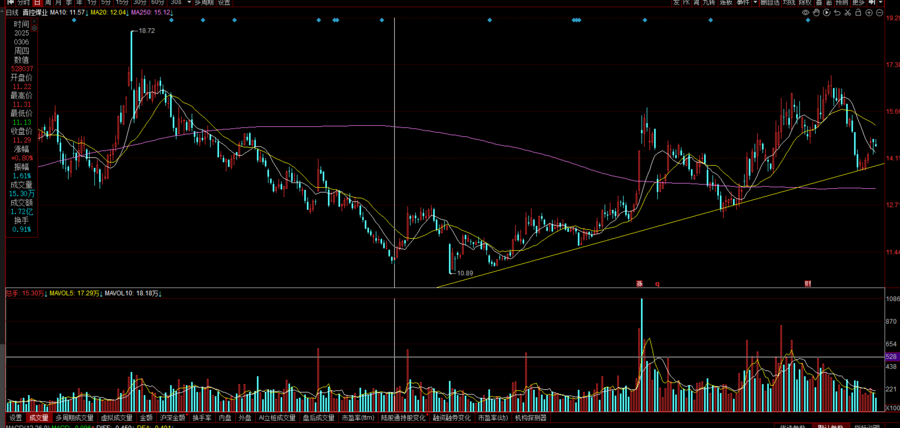

[toc]

## 前言

> 学习要符合如下的标准化链条：了解概念->探究原理->深入思考->总结提炼->底层实现->延伸应用"

## 01.学习概述

- **学习主题**：
- **知识类型**：
  - [ ] ✅Android/ 
    - [ ] ✅01.基础组件与机制 
      - [ ] ✅四大组件
      - [ ] ✅IPC机制
      - [ ] ✅消息机制
      - [ ] ✅事件分发机制
      - [ ] ✅View与渲染体系（含Window、复杂控件、动画）
      - [ ] ✅存储与数据安全（SharedPreferences/DataStore/Room/Scoped Storage）
    - [ ] ✅02. 架构与工程化
      - [ ] ✅架构模式（MVC/MVP/MVVM/MVI）
      - [ ] ✅依赖注入（Koin/Hilt/Dagger）
      - [ ] ✅路由与模块化（ARouter、Navigation）
      - [ ] ✅Gradle与构建优化
      - [ ] ✅插件化与动态化
      - [ ] ✅插桩与监控框架
    - [ ] ✅03.性能优化与故障诊断
      - [ ] ✅ANR分析与优化
      - [ ] ✅启动耗时优化
      - [ ] ✅内存泄漏监控
      - [ ] ✅监控与诊断工具
    - [ ] ✅04.Jetpack与生态框架
      - [ ] ✅Room
      - [ ] ✅Paging
      - [ ] ✅WorkManager
      - [ ] ✅Compose
    - [ ] ✅05.Framework与系统机制
      - [ ] ✅ActivityManagerService (含ANR触发机制)
      - [ ] ✅Binder机制
  - [ ] ✅音视频开发/
    - [ ] ✅01.基础知识
    - [ ] ✅02.OpenGL渲染视频
    - [ ] ✅03.FFmpeg音视频解码
  - [ ] ✅ Java/
    - [ ] ✅01.基础知识
    - [ ] ✅02.集合框架
    - [ ] ✅03.异常处理
    - [ ] ✅04.多线程与并发
    - [ ] ✅06.JVM
  - [ ] ✅ Kotlin/
    - [ ] ✅01.基础语法
    - [ ] ✅02.高阶扩展
    - [ ] ✅03.协程和流
  - [ ] ✅ Flutter/
    - [ ] ✅01.基础知识
      - [ ] ✅Dart 语言基础
      - [ ] ✅Widget 基础与生命周期
      - [ ] ✅Flutter 基础组件
      - [ ] ✅布局与约束
      - [ ] ✅绘制与渲染体系
      - [ ] ✅状态管理
      - [ ] ✅事件处理与手势系统
      - [ ] ✅原生通信
    - [ ] ✅02.路由与导航
    - [ ] ✅03.性能优化与故障诊断
    - [ ] ✅04.异步编程
    - [ ] ✅05.项目经验与案例沉淀
  - [ ] ✅ 自我管理/
    - [ ] ✅01.内观
  - [ ] ✅ 项目经验/
    - [ ] ✅01.启动逻辑
    - [ ] ✅02.云值守
    - [ ] ✅03.智控平台
- **学习来源**：
- **重要程度**：⭐⭐⭐⭐⭐
- **学习日期**：2025.
- **记录人**：@panruiqi

### 1.1 学习目标

- 了解概念->探究原理->深入思考->总结提炼->底层实现->延伸应用"

### 1.2 前置知识

- [ ] 

## 02.核心概念

### 2.1 是什么？

### 2.2 解决什么问题？

### 2.3 基本特性

## 03.原理机制

### 3.1 技术面分析

黄色趋势线从底部 10 元附近一路向上延伸，股价在过去多次回踩但都成功撑住。

现在股价：

- 刚好回踩 **趋势线上沿**
- 同时靠近 **年线（250日左右）**

回踩过程量能萎缩 

-  主力并没有大规模撤退
-  是健康回调，而不是恐慌砸盘

### 3.2 投资策略

根据基准点法：采用分批低吸法

- 第一步：试探仓
  - 当前接近趋势线，但是没有确认反弹，先买 30% 仓位，打底。用于参与趋势机会，即使后面继续跌也可继续加仓，不会慌。
- 第二步：确认仓
  - 形态确认反弹了，再买 30% 仓位
- 第三步：突破仓
  - 突破5日/10日均线的交叉，或者突破一个短线压力位，可以再买 40% 仓位。

后续推演

- 跌破趋势线，这意味着基准点被破坏。立即止损或至少减仓到 10% 以下观察
- 一旦股价从趋势线位置重新向上：
  - 第一目标：前高 15.5 附近（短线可以择机减仓）
  - 第二目标：上方压力 17–18 区间（靠近历史高点，大概率会震荡）
  - 策略：逢压力位减仓回收成本

## 04.底层原理

## 05.深度思考

### 5.1 关键问题探究

### 5.2 设计对比

## 06.实践验证

### 6.1 行为验证代码

### 6.2 性能测试

## 07.应用场景

### 7.1 最佳实践

### 7.2 使用禁忌

## 08.总结提炼

### 8.1 核心收获

### 8.2 知识图谱

### 8.3 延伸思考

## 09.参考资料

1. 
2. 
3. 

## 其他介绍

### 01.关于我的博客

- csdn：http://my.csdn.net/qq_35829566

- 掘金：https://juejin.im/user/499639464759898

- github：https://github.com/jjjjjjava

- 邮箱：[934137388@qq.com]

