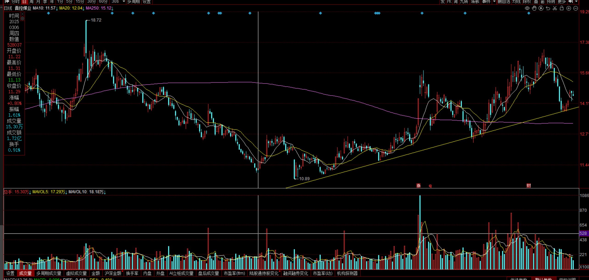

[toc]

## 前言

> 学习要符合如下的标准化链条：了解概念->探究原理->深入思考->总结提炼->底层实现->延伸应用"

## 01.学习概述

- **学习主题**：
- **知识类型**：
  - [ ] ✅Android/ 
    - [ ] ✅01.基础组件与机制 
      - [ ] ✅四大组件
      - [ ] ✅IPC机制
      - [ ] ✅消息机制
      - [ ] ✅事件分发机制
      - [ ] ✅View与渲染体系（含Window、复杂控件、动画）
      - [ ] ✅存储与数据安全（SharedPreferences/DataStore/Room/Scoped Storage）
    - [ ] ✅02. 架构与工程化
      - [ ] ✅架构模式（MVC/MVP/MVVM/MVI）
      - [ ] ✅依赖注入（Koin/Hilt/Dagger）
      - [ ] ✅路由与模块化（ARouter、Navigation）
      - [ ] ✅Gradle与构建优化
      - [ ] ✅插件化与动态化
      - [ ] ✅插桩与监控框架
    - [ ] ✅03.性能优化与故障诊断
      - [ ] ✅ANR分析与优化
      - [ ] ✅启动耗时优化
      - [ ] ✅内存泄漏监控
      - [ ] ✅监控与诊断工具
    - [ ] ✅04.Jetpack与生态框架
      - [ ] ✅Room
      - [ ] ✅Paging
      - [ ] ✅WorkManager
      - [ ] ✅Compose
    - [ ] ✅05.Framework与系统机制
      - [ ] ✅ActivityManagerService (含ANR触发机制)
      - [ ] ✅Binder机制
  - [ ] ✅音视频开发/
    - [ ] ✅01.基础知识
    - [ ] ✅02.OpenGL渲染视频
    - [ ] ✅03.FFmpeg音视频解码
  - [ ] ✅ Java/
    - [ ] ✅01.基础知识
    - [ ] ✅02.集合框架
    - [ ] ✅03.异常处理
    - [ ] ✅04.多线程与并发
    - [ ] ✅06.JVM
  - [ ] ✅ Kotlin/
    - [ ] ✅01.基础语法
    - [ ] ✅02.高阶扩展
    - [ ] ✅03.协程和流
  - [ ] ✅ Flutter/
    - [ ] ✅01.基础知识
      - [ ] ✅Dart 语言基础
      - [ ] ✅Widget 基础与生命周期
      - [ ] ✅Flutter 基础组件
      - [ ] ✅布局与约束
      - [ ] ✅绘制与渲染体系
      - [ ] ✅状态管理
      - [ ] ✅事件处理与手势系统
      - [ ] ✅原生通信
    - [ ] ✅02.路由与导航
    - [ ] ✅03.性能优化与故障诊断
    - [ ] ✅04.异步编程
    - [ ] ✅05.项目经验与案例沉淀
  - [ ] ✅ 自我管理/
    - [ ] ✅01.内观
  - [ ] ✅ 项目经验/
    - [ ] ✅01.启动逻辑
    - [ ] ✅02.云值守
    - [ ] ✅03.智控平台
- **学习来源**：
- **重要程度**：⭐⭐⭐⭐⭐
- **学习日期**：2025.
- **记录人**：@panruiqi

### 1.1 学习目标

- 了解概念->探究原理->深入思考->总结提炼->底层实现->延伸应用"

### 1.2 前置知识

- [ ] 

## 02.核心概念

### 2.1 是什么？


### 2.2 解决什么问题？


### 2.3 基本特性



## 03.当前局面和应对策略

### 3.1 当前技术面分析

周线（大格局）

- 从8.61元启动，形成明显的上升通道

- 当前价格14.45，趋势线支撑约在12.5-13元区间
- 周线级别趋势完好，没有破坏

日线（短期）

- 前高18.47元，当前14.45元，已从高点回落约22%
- 回踩到MA250（年线）附近获得支撑
- 日线趋势线支撑约在13.5元左右

### 3.2 当前处境

- 持仓：7成仓位
- 成本：约14.43元
- 当前价：14.45元（基本持平）
- 入场逻辑：趋势线支撑

好消息是：您的入场位置不差，目前没有亏损，趋势线也没破。

### 3.3 接下来的操作策略

既然已经7成仓位，现在核心任务是"守"，不是"攻"

具体场景应对

- ```
  情景1：震荡企稳后向上突破14.79
  → 加仓到8成，止损上移到14元
  
  情景2：继续震荡，不破13.5
  → 持仓不动，耐心等待
  
  情景3：跌破13.5但守住12.5
  → 减仓到5成，观察周线趋势线能否撑住
  
  情景4：跌破12.5（周线趋势线）
  → 清仓，趋势彻底走坏
  
  ```

  

## 04. 复盘

如果是您，作为专业人士，您会如何处理呢？

### 4.1 我做错了什么

做对的地方：

- 选股逻辑清晰：上升通道+趋势线支撑
- 入场位置不错：回踩趋势线+年线支撑
- 有止损意识：知道跌破趋势线要走

做错的地方：

- 仓位管理失控
- 涨了一天，加仓到7成，没有等待任何确认信号

根本原因：混淆了"防守信号"和"进攻信号"

- 趋势线支撑 = 防守信号（告诉你下方有保护）
- 突破压力位 = 进攻信号（告诉你可以加仓）

### 4.2 如果再来，应该怎么做

第一阶段：观察与试探

- ```
  观察到：周线上升通道完好，日线回踩趋势线+年线
  判断：这是一个低风险试探机会
  操作：12.09回踩反弹当天，入场2-3成
  止损：设在趋势线下方13元，亏损约10%
  ```

第二阶段：等待确认

- ```
  等待信号：
  1. 站稳5日均线3天以上
  2. 或者突破14.79短期压力位
  3. 或者形成更高的波段低点
  
  在此之前：不加仓，只观察
  ```

第三阶段：确认后加仓

- ```
  如果突破14.79且放量：
  → 加仓到5成
  → 止损上移到14元
  
  如果继续上涨突破前高15.5：
  → 加仓到7成
  → 止损上移到14.79（突破位）
  ```

第四阶段：持仓与止盈

- ```
  目标位：
  - 第一目标：前高18.47附近，减仓1/3
  - 第二目标：周线通道上轨（约20元），再减1/3
  - 剩余1/3：跟随趋势，跌破周线趋势线离场
  ```

### 4.3 反思

我的策略框架没问题，问题出在执行层面。建议：

#### 1.制定加仓清单

每次交易前写下：

```
试探仓条件：_______ 仓位：___成
确认仓条件：_______ 仓位：___成  
突破仓条件：_______ 仓位：___成
```

#### 2.强制冷静期

加仓前必须等待至少2个交易日，避免情绪化决策。

#### 3.记录每笔交易

写下入场理由、加仓理由、止损位。事后复盘对照，这是进步最快的方式。

您的方向是对的，只是需要在纪律性上再打磨。这次晋控煤业的仓位虽然重了点，但入场位置不差，耐心等待市场给答案就好。

## 05.深度思考

### 5.1 关键问题探究


### 5.2 设计对比


## 06.实践验证

### 6.1 行为验证代码


### 6.2 性能测试


## 07.应用场景

### 7.1 最佳实践


### 7.2 使用禁忌


## 08.总结提炼

### 8.1 核心收获


### 8.2 知识图谱


### 8.3 延伸思考


## 09.参考资料

1. []()
2. []()
3. []()

## 其他介绍

### 01.关于我的博客

- csdn：http://my.csdn.net/qq_35829566

- 掘金：https://juejin.im/user/499639464759898

- github：https://github.com/jjjjjjava

- 邮箱：[934137388@qq.com]

