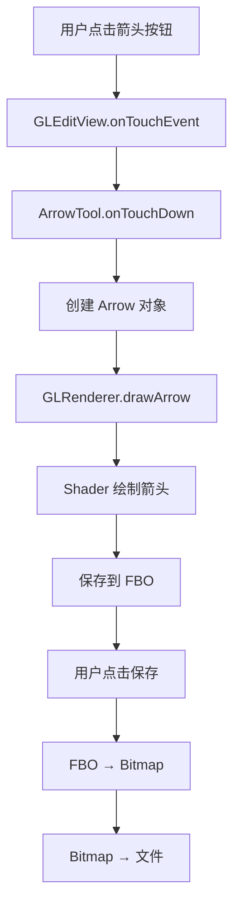
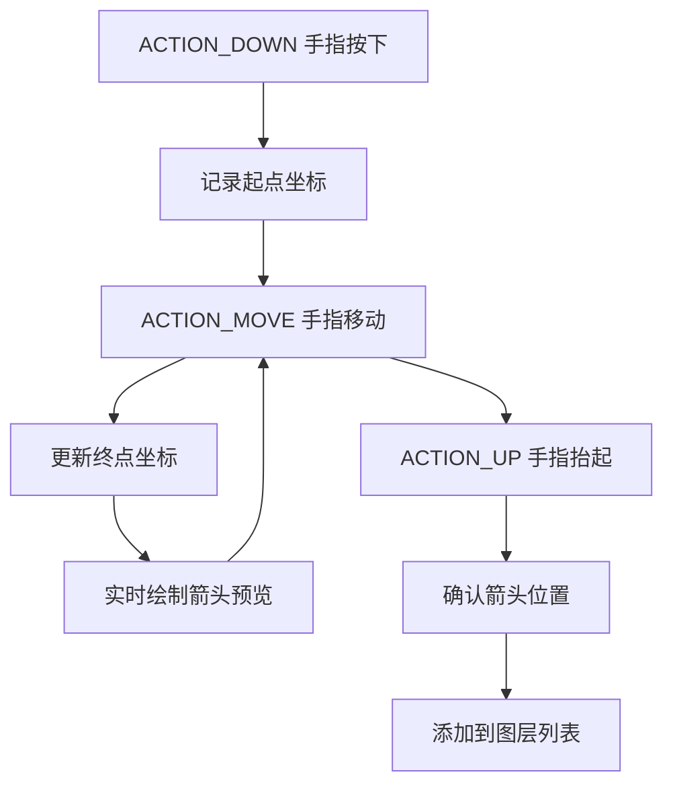
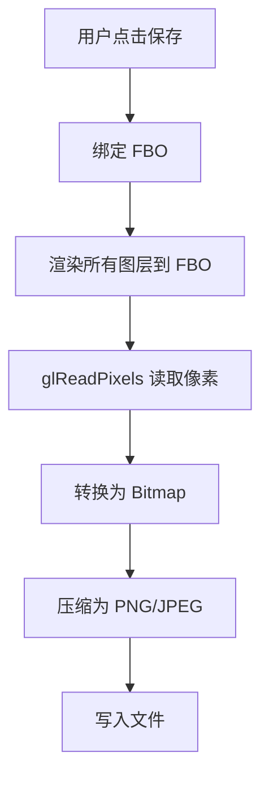
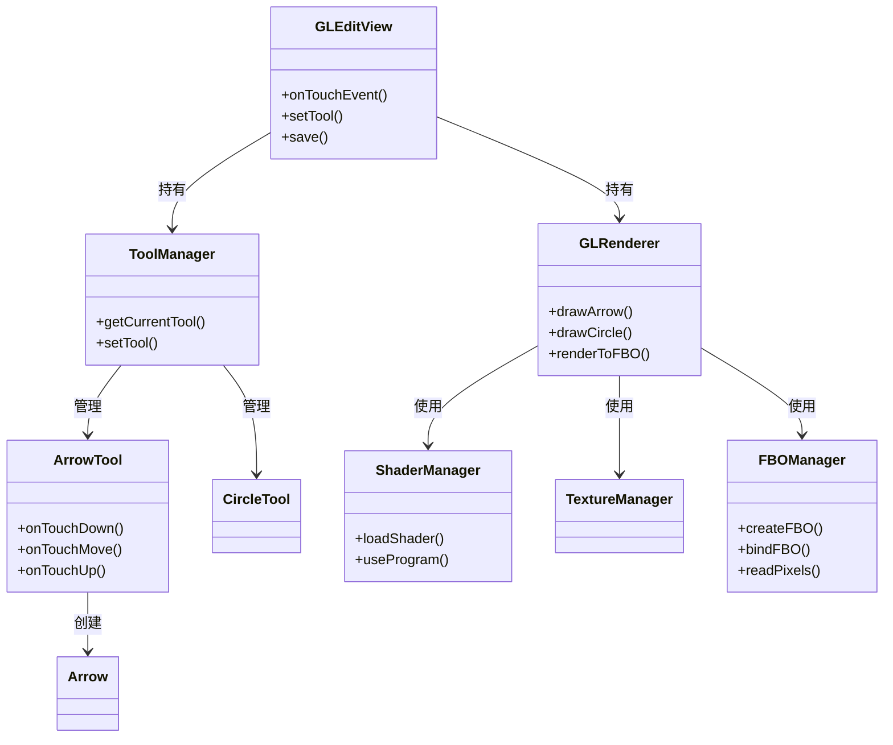

# Project Interview Prep v1.0

面向 Android/Flutter/鸿蒙工程师的项目面试准备助手。

## 重要说明

本 skill 依赖 learning-system，所有数据存储在 learning-system/ 目录下。

**工作区要求**：
- 请在 `brain/` 目录下打开 Kiro 工作区
- 确保工作区包含 `learning-system/` 和 `project-interview-prep/` 两个目录

**路径说明**：
- 文档中的 `states/` → 实际路径 `learning-system/states/`
- 文档中的 `notes/` → 实际路径 `learning-system/notes/`
- AI 执行时会自动使用完整路径

---

## 目录

- [系统本质](#系统本质)
- [设计哲学](#设计哲学)
- [与 learning-system 的联动](#与-learning-system-的联动)
- [目录结构](#目录结构)
- [项目状态文件规范](#项目状态文件规范)
- [学习路径（四轮迭代）](#学习路径四轮迭代)
- [用户操作协议](#用户操作协议)
  - [1. 开始学习项目](#1-开始学习项目)
  - [2. 完成当前轮次](#2-完成当前轮次)
  - [3. 跳过轮次](#3-跳过轮次)
  - [4. 项目复习](#4-项目复习)
  - [5. 模拟面试](#5-模拟面试)
- [AI 验证机制](#ai-验证机制)
- [面试场景分类](#面试场景分类)
- [技术栈识别规则](#技术栈识别规则)
- [注意事项](#注意事项)
- [快速参考](#快速参考)

---

## 系统本质

这不是一个代码分析工具，而是一个**项目级学习系统**。它管理的是：
- 项目技术架构的理解深度
- 核心代码的掌握程度
- 面试问答的准备状态
- 学习轮次的进度追踪

## 设计哲学

1. **20/80 原则** - 用20%时间掌握80-90%核心技术
2. **面试导向** - 所有内容围绕面试场景设计
3. **四轮迭代** - 渐进式学习，每轮有明确目标
4. **验证驱动** - AI 追问验证，防止自欺欺人
5. **状态持久化** - 所有学习进度存储在文件中
6. **与 learning-system 联动** - 项目作为知识点管理

---

## 与 learning-system 的联动

### 联动机制

1. **项目在 learning-system 中作为知识点管理**
   - category: project
   - level: 0-4（对应四轮学习）
   - 遵循 learning-system 的复习周期

2. **状态同步**
   - learning-system 管理复习周期（next_review）
   - project-interview-prep 管理学习进度（current_round）
   - 完成轮次时，同步更新 learning-system 的 level

3. **工作流**
   ```
   用户：今天该干嘛？
   learning-system：建议学习"视频加水印项目"（level 2, 需复习）
   
   用户：开始学习视频加水印项目
   project-interview-prep：读取状态 → 发现 level 2 → 继续第3轮学习
   
   用户：完成第3轮学习
   project-interview-prep：更新 learning-system（level 2→3）
   ```

---

## 目录结构

```
learning-system/
├── states/
│   ├── active/
│   │   └── 003-视频加水印项目.yaml  # learning-system 管理
│   └── ...
└── notes/
    └── 003-视频加水印项目/          # project-interview-prep 管理
        ├── state.yaml              # 项目学习状态
        ├── architecture.md         # 技术架构分析
        ├── round-1-了解.md
        ├── round-2-初步学会.md
        ├── round-3-深入掌握.md
        ├── round-4-可以面试.md
        └── code-snippets/          # 核心代码片段
            ├── shader-watermark.glsl
            ├── mediacodec-encoder.kt
            └── ...
```

---

## 项目状态文件规范

### learning-system/states/active/003-视频加水印项目.yaml

```yaml
id: 003
title: 视频加水印项目
category: project  # 标记为项目类型
core: true
level: 2  # 0=未接触, 1=了解, 2=初步学会, 3=深入掌握, 4=可以面试
review_stage: 1
status: active
last_study: 2026-03-02
next_review: 2026-03-05
importance: 5
created: 2026-02-20
project_path: D:\Projects\video-watermark  # 项目代码路径
```

### learning-system/notes/003-视频加水印项目/state.yaml

```yaml
project_id: 003
title: 视频加水印项目
project_path: D:\Projects\video-watermark
current_round: 2  # 当前在第几轮（0-4）
tech_stack:  # AI 自动识别
  - OpenGL ES 3.0
  - MediaCodec
  - Kotlin Coroutines
  - Custom Shader (GLSL)
  - FBO (FrameBuffer Object)
architecture_analyzed: true  # 是否已完成架构分析
rounds_completed:  # 已完成的轮次
  - round: 1
    completed_date: 2026-02-25
    notes_file: round-1-了解.md
  - round: 2
    completed_date: 2026-03-02
    notes_file: round-2-初步学会.md
interview_questions:  # 已生成的面试问题
  basic: 8  # 基础概念问题数量
  deep: 5   # 项目深挖问题数量
  extend: 2 # 扩展应用问题数量
last_updated: 2026-03-02
```

---

## 学习路径（四轮迭代）

### 第0轮：项目扫描（自动）

**触发条件**：用户首次开始学习项目

**AI 执行**：
1. 扫描项目代码（5分钟深度分析）
2. 识别技术栈（自动推断）
3. 生成技术架构文档（architecture.md）
4. 提取核心文件列表
5. 等待用户确认技术栈

**输出**：
```markdown
# 技术架构分析

## 项目概述
视频加水印优化项目，使用 OpenGL + MediaCodec 实现硬件加速

## 技术栈
- OpenGL ES 3.0（渲染）
- MediaCodec（硬编硬解）
- Kotlin Coroutines（异步处理）
- Custom Shader（水印混合）
- FBO（离屏渲染）

## 核心模块
1. WatermarkRenderer（OpenGL 渲染器）
2. VideoEncoder（MediaCodec 编码器）
3. ShaderManager（Shader 管理）
4. TextureManager（纹理管理）

## 核心文件
- WatermarkRenderer.kt (230 lines)
- watermark.frag (45 lines)
- VideoEncoder.kt (180 lines)
- ...
```

---

### 第1轮：了解（level 0→1）

**目标**：快速建立整体认知，用 50-60 分钟掌握项目核心流程和架构

**学习步骤**（四步法）：

---

#### Step 1：看执行流（10分钟）

**AI 执行**：
1. 分析用户操作路径（例如：点击箭头按钮 → 绘制 → 保存）
2. 生成执行流程图（Mermaid 格式）
3. 展示给用户

**用户任务**：
- 看懂流程图
- 能用自己的话复述完整流程

**输出示例**：
````markdown
## 执行流程图

### 用户点击箭头按钮后的流程



### 触摸屏幕绘制箭头的流程



### 保存图片的流程



**请复述一下这三个流程，看懂了就说"懂了，继续"，有疑问就提问。**
````

---

#### Step 2：看架构（5分钟）

**AI 执行**：
1. 识别核心类（5-8个）
2. 分析类之间的关系（继承、组合、调用）
3. 生成架构图（Mermaid 格式）
4. 展示给用户

**用户任务**：
- 理解类之间的关系
- 能说出每个类的作用
- 能说出"谁调用谁"

**输出示例**：
````markdown
## 架构图

### 核心类关系



### 类的作用

| 类名 | 作用 | 关键方法 |
|------|------|----------|
| GLEditView | 主视图，处理触摸事件 | onTouchEvent, setTool, save |
| GLRenderer | OpenGL 渲染器 | drawArrow, renderToFBO |
| ToolManager | 工具管理器 | getCurrentTool, setTool |
| ArrowTool | 箭头工具 | onTouchDown, onTouchMove, onTouchUp |
| ShaderManager | Shader 管理器 | loadShader, useProgram |
| TextureManager | 纹理管理器 | loadTexture, bindTexture |
| FBOManager | FBO 管理器 | createFBO, bindFBO, readPixels |

### 调用关系

1. **用户点击箭头按钮**：
   - GLEditView.setTool() → ToolManager.setTool(ArrowTool)

2. **用户触摸屏幕**：
   - GLEditView.onTouchEvent() → ArrowTool.onTouchDown() → GLRenderer.drawArrow()

3. **用户保存图片**：
   - GLEditView.save() → GLRenderer.renderToFBO() → FBOManager.readPixels()

**请说说这些类的作用和调用关系，看懂了就说"懂了，继续"，有疑问就提问。**
````

---

#### Step 3：看核心代码（30-40分钟）

**AI 执行**：
1. 挑选 5-6 个核心代码片段（根据项目复杂度调整）
2. 按代码调用顺序展示（初始化 → 设置工具 → 触摸事件 → 绘制 → 保存）
3. 每个代码片段后，**等待用户回复**：
   - 用户说"懂了，继续" → 展示下一个
   - 用户说"不懂，XXX 是什么？" → AI 解释
4. 遇到底层概念（OpenGL、Shader、FBO、MediaCodec 等）：
   - 用户说"简单说说" → 浅层解释（1-2分钟）
   - 用户说"详细讲讲" → 深层讲解（10-20分钟）

**用户任务**：
- 看代码，看懂就说"懂了，继续"
- 看不懂就提问，AI 解释对应的技术细节
- 遇到 OpenGL、Shader、FBO 等核心底层原理概念不懂，停下来讨论

**输出示例**：
````markdown
## 核心代码片段

我会按执行顺序展示 5-6 个核心代码片段。每个片段后，请说"懂了，继续"或提问。

---

### 代码片段 1：GLEditView 初始化

```kotlin
class GLEditView(context: Context) : GLSurfaceView(context) {
    private val renderer: GLRenderer
    private val toolManager: ToolManager
    
    init {
        // 设置 OpenGL ES 3.0
        setEGLContextClientVersion(3)
        
        // 创建渲染器
        renderer = GLRenderer(context)
        setRenderer(renderer)
        
        // 创建工具管理器
        toolManager = ToolManager()
        
        // 设置渲染模式（按需渲染）
        renderMode = RENDERMODE_WHEN_DIRTY
    }
    
    override fun onTouchEvent(event: MotionEvent): Boolean {
        val tool = toolManager.getCurrentTool()
        return tool?.handleTouchEvent(event) ?: false
    }
}
```

**关键点**：
- `setEGLContextClientVersion(3)`：设置 OpenGL ES 3.0 版本
- `setRenderer(renderer)`：设置渲染器
- `renderMode = RENDERMODE_WHEN_DIRTY`：按需渲染（不是每帧都渲染）
- `onTouchEvent`：触摸事件分发给当前工具

**看懂了吗？说"懂了，继续"或提问。**

---

（等待用户回复）

---

### 代码片段 2：设置当前工具（箭头）

```kotlin
class ToolManager {
    private var currentTool: Tool? = null
    
    fun setTool(tool: Tool) {
        currentTool?.onDeselect()  // 取消选中旧工具
        currentTool = tool
        tool.onSelect()  // 选中新工具
    }
    
    fun getCurrentTool(): Tool? = currentTool
}

// 使用
val arrowTool = ArrowTool(renderer)
toolManager.setTool(arrowTool)
```

**关键点**：
- `onDeselect()`：旧工具取消选中（清理状态）
- `onSelect()`：新工具选中（初始化状态）
- 工具切换时，确保状态正确

**看懂了吗？说"懂了，继续"或提问。**

---

（等待用户回复）

---

### 代码片段 3：触摸事件处理

```kotlin
class ArrowTool(private val renderer: GLRenderer) : Tool {
    private var startPoint: PointF? = null
    private var endPoint: PointF? = null
    private var currentArrow: Arrow? = null
    
    override fun handleTouchEvent(event: MotionEvent): Boolean {
        return when (event.action) {
            MotionEvent.ACTION_DOWN -> {
                // 手指按下，记录起点
                startPoint = PointF(event.x, event.y)
                true
            }
            MotionEvent.ACTION_MOVE -> {
                // 手指移动，更新终点，实时绘制预览
                endPoint = PointF(event.x, event.y)
                currentArrow = Arrow(startPoint!!, endPoint!!)
                renderer.requestRender()  // 触发重绘
                true
            }
            MotionEvent.ACTION_UP -> {
                // 手指抬起，确认箭头
                currentArrow?.let { renderer.addArrow(it) }
                startPoint = null
                endPoint = null
                currentArrow = null
                true
            }
            else -> false
        }
    }
}
```

**关键点**：
- `ACTION_DOWN`：记录起点
- `ACTION_MOVE`：更新终点，实时预览
- `ACTION_UP`：确认箭头，添加到渲染器
- `requestRender()`：触发重绘（因为是 RENDERMODE_WHEN_DIRTY）

**看懂了吗？说"懂了，继续"或提问。**

---

（等待用户回复）

---

### 代码片段 4：箭头绘制（OpenGL + Shader）

```kotlin
class GLRenderer(context: Context) : GLSurfaceView.Renderer {
    private val shaderManager = ShaderManager()
    private val arrows = mutableListOf<Arrow>()
    
    override fun onDrawFrame(gl: GL10?) {
        // 清屏
        GLES30.glClear(GLES30.GL_COLOR_BUFFER_BIT)
        
        // 使用箭头 Shader
        shaderManager.useProgram("arrow")
        
        // 绘制所有箭头
        arrows.forEach { arrow ->
            drawArrow(arrow)
        }
    }
    
    private fun drawArrow(arrow: Arrow) {
        // 设置顶点数据（箭头的三角形）
        val vertices = arrow.getVertices()
        GLES30.glVertexAttribPointer(0, 3, GLES30.GL_FLOAT, false, 0, vertices)
        GLES30.glEnableVertexAttribArray(0)
        
        // 设置颜色
        val colorLocation = GLES30.glGetUniformLocation(shaderManager.program, "uColor")
        GLES30.glUniform4f(colorLocation, 1.0f, 0.0f, 0.0f, 1.0f)  // 红色
        
        // 绘制
        GLES30.glDrawArrays(GLES30.GL_TRIANGLES, 0, vertices.capacity() / 3)
    }
}
```

**关键点**：
- `glClear`：清屏
- `useProgram`：使用 Shader 程序
- `glVertexAttribPointer`：设置顶点数据
- `glUniform4f`：设置颜色（Uniform 变量）
- `glDrawArrays`：绘制三角形

**如果不懂 OpenGL 的渲染流程，可以说"详细讲讲 OpenGL"。看懂了就说"懂了，继续"。**

---

（等待用户回复，如果用户说"详细讲讲 OpenGL"，AI 展开讲解）

---

### 代码片段 5：保存图片（FBO → Bitmap）

```kotlin
class GLRenderer {
    private val fboManager = FBOManager()
    
    fun saveToFile(filePath: String) {
        // 1. 绑定 FBO
        fboManager.bindFBO()
        
        // 2. 渲染所有图层到 FBO
        onDrawFrame(null)
        
        // 3. 读取像素
        val width = fboManager.width
        val height = fboManager.height
        val buffer = ByteBuffer.allocateDirect(width * height * 4)
        GLES30.glReadPixels(0, 0, width, height, GLES30.GL_RGBA, GLES30.GL_UNSIGNED_BYTE, buffer)
        
        // 4. 转换为 Bitmap
        val bitmap = Bitmap.createBitmap(width, height, Bitmap.Config.ARGB_8888)
        bitmap.copyPixelsFromBuffer(buffer)
        
        // 5. 保存到文件
        FileOutputStream(filePath).use { out ->
            bitmap.compress(Bitmap.CompressFormat.PNG, 100, out)
        }
        
        // 6. 解绑 FBO
        fboManager.unbindFBO()
    }
}
```

**关键点**：
- `bindFBO()`：绑定 FBO（离屏渲染）
- `onDrawFrame()`：渲染到 FBO
- `glReadPixels()`：读取像素到 ByteBuffer
- `copyPixelsFromBuffer()`：转换为 Bitmap
- `compress()`：压缩为 PNG

**如果不懂 FBO，可以说"详细讲讲 FBO"。看懂了就说"懂了，继续"。**

---

（等待用户回复）

---

**所有核心代码片段已展示完毕。接下来进入验证环节。**
````

---

#### Step 4：验证理解（5分钟）

**AI 执行**：
1. 提问 2-3 个问题（混合型）：
   - **复述型**：说说执行流程
   - **应用型**：如果要添加新功能，怎么改？
   - **对比型**：XXX 和 YYY 的区别是什么？
2. 用户口述回答
3. AI 判断是否达标

**验证标准**：
- 能口述用户操作的完整流程（不要求100%准确，但逻辑要对）
- 能说出核心类的作用和关系
- 能看懂核心代码在做什么
- 能理解遇到的技术概念（OpenGL、Shader、FBO等）

**输出示例**：
```markdown
## 验证理解

学完了，我问你几个问题：

**Q1（复述型）**：说说用户点击箭头按钮后，到保存图片的完整流程。

（等待用户回答）

---

**Q2（应用型）**：如果要添加一个圆形工具，需要改哪些地方？

（等待用户回答）

---

**Q3（对比型）**：FBO 和普通渲染的区别是什么？为什么要用 FBO？

（等待用户回答）

---

**评估**：
- 如果回答完整、准确 → "你已经达到第1轮标准（了解），可以完成这一轮了。"
- 如果回答模糊、有遗漏 → "还有些地方不太清楚，建议回顾一下 XXX 部分。"
```

---

**预期学习成果**：
- ✅ 能画出（口述）用户操作的完整流程
- ✅ 能说出核心类的作用和关系
- ✅ 能看懂核心代码在做什么
- ✅ 能理解遇到的技术概念（OpenGL、Shader、FBO等）

**生成文件**：
- `learning-system/notes/<项目ID>-<项目名>/round-1-了解.md`（包含流程图、架构图、核心代码片段）

---

### 第2轮：初步学会（level 1→2）

**目标**：理解核心实现细节

**AI 执行**：
1. 深入解析核心代码（逐行注释）
2. 生成技术细节文档
3. 生成面试问答（基础版，8-10个）
4. 模拟面试场景1（项目深挖）

**验证方式**：
- AI 提问："为什么用 OpenGL + MediaCodec？有考虑过其他方案吗？"
- 用户回答
- AI 追问 2-3 个细节问题

**输出示例**：
```markdown
# 第2轮：初步学会

## 核心实现细节

### OpenGL 渲染流程
1. 创建 EGLContext
2. 创建 Surface（连接 MediaCodec）
3. 加载 Shader
4. 绑定纹理（视频帧 + 水印）
5. 绘制（glDrawArrays）
6. 交换缓冲区（eglSwapBuffers）

### MediaCodec 编码流程
1. 配置编码器（H.264, 1080p, 5Mbps）
2. 创建 InputSurface（从 OpenGL 获取）
3. 启动编码器
4. 循环：渲染 → 通知编码器 → 获取编码数据
5. 写入文件

## 面试问答（基础版）

**Q1: 说说这个项目的技术架构**
A: 使用 OpenGL ES 3.0 进行视频帧渲染和水印混合，通过 FBO 离屏渲染避免显示到屏幕。渲染结果直接输出到 MediaCodec 的 InputSurface，利用硬件编码器进行 H.264 编码，最后写入文件。整个流程在 Kotlin Coroutines 中异步执行，避免阻塞主线程。

**Q2: 为什么用 OpenGL + MediaCodec？**
A: 
- OpenGL：GPU 加速渲染，支持复杂的 Shader 效果（Alpha 混合、颜色调整）
- MediaCodec：硬件编码，速度快（比 FFmpeg 软编快5-10倍）
- 两者结合：OpenGL 渲染结果直接输入 MediaCodec，零拷贝，性能最优

**考虑过的其他方案**：
- FFmpeg 软编：CPU 占用高，速度慢
- Canvas 绘制：不支持硬件加速，性能差
- 系统 API（Bitmap）：内存占用大，无法实时处理

...
```

---

### 第3轮：深入掌握（level 2→3）

**目标**：掌握技术细节和坑点

**AI 执行**：
1. 深挖技术难点（坑点、优化点）
2. 生成扩展问题（5-8个）
3. 模拟面试场景2（基础概念 + 项目深挖）
4. 生成对比分析（与其他方案对比）

**验证方式**：
- AI 连续追问 3-5 个刁钻问题
- 用户必须回答出关键细节

**输出示例**：
```markdown
# 第3轮：深入掌握

## 技术难点与坑点

### 1. EGLContext 共享问题
**问题**：OpenGL 渲染线程和 MediaCodec 编码线程需要共享纹理
**解决**：创建共享 EGLContext
\`\`\`kotlin
val sharedContext = EGL14.eglCreateContext(
    display, config, renderContext, // renderContext 是渲染线程的 Context
    intArrayOf(EGL14.EGL_CONTEXT_CLIENT_VERSION, 3, EGL14.EGL_NONE)
)
\`\`\`

### 2. 时间戳同步问题
**问题**：视频帧的 PTS（Presentation Time Stamp）必须单调递增
**解决**：手动计算 PTS
\`\`\`kotlin
val pts = frameIndex * 1_000_000L / fps  // 微秒
EGLExt.eglPresentationTimeANDROID(display, surface, pts)
\`\`\`

### 3. 内存泄漏问题
**问题**：纹理、FBO、Shader 未释放
**解决**：在 onDestroy 中释放所有 OpenGL 资源

## 扩展问题

**Q1: 如果让你继续优化，你会怎么做？**
A:
1. 多线程渲染：使用多个 EGLContext 并行处理多个视频
2. GPU 纹理缓存：复用纹理对象，减少创建销毁开销
3. Shader 优化：减少 if 分支，使用查找表（LUT）
4. 内存池：复用 ByteBuffer，减少 GC

**Q2: 遇到过什么坑？**
A:
1. EGLContext 共享失败 → 纹理黑屏
2. PTS 不单调 → MediaCodec 编码失败
3. FBO 未绑定 → 渲染到屏幕而非离屏
4. Shader 编译失败 → 未检查 glGetShaderiv 返回值

...
```

---

### 第4轮：可以面试（level 3→4）

**目标**：达到面试标准

**AI 执行**：
1. 生成完整面试问答库（15-20个）
2. 模拟完整面试（连续追问）
3. 优化面试话术
4. 生成面试稿（可直接背诵）

**验证方式**：
- AI 模拟真实面试（10-15分钟）
- 连续追问，不给喘息时间
- 评估回答的完整性、准确性、流畅度

**输出示例**：
```markdown
# 第4轮：可以面试

## 完整面试问答库

### 场景1：项目深挖（高频）

**Q1: 说说你的视频加水印优化项目**
A: 这个项目是为了优化视频加水印的性能。之前的方案是用 FFmpeg 软编，CPU 占用高，处理一个1分钟的1080p视频需要30秒。我用 OpenGL + MediaCodec 重构，利用 GPU 渲染和硬件编码，性能提升了5倍，现在只需要6秒。

**核心技术**：
- OpenGL ES 3.0：GPU 渲染，Shader 实现水印混合
- MediaCodec：硬件编码，H.264 格式
- FBO：离屏渲染，避免显示到屏幕
- Kotlin Coroutines：异步处理，不阻塞主线程

**Q2: 为什么用 OpenGL + MediaCodec？有考虑过其他方案吗？**
A: 考虑过三种方案：
1. FFmpeg 软编：CPU 占用高，速度慢，但兼容性好
2. Canvas + Bitmap：简单，但内存占用大，无法实时处理
3. OpenGL + MediaCodec：性能最优，但实现复杂

最终选择方案3，因为：
- 性能要求高（需要实时处理）
- 支持复杂效果（Alpha 混合、颜色调整）
- 硬件编码速度快

**Q3: 遇到过什么坑？怎么解决的？**
A: 主要遇到3个坑：
1. **EGLContext 共享失败**：OpenGL 和 MediaCodec 在不同线程，纹理无法共享。解决：创建共享 EGLContext。
2. **PTS 不单调**：MediaCodec 要求时间戳单调递增，否则编码失败。解决：手动计算 PTS = frameIndex * 1_000_000 / fps。
3. **内存泄漏**：纹理、FBO 未释放。解决：在 onDestroy 中调用 glDeleteTextures、glDeleteFramebuffers。

**Q4: 如果让你继续优化，你会怎么做？**
A: 三个方向：
1. **多线程渲染**：使用多个 EGLContext 并行处理多个视频
2. **GPU 缓存**：复用纹理对象，减少创建销毁开销
3. **Shader 优化**：减少 if 分支，使用查找表（LUT）加速颜色转换

### 场景2：基础概念（中频）

**Q5: 说说 OpenGL 的渲染流程**
A: 
1. 创建 EGLContext（OpenGL 上下文）
2. 创建 Surface（渲染目标）
3. 加载 Shader（顶点着色器 + 片段着色器）
4. 绑定纹理（视频帧、水印）
5. 设置顶点数据（位置、纹理坐标）
6. 绘制（glDrawArrays）
7. 交换缓冲区（eglSwapBuffers）

**Q6: MediaCodec 硬编硬解的原理**
A: MediaCodec 是 Android 提供的硬件编解码 API，直接调用芯片的编解码器（如高通的 Adreno、联发科的 Mali）。

**硬编流程**：
1. 配置编码器（格式、分辨率、码率）
2. 创建 InputSurface（从 OpenGL 获取）
3. 启动编码器
4. 循环：渲染 → 通知编码器 → 获取编码数据
5. 写入文件

**优势**：速度快（比软编快5-10倍），功耗低
**劣势**：兼容性差（不同芯片实现不同），部分设备不支持

...

### 场景3：扩展应用（低频）

**Q15: 做过直播吗？推流拉流了解吗？**
A: 没做过完整的直播项目，但了解基本原理：
- **推流**：采集（摄像头/屏幕）→ 编码（H.264/H.265）→ 封装（FLV/RTMP）→ 推送到服务器
- **拉流**：从服务器拉取 → 解封装 → 解码 → 渲染

我的视频加水印项目中，编码部分和推流类似，都是用 MediaCodec 编码 H.264，只是输出目标不同（一个是文件，一个是网络）。

**Q16: FFmpeg 用过吗？**
A: 用过，之前的方案就是 FFmpeg 软编。FFmpeg 是一个强大的音视频处理库，支持几乎所有格式，但性能不如硬件编码。

**常用命令**：
- 视频转码：`ffmpeg -i input.mp4 -c:v libx264 output.mp4`
- 加水印：`ffmpeg -i input.mp4 -i watermark.png -filter_complex overlay output.mp4`

**Q17: 如何实现实时美颜？**
A: 美颜本质是图像处理，可以用 OpenGL Shader 实现：
1. **磨皮**：高斯模糊 + 原图混合
2. **美白**：提升亮度（Y 通道）
3. **瘦脸**：网格变形（Mesh Warp）

我的项目中用了类似的技术（Shader 混合），可以快速迁移到美颜场景。

## 面试话术模板

### 开场（30秒）
"我做过一个视频加水印优化项目，之前用 FFmpeg 软编，性能不行，处理1分钟视频要30秒。我用 OpenGL + MediaCodec 重构，利用 GPU 渲染和硬件编码，性能提升了5倍，现在只需要6秒。"

### 技术细节（2分钟）
"核心技术是 OpenGL ES 3.0 和 MediaCodec。OpenGL 负责渲染，用 Shader 实现水印混合，通过 FBO 离屏渲染。MediaCodec 负责编码，直接从 OpenGL 的 Surface 获取数据，零拷贝，性能最优。整个流程在 Kotlin Coroutines 中异步执行。"

### 坑点（1分钟）
"主要遇到3个坑：EGLContext 共享失败、PTS 不单调、内存泄漏。都通过查文档和实验解决了。"

### 优化方向（1分钟）
"如果继续优化，我会考虑多线程渲染、GPU 缓存、Shader 优化三个方向。"
```

---

## 用户操作协议

### 1. 开始学习项目

**用户输入**：
```
开始学习视频加水印项目
```

**AI 执行流程**：

1. **读取 learning-system 状态**
   - 读取 `states/active/003-视频加水印项目.yaml`
   - 获取 `project_path`、`level`

2. **读取 project-interview-prep 状态**
   - 读取 `notes/003-视频加水印项目/state.yaml`
   - 获取 `current_round`、`tech_stack`、`architecture_analyzed`

3. **判断当前阶段**
   - 如果 `architecture_analyzed = false` → 执行第0轮（项目扫描）
   - 如果 `current_round = 0` → 执行第1轮
   - 如果 `current_round = 1` → 执行第2轮
   - 以此类推

4. **执行对应轮次**（见上文各轮次详细流程）

---

### 2. 完成当前轮次

**用户输入**：
```
完成第2轮学习
```

**AI 执行流程**：

1. **验证学习效果**（AI 追问）
   - 根据当前轮次，提问相应难度的问题
   - 用户口述回答
   - AI 判断是否达标

2. **更新 project-interview-prep 状态**
   - 更新 `notes/003-视频加水印项目/state.yaml`
   - `current_round: 2 → 3`
   - `rounds_completed` 添加记录

3. **询问是否更新 learning-system**
   ```
   你已完成第2轮学习（初步学会）。
   是否更新 learning-system 的 level？（2 → 3）
   ```

4. **用户确认后，更新 learning-system**
   - 更新 `states/active/003-视频加水印项目.yaml`
   - `level: 2 → 3`
   - `last_study: 2026-03-02`

5. **明确告知**
   ```
   已完成第2轮学习
   - project-interview-prep: current_round 2 → 3
   - learning-system: level 2 → 3, last_study 2026-03-02
   - 生成文件: notes/003-视频加水印项目/round-2-初步学会.md
   ```

---

### 3. 跳过轮次

**用户输入**：
```
跳过第1轮，直接进入第3轮
```

**AI 执行流程**：

1. **警告提示**
   ```
   你要跳过第1轮（了解）和第2轮（初步学会），直接进入第3轮（深入掌握）。
   这要求你已经充分理解项目的核心技术和实现细节。
   是否确认？
   ```

2. **用户确认后，强制验证**
   ```
   好的，但我需要验证你是否真正理解。
   请回答以下问题：
   1. 说说这个项目的核心技术流程（3分钟）
   2. 为什么用 OpenGL + MediaCodec？
   3. 遇到过什么坑？
   ```

3. **AI 判断**
   - 如果回答完整、准确 → 允许跳过
   - 如果回答模糊、有遗漏 → 建议从第1轮开始

4. **更新状态**
   - `current_round: 0 → 3`
   - `rounds_completed` 标记第1、2轮为"跳过"

---

### 4. 项目复习

**触发条件**：
- learning-system 提示"视频加水印项目"需要复习
- 用户主动说"复习视频加水印项目"

**AI 执行流程**：

1. **读取状态**
   - 读取 `states/review/003-视频加水印项目.yaml`
   - 读取 `notes/003-视频加水印项目/state.yaml`

2. **判断复习内容**
   - 如果 `level = 4`（可以面试）→ 模拟面试
   - 如果 `level < 4` → 回顾对应轮次的笔记

3. **模拟面试**（level 4）
   - 随机抽取 5-8 个面试问题
   - 连续追问，模拟真实面试
   - 评估回答质量

4. **回顾笔记**（level < 4）
   - 展示对应轮次的学习笔记
   - 提问 2-3 个关键问题
   - 验证是否仍然掌握

5. **更新 learning-system**
   - 更新 `review_stage`
   - 更新 `next_review`
   - 更新 `last_study`

---

### 5. 模拟面试

**用户输入**：
```
模拟面试：视频加水印项目
```

**AI 执行流程**：

1. **读取面试问答库**
   
- 读取 `notes/003-视频加水印项目/round-4-可以面试.md`
   
2. **随机抽取问题**
   - 场景1（项目深挖）：3-4个
   - 场景2（基础概念）：2-3个
   - 场景3（扩展应用）：1-2个

3. **连续追问**
   - 不给喘息时间
   - 根据回答深度追问
   - 模拟真实面试节奏

4. **评估反馈**
   ```
   面试评估：
   - 回答完整性：85%
   - 技术准确性：90%
   - 表达流畅度：80%
   
   需要改进的地方：
   1. "EGLContext 共享"部分回答不够清晰
   2. "PTS 计算"公式记得不牢，需要强化记忆
   3. 回答"优化方向"时有些犹豫，建议提前准备
   
   优势：
   1. 对 OpenGL 渲染流程理解透彻
   2. 坑点总结到位，有实战经验
   3. 技术选型理由充分
   ```

5. **生成改进建议**
   - 针对薄弱环节，生成强化练习
   - 更新面试话术

---

## AI 验证机制

### 验证时机

1. **完成每轮学习时**（必须验证）
2. **跳过轮次时**（强制验证）
3. **项目复习时**（抽查验证）
4. **模拟面试时**（全面验证）

### 验证标准

**第1轮（了解）**：
- 能说出核心技术流程（3-5分钟）
- 能回答 1-2 个基础问题
- 逻辑连贯，没有明显错误

**第2轮（初步学会）**：
- 能解释技术选型理由
- 能回答 2-3 个细节问题
- 能说出至少1个坑点

**第3轮（深入掌握）**：
- 能回答刁钻问题
- 能对比不同方案
- 能说出优化方向

**第4轮（可以面试）**：
- 能流畅回答连续追问（10-15分钟）
- 技术准确性 > 85%
- 表达流畅度 > 80%

### 验证流程

1. **AI 提问**
   ```
   请口述一下这个项目的核心技术流程（3分钟）
   ```

2. **用户回答**（AI 记录回答内容）

3. **AI 追问**（数量不固定，基于回答完整性）
   - 如果回答完整 → 追问 1-2 个问题
   - 如果回答模糊 → 追问 3-5 个问题
   - 追问应针对关键细节、易错点

4. **AI 判断**
   ```
   我认为你已经达到第2轮标准（初步学会）。是否确认完成？
   或
   我认为还未达到第2轮标准，建议继续学习。是否仍要完成？
   ```

5. **用户权力**
   - 用户可以说"我不想验证，直接完成" → AI 尊重决定，但提示风险
   - 用户可以拒绝 AI 的判断 → AI 尊重决定

---

## 面试场景分类

### 场景1：项目深挖（高频，60%）

**典型问题**：
- 说说你的 XXX 项目
- 为什么用 XXX 技术？有考虑过其他方案吗？
- 遇到过什么坑？怎么解决的？
- 如果让你继续优化，你会怎么做？
- 这个项目的难点是什么？

**准备策略**：
- 30秒开场白（项目背景 + 核心技术）
- 技术选型理由（对比至少2个方案）
- 坑点总结（至少3个，带解决方案）
- 优化方向（至少3个）

---

### 场景2：基础概念（中频，30%）

**典型问题**：
- 说说 OpenGL 的渲染流程
- MediaCodec 硬编硬解的原理
- 音视频同步怎么做？
- H.264 编码了解吗？
- Shader 是什么？怎么工作的？

**准备策略**：
- 从项目中提取的基础概念
- 每个概念准备 1-2 分钟回答
- 结合项目实例说明

---

### 场景3：扩展应用（低频，10%）

**典型问题**：
- 做过直播吗？推流拉流了解吗？
- FFmpeg 用过吗？
- 如何实现实时美颜？
- WebRTC 了解吗？
- 如何优化视频加载速度？

**准备策略**：
- 了解相关技术的基本原理
- 说明与项目的关联性
- 表达学习意愿

---

## 技术栈识别规则

### 自动识别流程

1. **扫描项目文件**（5分钟深度分析）
   - 读取所有源代码文件
   - 分析 import/include 语句
   - 识别关键 API 调用
   - 统计代码行数和复杂度

2. **推断技术栈**
   - Android：检测 `android.*`、`androidx.*`
   - OpenGL：检测 `android.opengl.*`、`.glsl` 文件
   - MediaCodec：检测 `android.media.MediaCodec`
   - Kotlin Coroutines：检测 `kotlinx.coroutines.*`
   - Flutter：检测 `flutter/*`、`dart` 文件
   - 鸿蒙：检测 `@ohos.*`

3. **生成技术栈列表**
   ```yaml
   tech_stack:
     - OpenGL ES 3.0
     - MediaCodec
     - Kotlin Coroutines
     - Custom Shader (GLSL)
     - FBO (FrameBuffer Object)
   ```

4. **展示给用户确认**
   ```
   我识别到以下技术栈：
   - OpenGL ES 3.0
   - MediaCodec
   - Kotlin Coroutines
   - Custom Shader (GLSL)
   - FBO (FrameBuffer Object)
   
   是否正确？或者你可以修改。
   ```

5. **用户确认或修改**
   ```
   确认
   或
   改成：OpenGL ES 2.0, MediaCodec, Kotlin Coroutines
   ```

6. **写入 state.yaml**

### 识别规则库

**Android 原生**：
- `android.opengl.*` → OpenGL ES
- `android.media.MediaCodec` → MediaCodec
- `kotlinx.coroutines.*` → Kotlin Coroutines
- `androidx.lifecycle.*` → Jetpack Lifecycle
- `androidx.compose.*` → Jetpack Compose
- `com.squareup.retrofit2.*` → Retrofit
- `com.google.gson.*` → Gson

**Flutter**：
- `flutter/material.dart` → Flutter Material
- `flutter/cupertino.dart` → Flutter Cupertino
- `provider` → Provider 状态管理
- `bloc` → BLoC 状态管理
- `dio` → Dio 网络库

**鸿蒙**：
- `@ohos.multimedia.*` → 鸿蒙多媒体
- `@ohos.graphics.*` → 鸿蒙图形
- `@ohos.router.*` → 鸿蒙路由

---

## 注意事项

### 1. 状态同步
- **project-interview-prep** 管理学习进度（current_round）
- **learning-system** 管理复习周期（next_review）
- 完成轮次时，必须同步更新 learning-system 的 level

### 2. 文件管理
- 所有学习笔记存储在 `learning-system/notes/<项目ID>-<项目名>/`
- 文件命名规范：`round-N-<阶段名>.md`
- 代码片段存储在 `code-snippets/` 子目录

### 3. 验证机制
- 防止自欺欺人，必须真正理解
- 但尊重用户最终决定
- 跳过轮次时，强制验证

### 4. 面试导向
- 所有内容围绕面试场景设计
- 问答库必须包含三种场景（项目深挖、基础概念、扩展应用）
- 话术优化，追求流畅表达

### 5. 20/80 原则
- 不追求100%完美
- 聚焦核心技术点（5-8个）
- 聚焦高频面试问题（15-20个）

### 6. 项目代码变更
- 如果项目代码更新，用户需要手动触发重新分析
- 用户输入："重新分析视频加水印项目"
- AI 重新扫描代码，生成差异报告

### 7. 多项目管理
- 每个项目独立管理
- 通过 learning-system 统一调度
- 项目之间互不干扰

---

## 快速参考

### 常用命令
- `开始学习 XXX 项目` - 开始学习项目（自动判断当前轮次）
- `完成第 N 轮学习` - 完成当前轮次（带验证）
- `跳过第 N 轮，直接进入第 M 轮` - 跳过轮次（强制验证）
- `复习 XXX 项目` - 项目复习（模拟面试或回顾笔记）
- `模拟面试：XXX 项目` - 模拟真实面试
- `重新分析 XXX 项目` - 重新扫描代码（代码变更时）

### 学习路径
- 第0轮：项目扫描（自动）
- 第1轮：了解（level 0→1）
- 第2轮：初步学会（level 1→2）
- 第3轮：深入掌握（level 2→3）
- 第4轮：可以面试（level 3→4）

### 面试场景
- 场景1：项目深挖（60%）
- 场景2：基础概念（30%）
- 场景3：扩展应用（10%）

### 验证标准
- 第1轮：能说出核心流程（3-5分钟）
- 第2轮：能解释技术选型 + 1个坑点
- 第3轮：能回答刁钻问题 + 优化方向
- 第4轮：能流畅回答连续追问（10-15分钟）

---

**这是一个项目级学习系统，用20%时间掌握80-90%核心技术，专注于面试场景。**