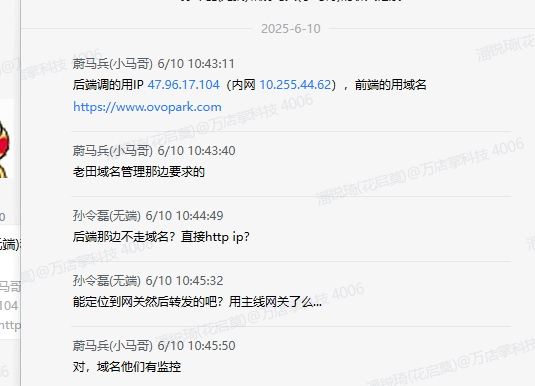

- **内容：**
  - **日期：**20250609

  - **需求一**

    - **需求来源：**业务测试 陈家伟
    - **需求简述：** 
      - OTA安装权限问题，当没有授予安装权限时，其需要跳转到系统层面授予权限，授予完成后回来，安装包会被删除，弹窗会被销毁，无法正常安装，需要重新启动才能安装
    - **完成状态：** 已完成
    - **耗时估算/实际耗时：**4h
    - **关键产出/难点：**
      - 代码的分析和解决
      - 采用sharedperference记录当前安装包安装状态，回到mainacitivity中，resume时检测安装状态，继续安装流程

  - 需求二

    - **需求来源：** 产品经理 韩帅

    - **需求简述：** 
      - 购物车主页增加超时未操作后的回退功能，当用户处于购物车页面，5s时间没有操作，那么右上角就会显示（清空120s）倒计时。
      - **主要场景**：  

        - 用户A扫描了一些商品，购物车有商品，显示购物车页面

        - 用户A突然有事离开，没有完成结账，也没有清空购物车

        - 机器就会一直停留在购物车页面，显示用户A的商品

        - 用户B来使用机器时，会看到用户A的购物车

        - 为了避免这种情况，需要检测用户无操作后自动清空

    - **完成状态：** 已完成

    - **耗时估算/实际耗时：**3h

    - **关键产出/难点/解决方案：**
    - ViewModel中新增对应状态流
      - UI中设置root的点击事件，记录对应的全局触摸检测。并触发流状态的变更
    - 流的状态变更导致UI的变更

  - 需求三

    - **需求来源：**业务测试 陈家伟 

    - **需求简述：** 

      - 频繁点击+号错误出现计算金额报错的弹窗

    - **完成状态：** 已完成

    - **耗时估算/实际耗时：**1h

    - **关键产出/难点/解决方案：**
      - 之前为了解决频繁点击+号导致协程之间并发存在问题，因此当时增加了防抖，高频操作时会合并操作，取消之前的协程任务。在这里被取消的协程报了异常，被错误检测为任务失败的异常，因此产生弹窗
      - 区分协程取消的异常和任务失败的异常即可。

  - 需求四

    - **需求来源：**产品经理 韩帅

    - **需求简述：** 

      - 修改登陆验证的API

    - **完成状态：** 已完成

    - **耗时估算/实际耗时：**1h

    - **关键产出/难点/解决方案：**
      - 修改登陆验证API，之前是token给的假数据，现在使用的是getYzsDevicestatusByMac

- **内容：**

- **日期：**20250610

  - **需求一**

    - **需求来源：** 业务测试 陈家伟 
    - **需求简述：** 
      - 修复了支付页取消支付回退到购物车页中错误弹窗弹出两次的问题
    - **完成状态：** 已完成
    - **耗时估算/实际耗时：**3h
    - **关键产出/难点/解决方案：**
      - 弹窗并非错误弹出两次，而是中间被抢占。
      - 采用加入弹窗优先级和检测UI是否繁忙的操作来协调各弹窗之间的关系

  - **需求二**

    - **需求来源：** 自提

    - **需求简述：** 

      - 日志输出过多，优化release日志输出，提高release运行效率

    - **完成状态：** 已完成

    - **耗时估算/实际耗时：**2h

    - **关键产出/难点/解决方案：**

      - 当前问题：
        - 所有的便捷日志方法都会调用getCallerInfo()，这在每次日志调用时都会执行栈帧分析，性能开销大
          - Release版本的ReleaseTree只过滤了低级别日志，但是在调用日志方法之前，字符串拼接、参数处理等操作还是会执行
        - 文件写入没有做异步处理，会阻塞主线程
        - 没有日志级别的控制，导致不必要的日志处理

      - 优化方向：

        - 添加日志级别控制，在Release版本中早期返回，避免不必要的字符串处理
        - 将文件写入改为异步处理
        - 优化getCallerInfo()的调用时机
        - 使用内联函数和lazy评估来优化性能

        - 添加更细粒度的日志控制

  - **需求三**

    - **需求/问题来源：** 业务测试 陈家伟 
    - **需求/问题简述：** 
      - 测试用设备无法正确登陆
    - **完成状态：** 已完成
    - **耗时估算/实际耗时：**2h
    - **关键产出/难点/解决方案：**
      - 测试使用平板，没有mac地址，登录时按照需求文档，需要获取mac地址，调用接口验证。目前只能给一个假的地址，这会影响实际发布的代码逻辑。已经和韩帅沟通。

  - **需求四**

    - **需求/问题来源：** 业务平台  孙令磊
    - **需求/问题简述：** 
      - 域名修改，走其他的域名
      - 
    - **完成状态：** 未完成
    - **耗时估算/实际耗时：**0.5h
    - **关键产出/难点/解决方案：**
      - 没沟通清除，我得认真了解一下到底要修改什么。

  - **需求五：**

    - **需求来源：** 产品经理 韩帅
    - **需求简述：** 
      - feat：区分测试服和正式服，测试服和正式服使用不同的域名
    - **完成状态：** 已完成
    - **耗时估算/实际耗时：**1h
    - **关键产出/难点/解决方案：**
      - 没理解什么意思？怎么区分测试服和正式服啊？
      - 采用Debug为测试服，Release为正式服

  - **需求六：**

    - **需求来源：** 项目组
    - **需求简述：** 
      - 保证发版顺利进行
    - **完成状态：** 已完成
    - **耗时估算/实际耗时：**3h
    - **关键产出/难点/解决方案：**
      - 发现正式版接口需要验证wdzdeptId（测试版时该字段被写死），我使用PerferenceManager全局唯一单例保存，提供saveDeviceId和getDeviceId方法，其他位置通过Koin依赖注入导入这个单例。然后登陆验证仓库位置save，其他api仓库位置get。未影响主流程。

    

    

- **内容：**

  - **日期：**20250611
  - **需求一**
    - **需求来源：**  徐晨 
    - **需求简述：** 
      - 验证Pos机固件刷新能否获取权限，确认Pos机可用性强，支持后续的大批量采购
    - **完成状态：** 未完成
    - **耗时估算/实际耗时：**4h
    - **关键产出/难点/解决方案：**

- **需求二**
  
  - **需求来源：** 产品经理 韩帅
  - **需求简述：** 
  
    - 优化     购物车主页   取消（120s）按钮   的UI显示
  - **完成状态：** 已完成
  - **耗时估算/实际耗时：**0.5h
  - **关键产出/难点/解决方案：**
    - 
  
- **需求三**
    - **需求来源：** 产品经理 韩帅
      
    - **需求简述：** 
      
      - 优化     弹窗中取消按钮   UI显示
      
    - **完成状态：** 已完成
      
    - **耗时估算/实际耗时：**0.5h
      
    - **关键产出/难点/解决方案：**

      - 优化弹窗中取消按钮UI显示
    
- **需求四**

    - **需求来源：** 自提

    - **需求简述：** 
      - 发现正式版接口需要验证wdzdeptId（测试版时该字段被写死），之前做法的优化

    - **完成状态：** 已完成

    - **耗时估算/实际耗时：**1h

    - **关键产出/难点/解决方案：**

      - 优化弹窗中取消按钮UI显示

- **需求五**

    - **需求来源：**  自提

    - **需求简述：** 
      - 版本切换

    - **完成状态：** 已完成

    - **耗时估算/实际耗时：**0.5h

    - **关键产出/难点/解决方案：**

      - 之前的版本切换好像不对，现在要去修改。

