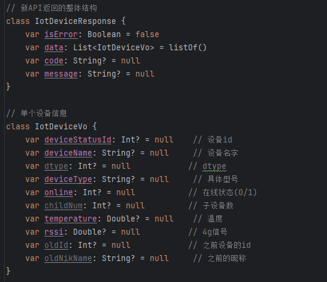
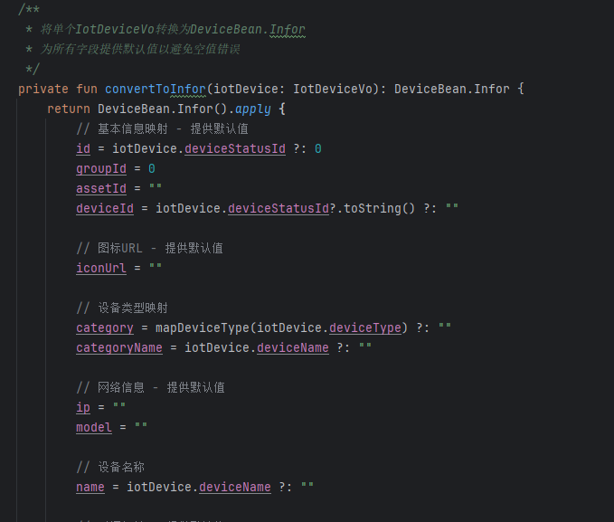
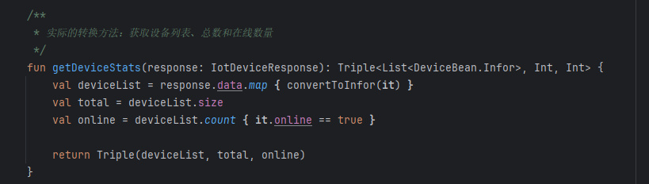
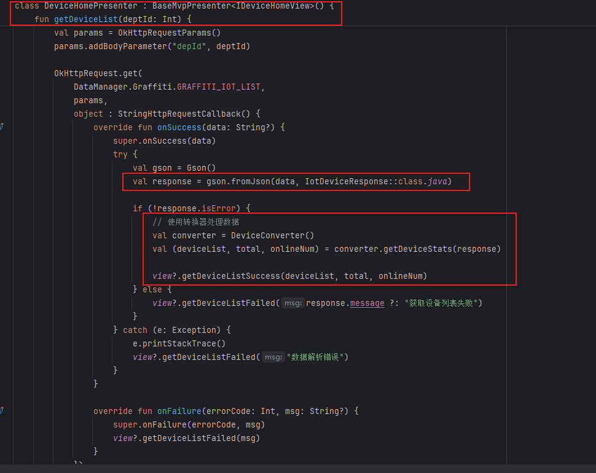
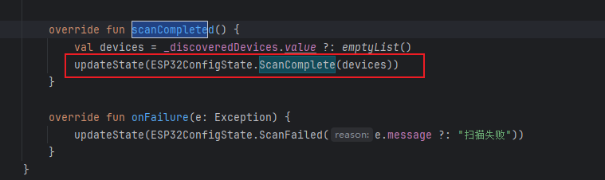

3. - ## 📅 Android 开发工作周报 (_2025_年_07_月_21_日 –_2025_年_07_月_27_日)

     **汇报人：** [潘锐琦]  
     **周目标：** 主线总智能硬件模块开发

     ---

     ## 🗓 日报记录

     1. **今日工作要点：**  
        - 【概述】一句话说今天主要做了什么  
     2. **难点 & 解决：**  
        - 【难点】简述遇到的最大挑战  
        - 【方案】如何定位、思路与结果  
     3. **收获 & 思考：**  
        - 【收获】新知识、工具或有趣发现  
        - 【思考】对后续工作的启发

     ---

     ## 🗓 日报记录（周一）

     1. **今日工作要点：**  
        - 【概述】一句话说今天主要做了什么  
     2. **难点 & 解决：**  
        - 【难点】简述遇到的最大挑战  
        - 【方案】如何定位、思路与结果  
     3. **收获 & 思考：**  
        - 【收获】新知识、工具或有趣发现  
        - 【思考】对后续工作的启发

     ## 🗓 日报记录（周二）

     1. **今日工作要点：**  
        - 【概述】智控平台网关详情页，断路器详情页开发，包括：UI + 内部业务逻辑（接口还未给出，因此没调接口获取数据）
     2. **难点 & 解决：**  
        - 【难点】怎么尽量减少对原有代码的破坏，比如：门店设备新增 智能断路器 和 智能网关 设备
        - 【方案】
          - 原有方案：
            - AddDeviceActivity中他是一个ScrollerView包裹的RecyclerVIew
            - 
            - 
              - 通过下面的进行两个级别的显示，先有外层的设备类型列表，然后有类型下的设备列表
                - 
            - 新的方案可以怎么设计呢？原有代码扩展性很强了，IOS是直接重写页面，写死。我能不能在保留原有逻辑的基础上去使用呢？
              - 考量数据来源
              - 原有是通过
              - 
              - 现在可以修改数据源，给假的数据
              - 
              - 
     3. **收获 & 思考：**  
        - 【收获】新知识、工具或有趣发现  
        - 【思考】开发要考虑复用性，尽量减少对已有代码的直接重构，写死是很呆的方式，给个假数据就很灵活，这样后续如果需要添加其他设备类型，就可以快速增加了。也许加1个，2个，跟写死比没有太多的提高，但是如果10多个呢？这就快很多

     ## 🗓 日报记录（周三）

     1. **今日工作要点：**  
        - 【概述】打通智控平台中新增智能网关的逻辑：包含引导重置设备，搜索设备，显示设备列表，点击后进入手动配网页，配网成功后显示配网成功页。
     2. **难点 & 解决：**  
        - 【难点】
          - 由于蓝牙设备的不稳定性，导致的配网有高达6种甚至更多的结果：Success + 5种failed（这里将部分统一归为WiFi配置失败），这时错误处理，回退机制，让用户最大化可用就是一个难点了
          - 
        - 【方案】如何定位、思路与结果  
          - 增加超时机制和分级错误判断，如果是密码错误，找不到指定的WIFI网络，运行尝试重新输入wifi名称和密码进行重新连接。如果是其他的错误，按照实际的多次测试的结果，这种情况通常无法再次连接成功，因此统一断连设备，回退到扫描设备页。
          - 
          - 同时提供多种提示：包含：
            - 
            - 
            - 
     3. **收获 & 思考：**  
        - 【收获】LiveData蛮好用的，分离了业务逻辑，我不需要直接通过回调获取处理的结果，直接订阅LiveData，然后根据对应状态的变化来更新UI就好了。
        - 【思考】对后续工作的启发

     ## 🗓 日报记录（周四）

     1. **今日工作要点：**  
        - 【概述】写转化器，对接口，目前对了：获取门店下IOT设备列表，网关设备引导入网，断路器设备入网，温湿度传感器入网（但是并没完全通，还要和后端联调）
     2. **难点 & 解决：**  
        - 【难点】：现在的核心问题是：新旧API之间的数据模型不同，现在要用新的API替代旧的API，新的API对应新的数据模型，这会产生新旧模型之前数据不一致的问题
        - 【方案】如何定位、思路与结果  
          - 解决思路：创建一个DTO类来表示新的API响应结构，然后创建映射扩展函数将新的数据模型转换为旧的DeviceBean模型。
          - 实现思路：
            - 创建新API数据结构
              - 
            - 创建 转换器，专门负责转换工作

              - 单个IOT设备映射
                - 
              - 实际的映射方法
                - 

            - 实际使用中

              - 
     3. **收获 & 思考：**  
        - 【收获】强行使用新模型替代旧模型，会产生诸多的问题，要一点点排除，可以通过一个中间的转化器层，将他们字段映射，这样可以很好兼容老项目
        - 【思考】既要考虑对老项目的兼容性，也要考虑对后续开发的兼容性，要写出可扩展性强的代码。

     ## 🗓 日报记录（周五）

     1. **今日工作要点：**  
        - 【概述】调通了断路器入网和获取断路器下子设备的逻辑，初步判断到网关联网后入网失败的问题
     2. **难点 & 解决：**  
        - 【难点】网关联网后入网失败，我这边没有相关日志，死活找不到问题点在哪
        - 【方案】和硬件范镇联调，我们发现一条异常的DMS心跳记录
          - 
          - 而我们的mac地址显示的是
          - 
     - 从这个位置获取到的
          - 
     - 这就很有意思了，两边mac地址不对
          - 实际的mac是多少？我们来看看设备背后的标签
     - 
          - 难道我通过蓝牙获取的存在问题吗？
          - 这是其他安卓apk获取的
          - 
     3. **收获 & 思考：**  
        - 【收获】网关设备本身的mac地址和从蓝牙获取到的他的mac地址存在不一致？
        - 【思考】我们确认是硬件这个位置产生的问题，因为我们排查了其他给出的三个硬件，他们的mac是这样的
          - 
     - 软件无法解决硬件上的问题，软件遇到硬件问题，很多时候不知道如何处理，甚至连排查也相当困难。
          - 另：吐槽，张瑞真的很不靠谱，很不用心，是不是最近忙没时间呢？可是也没见他加过班啊，算了，尽量避免和他一起合作共事。范镇解决问题就很认真。
     
     ## 🗓 日报记录（周六）
     
     1. **今日工作要点：**  
        - 【概述】调通空开：操作空开，详情页，Home页，获取空开子设备，细节页中数据获取逻辑
     2. **难点 & 解决：**  
        - 【难点】Activity 和adapter中共享数据比较合理的解决方法
        - 【方案】
          - 接口，activity实现接口，向外暴露，adapter中获取
          - LiveData + ViewModel
          - SharedPerference
          - EventBus
     3. **收获 & 思考：**  
        - 【收获】新知识、工具或有趣发现  
        - 【思考】对后续工作的启发
     
     ## 🗓 日报记录（周日）
     
     1. **今日工作要点：**  
        - 【概述】一句话说今天主要做了什么  
     2. **难点 & 解决：**  
        - 【难点】简述遇到的最大挑战  
        - 【方案】如何定位、思路与结果  
     3. **收获 & 思考：**  
        - 【收获】新知识、工具或有趣发现  
        - 【思考】对后续工作的启发
     
     ---
     
     ## 🔍 每周总结（每周固定时间填写）
     
     1. **本周完成：**  
        - 列出 3–5 条本周关键产出或里程碑  
     2. **核心经验：**  
        - 提炼最重要的技术/协作/流程收获  
     3. **待改进 & 下周计划：**  
        - 本周有哪些不足  
        - 下周重点目标 & 需要的支持
     
     ---