## 📅 Android 开发工作周报 (_2025_年_07_月_21_日 –_2025_年_07_月_27_日)

**汇报人：** [潘锐琦]  
**周目标：** 主线总智能硬件模块发版 + Pos机

---

## 🗓 日报记录

1. **今日工作要点：**  
   - 【概述】一句话说今天主要做了什么  
2. **难点 & 解决：**  
   - 【难点】简述遇到的最大挑战  
   - 【方案】如何定位、思路与结果  
3. **收获 & 思考：**  
   - 【收获】新知识、工具或有趣发现  
   - 【思考】对后续工作的启发

---

## 🗓 日报记录（周一）

1. **今日工作要点：**  
   - 【概述】解决若干个bug，清除无用代码，将代码中字符放到strings.xml中
2. **难点 & 解决：**  
   - 【难点】
     - 现在有DeviceHome页和ZnwgHome页，分别代表总的设备列表和智能网关下子设备列表。智能网关下有温湿度传感器。
     - 我们在ZnwgHome页可以通过智能网关的设备id拿取到温湿度传感器的OldID，然后通过TuyaApI获取到温湿度传感器的数据显示出来。
     - 但是温湿度传感器同时也会在DeviceHome页中显示，他们都是同一个数据bean，但是这里不给OldId，导致我们在这个位置没法正确显示数据。
     - 因此我们需要在这里对每个智能网关做一个API，获取到他的子的温湿度传感器的数据，然后替换之前的总的设备列表中的温湿度传感器。
   - 【方案】如何定位、思路与结果  
     - 首先是一个获取所有网关设备(category == "wfcon")下的子设备的逻辑，他会返回一个列表。
     - 然后是把列表和之前已有的列表合并的逻辑，我们会替换之前的列表中所有的category = “wsdcg”,并且id和我们列表中设备id相同的。单个替换完后，我们要操作这单个的数据，让他的id和deviceId为oldId。
     - 但是这里发现，DeviceHome页中的温湿度传感器的ID为0，靠北，太偷懒了，oldId不给，这个也不给。现在只能用niceName做对比了
3. **收获 & 思考：**  
   - 【收获】收获不是很多啊
   - 【思考】注意编写过程中就要做脏东西的清除，避免现在要花很多时间处理。

## 🗓 日报记录（周二）

1. **今日工作要点：**  
   
   - 【概述】：提测中bug解决 + 代码审查
2. **难点 & 解决：**  
   - 【难点】代码自我审查中遇到的诸多问题
     - SearchDeviceActivity,避免使用Thread.sleep做定时器，同时避免在子线程中直接更新UI。修改为使用counterDown做定时器，通过post放在主线程中更新UI
       - 问题代码：
         - 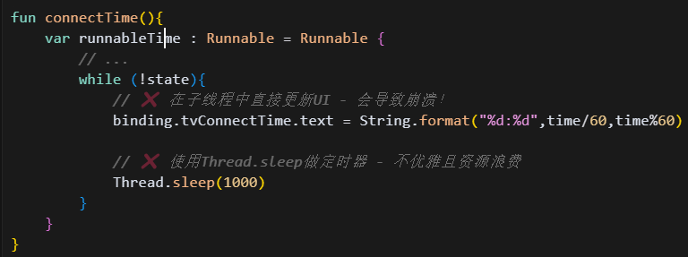
       - 解决方案：
         - 使用counterDown做定时器，通过post放在主线程中更新UI
         - 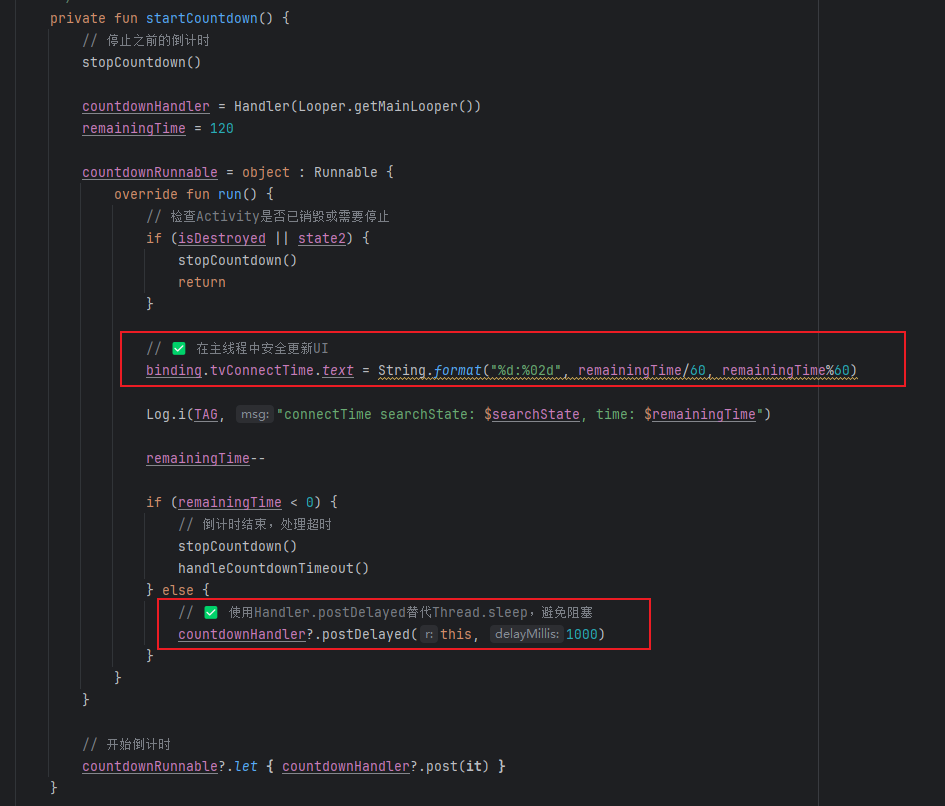
         - handler.postDelayed是什么意思？
       
     - ProvisionSuccessActivity中存在Handler内存泄漏和可能的崩溃性问题
       - 问题代码：
         - 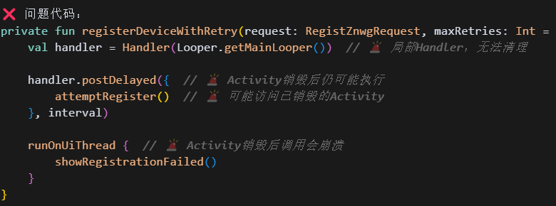
       - 解决方案：
         - 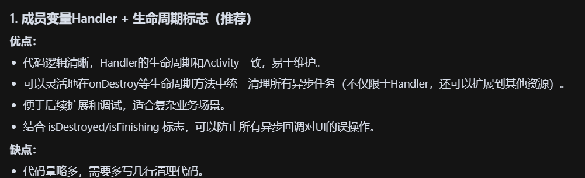
         - 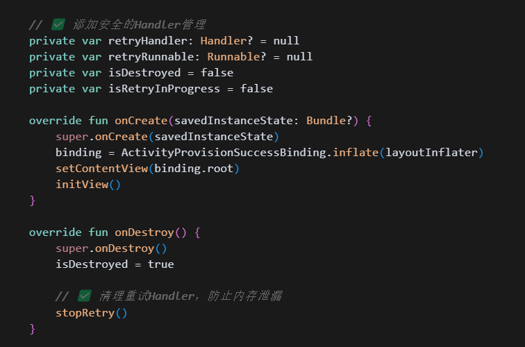
         - 每个异步的地方都要加检查
         - 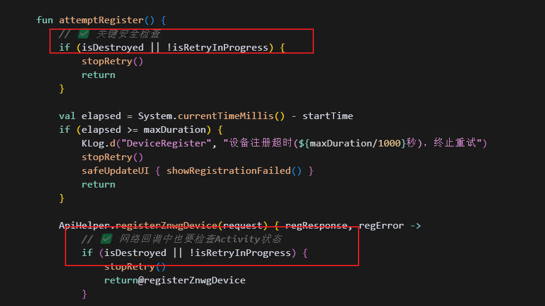
         - 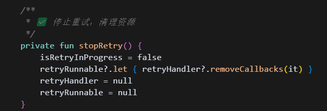
       - 副作用：你没发现你这种方法，只要用到handler，就要极为频繁的加检查吗？每次用到 Handler 的回调、网络回调、定时任务、UI更新等地方，都要加 isDestroyed 或 isFinishing 检查。
       - 为什么会这样：
         - 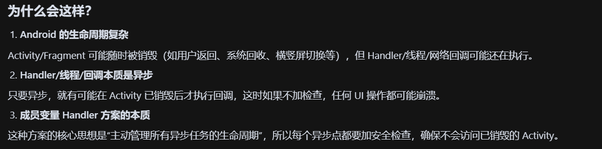
       - 更优雅的解决方法：采用协程执行异步任务，其会在Activity销毁时自动取消
         - 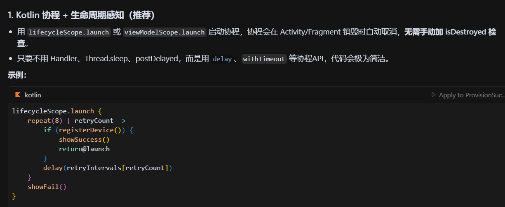
       
     - 修复线程安全问题 - DeviceRepository

       - 初始代码

         - 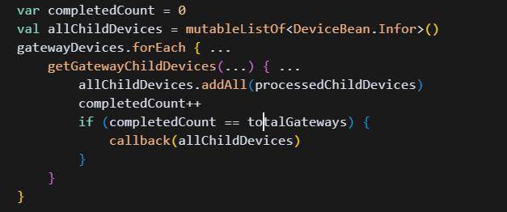
         - 存在问题：多个异步回调并发执行时，completedCount++和allChildDevices.addAll()都不是线程安全的，可能导致：
           - 计数不准，callback被漏调或多调。
           - 集合被并发修改，抛出异常或数据丢失。

       - 优化后方法

         - 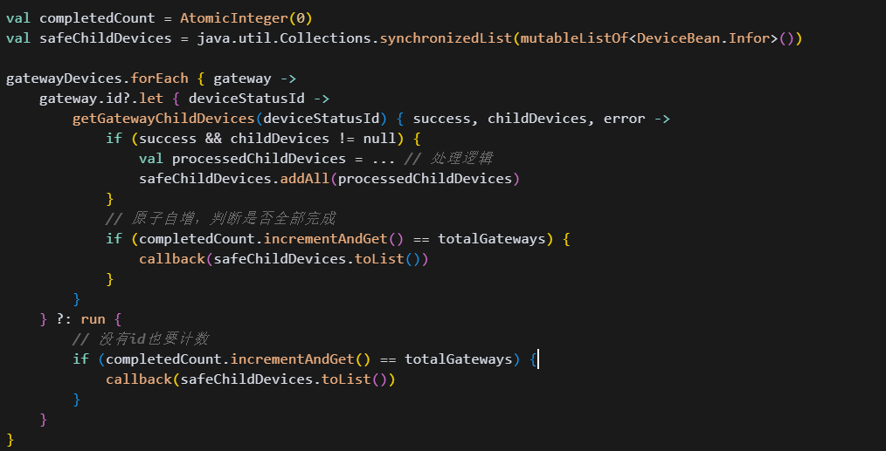

         -  计数器用AtomicInteger保证线程安全

           - val completedCount = AtomicInteger(0)

           - 用completedCount.incrementAndGet()原子性地自增，避免多线程下的竞态条件。

         - 集合用同步列表保证线程安全

           - val safeChildDevices = java.util.Collections.synchronizedList(mutableListOf<DeviceBean.Infor>())

           - 多个线程可以安全地向synchronizedList添加数据，不会抛出并发修改异常。

         - 回调时转换为普通List

           - 回调时用safeChildDevices.toList()，避免外部再对同步集合进行并发操作

     - 优化网络请求策略 - 并行执行

       - 初始代码：

         - 
         - 对每个子设备，进行API请求。这里会等待结果，是串行的。

       - 优化后方案：

         - 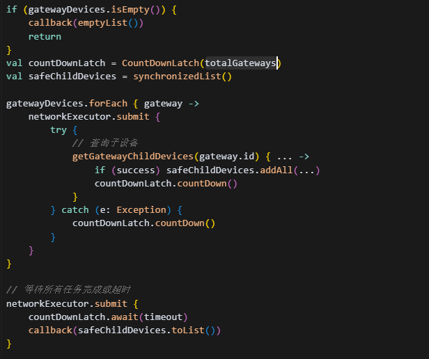

         - 并行执行：通过networkExecutor.submit { ... }，每个网关的子设备查询都在独立线程中并发执行，而不是串行等待。

           - 这样总耗时≈单个最慢请求的耗时，而不是所有请求耗时之和，大大提升了性能。

           - 超时控制：countDownLatch.await(30, TimeUnit.SECONDS)设置最大等待时间，防止某些网络请求卡死导致整体阻塞。

         - 线程安全控制：

           - 同步集合：safeChildDevices = Collections.synchronizedList(...)多线程环境下安全地收集所有子设备，避免并发修改异常。
           - CountDownLatch：val countDownLatch = CountDownLatch(totalGateways)用于等待所有网关的子设备查询任务都完成，保证最终回调时数据完整。

     - 改进防抖机制：

       - 原有方案：
         - 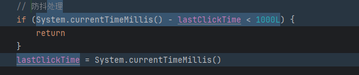
       - 新的方案
         - 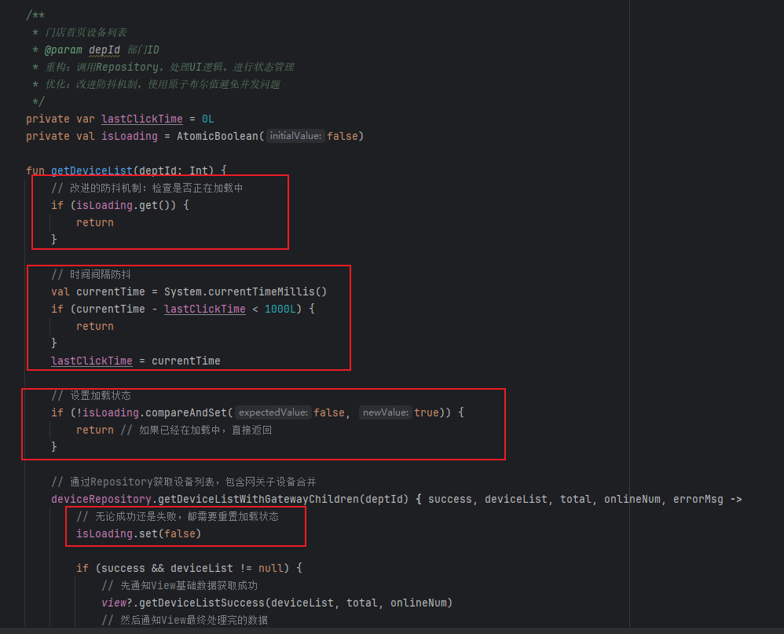

     - UI更新失败：

       - 初始代码：
         - 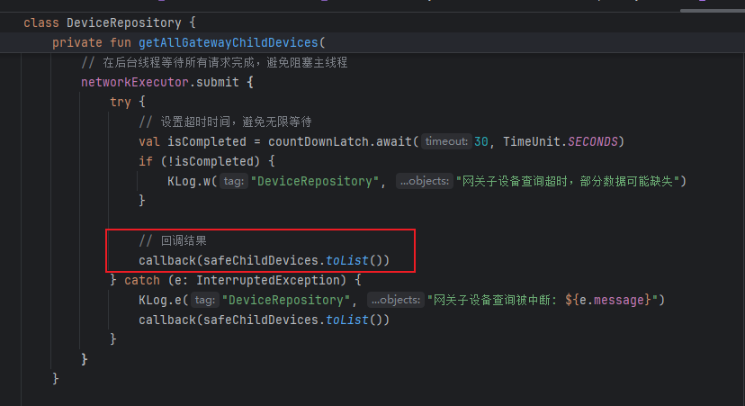
         - callback是UI更新操作，在后台线程执行，导致UI更新失败
       - 解决方案：
         - 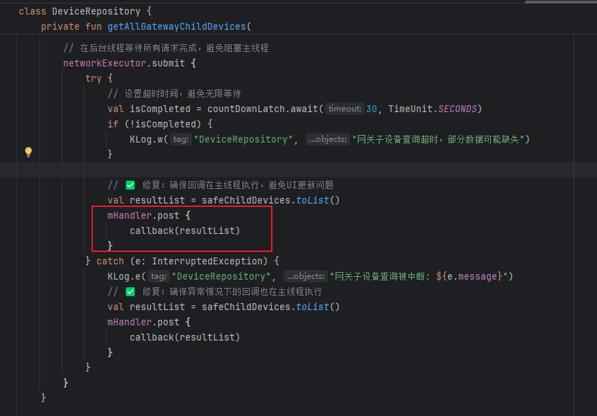

   - 【方案】
3. **收获 & 思考：**  
   - 【收获】新知识、工具或有趣发现  
   - 【思考】对后续工作的启发

## 🗓 日报记录（周三）

1. **今日工作要点：**  
   - 【概述】 检查并处理所有XML布局文件中的硬编码中文字符串，检查并处理颜色和尺寸资源，配置Charles，处理范镇提出的新的UI优化的需求
2. **难点 & 解决：**  
   - 【难点】Charles配置，回头得记录一下
   - 【方案】如何定位、思路与结果  
3. **收获 & 思考：**  
   - 【收获】新知识、工具或有趣发现  
   - 【思考】工作中要学会处理边界模糊的问题，清楚责任边界，遇到测试提出的超出开发职责的问题，应当协助定位问题根源，把问题抛出去。既不要直接拒绝，也不要自己独自处理。要能够界定责任边界。

## 🗓 日报记录（周四）

1. **今日工作要点：**  
   - 【概述】处理范镇提出的新的UI优化的需求 + DMS平台连通 + App扫码入网Pos
2. **难点 & 解决：**  
   - 【难点】DMS平台和扫码入网的业务流程性问题
   - 【方案】拉一个群，一起沟通
3. **收获 & 思考：**  
   - 【收获】新知识、工具或有趣发现  
   - 【思考】谁写的DMS平台，写完后一点开发文档没有，我们郭运起找了半天问题。开发一个功能项目，一定要多写开发文档。

## 🗓 日报记录（周五）

1. **今日工作要点：**  
   - 【概述】一句话说今天主要做了什么  
2. **难点 & 解决：**  
   - 【难点】简述遇到的最大挑战  
   - 【方案】如何定位、思路与结果  
3. **收获 & 思考：**  
   - 【收获】新知识、工具或有趣发现  
   - 【思考】对后续工作的启发

## 🗓 日报记录（周六）

1. **今日工作要点：**  
   - 【概述】一句话说今天主要做了什么  
2. **难点 & 解决：**  
   - 【难点】简述遇到的最大挑战  
   - 【方案】如何定位、思路与结果  
3. **收获 & 思考：**  
   - 【收获】新知识、工具或有趣发现  
   - 【思考】对后续工作的启发

## 🗓 日报记录（周日）

1. **今日工作要点：**  
   - 【概述】一句话说今天主要做了什么  
2. **难点 & 解决：**  
   - 【难点】简述遇到的最大挑战  
   - 【方案】如何定位、思路与结果  
3. **收获 & 思考：**  
   - 【收获】新知识、工具或有趣发现  
   - 【思考】对后续工作的启发

---

## 🔍 每周总结（每周固定时间填写）

1. **本周完成：**  
   - 列出 3–5 条本周关键产出或里程碑  
2. **核心经验：**  
   - 提炼最重要的技术/协作/流程收获  
3. **待改进 & 下周计划：**  
   - 本周有哪些不足  
   - 下周重点目标 & 需要的支持

---