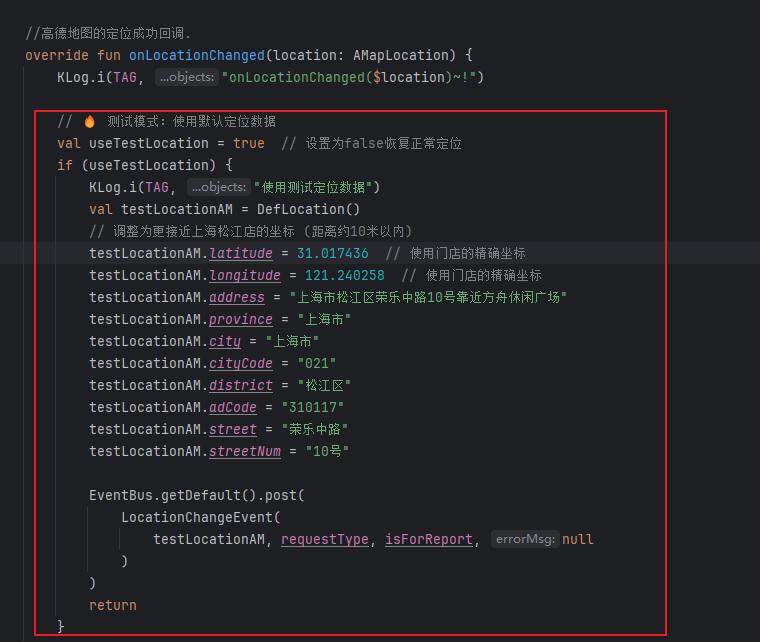
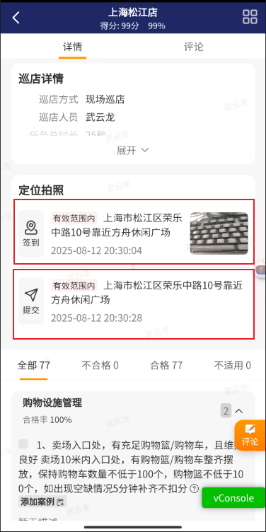
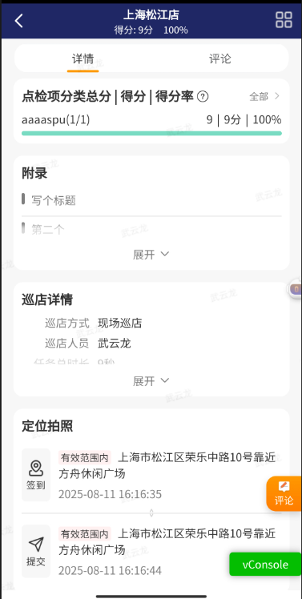
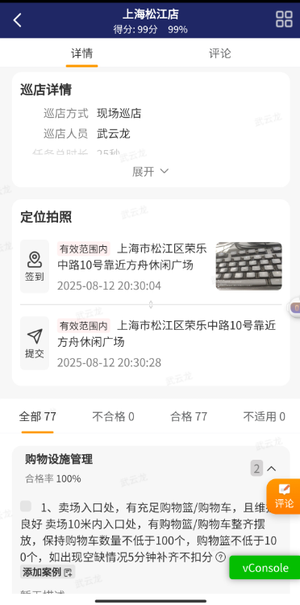
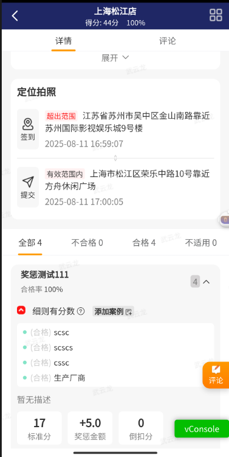
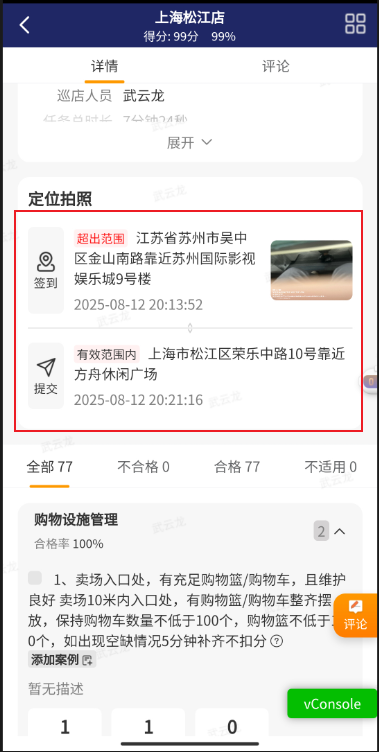
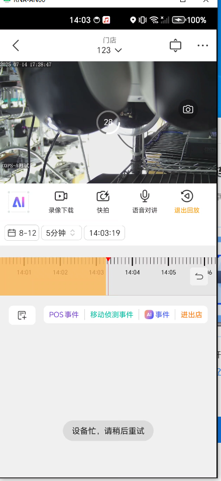
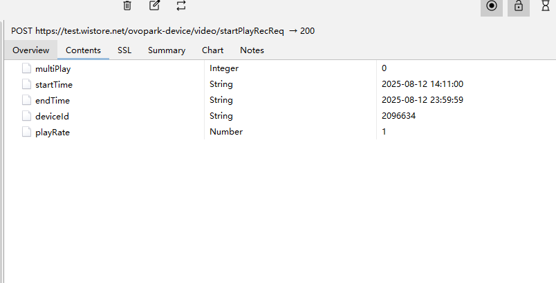
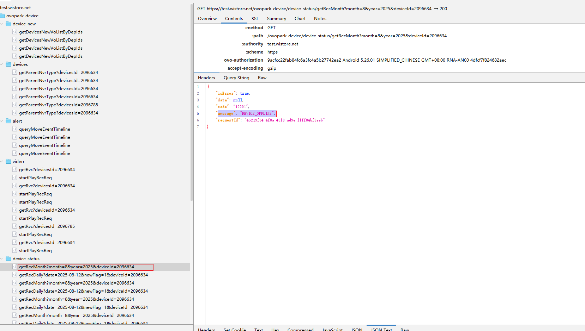

## 📅 Android 开发工作周报

**汇报人：** [潘锐琦]  

---

## 🗓 日报记录

1. **今日工作要点：**  
   - 【概述】一句话说今天主要做了什么  
2. **难点 & 解决：**  
   - 【难点】简述遇到的最大挑战  
   - 【方案】如何定位、思路与结果  
3. **收获 & 思考：**  
   - 【收获】新知识、工具或有趣发现  
   - 【思考】对后续工作的启发

---

## 🗓 日报记录（周一）

1. **今日工作要点：**  
   - 【概述】：
     - Pos侧启动自升级
     - Android磁盘告警首屏弹窗
2. **难点 & 解决：**  
   - 【难点】
     - Pos侧启动自升级有一个很难处理的问题，就是如何做到无需用户做任何操作，即可实现自升级？
     - Android磁盘告警问题排查不好处理，我当时有种手足无措的感觉
   - 【方案】如何定位、思路与结果  
     - 这个只能使用系统的su命令。正常的intent根本不行。使用系统root权限，执行su命令。但是产生新的问题了，他没法重启，因为这个应用安装过程中就会被其他应用杀死。所以我们另外还需要一个守护进程。但是这个守护进程又该如何处理呢？哎呀，好麻烦啊
     - 磁盘告警要学会善用日志，对啊，我们如何过滤掉无关的日志，只显示自己想要的呢？
3. **收获 & 思考：**  
   - 【收获】
   - 【思考】
     - 磁盘告警，嗯，要求是跳到告警中心，但是后面又改需求，这种情况，就必须让他们建jira，让我可以去处理。
     - bug如何定位呢？磁盘告警现象是：后端说发数据了，但是我们这里没有实际的首屏弹窗。
       - 我们的方法：截取两头，处理中间，首先抓取数据，查看他是否发送了相关的数据。然后去查看数据的走下去的流程？还是怎么处理？现在有：按照代码执行流，一点点的往下走，加日志，另一个是：折半查找，找到中间路径，位置加日志。还是有其他更好的方式？
       - 这是一个经典的"数据有，现象无"的Bug定位场景。我该使用什么方法进行最优定位呢？
       - 

## 🗓 日报记录（周二）

1. **今日工作要点：**  
   - 【概述】
     - 巡店模块代码逻辑阅读， [02. 首页_首页包含哪些模块.md](..\03. 业务逻辑介绍\02. 首页_首页包含哪些模块.md) ； [03. 巡店_现场巡店门店选择逻辑.md](..\03. 业务逻辑介绍\03. 巡店_现场巡店门店选择逻辑.md) ； [03. 巡店_巡店定位获取逻辑.md](..\03. 业务逻辑介绍\03. 巡店_巡店定位获取逻辑.md) 
     - 处理bug：[现场巡店拍照签到，用户在门店附近但是app判断不在门店范围内](http://jira-inc.ovopark.com:8080/browse/WDZ-128970)
     - 
2. **难点 & 解决：**  
   - 【难点】
     - 这个bug是偶现的，不好处理。该怎么去复现呢？该怎么完全复原用户的场景呢？首先要有一个门店，位置完全相符。然后要有签到的位置
   - 【方案】
     - 如何复现？
       - 门店：这个好处理，新建一个测试服门店，然后经纬度让后端修改，ok，我们有这个门店了。
       - 签到的位置：
         - 我们首先尝试使用虚拟定位，不行，仍然显示位置为寿桃湖附近，为什么呢？拼多多上显示的是上海附近啊。
         - 阅读巡店定位获取逻辑，发现是高德SDK的一个Listener中发射出去的，那我们直接修改，给一个假的数据
         - 
     - 多次尝试：
       - 目前多次测试，发现一个情况，签到和提交都需要定位，他们是分开的。签到和提交各需要一次定位
       - 
     - ok，下面是多次尝试的截图
       - 
       - 
     - 目前只有下面的情况复现出签到超出范围的情况
       - 
       - 
3. **收获 & 思考：**  
   - 【收获】：
     - 巡店业务逻辑学习了蛮多的； [03. 巡店_现场巡店门店选择逻辑.md](..\03. 业务逻辑介绍\03. 巡店_现场巡店门店选择逻辑.md) ； [03. 巡店_巡店定位获取逻辑.md](..\03. 业务逻辑介绍\03. 巡店_巡店定位获取逻辑.md) ； [02. 首页_首页包含哪些模块.md](..\03. 业务逻辑介绍\02. 首页_首页包含哪些模块.md) 
     - RxView没有通过线程调度时底层是什么样的？底层其实就类似接口回调一样。如果有线程调度，那么依赖于Handler和工作线程池中的任务队列
     - 埋点是什么？这个要去处理啊
   - 【思考】：要关注处理需求和学习的平衡。需求应该迅速高效处理完

## 🗓 日报记录（周三）

1. **今日工作要点：**  
   - 【概述】：bug-fix：云值守
     - 回放截取时间不对
       - 
       - 
     - Android默认回放设备不对
     - Android查看回放时返回"message": "DEVICE_OFFLINE",
       - 
2. **难点 & 解决：**  
   - 【难点】
     - 如何快速理解逻辑
     - 如何快速高效定位问题，分清责任边界？
     - 自己边界内的问题如何给出解决方法
     - 自己边界外的问题如何和他人正确的高效的沟通？
   - 【方案】如何定位、思路与结果  
     - 很开心，之前处理云值守的时候留下来很多笔记，这让我这次处理云值守时可以快速回顾之前的逻辑，相对来说可以非常快的定位到逻辑Android默认回放设备不对这个bug的逻辑，并且很快处理完我们这一侧的。
     - 同时Android默认回放设备不对bug我进行了充分的自测，发现退出云值守模块，重新进入后，问题仍然存在，也是很快定位到是H5侧传参的问题。
     - 同时，受益于之前智控平台方面的学到的和测试沟通的技巧。我很快定位到Android查看回放时返回"message": "DEVICE_OFFLINE",的bug不是我们产生的，并协助测试定位问题根源，把问题抛出去。清晰的界定责任边界。
3. **收获 & 思考：**  
   - 【收获】
     - 处理问题的过程中多记学习笔记，有大用处
   - 【思考】
     - 我感觉我的学习缺乏一个清晰的规划，就很简单，假如，新的一天开始，我脑子里有：我今天要学习什么模块下的什么知识的概念吗？我觉得我缺少这个概念。

## 🗓 日报记录（周四）

1. **今日工作要点：**  

   - 【概述】
     - Pos机发版
     - Pos机新需求：支持远程重启与退网处理。
     - 云值守bug处理
2. **难点 & 解决：**  
   - 【难点】
     - 
   - 【方案】如何定位、思路与结果  
     -  Pos机：通过DMS接收指令，然后创建一个新的进程，等待一段时间后杀死自身
     - 云值守Bug：参考周五的bug定位的思考
3. **收获 & 思考：**  
   
   - 【收获】
   
   - 【思考】
   
     - 我目前遇到了两个反复处理的问题，一个是DMS，一个是蓝牙配网的SDK。
   
     - 蓝牙配网SDK是三个问题，
   
       - 一个是：SDK无法很好的使用。这跟SDK本身存在问题有关，同时也和我自己缺乏SDK使用经验有关，我吸取了这个教训，下次遇见新的SDK，我会先去使用Demo，看这个过程中的日志，然后学习demo本身如何操作和使用sdk的，然后放到项目中使用，而非单纯凭借README操作。
       - 另一个是：蓝牙获取的mac和他设备上报心跳的mac不一致，这个是设备的问题。也是花了很多时间
       - 最后一个是：SDK依赖的最低Android minSDK为23，调整Android minSDK后，包的体积扩大，这个是SDK和我们项目本身的问题了，我需要处理SDK的迁移和适配。这确实是一个耗时的任务。
       - 在这个过程中戴雪飞越过我直接和leader沟通了2次，我很讨厌这种做法，让我丧失了对她的信任，一个产品是解决问题的，绝对不是抛出问题的，组员遇到问题，应该的方法是了解情况，尝试给予帮助，风险把控不了时才进行下一步风险处理，但是我仔细思考，我处理的已经很好了，我获取了高级Android工程师应有的能力：自定义修改SDK，我积极解决了各种问题
   
     - DMS
   
       - DSM核心就是一个问题，缺少文档，张瑞在写这个的过程中，一点文档都没写。我根本不知道整个DMS连接和设备入网对应的流程是什么样的，甚至和我对接的郭运起，也是要不断的看代码，不断的和我说要加这个，这也造成了整个过程中的反复。
       - 比如：我们最开始沟通时，认为时连接上重定向服务器，然后重定向服务器给你发送DMS真实地址，你直接连接就行。但是实际上，实际流程是：你连接重定向服务器，发送心跳，同时还要订阅一个验证密码的主题。这样才可以正确入网并获取真实的DMS地址。
       - 这是无奈的，流程不在我手中把控着，那么反复就不是我能控制的了。这让我感觉到深深的无力感。我无法按照自己的意愿让问题顺利的解决。
   
     - 回顾这两个问题，我认为我遇到了一定的困境，我有着深深的无力感，这个困境是**技术问题和组织问题交织**的状态
   
       - **技术层面**
   
         - 蓝牙配网 SDK 的问题我已经从“生疏 → 能快速掌握 → 能改 SDK”有了明显成长，这点很值得肯定。
         - DMS 问题其实不是技术本身，而是**流程、文档、信息不透明**造成的反复。
   
         **组织层面**
   
         - 我在蓝牙配网那件事里，遇到了戴雪飞越级沟通的问题，这不是单纯的情绪，而是**协作信任链被破坏**。
         - 在 DMS 那件事里，我受制于**流程信息不在自己手里**，导致无法按自己节奏推进，造成无力感。
   
     - 我下次应该如何破解这个困局？
   
       - 把心态从  我要按自己意愿推进 转换为  我要让别人也按我的意愿推进。（可行吗？如何处理？如何实操？）
       - 积极和leader保持沟通。（可行，积极同步情况）
       - 让自己的努力被更多的人看见 （如何操作？）
       - 我感觉仍然很被动，无法很好的操作

## 🗓 日报记录（周五）

1. **今日工作要点：**  
   
   - 【概述】：
     - 消息中心业务逻辑预热。学习相关的逻辑（下次这种消息类型的没必要花大精力去看，因为消息类型本身并不复杂，不会是一个复杂的业务逻辑）
     - Pos机新需求：支持远程重启与退网处理，自测
     - GC频繁问题排查及尝试优化
2. **难点 & 解决：**  
   
   - 【难点】
     - GC频繁问题的排查和定位，以及优化效果的量化分析
   - 【方案】如何定位、思路与结果  
     - 建立Java内存泄漏的标准化处理方案： [03. study_内存泄漏标准化处理方案.md](..\03. 故障分析与处理\03. study_内存泄漏标准化处理方案.md) 
     -  [04. perf_ScrollImageView_01.md](..\03. 故障分析与处理\04. perf_ScrollImageView_01.md)，  [04. perf_ScrollImageView_02.md](..\03. 故障分析与处理\04. perf_ScrollImageView_02.md) 
3. **收获 & 思考：**  
   - 【收获】

   - 【思考】

     - 如何快速定位一个bug，

     - 日志分析 - 找关键线索

       - ```
         WebView传递: "deviceId":2096955
         网络请求使用: videoId=2096953
         ```

       - 关键发现: 设备ID在某个环节被替换了，这不是简单的参数传递错误，而是有业务逻辑在"选择"设备。

     -  关键词搜索 - 追踪调用链，我按照这个顺序搜索：

       - goVideoPlay → 找到WebView的JS调用入口

       - webview call json → 找到处理WebView事件的地方

       - EVENT_TYPE_VIDEO_PLAY → 找到具体的处理逻辑

     - 发现关键分支 - 云值守特殊处理，在BaseWebViewActivity中发现了这段关键代码：

       - ```
         if (lastRouteUrl.contains("cloud-attendance")) {
         
           *// 云端出勤入口：获取门店所有设备*
         
           handleCloudAttendanceVideoPlay(deviceId, replayTime, storeId, duration)
         
         } else {
         
           *// 其他入口：保持原有单设备逻辑*
         
           handleRegularVideoPlay(deviceId, replayTime)
         
         }
         ```

     - 重要洞察: 云值守模式有特殊逻辑！它不是直接使用传入的设备ID，而是：

       - 获取门店所有设备列表
       - 在列表中查找指定设备
       - 如果找不到，默认选择第一个设备

     - 定位核心bug - 字段匹配错误，在handleDeviceListSuccess方法中找到问题代码：

       - ```
         selectedIndex = finalDeviceList.indexOfFirst { 
         
           it.deviceId.toString() == selectedDeviceId *// ❌ 错误的字段*
         
         }.let { if (it >= 0) it else 0 }
         ```

     - 数据模型验证 - 确认字段映射，通过查看数据转换过程：

       - ```
         *// DevicesSets.convertToDevices()*
         
         device.id = it.deviceId *// DeviceSimple.deviceId -> Device.id*
         ```

       - 确认问题: 代码在查找Device.deviceId字段，但该字段不存在！应该查找Device.id。

   - 关键在于对现象的分析和理解，然后由现象到本质的过程。

     - 比如：现象是：传递默认设备，但是没有使用默认设备。查询deviceId字段，发现传进来的被替换为了错误的ID。
     - 查看调用的接口方法，一步步往下走。就知道了。

## 🔍 每周总结（每周固定时间填写）

1. **本周完成：**  
   - ✅ 磁盘告警弹窗闭环
   - ✅ 云值守3项问题沟通解决修复
   - ✅ 巡店定位偏差问题处理
   - ✅ 远程重启/退网指令开发
   - ✅ Pos自升级闭环
   - ✅ **GC频繁问题优化（建立标准化分析流程）**
2. **核心经验：**  
   - 日志分析法高效定位隐性问题（如磁盘告警）
   - **内存泄漏分析标准化提升排查效率**
   - 技术笔记显著提升重复问题解决效率
3. **待改进 & 下周计划：**  
   - ⚠️ 改进：三方SDK接入前评估不足
   - ➡️ 下周重点：
     - 消息中心需求开发
     - GC优化方案落地验证
     - 巡店模板标识过滤
