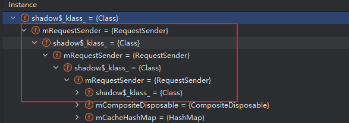

## 📅 Android 开发工作周报

**汇报人：** [潘锐琦]  

---

## 🗓 日报记录

1. **今日工作要点：**  
   - 【概述】一句话说今天主要做了什么  
2. **难点 & 解决：**  
   - 【难点】简述遇到的最大挑战  
   - 【方案】如何定位、思路与结果  
3. **收获 & 思考：**  
   - 【收获】新知识、工具或有趣发现  
   - 【思考】对后续工作的启发

---

## 🗓 日报记录（周一）

1. **今日工作要点：**  
   - 【概述】：
     - [POS自动闪退异常问题排查处理](http://jira-inc.ovopark.com:8080/browse/WDZ-135497)，目前初步判断是日志撑爆了系统的存储空间，导致存储空间不足 → 系统IO异常 → 应用无法正常读写 → 闪退。我的日志系统存在多个问题：
       - 没有文件大小限制 - 日志文件会无限增长，原本有，但是我的日志写入从同步改为异步后就没了。
       - 没有日志轮转机制 - 只按日期分文件，但单个文件可能巨大
       - 没有存储空间检查 - 不监控剩余存储空间
     - [【安卓】【商户端】追缴、退款并对接消息中心我这边对接好了
     - [已巡标识，支持按指定模板过滤](http://jira-inc.ovopark.com:8080/browse/WDZ-133148)业务逻辑学习
     - [DMS平台通知pos机解绑](http://jira-inc.ovopark.com:8080/browse/WDZ-133902)bug排查和解决，移动端和网页端发送的DMS指令不同，其内部有：reboot和restore字段，网页端是reboot 1, restore 0。移动端是reboot 0, restore 1。综合考虑跨部门协调的成本，选择本地自己处理。
     - RecyclerView学习
2. **难点 & 解决：**  
   - 【难点】
     - RecyclerView优化，我们该怎么去优化我们的RecyclerView？ [01.RecyclerView基础.md](..\04. 学习_Eden区\01.RecyclerView基础.md) 。RecyclerView有六种优化技巧，包含：ViewType分类、findViewById优化、高效onBind、ViewHolder创建优化、payload局部刷新、DiffUtil自动差异计算
     - 对于产品经理说的简述的抽象的需求，我们该如何理解并处理？
     - RecyclerView源码好难读啊。
   - 【方案】如何定位、思路与结果  
     - 很简单，先进行初步的沟通，获取到大致的信息，如：哪个页面，大致要做什么？然后看代码和业务逻辑，看懂了，有自己的思考后再去进一步沟通。
3. **收获 & 思考：**  
   - 【收获】
     -  [01.RecyclerView基础.md](..\04. 学习_Eden区\01.RecyclerView基础.md) 
     -  [03. 巡店_回放中巡店标识逻辑.md](..\03. 业务逻辑介绍\03. 巡店_回放中巡店标识逻辑.md) 
   - 【思考】
     - 技术债是不可避免的。优化日志系统。
   - 【补充】
     - 极光推送的还没去学相关的逻辑

## 🗓 日报记录（周二）

1. **今日工作要点：**  
   - 【概述】:
     - [已巡标识，支持按指定模板过滤](http://jira-inc.ovopark.com:8080/browse/WDZ-133148)业务逻辑熟悉， [03. 巡店_回放中巡店标识逻辑.md](..\03. 业务逻辑介绍\03. 巡店_回放中巡店标识逻辑.md)   。等后端给数据
     - [【app】【安卓】开启竖屏锁定之后，视频巡店横屏，还是自动竖屏](http://jira-inc.ovopark.com:8080/browse/WDZ-126779) 处理
     - 尝试优化一个内存泄漏问题，Profiler日志如下
       - 
2. **难点 & 解决：**  
   - 【难点】
     - 内存泄漏问题定位和根因分析
   - 【方案】如何定位、思路与结果  
     - 没解决，好难处理
3. **收获 & 思考：**  
   - 【收获】
     - 知道了作为一个Android开发每个阶段需要做什么？该有什么自我要求。但是还没完全了解https://juejin.cn/post/7467824311618535476
   - 【思考】
     - 有的时候会不想学习，不想动，不想工作，我觉得是心定不住，还是要规划一下，去调节一下自身。

## 🗓 日报记录（周三）

1. **今日工作要点：**  
   - 【概述】
2. **难点 & 解决：**  
   - 【难点】
     - 
   - 【方案】如何定位、思路与结果  
     - 
3. **收获 & 思考：**  
   - 【收获】
   - 【思考】

## 🗓 日报记录（周四）

1. **今日工作要点：**  
   - 【概述】：
     - [【app】【安卓】开启竖屏锁定之后，视频巡店横屏，还是自动竖屏](http://jira-inc.ovopark.com:8080/browse/WDZ-126779) 解决
     - [已巡标识，支持按指定模板过滤](http://jira-inc.ovopark.com:8080/browse/WDZ-133148)等和后端沟通
2. **难点 & 解决：**  
   - 【难点】
     - 后端给出数据比较晚时该如何处理？
   - 【方案】如何定位、思路与结果  
     - 
3. **收获 & 思考：**  
   - 【收获】
     - 
   - 【思考】

## 🗓 日报记录（周五）

1. **今日工作要点：**  
   - 【概述】
2. **难点 & 解决：**  
   - 【难点】
     - 
   - 【方案】如何定位、思路与结果  
     - 
3. **收获 & 思考：**  
   - 【收获】
   - 【思考】

## 🗓 日报记录（周六）

1. **今日工作要点：**  
   - 【概述】
2. **难点 & 解决：**  
   - 【难点】
     - 
   - 【方案】如何定位、思路与结果  
     - 
3. **收获 & 思考：**  
   - 【收获】
   - 【思考】

## 🗓 日报记录（周日）

1. **今日工作要点：**  
   - 【概述】
2. **难点 & 解决：**  
   - 【难点】
     - 
   - 【方案】如何定位、思路与结果  
     - 
3. **收获 & 思考：**  
   - 【收获】
   - 【思考】

---

## 🔍 每周总结（每周固定时间填写）

1. **本周完成：**  
   - 列出 3–5 条本周关键产出或里程碑  
2. **核心经验：**  
   - 提炼最重要的技术/协作/流程收获  
3. **待改进 & 下周计划：**  
   - 本周有哪些不足  
   - 下周重点目标 & 需要的支持

---