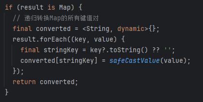
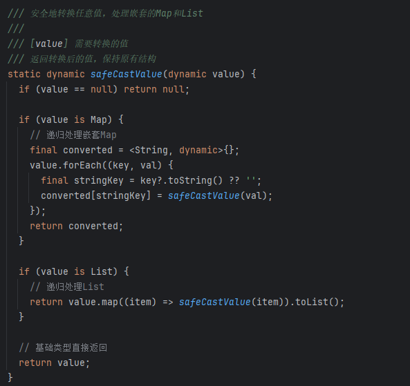
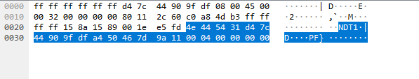
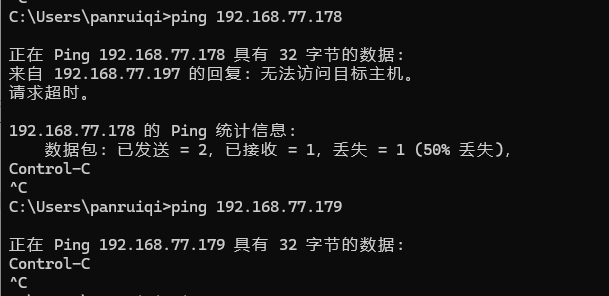
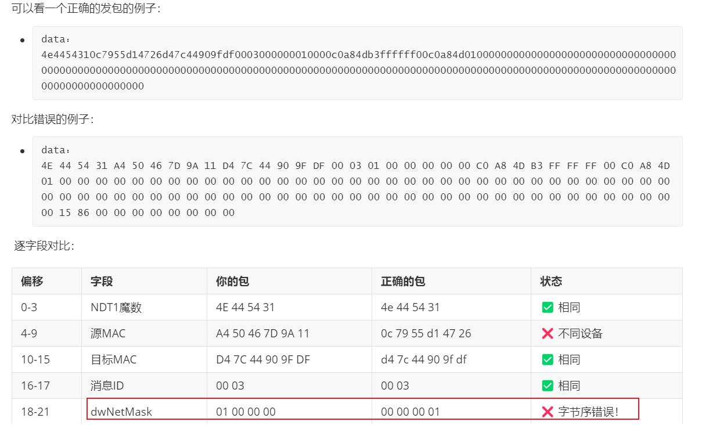

## 📅 Android 开发工作周报

**汇报人：** [潘锐琦]  

---

## 🗓 日报记录

1. **今日工作要点：**  
   - 【概述】一句话说今天主要做了什么  
2. **难点 & 解决：**  
   - 【难点】简述遇到的最大挑战  
   - 【方案】如何定位、思路与结果  
3. **收获 & 思考：**  
   - 【收获】新知识、工具或有趣发现  
   - 【思考】对后续工作的启发

---

## 🗓 日报记录（周一）

1. **今日工作要点：**  
   - 【概述】
2. **难点 & 解决：**  
   - 【难点】
     - 
   - 【方案】如何定位、思路与结果  
     - 
3. **收获 & 思考：**  
   - 【收获】
   - 【思考】
     - 

## 🗓 日报记录（周二）

1. **今日工作要点：**  
   - 【概述】
     1. Flutter MethodChannel返回数据的类型转换有问题，我们要解决_Map<Object?, Object?> 到 Map<String, dynamic> 的转换问题
     2. 清除切换无线网络方法，现在无线网络通过引导用户手动切换
     3. 增加设备项点击事件，显示对应的Dialog，可以接收用户名和密码。
     4. 优化点击事件对应的Dialog的样式，改为showModalBottomSheet样式
     5. 弹窗崩溃，Container 不能同时设置 color 和 decoration 属性，同时修复底部弹窗的键盘适配逻辑，解决了 "Bottom overflowed by 72 pixels" 的问题
     6. 创建device_auth_service用于设备摘要算法实现，并在项目中使用摘要算法进行设备认证
     7. 加日志，尝试解决设备认证失败: UNAUTHORIZED, 错误码: 401的问题
2. **难点 & 解决：**  
   - 【难点】
     - _Map<Object?, Object?> 到 Map<String, dynamic> 的转换问题
   - 【方案】如何定位、思路与结果  
     1. _Map<Object?, Object?> 到 Map<String, dynamic> 的转换问题
        - 我们不希望在Android原生中到处处理我们的_Map<Object?, Object?> 问题
        - 对result这个map中的所有key，将其toString
        - 
        - 对于其所有value，嵌套处理，如果是map，那么继续将key去toString，只有基础类型才直接返回
        - 
        - 本质就是嵌套处理map
     2. 创建device_auth_service用于设备摘要算法实现，并在项目中使用摘要算法进行设备认证
        - 首先获取认证挑战，向设备发送未带 `Authorization` 的请求（PUT）。设备返回 `401 Unauthorized`，并在 `WWW-Authenticate` 头中提供摘要认证参数（`realm`、`nonce`、`qop`、`algorithm` 等）。
        - 其次计算摘要并认证，客户端解析 `WWW-Authenticate` 头，提取必要参数。生成 `cnonce`（客户端随机数）、`nc`（nonce计数）。按 Digest 规范计算：
          - **HA1 = MD5(username:realm:password)**
          - **HA2 = MD5(method:uri)**
          - **response = MD5(HA1:nonce:nc:cnonce:qop:HA2)**
        - 构造 `Authorization: Digest ...` 头，带上所有参数。再次发送 PUT 请求，携带该认证头。
        - **设备返回认证结果**
          - 若认证通过，返回 `200000` 表示成功。
          - 否则返回具体错误码（如 `401`、自定义错误码等）
        - 存在以下难点：
          - Digest 算法细节复杂，任一参数计算错误（如 `realm` 缺失、URI 不一致、MD5 拼接格式不正确）都会导致 `401 Unauthorized`。
          - HTTP 报文控制要求高，必须精确控制 Header、请求方法（PUT/GET）、URI 等。不能依赖高层封装（如 OkHttp 自动处理的 Digest 认证），因为设备可能要求特定格式。
          - 错误排查难度大，设备返回 `401` 时，常常没有详细错误提示，需要抓包对比。
3. **收获 & 思考：**  
   - 【收获】
   - 【思考】

## 🗓 日报记录（周三）

1. **今日工作要点：**  

   - 【概述】
     1. 修改设备详情页样式，可以合理的显示设备详情，两个问题，第一个，body和头部间距过大。第二个body内部的item中的元素间距过大
     2. 条目点击事件，跳转到DHCP页
     3. DHCP页可以显示出来，显示具体的内容
     4. 处理DHCP页中DHCP的点击状态变化
     5. 通过点击事件进行数据的设置
     6. 解决这个过程中遇到的问题
        - 没有成功，该怎么排查？找包，正常ipaddr找不到，mac也不行
          - 发送解决了，是ip地址使用的问题，
        - 可是发送成功了，设备也给响应了，但是没有修改成功？
          - 
          - 对应的事NDT1 + 自身的mac：d47c44909fdf+ 对方的mac: a450467d9a11 + msgId 0004 + 错误码：00 00 00 00
          - 
          - 
          - 但是ping不通，两个IP都ping不同，说明他应该尝试进行了IP修改，但是因为某种原因修改失败了
          - 
        - 无法处理，实在找不到原因，嗯，转换思路，和华晓风沟通，了解到公司内部有ip修改的工具，ok，找这个去处理
          - 很多时候是字节序的问题
          - 
     7. 数据处理后，上一个页面中数据的设置工作，就是状态的同步。

2. **难点 & 解决：**  

   - 【难点】
     - 
   - 【方案】如何定位、思路与结果  
     - 

3. **收获 & 思考：**  

   - 【收获】

     - 现在和产品经理沟通，好像很多东西可以去掉，但是我已经做了，我很困惑。我感觉很多时候需要把握住产品经理的核心诉求，因为他们肯定希望功能更多一些。所以他们会疯狂的加，但是你不应该考虑这么多，你应该专注按照jira上的需求说明来实现
     - 我

   - 【思考】

     - flutter好像也能直接调用安卓手机的一些能力，比如：发送http等等，那么他也能调用其发送IP广播和组播，对吗？不对，这个需要系统级别的服务。好，flutter什么时候需要通过channel调用Android？

       - Flutter 层（Dart） 可以直接做 HTTP/HTTPS 网络请求（比如用 http 包），因为这些是标准的 TCP/UDP 网络能力，Dart VM 支持。

       - 但像“发送IP广播、组播”这种更底层的网络操作，Dart/Flutter 标准库本身不直接支持，因为这涉及到底层 socket 的特殊用法，甚至需要特定的权限和系统 API。

       - 这些操作通常需要用到 Android 的原生 API（比如 Java/Kotlin 的 DatagramSocket、MulticastSocket），Flutter 不能直接做，需要通过 Platform Channel 调用原生代码。

     - 现在和产品经理沟通，好像很多东西可以去掉，但是我已经做了，我很困惑。我感觉很多时候需要把握住产品经理的核心诉求，因为他们肯定希望功能更多一些。所以他们会疯狂的加，但是你不应该考虑这么多，你应该专注按照jira上的需求说明来实现

     - 我本身的沟通也是有问题的，我习惯性先自己处理，实在找不到才问别人，因为我会觉得，别人已经用这个处理过了，那肯定就没问题的，但是实际上处理方式是不同的。所以，很多时候，需要多向别人寻求帮助。

## 🗓 日报记录（周四）

1. **今日工作要点：**  
   - 【概述】
     - fix_bug：Bad State：Cannot add new  events after calling close，我进行搜索设备的时候遇到这个问题，感觉是状态恢复没做好，初步判断是在 IpcSearchService 的 dispose() 方法中，它调用了 _deviceStreamController.close()，这会关闭流控制器。但是当再次搜索设备时，代码仍然尝试向已关闭的流中添加事件，这就导致了 "Bad State: Cannot add new events after calling close" 错误。
     - 引导页_设备页代码的编写
     - 引导页_wifi页代码的编写
     - 处理引导页_wifi页的点击事件，需要接入Channel
     - 解决点击进行系统设置页后，回到flutter中没有正确检测wifi状态
     - 解决页面生命周期没有被正确的调用，核心是flutter的生命周期管理
     - 引导页_引导成功页代码的编写
     - 添加DHCP开启检测功能
     - 性能优化
     - 日志优化
     - 样式优化调整
     - 学习Android的存储
2. **难点 & 解决：**  
   - 【难点】
     - 
   - 【方案】如何定位、思路与结果  
     - 
3. **收获 & 思考：**  
   - 【收获】
   - 【思考】

## 🗓 日报记录（周五）

1. **今日工作要点：**  
   - 【概述】
     - 同步异步状态处理和解决
     - Flutter生命周期没有正确处理
     - onPageShow也不行，
2. **难点 & 解决：**  
   - 【难点】
     - onPageShow也不行
       - 定位是没有使用内部的路由框架
   - 【方案】如何定位、思路与结果  
     - 
3. **收获 & 思考：**  
   - 【收获】
   - 【思考】

## 🗓 日报记录（周六）

1. **今日工作要点：**  
   - 【概述】
2. **难点 & 解决：**  
   - 【难点】
     - 
   - 【方案】如何定位、思路与结果  
     - 
3. **收获 & 思考：**  
   - 【收获】
   - 【思考】

## 🗓 日报记录（周日）

1. **今日工作要点：**  
   - 【概述】
2. **难点 & 解决：**  
   - 【难点】
     - 
   - 【方案】如何定位、思路与结果  
     - 
3. **收获 & 思考：**  
   - 【收获】
   - 【思考】

---

## 🔍 每周总结（每周固定时间填写）

1. **本周完成：**  
   - 列出 3–5 条本周关键产出或里程碑  
2. **核心经验：**  
   - 提炼最重要的技术/协作/流程收获  
3. **待改进 & 下周计划：**  
   - 本周有哪些不足  
   - 下周重点目标 & 需要的支持

---