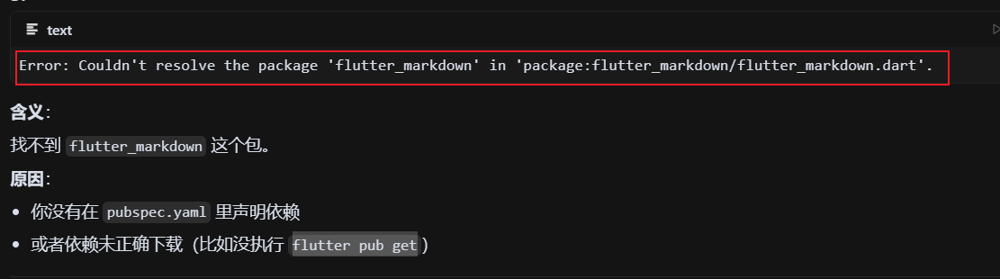
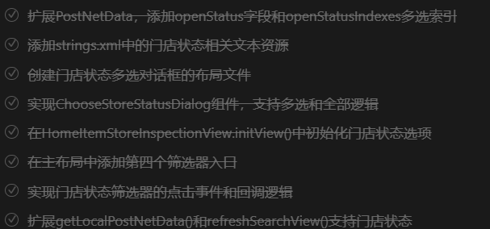
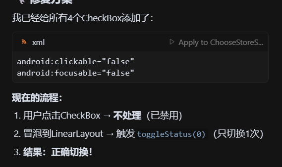
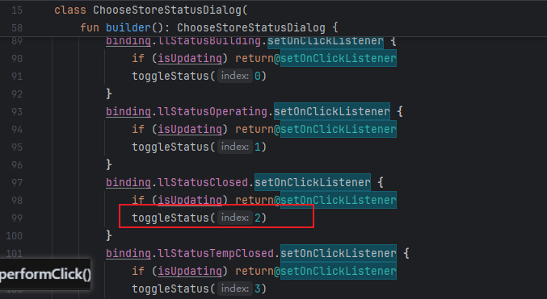
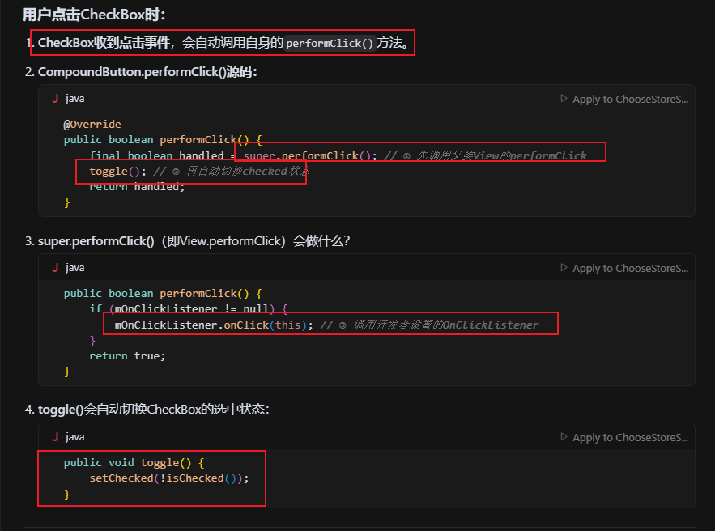

## 📅 Android 开发工作周报

**汇报人：** [潘锐琦]  

---

## 🗓 日报记录

1. **今日工作要点：**  
   - 【概述】一句话说今天主要做了什么  
2. **难点 & 解决：**  
   - 【难点】简述遇到的最大挑战  
   - 【方案】如何定位、思路与结果  
3. **收获 & 思考：**  
   - 【收获】新知识、工具或有趣发现  
   - 【思考】对后续工作的启发

---

## 🗓 日报记录（周一）

1. **今日工作要点：**  
   - 【概述】
     - 上周工作梳理，今日工作规划。

     - 首屏看板-中巡店概览增加筛选功能——预热，看看相关情况，找测试拿IOS手机看看情况。

     - 解决编译问题，保证代码编写前工作区clean。存在问题：

       - 

       - ```
         # 进入子模块目录操作生成.android等文件否则项目报错，setting依赖.android内部的groovy. 
         cd .\@fluttermode\FlutterBoostExample\flutter_module
         # 拉取三方库、生成.android等文件
         flutter pub get
         ```
       
     - 巡店概览相关逻辑学习

       - 优化内部网络请求模块

     - 首屏看板-中巡店概览增加筛选功能开发，步骤如下：

       - 
       - 
       
     - fix-bug：checkbox:点击3个选项，但是实际只选择了1个。偶尔可以成功
2. **难点 & 解决：**  
   
   - 【难点】
     
     - checkbox:点击3个选项，但是实际只选择了1个。偶尔可以成功
   - 【方案】如何定位、思路与结果  
     
     - 判断是双重触发的问题
     
       - 用户点击CheckBox → CheckBox自动toggle（第1次切换）
       - 冒泡到LinearLayout → 触发toggleStatus(0)（第2次切换）
       - 结果：被切了两次 = 回到原状态！
     
     - 处理
     
       - 
     
     - 原因：
     
       - CompoundButton.performClick() 会先调用 super.performClick()，再 toggle()
       - 开发者的 OnClickListener 在 super.performClick() 时被触发，我在里面toggle了
       - 这回和后面的toggle重叠，会导致状态切换两次，出现“看起来没反应”的问题
       - 
       - 
     
     - 解决方案
     
       - 要在OnClickListener里手动切换checked，让系统自动toggle。
     
       - 如果用父布局监听，禁用CheckBox自身点击（android:clickable=\"false\"），只让父布局处理。
3. **收获 & 思考：**  
   - 【收获】
   - 【思考】

## 🗓 日报记录（周二）

1. **今日工作要点：**  
   - 【概述】
     - 了解IJkPlayer，fanPalyer。为什么不满足于项目中的IJkPlayer呢？
     - 重构feat文件，标准化需求开发的思维过程和方法论。
     - 使用重构后的feat文件处理之前的巡店概览增加筛选功能。
     - 添加H5跳转功能
     - 正确处理状态变化
     - 提测和代码规范性检测
     - Pos机遗漏需求处理
     - ARouter学习
     - jira剩余需求查看和评估
2. **难点 & 解决：**  
   - 【难点】
     - 
   - 【方案】如何定位、思路与结果  
     - 
3. **收获 & 思考：**  
   - 【收获】
   - 【思考】

## 🗓 日报记录（周三）

1. **今日工作要点：**  
   - 【概述】
     - 切换环境，进行新的开发，总结出带子仓库的模块的开发的过程。
     - 自研播放器启动会议
     - 评估任务耗时：创建巡店新增数据时，先确认门店对应巡店服务是否在有效期内。预计实际耗时2h。
     - 回顾之前写的03. 巡店_现场巡店门店选择逻辑.md逻辑
     - 学习新的03. 巡店_现场巡店任务创建逻辑.md
     - feat(wdz_138321): 添加EXCEEDED_VALIDITY和91035对应提示，设置给tips panruiqi Today 15:44
     - 清理工作区，解决冲突并提交feat(wdz_138321) 和  feat(wdz_136495)
     - 新开feat_wdz136982
     - 学习计划巡店中筛选按钮的逻辑
2. **难点 & 解决：**  
   - 【难点】
     - 
   - 【方案】如何定位、思路与结果  
     - 
3. **收获 & 思考：**  
   - 【收获】
   - 【思考】

## 🗓 日报记录（周四）

1. **今日工作要点：**  
   - 【概述】
     - 代码
2. **难点 & 解决：**  
   - 【难点】
     - 
   - 【方案】如何定位、思路与结果  
     - 
3. **收获 & 思考：**  
   - 【收获】
   - 【思考】

## 🗓 日报记录（周五）

1. **今日工作要点：**  
   - 【概述】
     - jira流转
     - [WDZ-140531](http://jira-inc.ovopark.com:8080/browse/WDZ-140531)【计划巡店】安卓，首页看板门店状态是全部时跳转至计划巡店任务概览，没有带门店状态处理，panruiqi fix(wdz_136495): 修改H5传参，"plan-check"要特殊处理，其他位置传空是兼容的会被正确判断为全部，但是这个H5页好像不兼容，因此需要我给出全部的0,1,2,3 Today 10:57
     - FFmpeg学习思路和规划
2. **难点 & 解决：**  
   - 【难点】
     - 
   - 【方案】如何定位、思路与结果  
     - 
3. **收获 & 思考：**  
   - 【收获】
   - 【思考】

## 🗓 日报记录（周六）

1. **今日工作要点：**  
   - 【概述】
2. **难点 & 解决：**  
   - 【难点】
     - 
   - 【方案】如何定位、思路与结果  
     - 
3. **收获 & 思考：**  
   - 【收获】
   - 【思考】

## 🗓 日报记录（周日）

1. **今日工作要点：**  
   - 【概述】
2. **难点 & 解决：**  
   - 【难点】
     - 
   - 【方案】如何定位、思路与结果  
     - 
3. **收获 & 思考：**  
   - 【收获】
   - 【思考】

---

## 🔍 每周总结（每周固定时间填写）

1. **本周完成：**  
   - 列出 3–5 条本周关键产出或里程碑  
2. **核心经验：**  
   - 提炼最重要的技术/协作/流程收获  
3. **待改进 & 下周计划：**  
   - 本周有哪些不足  
   - 下周重点目标 & 需要的支持

---

```
/**
     * 获取组织排名数据 - suspend版本
     */
    private suspend fun getOrganizeRankingSuspend(): StoreInspectionInfo1 = withContext(Dispatchers.IO) {
        suspendCoroutine { continuation ->
                HomePageApi.getInstance().getOrganizeRanking(
                    HomePageParamsSet.getOrganizeRanking(
                        postNetData.depNodes,
                        postNetData.customStartDate,
                        postNetData.customEndDate,
                        postNetData.storeInspectionWay,
                        if (postNetData.tempIndex >= 0)
                            (listStoreInspectionTemp[postNetData.tempIndex].id ?: -200)
                        else -200,
                        0,
                        postNetData.openStatus
                    ),
                    object : OnResponseCallback<StoreInspectionInfo1>() {
                        override fun onSuccess(data: StoreInspectionInfo1?) {
                            super.onSuccess(data)
                        val result = data ?: StoreInspectionInfo1()
                        if (result.content.isNullOrEmpty()) {
                            result.content = mutableListOf()
                            result.content!!.add(Content())
                        }
                        continuation.resume(result)
                        }

                        override fun onSuccessError(resultCode: String?, errorMessage: String?) {
                            super.onSuccessError(resultCode, errorMessage)
                        val result = StoreInspectionInfo1().apply { 
                            content = mutableListOf()
                            content!!.add(Content()) 
                        }
                        continuation.resume(result)
                        }

                        override fun onFailure(errorCode: Int, msg: String?) {
                            super.onFailure(errorCode, msg)
                        val result = StoreInspectionInfo1().apply { 
                            content = mutableListOf()
                            content!!.add(Content()) 
                        }
                        continuation.resume(result)
                    }
                }
            )
        }
    }
```

