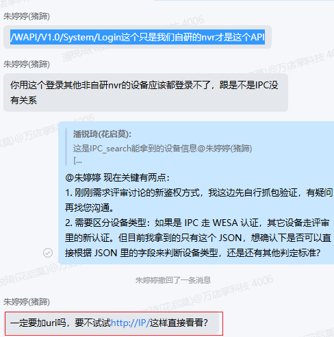
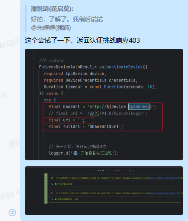
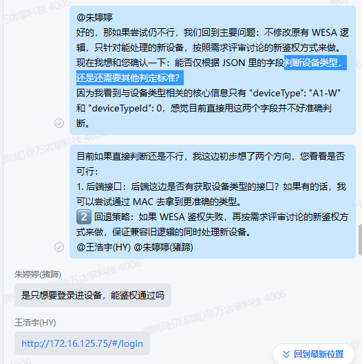
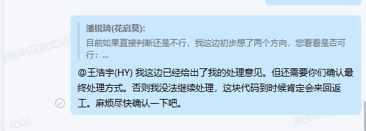

## 📅 Android 开发工作周报

**汇报人：** [潘锐琦]  

---

## 🗓 日报记录

1. **今日工作要点：**  
   - 【概述】一句话说今天主要做了什么  
2. **难点 & 解决：**  
   - 【难点】简述遇到的最大挑战  
   - 【方案】如何定位、思路与结果  
3. **收获 & 思考：**  
   - 【收获】新知识、工具或有趣发现  
   - 【思考】对后续工作的启发

---

## 🗓 日报记录（周一）

1. **今日工作要点：**  
   - 【概述】
     - 复习音视频基础和音视频解码框架封装
     - jira流转，处理，工时填报
2. **难点 & 解决：**  
   - 【难点】
     - 
   - 【方案】如何定位、思路与结果  
     - 
3. **收获 & 思考：**  
   - 【收获】
   - 【思考】

## 🗓 日报记录（周二）

1. **今日工作要点：**  

   - 【概述】

     - panruiqi feat(wdz_141099): 交互逻辑优化，全选状态点击按钮时先清空选择状态，再进行选择。 12 minutes ago

     - 复习音视频基础知识

     - 需求评审会

     - 验证/WAPI/V1.0/System/Login这个只是我们自研的nvr才是这个API

       - 
       - 结果，不行
       - 

     - 沟通设备类型判断后鉴权逻辑

       - 

         

     - 【功能可行性调研】【自研设备】「移动端 IPC search」设备搜索-新增通过onvif协议搜索设备

     - 复习音视频封装基础解码框架

2. **难点 & 解决：**  

   - 【难点】
     - 
   - 【方案】如何定位、思路与结果  
     - 

3. **收获 & 思考：**  

   - 【收获】
   - 【思考】

## 🗓 日报记录（周三）

1. **今日工作要点：**  
   - 【概述】
2. **难点 & 解决：**  
   - 【难点】
     - 
   - 【方案】如何定位、思路与结果  
     - 
3. **收获 & 思考：**  
   - 【收获】
   - 【思考】

## 🗓 日报记录（周四）

1. **今日工作要点：**  
   - 【概述】
2. **难点 & 解决：**  
   - 【难点】
     - 
   - 【方案】如何定位、思路与结果  
     - 
3. **收获 & 思考：**  
   - 【收获】
   - 【思考】

## 🗓 日报记录（周五）

1. **今日工作要点：**  
   - 【概述】
2. **难点 & 解决：**  
   - 【难点】
     - 
   - 【方案】如何定位、思路与结果  
     - 
3. **收获 & 思考：**  
   - 【收获】
   - 【思考】

## 🗓 日报记录（周六）

1. **今日工作要点：**  
   - 【概述】
2. **难点 & 解决：**  
   - 【难点】
     - 
   - 【方案】如何定位、思路与结果  
     - 
3. **收获 & 思考：**  
   - 【收获】
   - 【思考】

## 🗓 日报记录（周日）

1. **今日工作要点：**  
   - 【概述】
2. **难点 & 解决：**  
   - 【难点】
     - 
   - 【方案】如何定位、思路与结果  
     - 
3. **收获 & 思考：**  
   - 【收获】
   - 【思考】

---

## 🔍 每周总结（每周固定时间填写）

1. **本周完成：**  
   - 列出 3–5 条本周关键产出或里程碑  
2. **核心经验：**  
   - 提炼最重要的技术/协作/流程收获  
3. **待改进 & 下周计划：**  
   - 本周有哪些不足  
   - 下周重点目标 & 需要的支持

---