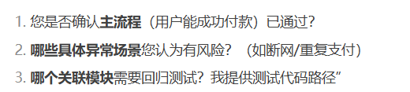
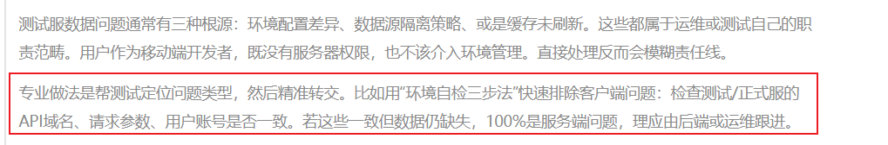
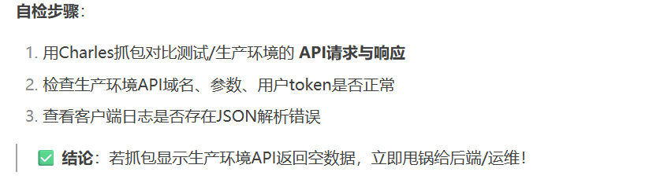

[toc]

## 前言

> 学习要符合如下的标准化链条：了解概念->探究原理->深入思考->总结提炼->底层实现->延伸应用"

## 01.学习概述

- **学习主题**：
- **知识类型**：
  - [ ] **知识类型**：
    - [ ] ✅Android/ 
      - [ ] ✅01.基础组件
      - [ ] ✅02.IPC机制
      - [ ] ✅03.消息机制
      - [ ] ✅04.View原理
      - [ ] ✅05.事件分发机制
      - [ ] ✅06.Window
      - [ ] ✅07.复杂控件
      - [ ] ✅08.性能优化
      - [ ] ✅09.流行框架
      - [ ] ✅10.数据处理
      - [ ] ✅11.动画
      - [ ] ✅12.Groovy
    - [ ] ✅音视频开发/
      - [ ] ✅01.基础知识
      - [ ] ✅02.OpenGL渲染视频
      - [ ] ✅03.FFmpeg音视频解码
    - [ ] ✅ Java/
      - [ ] ✅01.基础知识
      - [ ] ✅02.Java设计思想
      - [ ] ✅03.集合框架
      - [ ] ✅04.异常处理
      - [ ] ✅05.多线程与并发编程
      - [ ] ✅06.JVM
    - [ ] ✅ Kotlin/
      - [ ] ✅01.基础语法
      - [ ] ✅02.高阶扩展
      - [ ] ✅03.协程和流
    - [ ] ✅ 故障分析与处理/
      - [ ] ✅01.基础知识
- **学习来源**：
- **重要程度**：⭐⭐⭐⭐⭐
- **学习日期**：2025.
- **记录人**：@panruiqi

### 1.1 学习目标

- 了解概念->探究原理->深入思考->总结提炼->底层实现->延伸应用"

### 1.2 前置知识

- [ ] 

## 02.核心概念

### 2.1 是什么？

### 2.2 解决什么问题？

### 2.3 基本特性

## 03.原理机制

### 3.1 有新活派发到头上，但是不是直属leader派发的，我该如何处理？

你的工作优先级和任务分配，最终应该由你的**直属Leader**决定或知情同意

- 礼貌回应，表达兴趣，但不要立刻承诺：
  - 当非直属Leader（比如其他团队Leader、产品经理、项目经理、更高级别的老板等）向你派发任务时，先表示感谢和收到。
  - **示例（当面/IM）：** `“好的，[对方称呼，如张经理/李哥]，收到这个需求/任务了，听起来挺重要的/挺有意思的。不过我需要先跟我Leader同步下我当前的工作安排和优先级，确认下排期和可行性，稍后给您一个明确的答复，您看可以吗？”`
- 立刻向直属领导同步：
  - **第一时间**（比如收到请求后的几分钟内，或会议结束后）向你的直属Leader汇报此事。
  - **清晰传达：**
    - **谁** 派发了任务（哪个部门/哪位同事/哪位领导）
    - **是什么** 任务（简要说明任务内容、背景、预期目标/交付物）
    - **对方期望的完成时间**（如果有）
    - **你当前的工作负荷**（正在做什么，优先级如何）
    - **你的初步判断**（这个任务大概需要多少工作量？是否紧急？是否与当前团队目标一致？）
  - **核心询问：**
    - `“Leader，刚才 [对方称呼/部门] 的 [名字] 给我派了个活，是关于 [简述任务]。他/她希望 [时间点] 完成。我现在手头正在做 [你的当前任务A] 和 [任务B]，优先级是 [说明]。您看这个新任务怎么安排比较合适？是插进来优先做，还是排到后面，或者需要跟对方沟通调整？”`
  - **目的：**
    - 让Leader掌握所有信息。
    - 让Leader决定优先级和资源分配。
    - 避免你陷入两难境地。
- **根据直属Leader的指示行动：**
  - **情况一：Leader同意你接，并明确了优先级：**
    - 向非直属Leader确认接受任务，并沟通好期望的时间点（如果需要调整，此时沟通）。
    - **示例：** `“[对方称呼]，跟我Leader同步过了，这个任务我可以接下来。预计 [给出你的合理排期，比如‘下周三前完成初稿’ 或 ‘需要X个工作日’]。我会把它加入到我的任务列表里，按优先级推进。过程中有进展或问题会及时跟您同步。”`
    - **行动：** 将任务正式记录（如创建Jira ticket，关联到你），按Leader指示的优先级处理。
  - **情况二：Leader认为优先级不高/需要暂缓/需要协调资源：**
    - Leader可能会让你：
      - 告知对方需要排队，等手头高优任务完成后开始（并给出大致时间）。
      - 让Leader直接去和对方沟通优先级或资源问题。
      - 婉拒（如果任务确实不符合团队当前目标或严重超负荷）。
    - **行动：** 严格按照Leader的指示去回复对方。
    - **示例（需要排队）：** `“[对方称呼]，跟我Leader确认过了。这个任务我们理解它的重要性。不过目前我手头有 [简述高优任务，如‘本周必须上线的XX功能修复’] 在赶工，优先级非常高。预计要到 [时间点，如下周一] 后才能开始处理您这个需求。您看这个时间可以接受吗？或者是否需要我Leader和您沟通下优先级？”`
    - **示例（Leader介入协调）：** `“[对方称呼]，我跟Leader汇报了您这个需求。他/她可能需要和您/您Leader沟通下整体优先级和资源安排，稍后会给您答复/会联系您。”`
    - **关键点：** **不要自己当传话筒去争论优先级！** 把需要协调的问题上升到Leader层面解决。回复时保持礼貌、客观，说明是团队资源/优先级安排的原因。
  - **情况三：Leader认为任务不合理/不该你做：**
    - 由Leader出面去沟通解决，你按Leader要求回复即可。

### 3.2 leader说：jira上面的任务做完了，状态流转下，此时我需要向他详细解释我的需求还有哪些吗？

不用，很简单，先进行流转操作，然后告知流转了哪些，等leader问起来在沟通

- **立即执行流转：**
  - 仔细检查任务：确认代码是否提交、合并请求是否完成、文档是否更新、自测是否通过等。确保流转状态前，你的工作确实达到了“完成”的标准。
  - **准确流转状态：** 按照团队定义的Jira工作流，将任务流转到正确的下一个状态（通常是“待测试”、“待验收”、“已完成”等）。这一步至关重要，它触发了后续流程（如测试介入）。
- **流转后，通知leader：**
  -  让Leader和其他成员知道这个任务在你这里已经完成，进入下一环节。

### 3.3 我今天的这种学习困境该如何处理？ 花大量时间在工作，知道该学什么，却没有去学。很多工作是一些优化性质的。是出于。对自我的高要求，而非实际的完成任务。

### 3.4 测试人员只肯确认单个功能点通过，不愿承诺整体验收通过，尽管实际已经反复测试过。

- 避免陷入“逼签”误区。测试的谨慎是开发者的**最后一道防线**，用专业工具和流程消除他的顾虑，比施压更有效。当你开始主动帮他降低风险，他就会成为你最坚定的质量盟友。
- 分级验收
  - 

### 3.5 测试还让我处理一个不该我管的问题，就是：测试服有数据，正式服某个位置无数据，这种我应该主动处理吗？不应该，因为我没有时间，我该怎么应对和解决呢？

- 定位问题，然后甩出去
  
  - 
- 

- **二、黄金拒绝话术模板（附场景案例）**

  **场景1：测试直接口头/IM要求你处理**

  - **错误回应**：
    “这不该我管，你找后端去！” ❌（破坏协作关系）

  - **专业话术**：

    > “刚抓包确认了：
    > **测试环境**API响应：`{data: [···]}`
    > **生产环境**API响应：`{data: null}`
    > 客户端代码**完全一致**，问题出在服务端数据返回。
    > 建议直接提单给**后端负责人@王工**，需要我协助提供抓包证据吗？” ✅

  **场景2：测试在Jira上把Bug指派给你**

  - **操作流程**：

    1. **附上关键证据**（抓包对比图+环境对比日志）

    2. **重新指派**给后端负责人

    3. **评论@测试和后端**：

       > “经查证：
       >
       > - 客户端版本号一致（v1.2.3）
       > - 生产环境API `GET /api/v1/data` 返回空数组
       > - 相同请求在测试环境返回有效数据
       >   判定为**服务端数据问题**，已转交@后端王工处理。
       >   建议运维检查数据库连接或数据同步状态。”

### 3.6 遇到需求讲不明白的产品经理

我刚来，对公司的业务逻辑并不清楚，现在某个产品经理有一个需求，我之前和这个产品经理合作过，他说话很抽象，全靠自己理解，回复也很冷淡，我不知道哪得罪了她。我上次合作的时候发现自己搞不懂需求，就硬抓着她，让他给我讲明白才去处理的，我是这样说的：你可能要把需求讲清楚些，我现在不理解，没法做你的。请问这次我可以怎么更好的处理呢？

- 沟通前的准备

  - **拆解已有信息：** 即使产品经理的话很抽象，也一定有碎片信息。写下你理解的：功能模块、用户操作流程、涉及哪些界面/接口？哪里是你觉得模糊的点？
  - **列出具体问题清单：** 不要笼统地说“不理解”。把模糊点拆解成具体、封闭式问题（能用是/否或简单答案回答的）：

- **沟通时的策略（展现专业性和主动性）**

  - **开场白 - 表达积极态度 + 展现努力：**

    > “Hi [产品经理名字]，关于【需求名称/功能点】的需求，我仔细看了文档/听了之前的说明，已经着手开始梳理实现思路了。为了确保开发方向准确，有**几个具体细节**想跟您快速确认下，大概占用您5-10分钟可以吗？您看是现在方便还是稍后某个时间？” (表现出你**已经行动了**，不是空等答案)

  - **结构化沟通 - 使用你的“准备成果”：**

    - **展示你的理解：** “我初步理解这个流程大概是：用户先做A，然后选择B，最后触发C操作。我画了个简易流程图/写了关键步骤，您看**这个主干理解对吗**？” (让她只需纠正主干错误，而不是从零给你讲)
    - **聚焦具体疑问点：** “在【你画的流程图/列出的步骤】的第X步，关于【具体模糊点】，我有几个选项不太确定：
      - 选项1: [你的理解A]
      - 选项2: [你的理解B]
      - 或者还有其他可能？**您觉得哪个更符合预期？**” (给她选择题，而不是问答题)

  - **提问技巧：**

    - **用“是不是”、“能不能”、“哪一个”代替开放式问题。**
    - **追问“为什么”：** 如果她给出一个模糊的答案，试着问：“好的，明白了【重复她的关键点】。为了确保实现逻辑准确，**这个设计主要是为了解决用户哪个痛点/满足什么业务目标呢？**” (理解背景有时能帮你推理细节)
    - **确认边界：** “您提到的‘可能涉及历史数据’，是指需要展示**最近3个月**的数据，还是**全部**历史数据？” “如果遇到【某种边界情况】，预期如何处理？（如：网络失败、数据为空）”

- 沟通后的确认

  - **即时总结：** 会议结束前或文字沟通最后，快速总结：

    > “好的，那我总结一下确认的点：1. 【要点1】 2. 【要点2】 3. 【要点3】。特别是关于【之前最模糊的点】，确认按【选项X/方案Y】处理。这样理解没错吧？”

### 3.7 下次请假如何处理？

应该直接和leader说吗？不是个好的思路。那应该怎么处理呢？

- 在二部群里：活都处理好了，说明白自己手上的任务，等等都处理好了，然后生病对明天的影响，为了什么什么，所以今天才请假。

## 04.底层原理

## 05.深度思考

### 5.1 关键问题探究

### 5.2 设计对比

## 06.实践验证

### 6.1 行为验证代码

### 6.2 性能测试

## 07.应用场景

### 7.1 最佳实践

### 7.2 使用禁忌

## 08.总结提炼

### 8.1 核心收获

### 8.2 知识图谱

### 8.3 延伸思考

## 09.参考资料

1. 
2. 
3. 

## 其他介绍

### 01.关于我的博客

- csdn：http://my.csdn.net/qq_35829566

- 掘金：https://juejin.im/user/499639464759898

- github：https://github.com/jjjjjjava

- 邮箱：[934137388@qq.com]

