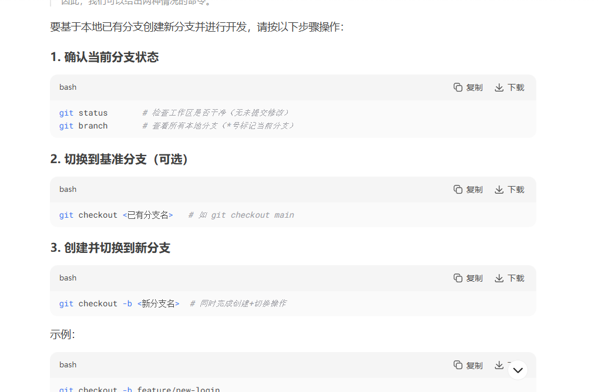
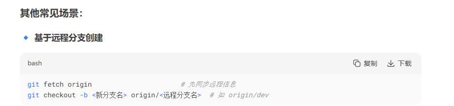
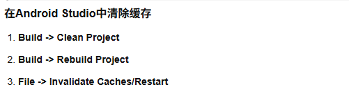
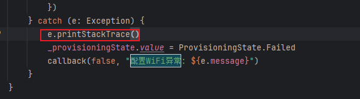

[toc]

## 前言

> 学习要符合如下的标准化链条：了解概念->探究原理->深入思考->总结提炼->底层实现->延伸应用"

## 01.学习概述

- **学习主题**：
- **知识类型**：
  - [ ] **知识类型**：
    - [ ] ✅Android/ 
      - [ ] ✅01.基础组件
      - [ ] ✅02.IPC机制
      - [ ] ✅03.消息机制
      - [ ] ✅04.View原理
      - [ ] ✅05.事件分发机制
      - [ ] ✅06.Window
      - [ ] ✅07.复杂控件
      - [ ] ✅08.性能优化
      - [ ] ✅09.流行框架
      - [ ] ✅10.数据处理
      - [ ] ✅11.动画
      - [ ] ✅12.Groovy
    - [ ] ✅音视频开发/
      - [ ] ✅01.基础知识
      - [ ] ✅02.OpenGL渲染视频
      - [ ] ✅03.FFmpeg音视频解码
    - [ ] ✅ Java/
      - [ ] ✅01.基础知识
      - [ ] ✅02.Java设计思想
      - [ ] ✅03.集合框架
      - [ ] ✅04.异常处理
      - [ ] ✅05.多线程与并发编程
      - [ ] ✅06.JVM
    - [ ] ✅ Kotlin/
      - [ ] ✅01.基础语法
      - [ ] ✅02.高阶扩展
      - [ ] ✅03.协程和流
    - [ ] ✅ 故障分析与处理/
      - [ ] ✅01.基础知识
- **学习来源**：
- **重要程度**：⭐⭐⭐⭐⭐
- **学习日期**：2025.
- **记录人**：@panruiqi

### 1.1 学习目标

- 了解概念->探究原理->深入思考->总结提炼->底层实现->延伸应用"

### 1.2 前置知识

- [ ] 

## 02.核心概念

### 2.1 是什么？


### 2.2 解决什么问题？


### 2.3 基本特性


## 03.原理机制

### 3.1 git开发流程是什么样的？

- 要基于本地已有分支创建新分支并进行开发，请按以下步骤操作：
  - 
- 基于远程分支
  - 

- 提交呢
  - git pull origin modulize  
  -  git push origin FEAT_WDZ_129598-128285-128279-panruiqi:modulize 

### 3.2 新开发模块依赖冲突该如何处理？

- 用如下命令查看依赖树，定位是否有重复依赖：
  - ```
    ./gradlew :lib_graffiti:dependencies > deps.txt
    ```

  - 然后在 deps.txt 里搜索 code-scanner、protobuf、zxing 等，看看是不是有多个版本或 groupId。

- 强制排除冲突依赖

  - ```
    implementation('com.budiyev.android:code-scanner:2.1.0') {
        exclude group: 'com.github.yuriy-budiyev', module: 'code-scanner'
    }
    ```

- 检查依赖树

  - 用如下命令定位是哪个库引入了 com.github.yuriy-budiyev:code-scanner:2.1.0，然后在对应依赖上加 exclude。

  - ```
    ./gradlew :lib_graffiti:dependencies --configuration implementation
    ```

- 如需进一步定位是哪个库引入了 com.github.yuriy-budiyev:code-scanner，可以用如下命令：

  - ```
    ./gradlew :lib_graffiti:dependencies --configuration runtimeClasspath > runtime_deps.txt
    ```

  - 然后在 runtime_deps.txt 里搜索 code-scanner，就能看到是哪个库引入的。

- 清空gradlew缓存

  - 

### 3.3 空指针异常等如何处理？

- 

### 3.4 Android项目中开发分几个阶段，用于早会汇报

- 需求分析和评审
- 技术设计和架构设计
- 画UI
- 业务逻辑和数据层开发
  - 实现ViewModel/Presenter，包含核心业务逻辑。
  - 实现数据获取层（Repository模式）：网络请求（Retrofit）、数据库操作（Room）、本地文件操作等。
  - 实现数据模型（Model）。
  - 处理数据转换和映射。
  - 实现状态管理（加载中、成功、失败、空数据等）。
- **交互逻辑与组件通信：**
  - 实现UI组件（Activity/Fragment/Composable）与ViewModel的绑定和数据观察。
  - 处理用户交互事件（点击、滑动、输入等）。
  - 实现组件间导航（Navigation Component）和数据传递。
  - 实现必要的动画效果。
- 本地自测
- 提测 + bug修复
- 代码审查

### 3.5 早会该怎么处理

过往处理：谁的需求，我怎么处理的，我还有什么要处理

痛点：早会很难受，总是感觉格格不入。

反思：Leader（尤其记录的一部队长）和团队需要的不是“你如何做到的”，而是“事情现在处于什么位置”、“需要我记录/关注什么”

进一步理解：Leader（尤其记录者）需要根据状态信息决定：

- 这个任务是否可以“擦掉”（完成）？
- 需要把哪个**新问题/阻塞点**记上白板（今日待处理/风险）？
- 是否需要介入协调资源？

我要做的：**清晰、准确地传递状态**，证明您对工作有掌控力。因此后续的方式：

- **原始过程描述 (问题所在)：**

  > “测试家伟那边昨天给我建了两个新的任务，一个是连接上DMS，但是郁公子那边无法查到，我配合郭运起解决。另一个是：心跳在长时间断网后无法连接。然后他问我今天有哪个问题，就是他要记在黑板上，但是我说继续，因为这两个昨天解决了。 然后还存在风险：DMS我一直说处理好了，但是又频繁的出现...”

- **重构为“状态”汇报 (目标)：**

  - **昨天完成 (Done - 状态：已解决/关闭)：**

    > “**昨天：关闭家伟提的DMS连接问题和心跳断网重连问题。**” (简洁明了，传递“完成”状态)

  - **今日计划 (Doing - 状态：进行中/聚焦点)：**

    > “**今天：集中处理DMS间歇性断连的复现和分析。**” (清晰指出今日核心工作状态)

  - **风险/阻塞 (Blockers - 状态：有风险/被卡住 - 这是白板最需要的！)：**

    > “**风险/阻塞：DMS间歇性断连问题复发，可能影响XX功能，正在定位根因，如需郁公子协助查日志会及时同步。**” (直接点明**存在风险**这个状态，说明影响和您正在做什么，以及后续可能需要什么 - 让Leader决定是否现在记录或后续跟进

- **用“关闭/解决/完成”** 明确告知**任务终结**。**用“处理/分析/开发/测试”** 表明**正在进行中**。**用“阻塞/风险/需要协助”** 亮起**红灯**，这是Leader最需要记录和关注的点！

 

### 3.6 反思：如何在工作中学习

首先：去问，他位于一个Android工程师的哪些知识体系框架下？

- 知识体系框架定位： 这属于Android高级工程师的核心技能栈：

    - 构建系统专家级(Gradle构建优化、模块管理)
    - SDK开发与集成(第三方库定制、API设计)
    - 架构设计能力(模块解耦、依赖注入)
    - 兼容性工程(API Level适配、向下兼容)

然后问：我现在是Android的初学者，我可以从中吸收到什么？或者说您认为我在跟您沟通解决这个问题的过程中，应该关注的能够提升自己的是什么？

你能吸收到的核心能力：

- 系统性思维培养 ⭐⭐⭐⭐⭐
    - 学会分解复杂问题的方法论
    - 培养风险评估意识（技术可行性→工作量预估→决策）
    - 建立工程化思维（而非纯coding思维）
  - Android构建系统入门 ⭐⭐⭐⭐
      - 理解build.gradle的作用和配置方法
      - 学习模块依赖管理(implementation、api等)
      - 掌握版本冲突解决思路
  - 源码阅读能力 ⭐⭐⭐⭐
      - 快速理解他人代码架构的方法
      - 识别核心功能vs辅助功能的能力
      - 学会从API设计反推实现逻辑
  - 问题解决流程 ⭐⭐⭐⭐⭐
      - 遇到技术难题时的标准化分析流程
      - 学会渐进式验证（先编译通过→再功能验证）

在我们沟通过程中你应该重点关注：

- 关注实操技巧：
    - 我是如何快速定位问题的？
    - 我使用了哪些工具和命令来分析代码？
    - 遇到编译错误时的解决思路和顺序

-   关注思维模式：
    - 我是如何拆解复杂任务的？
    - 面对未知SDK时，我的分析顺序是什么？
    - 我如何平衡风险与收益做决策？

- 提升建议：
    - 主动问**"为什么这样做"而不只是"怎么做"**
    - 关注我解释的原理，而不只是步骤
    - 尝试预判下一步，锻炼技术直觉

  这个项目对你来说是一个很好的从初学者向中级进阶的练习机会。

## 04.底层原理


## 05.深度思考

### 5.1 关键问题探究


### 5.2 设计对比


## 06.实践验证

### 6.1 行为验证代码


### 6.2 性能测试


## 07.应用场景

### 7.1 最佳实践


### 7.2 使用禁忌


## 08.总结提炼

### 8.1 核心收获


### 8.2 知识图谱


### 8.3 延伸思考


## 09.参考资料

1. []()
2. []()
3. []()

## 其他介绍

### 01.关于我的博客

- csdn：http://my.csdn.net/qq_35829566

- 掘金：https://juejin.im/user/499639464759898

- github：https://github.com/jjjjjjava

- 邮箱：[934137388@qq.com]

