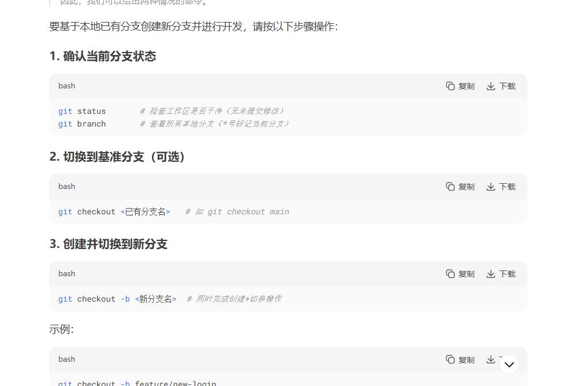
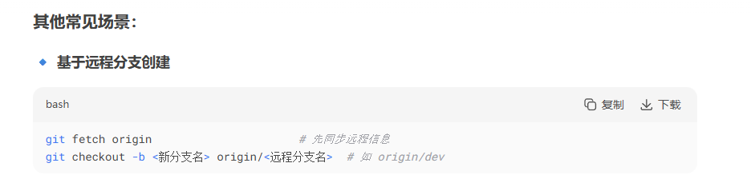
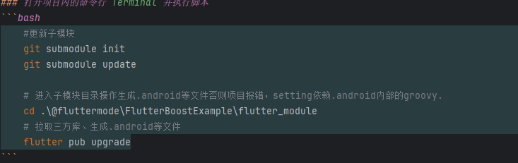
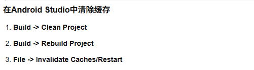

[toc]

## 前言

> 学习要符合如下的标准化链条：了解概念->探究原理->深入思考->总结提炼->底层实现->延伸应用"

## 01.学习概述

- **学习主题**：
- **知识类型**：
  - [ ] **知识类型**：
    - [ ] ✅Android/ 
      - [ ] ✅01.基础组件
      - [ ] ✅02.IPC机制
      - [ ] ✅03.消息机制
      - [ ] ✅04.View原理
      - [ ] ✅05.事件分发机制
      - [ ] ✅06.Window
      - [ ] ✅07.复杂控件
      - [ ] ✅08.性能优化
      - [ ] ✅09.流行框架
      - [ ] ✅10.数据处理
      - [ ] ✅11.动画
      - [ ] ✅12.Groovy
    - [ ] ✅音视频开发/
      - [ ] ✅01.基础知识
      - [ ] ✅02.OpenGL渲染视频
      - [ ] ✅03.FFmpeg音视频解码
    - [ ] ✅ Java/
      - [ ] ✅01.基础知识
      - [ ] ✅02.Java设计思想
      - [ ] ✅03.集合框架
      - [ ] ✅04.异常处理
      - [ ] ✅05.多线程与并发编程
      - [ ] ✅06.JVM
    - [ ] ✅ Kotlin/
      - [ ] ✅01.基础语法
      - [ ] ✅02.高阶扩展
      - [ ] ✅03.协程和流
    - [ ] ✅ 故障分析与处理/
      - [ ] ✅01.基础知识
- **学习来源**：
- **重要程度**：⭐⭐⭐⭐⭐
- **学习日期**：2025.
- **记录人**：@panruiqi

### 1.1 学习目标

- 了解概念->探究原理->深入思考->总结提炼->底层实现->延伸应用"

### 1.2 前置知识

- [ ] 

## 02.核心概念

### 2.1 是什么？


### 2.2 解决什么问题？


### 2.3 基本特性


## 03.原理机制

### 3.1 git开发流程是什么样的？

- 要基于本地已有分支创建新分支并进行开发，请按以下步骤操作：
  - 
- 基于远程分支
  - 
- 注：fetch只是先同步远端的分支信息。
  
- 提交呢
  - git pull origin modulize  （需要拉取别人的修改，防止后续push时把别人的修改覆盖了，毕竟是协同开发的过程）
  -  git push origin FEAT_WDZ_129598-128285-128279-panruiqi:modulize 

> 补充，如果是带子模块的呢？提交流程（含子模块）
>
> 假设父仓库叫 `modulize`，子模块叫 `submoduleA`。
>
> Step 1：更新子模块
>
> ```
> cd submoduleA
> git checkout <你要操作的分支>  # 确保在对的分支
> git pull origin <branch>          # 拉取远端最新修改
> ```
>
> - 这是确保子模块本身的代码和远程同步，避免你修改的内容覆盖别人。
>
> ------
>
> Step 2：处理子模块冲突（如有）
>
> 如果 `git pull` 发现冲突：
>
> ```
> # 在 submoduleA 内部解决冲突
> git add .
> git commit -m "fix merge conflict in submoduleA"
> git push origin <branch>
> ```
>
> - 解决完子模块冲突，再回到父仓库。
>
> ------
>
> Step 3：更新父仓库对子模块的引用
>
> 回到父仓库：
>
> ```
> cd ..
> git add submoduleA   # 父仓库记录子模块新 commit
> git commit -m "update submoduleA commit"
> ```
>
> - 这个操作是关键：父仓库只会提交子模块指向的 commit，而不是子模块内容本身。
>
> ------
>
> Step 4：更新父仓库主分支
>
> ```
> git pull origin modulize  # 父仓库拉取最新代码
> ```
>
> - 如果父仓库有冲突，这里再解决。
> - 注意，父仓库冲突通常不会涉及子模块内部代码，只会涉及父仓库对子模块 commit 的引用。
>
> ------
>
> Step 5：推送父仓库修改
>
> ```
> git push origin FEAT_WDZ_129598-128285-128279-panruiqi:modulize
> ```
>
> ------
>
> 3️⃣ 总结规则
>
> 1. **子模块先拉、先合并、先推送**
>    确保子模块本身没冲突，远端仓库是最新。
> 2. **父仓库记录子模块 commit**
>    修改父仓库时，提交的是子模块新 commit。
> 3. **父仓库再拉取/合并/推送**
>    避免父仓库冲突，顺序和普通仓库类似，但要注意子模块 commit 的变化。

------

> 带子模块的开发流程呢？
>
> 先拉取子仓库，然后外层仓库checkout -b 。然后再更新自仓库的依赖等
>
> - 
>
> - ```bash
>       #更新子模块
>       git submodule init
>       git submodule update
>       
>       # 进入子模块目录操作生成.android等文件否则项目报错，setting依赖.android内部的groovy. 
>       cd .\@fluttermode\FlutterBoostExample\flutter_module
>       # 拉取三方库、生成.android等文件
>       flutter pub upgrade
>   ```
>

### 3.2变基

也可以先在本地逐步开发，等功能完成后再用交互式变基（git rebase -i）把多次提交合并成一个整洁的提交记录。
比如：原来是 A、B、C、D 四个提交，最终合并成一个提交 A，B，这是我们想要的目标。

- -1766213479760.png)

1.初始环境

- -1766213499330.png)
- -1766213517618.png)

2.执行git rebase -i HEAD~3（合并前3个为1个）

- -1766213512117.png)

3.修改pick为squash， squash 是 use commit, but meld into previous commit，表示将该提交合并入上一个提交

- -1766213528684.png)

4.保存后进入修改git commit message的环境

- -1766213538501.png)

5.删除上面三条提交记录，修改为feat: 完成交互式变基实验（合并原 B、C、D 提交）后

- -1766213548201.png)

这样最终就能得到一个干净的提交历史。

### 3.3 git的代码审查流程

使用cursor不好进行代码审核，我们可以通过： git diff c464eb41 7c8e609b > changes.diff    ，先输出git差异，然后让其执行agent进行代码审核。

### 3.4 鸿蒙开发如何提交应用市场

发布流程

```
# 1. 生成密钥对
ssh-keygen -m PEM -t RSA -b 4096 -f ~/.ssh_ohpm/mykey

# 2. 上传公钥到 OpenHarmony三方库中心仓

# 3. 配置私钥路径
ohpm config set key_path ~/.ssh_ohpm/mykey

# 4. 配置发布码
ohpm config set publish_id your_publish_id

# 5. 配置发布地址
ohpm config set publish_registry https://ohpm.openharmony.cn/ohpm

# 6. 构建 HAR（debug模式）
# DevEco Studio: Build > Make Module 'ffmpeg-kit-ohos'

# 7. 发布
ohpm publish ./build/default/outputs/default/lib_ffmpeg_utils.har

```

### 3.5 主线国际化


### 3.6 Android提到jitpack上


### 3.7 新开发模块依赖冲突该如何处理？

- 用如下命令查看依赖树，定位是否有重复依赖：
  - ```
    ./gradlew :lib_graffiti:dependencies > deps.txt
    ```

  - 然后在 deps.txt 里搜索 code-scanner、protobuf、zxing 等，看看是不是有多个版本或 groupId。

- 强制排除冲突依赖

  - ```
    implementation('com.budiyev.android:code-scanner:2.1.0') {
        exclude group: 'com.github.yuriy-budiyev', module: 'code-scanner'
    }
    ```

- 检查依赖树

  - 用如下命令定位是哪个库引入了 com.github.yuriy-budiyev:code-scanner:2.1.0，然后在对应依赖上加 exclude。

  - ```
    ./gradlew :lib_graffiti:dependencies --configuration implementation
    ```

- 如需进一步定位是哪个库引入了 com.github.yuriy-budiyev:code-scanner，可以用如下命令：

  - ```
    ./gradlew :lib_graffiti:dependencies --configuration runtimeClasspath > runtime_deps.txt
    ```

  - 然后在 runtime_deps.txt 里搜索 code-scanner，就能看到是哪个库引入的。

- 清空gradlew缓存

  - 


## 04.底层原理


## 05.深度思考

### 5.1 关键问题探究


### 5.2 设计对比


## 06.实践验证

### 6.1 行为验证代码


### 6.2 性能测试


## 07.应用场景

### 7.1 最佳实践


### 7.2 使用禁忌


## 08.总结提炼

### 8.1 核心收获


### 8.2 知识图谱


### 8.3 延伸思考

- 

**解决鸿蒙包体积异常增大的问题**

- 最新构建包从 48MB 异常增长至 ~900MB。
- 排查发现 `@ohos/mp4parser@2.0.6` 自带完整 FFmpeg 分离库，并被放置在顶级目录导致所有模块都引用了它。
- 注释掉相关引用后，包体积恢复正常。
- 同时对各模块中对 `redplayer` 的引用进行了优化，避免 hap 自身重复打包播放器相关 so，进一步降低包体积。

**调整 FFmpegUtils 的编译方式**

- 改为：将 FFmpegTools 源码 + FFmpeg 核心 `.a` 文件一起编译为单个 `.so` 的结构，便于后续维护和集成。

**处理编译中出现的 fPIC 问题**

- 编译报错提示缺失 fPIC，已按要求启用 fPIC 重新编译，问题解决

## 09.参考资料

1. []()
2. []()
3. []()

## 其他介绍

### 01.关于我的博客

- csdn：http://my.csdn.net/qq_35829566

- 掘金：https://juejin.im/user/499639464759898

- github：https://github.com/jjjjjjava

- 邮箱：[934137388@qq.com]


```
/**
     * 解码一帧
     * 此方法会阻塞直到有一帧输出或到达末尾
     * @return true 表示成功解码一帧并渲染到 Surface，false 表示已到达末尾
     */
    fun decodeFrame(): Boolean {
        if (isEndOfStream) {
            return false
        }
        
        val decoder = this.decoder ?: return false
        val extractor = this.extractor ?: return false
        
        // 循环直到获取到一帧输出或到达末尾
        while (true) {
            // 1. 尝试输入数据
            val inputBufferIndex = decoder.dequeueInputBuffer(TIMEOUT_US)
            if (inputBufferIndex >= 0) {
                val inputBuffer = decoder.getInputBuffer(inputBufferIndex)
                if (inputBuffer != null) {
                    val sampleSize = extractor.readSampleData(inputBuffer, 0)
                    if (sampleSize < 0) {
                        // 输入结束
                        if (!inputEOSSent) {
                            Log.d(TAG, "[DEBUG] Input EOS, sending END_OF_STREAM flag")
                            decoder.queueInputBuffer(inputBufferIndex, 0, 0, 0, MediaCodec.BUFFER_FLAG_END_OF_STREAM)
                            inputEOSSent = true
                        }
                    } else {
                        val presentationTimeUs = extractor.sampleTime
                        decoder.queueInputBuffer(inputBufferIndex, 0, sampleSize, presentationTimeUs, 0)
                        extractor.advance()
                    }
                }
            }
            
            // 2. 尝试获取输出
            val bufferInfo = MediaCodec.BufferInfo()
            val outputBufferIndex = decoder.dequeueOutputBuffer(bufferInfo, TIMEOUT_US)
            
            when {
                outputBufferIndex >= 0 -> {
                    currentPositionUs = bufferInfo.presentationTimeUs
                    decodedFrameCount++
                    
                    val isEOS = (bufferInfo.flags and MediaCodec.BUFFER_FLAG_END_OF_STREAM) != 0
                    
                    // 每100帧或前5帧打印日志
                    if (decodedFrameCount % 100 == 0 || decodedFrameCount <= 5 || isEOS) {
                        Log.d(TAG, "[DEBUG] Decoded frame $decodedFrameCount: pts=${bufferInfo.presentationTimeUs}us, size=${bufferInfo.size}, isEOS=$isEOS")
                    }
                    
                    // 渲染到 Surface
                    decoder.releaseOutputBuffer(outputBufferIndex, true)
                    
                    if (isEOS) {
                        Log.d(TAG, "[DEBUG] Output EOS received, total decoded frames: $decodedFrameCount")
                        isEndOfStream = true
                        return false
                    }
                    
                    // 成功获取一帧，返回 true
                    return true
                }
                outputBufferIndex == MediaCodec.INFO_OUTPUT_FORMAT_CHANGED -> {
                    Log.d(TAG, "[DEBUG] Output format changed: ${decoder.outputFormat}")
                    // 继续循环
                }
                outputBufferIndex == MediaCodec.INFO_TRY_AGAIN_LATER -> {
                    // 没有输出可用
                    if (inputEOSSent) {
                        // 已经发送了输入 EOS，继续等待输出 EOS
                        // 继续循环
                    } else {
                        // 还有输入数据，继续循环输入更多数据
                    }
                }
            }
            // 继续循环，直到获取到输出帧或 EOS
        }
    }
```


夏老板，您好，和您同步一下目前的进展：

一、结果先行
 昨晚已完成【新增背景样式】的开发当前效果已可用。

二、整体实现思路

- 在 AIBasePage 基类中新增 `AIBackgroundType` 枚举，支持两种背景类型切换
- 子类仅需重写 `backgroundType` getter 即可选择背景样式
- 整体样式为： 灰色底 + 顶部白色渐变层 + 两个彩色模糊圆，复用原有绘制代码，通过 `BackdropFilter + ImageFilter.blur` 实现高斯模糊，无图片资源依赖，降低 APK 体积

三、过程中修复的问题

1. 布局溢出问题
   - 根因：`ai_abnormal_list_page.dart` 第 39 行，`Column` 内容高度超出屏幕
   - 解决：将 `Column` 调整为可滚动布局
2. 页面跳转未加入栈管理问题
   - 已修复（Yesterday 16:55 / 17:30）

四、今日补充完成：性能优化
 针对 `ai_base_page.dart` 做了性能专项优化，降低重绘和 GPU 压力

 优化策略如下：

1. 提取Circle为独立 的StatelessWidget，减少不必要的 rebuild，结构更清晰

2. 在 `buildContent` 中将_buildAIBackground通过RepaintBoundary包裹为隔离背景层。

   页面内容滚动时，背景不参与重绘，降低 GPU 使用率

3. 使用 const 构造函数

   - 固定参数 Widget 全部使用 `const`
   - 减少对象重复创建，提升渲染效率


