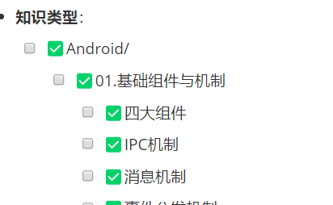

[toc]

## 前言

> 学习要符合如下的标准化链条：了解概念->探究原理->深入思考->总结提炼->底层实现->延伸应用"

## 01.学习概述

- **学习主题**：
- **知识类型**：
  - [ ] ✅Android/ 
    - [ ] ✅01.基础组件与机制 
      - [ ] ✅四大组件
      - [ ] ✅IPC机制
      - [ ] ✅消息机制
      - [ ] ✅事件分发机制
      - [ ] ✅View与渲染体系（含Window、复杂控件、动画）
      - [ ] ✅存储与数据安全（SharedPreferences/DataStore/Room/Scoped Storage）
    - [ ] ✅02. 架构与工程化
      - [ ] ✅架构模式（MVC/MVP/MVVM/MVI）
      - [ ] ✅依赖注入（Koin/Hilt/Dagger）
      - [ ] ✅路由与模块化（ARouter、Navigation）
      - [ ] ✅Gradle与构建优化
      - [ ] ✅插件化与动态化
      - [ ] ✅插桩与监控框架
    - [ ] ✅03.性能优化与故障诊断
      - [ ] ✅ANR分析与优化
      - [ ] ✅启动耗时优化
      - [ ] ✅内存泄漏监控
      - [ ] ✅监控与诊断工具
    - [ ] ✅04.Jetpack与生态框架
      - [ ] ✅Room
      - [ ] ✅Paging
      - [ ] ✅WorkManager
      - [ ] ✅Compose
    - [ ] ✅05.Framework与系统机制
      - [ ] ✅ActivityManagerService (含ANR触发机制)
      - [ ] ✅Binder机制
  - [ ] ✅音视频开发/
    - [ ] ✅01.基础知识
    - [ ] ✅02.OpenGL渲染视频
    - [ ] ✅03.FFmpeg音视频解码
  - [ ] ✅ Java/
    - [ ] ✅01.基础知识
    - [ ] ✅02.集合框架
    - [ ] ✅03.异常处理
    - [ ] ✅04.多线程与并发
    - [ ] ✅06.JVM
  - [ ] ✅ Kotlin/
    - [ ] ✅01.基础语法
    - [ ] ✅02.高阶扩展
    - [ ] ✅03.协程和流
  - [ ] ✅ Flutter/
    - [ ] ✅01.基础基础语法
    - [ ] ✅02.状态管理
    - [ ] ✅03.路由与依赖注入
    - [ ] ✅04.原生通信
  - [ ] ✅ 自我管理/
    - [ ] ✅01.内观
    - [ ] ✅02.如何正确学习
  - [ ] ✅ 项目经验/
    - [ ] ✅01.启动逻辑
    - [ ] ✅02.云值守
    - [ ] ✅03.智控平台
- **学习来源**：
- **重要程度**：⭐⭐⭐⭐⭐
- **学习日期**：2025.
- **记录人**：@panruiqi

### 1.1 学习目标

- 了解概念->探究原理->深入思考->总结提炼->底层实现->延伸应用"

### 1.2 前置知识

- [ ] 

## 02.核心概念

### 2.1 是什么？

### 2.2 解决什么问题？

我目前觉察到自己遇到了一个困境，从入职到目前位置，4个月了。我的项目能力和解决问题的能力提升了，可以初步适应公司的节奏了。但是我的整个的知识的掌握能力并没有过多的提升，这段时间更多提升的是自己原有知识的兑现。

### 2.3 基本特性

## 03.原理机制

### 3.1 引子

我想问下面几个问题：

- 为什么有的人可以进大厂，
- 为什么有的人工作1年就顶别人3年，我们学习究竟学的是什么？
- 为什么自己学了很多但还是不明白？
- 为什么很多时候很迷茫，干完活不知道该学什么？
- 为什么很多时候学习感觉很吃力，很模糊，没有一种透彻通透的感觉

我觉得这本质都是学习方法，学习思路的问题。

- 因为没有思路，所以迷茫，不知道该学什么？也不知道应该学到什么程度，也不清楚该怎么学懂，学透。
- 没有正确的学习方法，所以没有把自己的力拧成一股绳，往前发力。同时没有合理的正反馈机制，导致学习欲望下降。           *

学习最重要的不是靠体力，他最重要的是思路和方法。

### 3.2 学习中的常见误区

常见误区如下：

- **盲目追新**：追逐新技术，却没用到、不敢用，也没有权力用，忽视了真正缺失的东西（技术债）。
- **碎片化学习**：东一块西一块，看博客文章，缺乏体系，知识点无法融会贯通。
- **不记笔记**：学了就忘，时间一久全白费。大神写博客不是炫耀，而是复盘和提炼。
- **基础薄弱**：源码、框架看不懂，本质是基础知识没学。
- **反推式学习**：直接看复杂源码（如 OKHttp、Glide），遇到不懂就查，结果耗时大、效率低、效果差。

我想问：

- 我的这些不是在建立知识体系吗？
  - 
- 我一直有在记笔记，也没有盲目追新，基础并不薄弱，大多数都能看懂。
- 反推式学习也不多，因为你要想真正搞懂，确实就是得去看源码啊，但是他就存在，复杂，过多，耗时大，效率低的问题，这是没办法的啊。

### 3.3 我应该去怎么规划自己的学习_01？

我看到一篇博客：[Android筑基导论](https://juejin.cn/post/6870111983933325319)，他教授别人该怎么学习，但是他的思路是：先打基础，再考虑其他。

我想说的是：我认可基础很重要，但是学习是用到的时候去学效率最高，很多时候，对基础的学习是存在问题的，因为你用不到他，导致学习了，也没法很好的应用，如果学习不是为了应用，那么你的学习会很快被遗忘的。就像学了导数，积分，但是你现在做Android开发，你就会忘记这些。

那么我该如何思考，去求同存异，既要兼容基础，也要兼容当前的工作用到的工具，同时保持一个清晰的学习思路和构建一个合理的学习框架，并且找到一个正确的合适的学习方法呢？

### 3.4 我应该去怎么规划自己的学习_02？

首先，我们来解决学习的认知问题，也就是：以基础为重点，还是以用时学为重点。

- 我先来说句实话，基础学习效率很低，因为你用不上，没欲望。用时学的学习效率也很低，因为你光急着干活了，只会想着怎么正确的可以使用。那么什么时候学习效率最高呢？用后学的学习效率高，因为你带着问题去学，你有很多疑惑，很强的学习欲望。

好的，那么我们该怎么规划我们的学习的呢？

- 抓主线：项目驱动，查缺补漏

  - 继续以实际开发为主线，遇到不会的、用到的，立刻查资料、学原理、补基础。

  - 但不要只满足于“能用”，要顺藤摸瓜，把相关的基础知识补齐，形成知识网络

- 定期“回头看”，系统性梳理

  - 每隔1-2个月，回顾一下最近用到的技术/遇到的难题，看看哪些地方其实是基础不牢导致的。

  - 针对这些“卡壳点”，集中补一补相关基础，比如多线程、网络、数据结构等

- 具体行动的建议

  - 每次遇到新技术/难题时，除了查用法，还要顺便查查原理和相关基础。
  - 每次迭代周期后做一次“技术复盘”：写下最近遇到的难题、用到的新技术，查查背后有哪些基础知识是自己薄弱的，集中补一补。
  - 每季度做一次“知识体系梳理”：用思维导图/笔记，把自己会的东西串起来，看看哪些地方还不通，补上。

### 3.5 我应该去怎么规划自己的学习_03？

学习的本质是清晰，清楚和通透。

好，我现在还有几个困惑，如何保持一个清晰的学习思路，如何构建一个合理的学习框架，如何到一个正确的合适的学习方法可以学的清楚，清晰，通透，知道对一个知识该学到什么程度，应该有什么掌握，如何变得通透，学不会是因为什么？

好，先是学习思路的问题，如何确定自己的阶段性和整体学习思路？

- 为了确定学习思路，你就得确定成长阶段和目标。你得有目标，才能有思路。我们目标暂定如下：

- 初级阶段（0-1年）

  - 目标：能独立完成业务开发，掌握主流技术栈的用法，能查文档、能解决常见Bug。

  - 学习重点：API用法、常用库、开发流程、团队协作

- 中级阶段（1-3年）

  - 目标：能优化、能排查复杂问题，能理解常用技术/库的原理，能做技术分享。

  - 学习重点：原理机制、源码阅读、性能优化、架构模式、常见设计模式

- 高级阶段（3-5年及以上）

  - 目标：具备全局观，能做架构设计、技术选型、带团队，能解决疑难杂症。

  - 学习重点：系统设计、跨团队协作、技术创新、业务与技术结合、领导力

- 阶段性目标：

  - 每半年/一年设定一次成长目标，比如“半年内精通Android多线程与性能优化”、“一年内能独立设计中型App架构”。

  - 每月/季度设定具体学习主题，如“本月主攻Jetpack Compose”、“下季度补齐网络与安全基础”

那么个人的学习体系呢？

- 主线：确定你当前阶段的主攻领域（如Android开发、架构设计等）。

- 分支：细分出该领域下的核心模块（如四大组件、性能优化、架构模式等）。

- 细节：每个分支下再细化知识点（如Activity启动流程、内存泄漏原理等）。

- 联系：思考各知识点之间的联系和应用场景，形成知识网络
- 补充：以实际项目/业务为主线，遇到新技术/难题时，专题式深挖，并把相关知识点补齐到知识地图上。比如：做支付功能时，顺便补齐“安全、加密、网络协议、支付SDK”等相关知识
- 添加定时复盘：每季度/半年，回顾自己的知识地图，查漏补缺，看看哪些分支还薄弱，集中补一补。复盘时思考：哪些知识点是“孤岛”？能不能和主线/其他分支串联起来？

### 3.6 实际学习中遇到的困难案例_01

我现在遇到一个问题导致我ARouter学的不深：

- 我不理解KAPT注解处理器的过程，让其正确的生成路由表。
- 我不理解Gradle任务的过程，让其可以正确的讲路由表加载进内存中。
- 我也没搞懂他通过反射进行另一种运行时加载的原理。      

这是我的问题，我目前的最优解应该是：

- 忽略这些，囫囵吞枣咽下去，记下去。
- 然后针对疑惑记录，规划后续该怎么安排学习，对吗？
- 不应该花很多时间在这些不懂的点上盲人摸象，因为这是前置知识的问题。

我该怎么处理效率最高？您能给我什么建议呢？

- 你现在的想法是：先囫囵吞枣用起来，遇到疑惑记录下来，后续再系统补齐，而不是在这些“前置知识”上死磕。
- 这非常合理，前置知识链太长，死磕低效。KAPT、Gradle、反射、APT、Transform 这些本身就是“黑科技”，每一个都能单独学很久。你如果在每个细节上都死磕，容易陷入“盲人摸象”，既影响主线进度。
- 学习是一个螺旋形上升的过程，很多知识第一次接触时只能“模糊记忆”，等用多了、遇到瓶颈时再回头学，理解会更深刻

好，那我该怎么办？

- 标注“当前卡壳点”，比如“KAPT注解处理器如何生成路由表？Gradle任务如何加载？反射原理？
- 每隔一段时间（如每月/每季度），回头看自己的疑惑清单，挑选“对当前成长最有帮助”的点，集中补一补。这时你已经有了实际经验和问题，带着问题学原理，效率会高很多
- 阶段性：每次解决一个疑惑，写一篇小结/博客/分享，强化记忆，形成知识闭环
- 心态的正确认知：
  - 不用焦虑“没搞懂原理”，成长是分阶段的，很多知识第一次只能“模糊记忆”，后续会逐步通透。
  - 不要在细节上死磕，主线进度和实际应用更重要。
  - 记录疑惑，定期补齐，是最高效的成长方式。
- 最高效的成长路径：项目驱动+查缺补漏+定期复盘+输出总结。

## 04.底层原理

## 05.深度思考

### 5.1 关键问题探究

### 5.2 设计对比

## 06.实践验证

### 6.1 行为验证代码

### 6.2 性能测试

## 07.应用场景

### 7.1 最佳实践

### 7.2 使用禁忌

## 08.总结提炼

### 8.1 核心收获

### 8.2 知识图谱

### 8.3 延伸思考

## 09.参考资料

1. 
2. 
3. 

## 其他介绍

### 01.关于我的博客

- csdn：http://my.csdn.net/qq_35829566

- 掘金：https://juejin.im/user/499639464759898

- github：https://github.com/jjjjjjava

- 邮箱：[934137388@qq.com]

