[toc]

## 前言

> 学习要符合如下的标准化链条：了解概念->探究原理->深入思考->总结提炼->底层实现->延伸应用"

## 01.学习概述

- **学习主题**：
- **知识类型**：
  - [ ] **知识类型**：
    - [ ] ✅Android/ 
      - [ ] ✅01.基础组件
      - [ ] ✅02.IPC机制
      - [ ] ✅03.消息机制
      - [ ] ✅04.View原理
      - [ ] ✅05.事件分发机制
      - [ ] ✅06.Window
      - [ ] ✅07.复杂控件
      - [ ] ✅08.性能优化
      - [ ] ✅09.流行框架
      - [ ] ✅10.数据处理
      - [ ] ✅11.动画
      - [ ] ✅12.Groovy
    - [ ] ✅音视频开发/
      - [ ] ✅01.基础知识
      - [ ] ✅02.OpenGL渲染视频
      - [ ] ✅03.FFmpeg音视频解码
    - [ ] ✅ Java/
      - [ ] ✅01.基础知识
      - [ ] ✅02.Java设计思想
      - [ ] ✅03.集合框架
      - [ ] ✅04.异常处理
      - [ ] ✅05.多线程与并发编程
      - [ ] ✅06.JVM
    - [ ] ✅ Kotlin/
      - [ ] ✅01.基础语法
      - [ ] ✅02.高阶扩展
      - [ ] ✅03.协程和流
    - [ ] ✅ 故障分析与处理/
      - [ ] ✅01.基础知识
    - [ ] ✅ 自我管理/
      - [ ] ✅01.内观
    - [ ] ✅ 业务逻辑/
      - [ ] ✅01.启动逻辑
      - [ ] ✅02.云值守
      - [ ] ✅03.智控平台
- **学习来源**：
- **重要程度**：⭐⭐⭐⭐⭐
- **学习日期**：2025.
- **记录人**：@panruiqi

### 1.1 学习目标

- 了解概念->探究原理->深入思考->总结提炼->底层实现->延伸应用"

### 1.2 前置知识

- [ ] 

## 02.核心概念

### 2.1 是什么？

他是什么？有哪些基本概念？如何进行基础API调用来使用他？

- ESP-IDF Provisioning Android库是一个用于ESP32系列设备（包括ESP32、ESP32-S2、ESP32-S3、ESP32-C3和ESP8266）的配网工具库。它提供了一种机制，通过Android应用向ESP设备发送网络凭证和自定义数据。


### 2.2 解决什么问题？


### 2.3 基本特性


## 03.原理机制

### 3.1 进一步思考

他有哪些核心概念？

- 传输方式
  - BLE传输：通过蓝牙低功耗与设备通信
  - SoftAP传输：通过ESP32创建的WiFi热点进行通信
- 设备表示与管理
  - ESPDevice：虚拟设备对象
  - ESPProvisionManager：设备管理器
  - 设备获取方式：QR码扫描和手动创建
- 基本API使用
  - 设备发现与连接
  - WiFi扫描与配置
  - 加密通信机制
  - 自定义数据交换

### 3.2 进一步思考

如何进行基础的使用？

- 添加依赖

  - ```
    implementation 'com.github.espressif:esp-idf-provisioning-android:lib-2.2.5'
    ```

有哪些重要的API？

- 我们以实例来介绍：手动创建和配网的完整过程：

- 创建ESPDevice实例

  - ```
    // 创建ESPDevice实例，指定传输方式和安全类型
    val espDevice = ESPProvisionManager.getInstance(context).createESPDevice(
        TransportType.TRANSPORT_BLE,  // 使用BLE传输
        SecurityType.SECURITY_1        // 使用安全级别2（推荐）
    )
    ```

  - 安全类型选择：

    - SECURITY_0 - 无加密（不推荐）

    - SECURITY_1 - 基本加密

    - SECURITY_2 - 高级加密（推荐）

- 搜索BLE设备

  - ```
    // 搜索前缀为"PROV_"的ESP32设备
    ESPProvisionManager.getInstance(context).searchBleEspDevices("PROV_", object : BleScanListener {
        
        override fun onPeripheralFound(device: BluetoothDevice?, scanResult: ScanResult?) {
            // 找到匹配的设备
            // device是Android标准的BluetoothDevice对象
            // scanResult包含额外的扫描信息，如信号强度等
        }
        
        override fun scanCompleted() {
            // 扫描完成
        }
        
        override fun scanStartFailed() {
            // 扫描启动失败
        }
        
        override fun onFailure(e: Exception) {
            // 扫描过程中出现错误
        }
    })
    ```

- 连接到BLE设备

  - BLE设备连接需要提供以下信息：

    - 设备POP码（Proof of Possession）- 设备的验证密码

    - 设备的服务名称

    - 连接监听器

  - ```
    // 连接到选定的BLE设备
    val pop = "abcd1234" // 设备的POP码
    val serviceName = "PROV_123" // 设备的服务名称
    
    espDevice.connectBLEDevice(bluetoothDevice, primaryServiceUuid, pop, serviceName, object : ProvisionListener {
        override fun createSessionFailed(e: Exception) {
            // 创建会话失败
        }
        
        override fun onProvisioningFailed(e: Exception) {
            // 配网过程失败
        }
        
        override fun onProvisioningSuccess() {
            // 连接成功（注意：这里仅表示连接成功，还未配置WiFi）
        }
        
        // 其他回调...
    })
    ```

- 设置安全参数

  - 对于安全版本2，需要设置用户名：

  - ```
    // 设置POP（如果之前未设置）
    espDevice.setProofOfPossession(pop)
    
    // 安全版本2需要设置用户名
    espDevice.setUserName("espressif")
    ```

- 扫码可用的wifi网络

  - ```
    // 扫描设备可见的WiFi网络
    espDevice.scanNetworks(object : WiFiScanListener {
        override fun onWifiListReceived(wifiList: ArrayList<WiFiAccessPoint>) {
            // 接收到WiFi列表
            // wifiList包含SSID、信号强度等信息
        }
        
        override fun onWiFiScanFailed(e: Exception) {
            // WiFi扫描失败
        }
    })
    ```

- 配置设备WIFI连接

  - ```
    // 配置设备连接到指定WiFi
    val ssid = "YourWiFiName"
    val password = "YourWiFiPassword"
    
    espDevice.provision(ssid, password, object : ProvisionListener {
        override fun wifiConfigSent() {
            // WiFi配置已发送到设备
        }
        
        override fun wifiConfigFailed(e: Exception?) {
            // 发送WiFi配置失败
        }
        
        override fun wifiConfigApplied() {
            // 设备已应用WiFi配置
        }
        
        override fun wifiConfigApplyFailed(e: Exception?) {
            // 设备应用WiFi配置失败
        }
        
        override fun deviceProvisioningSuccess() {
            // 整个配网过程成功完成
        }
        
        override fun onProvisioningFailed(e: Exception) {
            // 整个配网过程失败
        }
        
        // 其他回调...
    })
    ```

- 检测wifi连接状态

  - 通过自定义数据交换可以检查WiFi连接状态：

  - ```
    // 创建自定义端点
    val customEndpoint = ESPConstants.ESPCustomEndpoint(
        "wifi-status",  // 名称
        "GET",          // HTTP方法
        "/wifi-status", // 路径
        null            // 数据类型
    )
    
    // 发送请求并接收响应
    espDevice.sendDataToCustomEndPoint(customEndpoint, null, object : ResponseListener {
        override fun onSuccess(response: ByteArray) {
            // 解析响应数据
            val jsonResponse = JSONObject(String(response))
            val isConnected = jsonResponse.optBoolean("connected", false)
            // 处理连接状态
        }
        
        override fun onFailure(e: Exception) {
            // 请求失败
        }
    })
    ```

- 断开连接

  - ```
    // 操作完成后断开设备连接
    espDevice.disconnectDevice()
    ```

    

### 3.3 进一步思考

他可以实现我们期望的功能吗？

- 这是我们所期望的：
  - 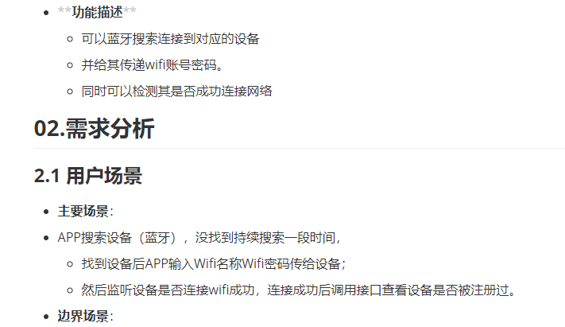	
- 他能否实现？
  - 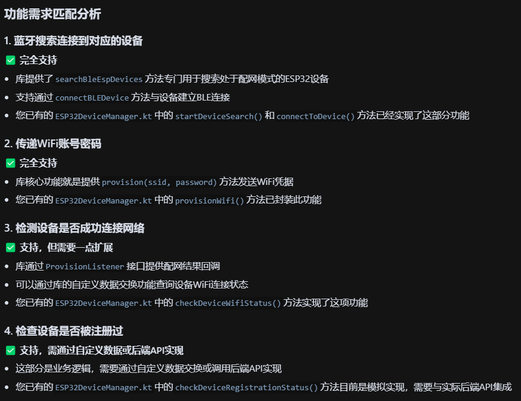
  - 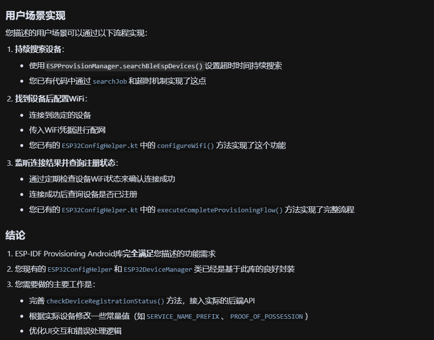

## 04.底层原理

### 4.1 蓝牙中的状态位

蓝牙连接的过程是什么样的？

首先是蓝牙连接过程中的状态位：

- 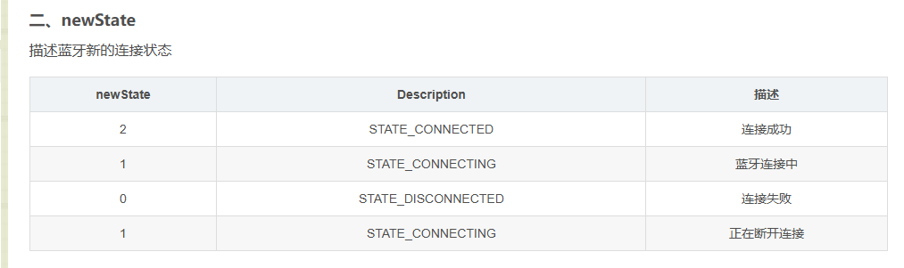
- 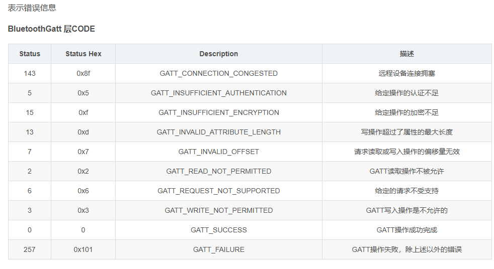

### 4.2 蓝牙设备的连接过程

好，蓝牙连接过程是什么样的？

- 如图：
- 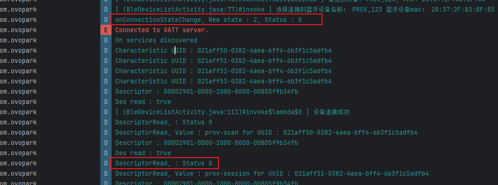
- 首先是连接状态
  - 
  - 
  - 
  - GATT是协议，这个代表协议码。
- 然后是发现当前蓝牙设备可以提供的服务
  - 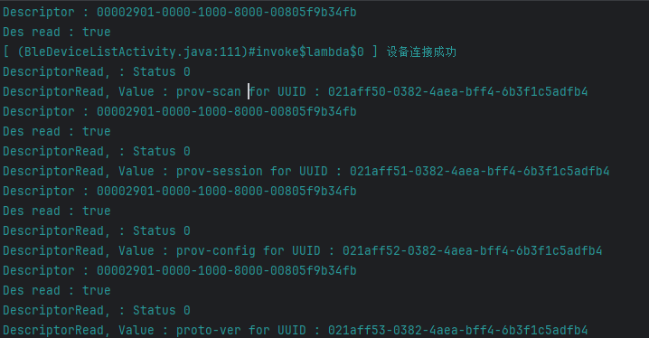
  - 
- 接着是读取蓝牙设备的实际能力，这是读取其协议版本，对应上面的021aff53
  - 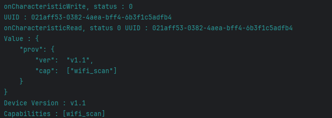

蓝牙的连接过程有些意思，尤其是他的服务发现的过程 和 获取实际能力的过程是不一样的

- 蓝牙的读取分为两种不同情况
  - 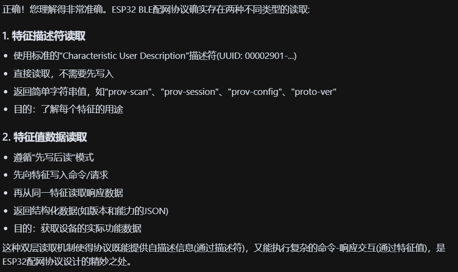
- 首先是描述符的读取
  - 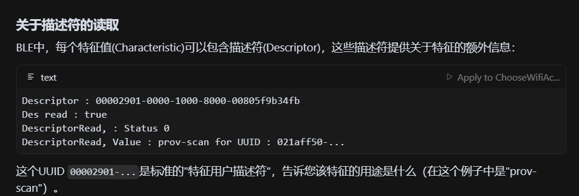
- 然后是特征值的读取
  - 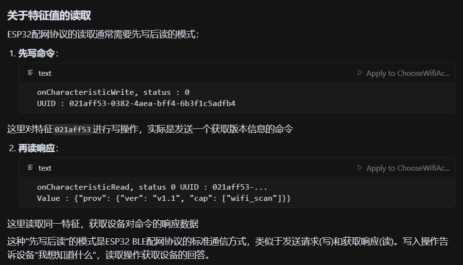

### 4.3 蓝牙设备的配网过程

好，接着是他的配网过程，这是什么样的？

- 如图：
  - 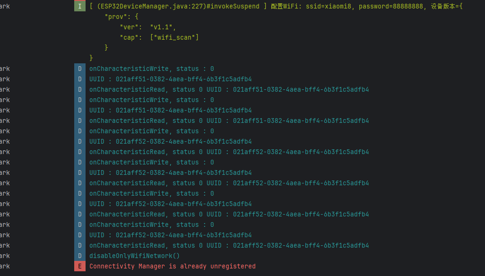
- 初始阶段，调用SDK发送WIFI凭据
  - 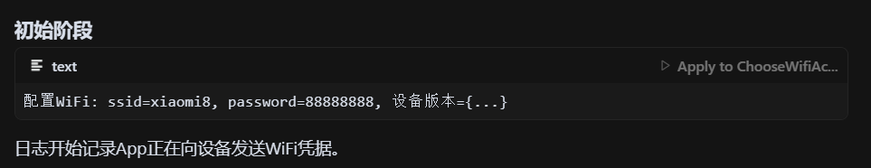
- 接着是配网过程
  - 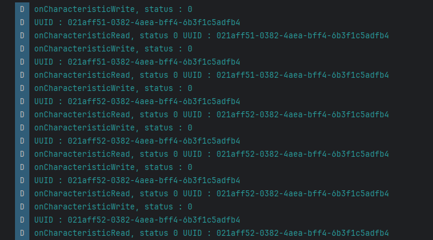
  - 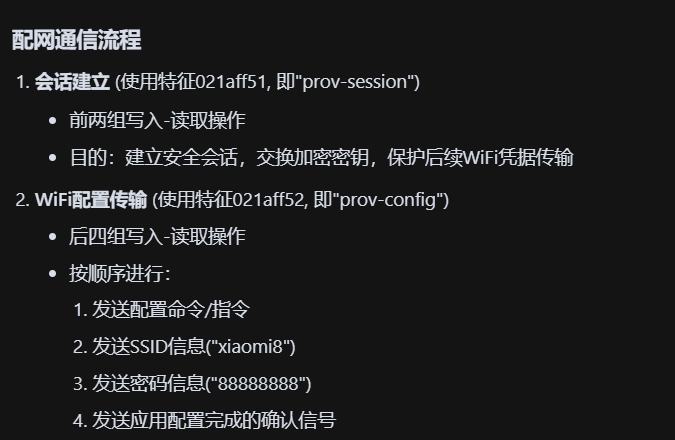
- 最后是配网完成阶段
  - 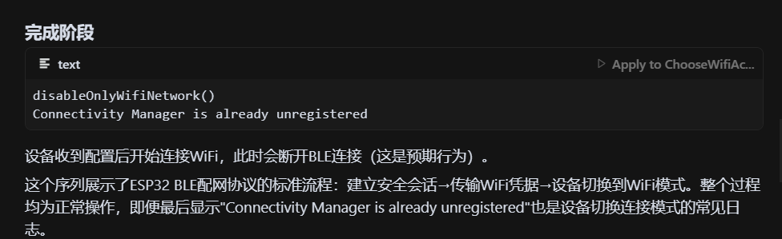

### 4.4 如何确认蓝牙设备成功连接上WIFI

现在存在下面的问题：

- 配置过程分为：配网，联网两个过程。
- 现在配网成功的迹象是：设备断连接。 但是我们无法判断联网状态了。 因为设备联网后我们无法通过蓝牙和他连接。 

设备断开连接表示进入联网尝试阶段

- 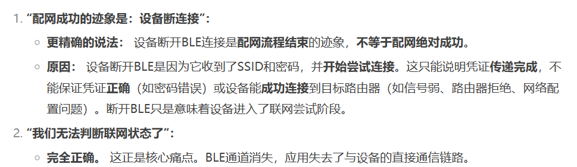

有哪些解决方案？

- mDNS
  - 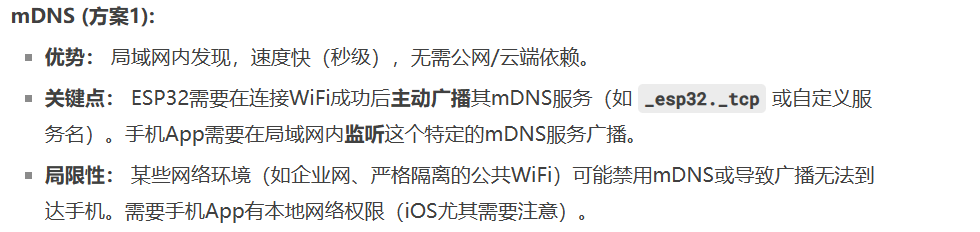
- 云端代理确认
  - 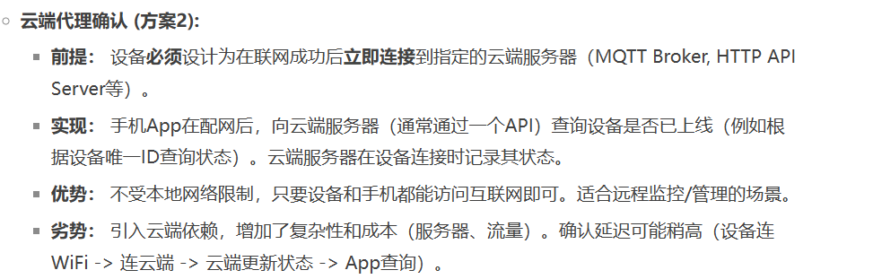
- **自动重连策略 / BLE 扫描 (方案3):**
  - 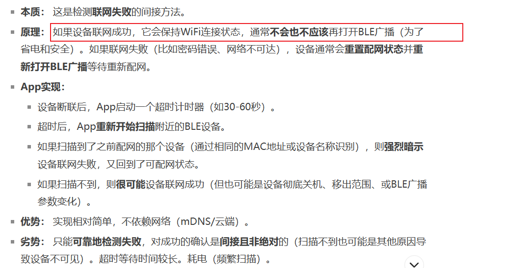
- **双向通信预设 / HTTP 查询 (方案4):**
  - 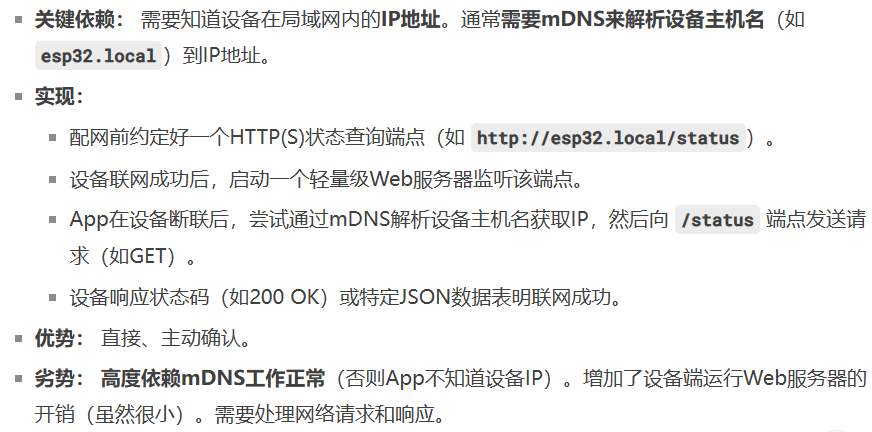
- 推荐方法：
  - 


## 05.深度思考

### 5.1 关键问题探究


### 5.2 设计对比


## 06.实践验证

### 6.1 行为验证代码


### 6.2 性能测试


## 07.应用场景

### 7.1 最佳实践


### 7.2 使用禁忌


## 08.总结提炼

### 8.1 核心收获


### 8.2 知识图谱


### 8.3 延伸思考


## 09.参考资料

1. []()
2. []()
3. []()

## 其他介绍

### 01.关于我的博客

- csdn：http://my.csdn.net/qq_35829566

- 掘金：https://juejin.im/user/499639464759898

- github：https://github.com/jjjjjjava

- 邮箱：[934137388@qq.com]

