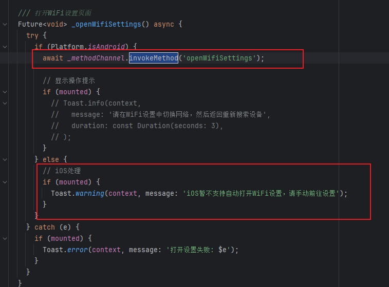
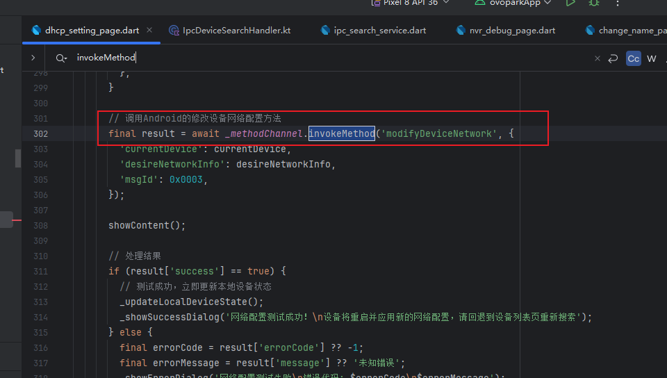
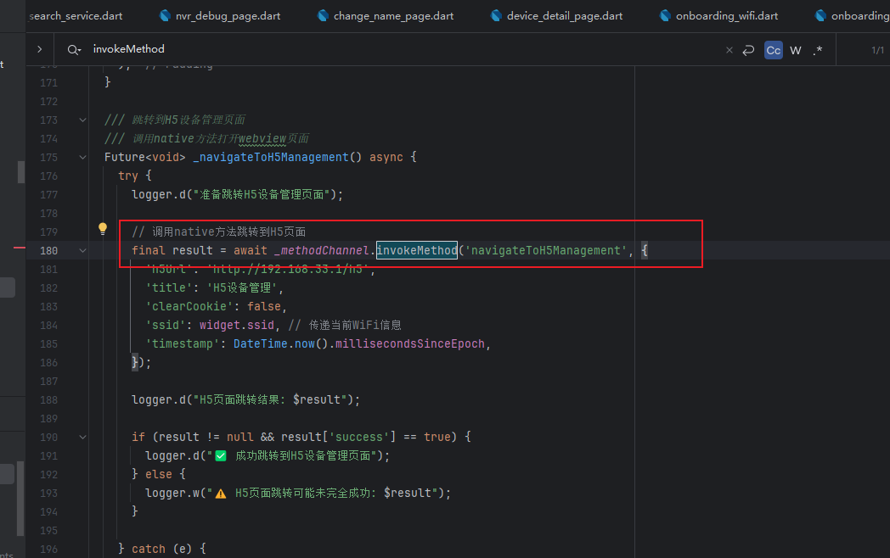
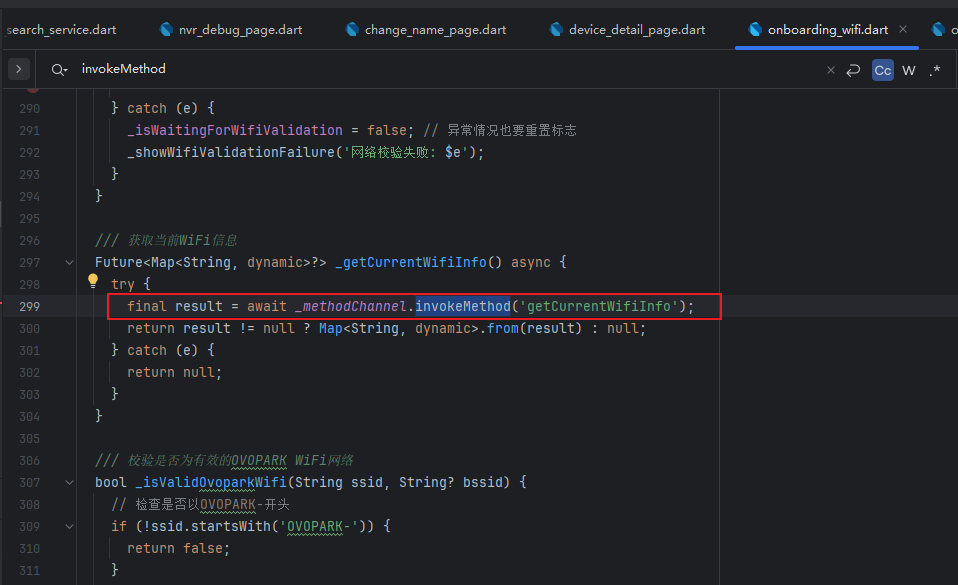
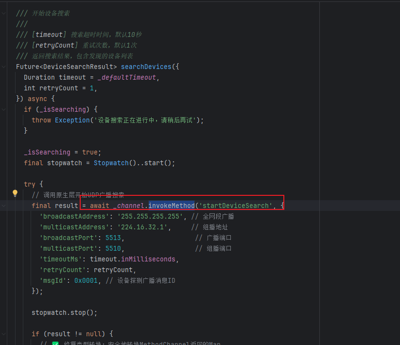
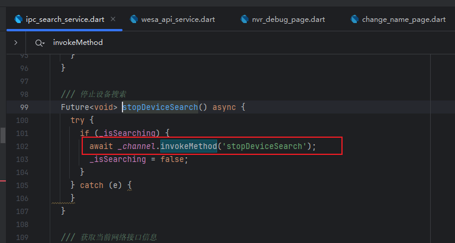

代码在最后面。有些是冗余的代码

先是flutter内部的代码，对应的调用Channel的接口如下：

- 其中Channel为
  - 

- 打开wifi设置页，同时要去代码中修改，因为我区分了Android和IOS处理
  - 
- 发送UDP以修改其dhcp配置
  - 
- 跳转内网H5
  - 
- 获取当前wifi信息，用于判断wifi是否切换成功
  - 
- 开始设备搜索
  - 
- 停止设备搜索
  - 

代码如下

- 消息handler

  - ```
    package com.kedacom.ovopark.flutter.handlers
    
    import android.content.Context
    import android.content.Intent
    import android.net.wifi.WifiManager
    import com.kedacom.ovopark.flutter.protocol.Ndt1Protocol
    import com.kedacom.ovopark.flutter.protocol.UdpSearchEngine
    import com.kedacom.ovopark.flutter.utils.NetworkHelper
    import com.ovopark.webview.WebViewIntentUtils
    import com.socks.library.KLog
    import io.flutter.plugin.common.MethodChannel.Result
    import kotlinx.coroutines.*
    import java.net.DatagramPacket
    import java.net.DatagramSocket
    import java.net.InetAddress
    import java.net.SocketTimeoutException
    import java.nio.ByteBuffer
    import java.nio.ByteOrder
    
    /**
     * IPC设备搜索处理器
     * 处理所有IPC设备相关的Flutter方法调用
     */
    class IpcDeviceSearchHandler(private val context: Context) {
        
        companion object {
            private const val TAG = "IpcDeviceSearchHandler"
            
            // IPC设备搜索方法常量
            const val METHOD_START_DEVICE_SEARCH = "startDeviceSearch"
            const val METHOD_STOP_DEVICE_SEARCH = "stopDeviceSearch"
            const val METHOD_OPEN_WIFI_SETTINGS = "openWifiSettings"
            const val METHOD_GET_CURRENT_NETWORK_INFO = "getCurrentNetworkInfo"
            const val METHOD_GET_CURRENT_WIFI_INFO = "getCurrentWifiInfo"
            const val METHOD_GET_DEVICE_DETAIL = "getDeviceDetail"
            const val METHOD_MODIFY_DEVICE_NETWORK = "modifyDeviceNetwork"
            const val METHOD_RESTART_DEVICE = "restartDevice"
            const val METHOD_GET_DEVICE_VERSION = "getDeviceVersion"
            const val METHOD_CHECK_NETWORK_CONNECTIVITY = "checkNetworkConnectivity"
            const val METHOD_NAVIGATE_TO_H5_MANAGEMENT = "navigateToH5Management"
        }
    
        // 搜索状态管理
        private var isSearching = false
        private var searchJob: Job? = null
        private val scope = CoroutineScope(Dispatchers.IO + SupervisorJob())
        private val udpSearchEngine = UdpSearchEngine(context)
    
        /**
         * 处理IPC相关方法调用
         */
        fun handleMethod(method: String, params: Map<String, Any>?, result: Result): Boolean {
            return when (method) {
                METHOD_START_DEVICE_SEARCH -> {
                    handleStartDeviceSearch(params, result)
                    true
                }
                METHOD_STOP_DEVICE_SEARCH -> {
                    handleStopDeviceSearch(result)
                    true
                }
                METHOD_OPEN_WIFI_SETTINGS -> {
                    handleOpenWifiSettings(result)
                    true
                }
                METHOD_GET_CURRENT_NETWORK_INFO -> {
                    handleGetCurrentNetworkInfo(result)
                    true
                }
                METHOD_GET_CURRENT_WIFI_INFO -> {
                    handleGetCurrentWifiInfo(result)
                    true
                }
                METHOD_GET_DEVICE_DETAIL -> {
                    handleGetDeviceDetail(params, result)
                    true
                }
                METHOD_MODIFY_DEVICE_NETWORK -> {
                    handleModifyDeviceNetwork(params, result)
                    true
                }
                METHOD_RESTART_DEVICE -> {
                    handleRestartDevice(params, result)
                    true
                }
                METHOD_GET_DEVICE_VERSION -> {
                    handleGetDeviceVersion(params, result)
                    true
                }
                METHOD_CHECK_NETWORK_CONNECTIVITY -> {
                    handleCheckNetworkConnectivity(result)
                    true
                }
                METHOD_NAVIGATE_TO_H5_MANAGEMENT -> {
                    handleNavigateToH5Management(params, result)
                    true
                }
                else -> false // 不处理其他方法
            }
        }
    
        /**
         * 启动IPC设备搜索
         * 基于NDT1协议的UDP广播搜索，添加安全检查和重试机制
         */
        private fun handleStartDeviceSearch(params: Map<String, Any>?, result: Result) {
            KLog.i(TAG, "🔍 开始IPC设备搜索")
            
            if (isSearching) {
                result.error("SEARCH_IN_PROGRESS", "设备搜索正在进行中", null)
                return
            }
            
            if (params == null) {
                result.error("INVALID_PARAMS", "搜索参数不能为空", null)
                return
            }
            
            // 基本安全检查：网络可用性
            if (!NetworkHelper.isNetworkAvailable(context)) {
                result.error("NO_NETWORK", "网络连接不可用", null)
                return
            }
            
            // 添加网络环境诊断信息
            NetworkHelper.printNetworkDiagnostics(context)
            
            // 获取协议相关参数，如果param没有，则使用默认常亮
            val broadcastAddress = params["broadcastAddress"] as? String ?: Ndt1Protocol.BROADCAST_ADDRESS
            val multicastAddress = params["multicastAddress"] as? String ?: Ndt1Protocol.MULTICAST_ADDRESS
            val broadcastPort = params["broadcastPort"] as? Int ?: Ndt1Protocol.BROADCAST_PORT
            val multicastPort = params["multicastPort"] as? Int ?: Ndt1Protocol.MULTICAST_PORT
            val timeoutMs = params["timeoutMs"] as? Int ?: Ndt1Protocol.DEFAULT_TIMEOUT_MS
            val retryCount = params["retryCount"] as? Int ?: 1
            val msgId = params["msgId"] as? Int ?: Ndt1Protocol.MSG_ID_DEVICE_SEARCH_REQ
            
            isSearching = true
            
            // 使用协程进行异步搜索
            searchJob = scope.launch {
                try {
                    val devices = udpSearchEngine.performDeviceSearch(
                        broadcastAddress, multicastAddress,
                        broadcastPort, multicastPort,
                        timeoutMs, msgId
                    )
                    
                    withContext(Dispatchers.Main) {
                        isSearching = false
                        val response = mapOf(
                            "isSuccess" to true,
                            "devices" to devices,
                            "totalCount" to devices.size,
                            "searchDurationMs" to timeoutMs
                        )
                        result.success(response)
                    }
                    
                } catch (e: Exception) {
                    withContext(Dispatchers.Main) {
                        isSearching = false
                        KLog.e(TAG, "设备搜索失败", e)
                        val response = mapOf(
                            "isSuccess" to false,
                            "devices" to emptyList<Map<String, Any>>(),
                            "totalCount" to 0,
                            "errorMessage" to e.message,
                            "searchDurationMs" to timeoutMs
                        )
                        result.success(response)
                    }
                }
            }
        }
    
        /**
         * 停止设备搜索
         */
        private fun handleStopDeviceSearch(result: Result) {
            KLog.i(TAG, "⏹️ 停止设备搜索")
            
            try {
                // 取消搜索协程
                searchJob?.cancel()
                searchJob = null
                
                // 设置停止标志
                isSearching = false
                
                KLog.d(TAG, "设备搜索已停止")
                
                val response = mapOf(
                    "success" to true,
                    "message" to "设备搜索已停止"
                )
                result.success(response)
                
            } catch (e: Exception) {
                KLog.e(TAG, "停止设备搜索失败", e)
                result.error("STOP_SEARCH_ERROR", "停止设备搜索失败: ${e.message}", null)
            }
        }
    
        /**
         * 打开WiFi设置
         */
        private fun handleOpenWifiSettings(result: Result) {
            KLog.i(TAG, "🔌 打开WiFi设置")
            
            try {
                // 使用更安全的WiFi设置页面跳转方式
                val intent = Intent(android.provider.Settings.ACTION_WIFI_SETTINGS)
                intent.addFlags(Intent.FLAG_ACTIVITY_NEW_TASK)
                context.startActivity(intent)
                result.success(mapOf("success" to true, "message" to "WiFi设置页面已打开"))
            } catch (e: Exception) {
                KLog.e(TAG, "打开WiFi设置失败", e)
                result.error("OPEN_WIFI_SETTINGS_ERROR", "打开WiFi设置失败: ${e.message}", null)
            }
        }
    
        /**
         * 获取当前网络信息
         */
        private fun handleGetCurrentNetworkInfo(result: Result) {
            KLog.i(TAG, "📡 获取当前网络信息")
            
            try {
                val networkInfo = NetworkHelper.getCurrentNetworkInfo(context)
                KLog.d(TAG, "当前网络信息: $networkInfo")
                result.success(networkInfo)
                
            } catch (e: Exception) {
                KLog.e(TAG, "获取网络信息失败", e)
                result.error("NETWORK_INFO_ERROR", "获取网络信息失败: ${e.message}", null)
            }
        }
    
        /**
         * 获取当前WiFi信息
         * 专门用于WiFi校验，返回SSID和BSSID信息
         */
        private fun handleGetCurrentWifiInfo(result: Result) {
            KLog.i(TAG, "📶 获取当前WiFi信息")
            
            try {
                val wifiManager = context.applicationContext.getSystemService(Context.WIFI_SERVICE) as WifiManager
                val wifiInfo = wifiManager.connectionInfo
                
                // 清理SSID名称（移除引号）
                val ssid = wifiInfo.ssid?.replace("\"", "") ?: ""
                val bssid = wifiInfo.bssid ?: ""
                val ipAddress = NetworkHelper.getLocalIpAddress(context)
                
                val wifiDetails = mapOf(
                    "isConnected" to true,
                    "ssid" to ssid,
                    "bssid" to bssid,
                    "ipAddress" to ipAddress,
                    "networkId" to wifiInfo.networkId,
                    "rssi" to wifiInfo.rssi,
                    "linkSpeed" to wifiInfo.linkSpeed,
                    "frequency" to if (android.os.Build.VERSION.SDK_INT >= android.os.Build.VERSION_CODES.LOLLIPOP) {
                        wifiInfo.frequency
                    } else {
                        0
                    },
                    "wifiEnabled" to wifiManager.isWifiEnabled
                )
                
                KLog.d(TAG, "当前WiFi信息:")
                KLog.d(TAG, "   SSID: $ssid")
                KLog.d(TAG, "   BSSID: $bssid")
                KLog.d(TAG, "   IP地址: $ipAddress")
                KLog.d(TAG, "   信号强度: ${wifiInfo.rssi} dBm")
                KLog.d(TAG, "   连接速度: ${wifiInfo.linkSpeed} Mbps")
                
                result.success(wifiDetails)
                
            } catch (e: Exception) {
                KLog.e(TAG, "获取WiFi信息失败", e)
                result.error("WIFI_INFO_ERROR", "获取WiFi信息失败: ${e.message}", null)
            }
        }
    
        /**
         * 获取设备详情
         */
        private fun handleGetDeviceDetail(params: Map<String, Any>?, result: Result) {
            KLog.i(TAG, "📋 获取设备详情")
            
            if (params == null) {
                result.error("INVALID_PARAMS", "设备详情参数不能为空", null)
                return
            }
            
            val macAddress = params["macAddress"] as? String
            val username = params["username"] as? String
            val password = params["password"] as? String
            val msgId = params["msgId"] as? Int ?: Ndt1Protocol.MSG_ID_GET_VERSION_REQ
            
            if (macAddress.isNullOrEmpty()) {
                result.error("INVALID_MAC", "设备MAC地址不能为空", null)
                return
            }
            
            // 模拟设备详情响应（实际应该通过UDP获取）
            scope.launch {
                try {
                    delay(1000) // 模拟网络请求
                    
                    val deviceDetail = mapOf(
                        "macAddress" to macAddress,
                        "ipAddress" to "192.168.1.100", // 模拟IP
                        "deviceName" to "IPC Camera 001",
                        "deviceType" to "IPC摄像头",
                        "serialNumber" to "SN123456789",
                        "softwareVersion" to "V1.0.0",
                        "deviceTypeId" to 0x02,
                        "runTime" to 86400000, // 1天运行时间
                        "isDhcpEnabled" to true,
                        "lastSeen" to System.currentTimeMillis(),
                        "isOnline" to true,
                        "lastUpdateTime" to System.currentTimeMillis(),
                        "networkInfo" to mapOf(
                            "ipAddress" to "192.168.1.100",
                            "subnetMask" to "255.255.255.0",
                            "gateway" to "192.168.1.1",
                            "dhcpEnabled" to true,
                            "dhcpType" to 2
                        ),
                        "capabilities" to mapOf(
                            "supportsCustomRtsp" to true,
                            "rawCapabilities" to listOf(0x1000002)
                        ),
                        "rtspUrls" to listOf(
                            "rtsp://192.168.1.100/live/main",
                            "rtsp://192.168.1.100/live/sub"
                        ),
                        "systemInfo" to mapOf(
                            "authenticated" to true,
                            "username" to username
                        )
                    )
                    
                    withContext(Dispatchers.Main) {
                        result.success(deviceDetail)
                    }
                    
                } catch (e: Exception) {
                    withContext(Dispatchers.Main) {
                        KLog.e(TAG, "获取设备详情失败", e)
                        result.error("DEVICE_DETAIL_ERROR", "获取设备详情失败: ${e.message}", null)
                    }
                }
            }
        }
    
        /**
         * 修改设备网络配置
         * 实现真正的NDT1协议通信，发送修改网络配置包并等待设备应答
         */
        private fun handleModifyDeviceNetwork(params: Map<String, Any>?, result: Result) {
            KLog.i(TAG, "⚙️ 修改设备网络配置")
            
            if (params == null) {
                result.error("INVALID_PARAMS", "网络配置参数不能为空", null)
                return
            }
            
            val currentDevice = params["currentDevice"] as? Map<String, Any>
            val desireNetworkInfo = params["desireNetworkInfo"] as? Map<String, Any>
            val msgId = params["msgId"] as? Int ?: Ndt1Protocol.MSG_ID_MODIFY_NETWORK_REQ
            
            if (currentDevice == null || desireNetworkInfo == null) {
                result.error("INVALID_PARAMS", "当前设备信息和期望网络配置不能为空", null)
                return
            }
            
            scope.launch {
                try {
                    // 解析当前设备信息
                    val currentMacAddress = currentDevice["macAddress"] as? String
                    val currentIpAddress = currentDevice["ipAddress"] as? String
                    val currentSubnetMask = currentDevice["subnetMask"] as? String
                    val currentGateway = currentDevice["gateway"] as? String
                    
                    // 解析期望的网络配置
                    val desireIpAddress = desireNetworkInfo["ipAddress"] as? String
                    val desireSubnetMask = desireNetworkInfo["subnetMask"] as? String
                    val desireGateway = desireNetworkInfo["gateway"] as? String
                    val dhcpEnabled = desireNetworkInfo["dhcpEnabled"] as? Boolean ?: false
                    val dhcpType = desireNetworkInfo["dhcpType"] as? Int ?: (if (dhcpEnabled) 2 else 0)
                    
                    // 验证参数
                    if (currentMacAddress.isNullOrEmpty() || currentIpAddress.isNullOrEmpty()) {
                        throw IllegalArgumentException("当前设备MAC地址和IP地址不能为空")
                    }
                    if (desireIpAddress.isNullOrEmpty()) {
                        throw IllegalArgumentException("期望的IP地址不能为空")
                    }
                    
                    KLog.d(TAG, "设备网络配置修改:")
                    KLog.d(TAG, "  当前设备:")
                    KLog.d(TAG, "    MAC: $currentMacAddress")
                    KLog.d(TAG, "    IP: $currentIpAddress")
                    KLog.d(TAG, "    子网掩码: $currentSubnetMask")
                    KLog.d(TAG, "    网关: $currentGateway")
                    KLog.d(TAG, "  期望配置:")
                    KLog.d(TAG, "    IP: $desireIpAddress")
                    KLog.d(TAG, "    子网掩码: $desireSubnetMask")
                    KLog.d(TAG, "    网关: $desireGateway")
                    KLog.d(TAG, "    DHCP: $dhcpEnabled (类型: $dhcpType)")
                    
                    // 发送修改网络配置包并等待应答
                    val response = sendModifyNetworkPacket(
                        currentMacAddress, currentIpAddress, 
                        desireIpAddress ?: "0.0.0.0", 
                        desireSubnetMask ?: "255.255.255.0", 
                        desireGateway ?: "0.0.0.0", 
                        dhcpType, msgId
                    )
                    
                    withContext(Dispatchers.Main) {
                        result.success(response)
                    }
                    
                } catch (e: Exception) {
                    withContext(Dispatchers.Main) {
                        KLog.e(TAG, "修改设备网络配置失败", e)
                        result.error("MODIFY_NETWORK_ERROR", "修改网络配置失败: ${e.message}", null)
                    }
                }
            }
        }
    
        /**
         * 发送修改网络配置包并等待设备应答
         * 根据NDT1协议构造修改网络配置包，发送到设备并等待应答
         */
        private suspend fun sendModifyNetworkPacket(
            deviceMacAddress: String,
            currentDeviceIp: String,
            desireIpAddress: String,
            desireSubnetMask: String,
            desireGateway: String,
            dhcpType: Int,
            msgId: Int
        ): Map<String, Any> = withContext(Dispatchers.IO) {
            
            try {
                // 解析设备MAC地址
                val deviceMacBytes = NetworkHelper.parseHexMacAddress(deviceMacAddress)
                
                // 使用5513端口发送单播包到设备当前地址
                DatagramSocket(5513).use { socket ->
                    socket.soTimeout = 5000 // 5秒超时
                    
                    // 构造NDT1修改网络配置包（包内容是期望的网络配置）
                    val modifyPacket = createNdt1ModifyNetworkPacket(
                        deviceMacBytes, desireIpAddress, desireSubnetMask, desireGateway, dhcpType, msgId
                    )
                    
                    // 发送到设备当前IP地址
                    val deviceAddress = InetAddress.getByName(currentDeviceIp)
                    val packet = DatagramPacket(
                        modifyPacket, modifyPacket.size,
                        deviceAddress, Ndt1Protocol.BROADCAST_PORT // 5513端口
                    )
                    
                    KLog.d(TAG, "🔧 发送修改网络配置包:")
                    KLog.d(TAG, "   发送到当前设备IP: $currentDeviceIp:${Ndt1Protocol.BROADCAST_PORT}")
                    KLog.d(TAG, "   期望设置的新IP: $desireIpAddress")
                    KLog.d(TAG, "   包大小: ${modifyPacket.size} 字节")
                    KLog.d(TAG, "   目标MAC: $deviceMacAddress")
                    KLog.d(TAG, "   包内容: ${modifyPacket.joinToString(" ") { "%02X".format(it) }}")
                    
                    socket.send(packet)
                    KLog.d(TAG, "✅ 修改网络配置包发送成功")
                    
                    // 等待设备应答 (MSG_ID_MODIFY_NETWORK_RSP = 0x0004)
                    val startTime = System.currentTimeMillis()
                    val timeout = 5000L // 5秒超时
                    val buffer = ByteArray(Ndt1Protocol.MAX_PACKET_SIZE)
                    
                    while (System.currentTimeMillis() - startTime < timeout) {
                        try {
                            val receivePacket = DatagramPacket(buffer, buffer.size)
                            socket.receive(receivePacket)
                            
                            KLog.d(TAG, "📥 收到设备应答包:")
                            KLog.d(TAG, "   来源: ${receivePacket.address.hostAddress}:${receivePacket.port}")
                            KLog.d(TAG, "   长度: ${receivePacket.length} 字节")
                            KLog.d(TAG, "   数据: ${receivePacket.data.take(receivePacket.length).joinToString(" ") { "%02X".format(it) }}")
                            
                            // 解析应答包
                            val responseResult = parseModifyNetworkResponse(receivePacket, deviceMacBytes)
                            if (responseResult != null) {
                                KLog.d(TAG, "✅ 收到有效的修改网络配置应答")
                                return@withContext responseResult
                            }
                            
                        } catch (e: SocketTimeoutException) {
                            // 继续等待
                            continue
                        }
                    }
                    
                    // 超时未收到应答
                    KLog.w(TAG, "⏰ 等待设备应答超时")
                    return@withContext mapOf(
                        "success" to false,
                        "errorCode" to -1,
                        "message" to "设备无响应，可能网络配置已生效但设备未及时应答",
                        "timeout" to true
                    )
                }
                
            } catch (e: Exception) {
                KLog.e(TAG, "发送修改网络配置包失败", e)
                throw e
            }
        }
    
        /**
         * 创建NDT1修改网络配置数据包
         * 格式: "NDT1" + TDTHeader + TDTDevNetParam
         * 根据协议文档构造完整的修改网络配置包
         */
        private fun createNdt1ModifyNetworkPacket(
            deviceMacBytes: ByteArray,
            ipAddress: String,
            subnetMask: String,
            gateway: String,
            dhcpType: Int,
            msgId: Int
        ): ByteArray {
            // 计算包总大小 - 根据协议文档精确计算
            // NDT1(4) + TDTHeader(14) + TDTDevNetParam结构
            // 
            // TDTDevNetParam结构详细计算：
            // - dwNetMask: 4字节
            // - TDTDevAddr: 14字节 (wDHCPOpen:2 + dwIpaddr:4 + dwNetmask:4 + dwGateWay:4)
            // - TDTDvsRegPlat: 88字节 (根据正确包长度反推，包含结构体对齐)
            // - dwReserved1: 4字节
            // - dwReserved2: 4字节
            val tdtDevNetParamSize = 4 + 14 + 88 + 4 + 4 // = 114字节
            val totalSize = 4 + 14 + 114 // NDT1(4) + TDTHeader(14) + TDTDevNetParam(114) = 132字节
            
            KLog.d(TAG, "🔧 精确计算缓冲区大小:")
            KLog.d(TAG, "   NDT1魔数: 4 字节")
            KLog.d(TAG, "   TDTHeader: 14 字节") 
            KLog.d(TAG, "   TDTDevNetParam: $tdtDevNetParamSize 字节 (dwNetMask:4 + TDTDevAddr:14 + TDTDvsRegPlat:88 + Reserved:8)")
            KLog.d(TAG, "   总大小: $totalSize 字节")
            
            val buffer = ByteBuffer.allocate(totalSize)
            buffer.order(ByteOrder.LITTLE_ENDIAN)
            
            // 1. NDT1协议魔数
            buffer.put(Ndt1Protocol.NDT1_MAGIC.toByteArray())
            
            // 2. TDTHeader (14字节)
            // 发送者MAC地址 (6字节) - 使用本机MAC
            val localMac = NetworkHelper.getLocalMacAddress()
            buffer.put(localMac)
            
            // 接收者MAC地址 (6字节) - 使用目标设备MAC
            buffer.put(deviceMacBytes)
            
            // 消息ID (2字节，网络字节序/大端序)
            buffer.order(ByteOrder.BIG_ENDIAN)
            buffer.putShort(msgId.toShort())
            buffer.order(ByteOrder.LITTLE_ENDIAN) // 恢复小端序
            
            // 3. TDTDevNetParam结构
            // dwNetMask - 表示地址有效的标志（使用网络字节序）
            buffer.order(ByteOrder.BIG_ENDIAN)
            buffer.putInt(0x00000001) // DT_NETMASK_MODADDR - 表示地址有效
            buffer.order(ByteOrder.LITTLE_ENDIAN) // 恢复小端序
            
            // TDTDevAddr (14字节) - IP地址字段使用网络字节序
            // 注意：NetworkHelper.ipStringToNetworkInt已经返回网络字节序的整数
            // 所以这里需要用小端序buffer来按字节写入，保持网络字节序
            buffer.order(ByteOrder.LITTLE_ENDIAN)
            
            // wDHCPOpen字段编码修正：根据协议分析，应该是 [0x00, dhcp_enable_flag]
            // - DHCP关闭: 00 00
            // - DHCP启用: 00 01  
            val wDHCPOpen = if (dhcpType > 0) 0x0100 else 0x0000  // 小端序：低字节0x00，高字节为DHCP启用标志
            buffer.putShort(wDHCPOpen.toShort())
            
            KLog.d(TAG, "   DHCP配置: dhcpType=$dhcpType, wDHCPOpen=0x${"%04X".format(wDHCPOpen)} -> 字节: ${String.format("%02X %02X", wDHCPOpen and 0xFF, (wDHCPOpen shr 8) and 0xFF)}")
            
            // 将网络字节序的IP地址按字节写入
            val ipInt = NetworkHelper.ipStringToNetworkInt(ipAddress)
            val subnetInt = NetworkHelper.ipStringToNetworkInt(subnetMask)
            val gatewayInt = NetworkHelper.ipStringToNetworkInt(gateway)
            
            // 按大端序(网络字节序)写入IP地址
            buffer.order(ByteOrder.BIG_ENDIAN)
            buffer.putInt(ipInt)      // IP地址
            buffer.putInt(subnetInt)  // 子网掩码
            buffer.putInt(gatewayInt) // 网关
            buffer.order(ByteOrder.LITTLE_ENDIAN) // 恢复小端序
            
            KLog.d(TAG, "   IP地址转换: $ipAddress -> 0x${"%08X".format(ipInt)}")
            KLog.d(TAG, "   子网掩码转换: $subnetMask -> 0x${"%08X".format(subnetInt)}")
            KLog.d(TAG, "   网关转换: $gateway -> 0x${"%08X".format(gatewayInt)}")
            
            // TDTDvsRegPlat结构 (88字节，包含可能的结构体对齐)
            buffer.put(0.toByte())      // byRegIPType
            buffer.put(0.toByte())      // byIsCMS
            buffer.putInt(0)            // dwRegIP
            buffer.put(ByteArray(Ndt1Protocol.DT_LEN_DNS)) // achRegDNS (64字节，全0)
            buffer.order(ByteOrder.BIG_ENDIAN)
            buffer.putShort(5510.toShort()) // wRegPort (网络序)
            buffer.order(ByteOrder.LITTLE_ENDIAN)
            
            // 添加16字节额外空间（可能是结构体对齐或额外字段）
            buffer.put(ByteArray(16)) // 16字节填充，全0
            
            // 保留字段
            buffer.putInt(0) // dwReserved1
            buffer.putInt(0) // dwReserved2
            
            val packet = buffer.array()
            
            KLog.d(TAG, "🔧 创建NDT1修改网络配置包:")
            KLog.d(TAG, "   包大小: ${packet.size} 字节")
            KLog.d(TAG, "   消息ID: 0x${"%04X".format(msgId)}")
            KLog.d(TAG, "   目标MAC: ${Ndt1Protocol.formatMacAddress(deviceMacBytes)}")
            KLog.d(TAG, "   IP配置: $ipAddress/$subnetMask, 网关: $gateway")
            KLog.d(TAG, "   DHCP类型: $dhcpType")
            
            return packet
        }
    
        /**
         * 解析修改网络配置应答包
         * 格式: "NDT1" + TDTHeader + uint32_t(ErrorCode)
         */
        private fun parseModifyNetworkResponse(
            packet: DatagramPacket,
            expectedDeviceMac: ByteArray
        ): Map<String, Any>? {
            try {
                val data = packet.data
                val length = packet.length
                
                // 基本长度检查
                val expectedMinLength = Ndt1Protocol.NDT1_HEADER_SIZE + Ndt1Protocol.TDT_HEADER_SIZE + 4 // +4 for ErrorCode
                if (length < expectedMinLength) {
                    KLog.w(TAG, "应答包长度不足: $length < $expectedMinLength")
                    return null
                }
                
                val buffer = ByteBuffer.wrap(data, 0, length)
                
                // 1. 验证NDT1魔数
                val magic = ByteArray(Ndt1Protocol.NDT1_HEADER_SIZE)
                buffer.get(magic)
                if (String(magic) != Ndt1Protocol.NDT1_MAGIC) {
                    KLog.w(TAG, "NDT1魔数不匹配")
                    return null
                }
                
                // 2. 解析TDTHeader
                buffer.order(ByteOrder.LITTLE_ENDIAN)
                val srcMac = ByteArray(6)
                val dstMac = ByteArray(6)
                buffer.get(srcMac)
                buffer.get(dstMac)
                
                // 消息ID使用网络字节序
                buffer.order(ByteOrder.BIG_ENDIAN)
                val msgId = buffer.short.toInt() and 0xFFFF
                buffer.order(ByteOrder.LITTLE_ENDIAN)
                
                KLog.d(TAG, "   应答消息ID: 0x${"%04X".format(msgId)}")
                KLog.d(TAG, "   应答源MAC: ${Ndt1Protocol.formatMacAddress(srcMac)}")
                
                // 检查是否为修改网络配置应答
                if (msgId != Ndt1Protocol.MSG_ID_MODIFY_NETWORK_RSP) {
                    KLog.w(TAG, "不是修改网络配置应答消息: $msgId")
                    return null
                }
                
                // 检查MAC地址是否匹配
                if (!srcMac.contentEquals(expectedDeviceMac)) {
                    KLog.w(TAG, "设备MAC地址不匹配")
                    return null
                }
                
                // 3. 解析ErrorCode
                val errorCode = buffer.int
                
                KLog.d(TAG, "   错误代码: $errorCode")
                
                return mapOf(
                    "success" to (errorCode == 0),
                    "errorCode" to errorCode,
                    "message" to if (errorCode == 0) "网络配置修改成功" else "网络配置修改失败，错误代码: $errorCode",
                    "modifiedTime" to System.currentTimeMillis()
                )
                
            } catch (e: Exception) {
                KLog.e(TAG, "解析修改网络配置应答包失败", e)
                return null
            }
        }
    
        /**
         * 重启设备
         */
        private fun handleRestartDevice(params: Map<String, Any>?, result: Result) {
            KLog.i(TAG, "🔄 重启设备")
            
            if (params == null) {
                result.error("INVALID_PARAMS", "重启设备参数不能为空", null)
                return
            }
            
            val macAddress = params["macAddress"] as? String
            val username = params["username"] as? String
            val password = params["password"] as? String
            val msgId = params["msgId"] as? Int ?: Ndt1Protocol.MSG_ID_RESTART_DEVICE
            
            if (macAddress.isNullOrEmpty()) {
                result.error("INVALID_MAC", "设备MAC地址不能为空", null)
                return
            }
            
            scope.launch {
                try {
                    // 模拟发送重启命令（实际应该发送UDP包到设备）
                    delay(1000) // 模拟发送时间
                    
                    KLog.d(TAG, "发送重启命令到设备: $macAddress")
                    
                    // 根据协议，设备收到重启消息无需回复，直接重启
                    val response = mapOf(
                        "success" to true,
                        "message" to "重启命令已发送",
                        "restartTime" to System.currentTimeMillis()
                    )
                    
                    withContext(Dispatchers.Main) {
                        result.success(response)
                    }
                    
                } catch (e: Exception) {
                    withContext(Dispatchers.Main) {
                        KLog.e(TAG, "设备重启失败", e)
                        result.error("RESTART_DEVICE_ERROR", "设备重启失败: ${e.message}", null)
                    }
                }
            }
        }
    
        /**
         * 获取设备版本
         */
        private fun handleGetDeviceVersion(params: Map<String, Any>?, result: Result) {
            KLog.i(TAG, "📊 获取设备版本信息")
            
            if (params == null) {
                result.error("INVALID_PARAMS", "版本查询参数不能为空", null)
                return
            }
            
            val macAddress = params["macAddress"] as? String
            val username = params["username"] as? String
            val password = params["password"] as? String
            val msgId = params["msgId"] as? Int ?: Ndt1Protocol.MSG_ID_GET_VERSION_REQ
            
            if (macAddress.isNullOrEmpty()) {
                result.error("INVALID_MAC", "设备MAC地址不能为空", null)
                return
            }
            
            scope.launch {
                try {
                    // 模拟版本信息查询（实际应该发送UDP包到设备）
                    delay(1000) // 模拟查询时间
                    
                    KLog.d(TAG, "查询设备版本: $macAddress")
                    
                    // 模拟版本响应
                    val response = mapOf(
                        "success" to true,
                        "version" to "V2.1.5_Build20231201",
                        "deviceMac" to macAddress,
                        "queryTime" to System.currentTimeMillis()
                    )
                    
                    withContext(Dispatchers.Main) {
                        result.success(response)
                    }
                    
                } catch (e: Exception) {
                    withContext(Dispatchers.Main) {
                        KLog.e(TAG, "获取设备版本失败", e)
                        result.error("DEVICE_VERSION_ERROR", "获取设备版本失败: ${e.message}", null)
                    }
                }
            }
        }
    
        /**
         * 检查网络连接
         */
        private fun handleCheckNetworkConnectivity(result: Result) {
            KLog.i(TAG, "🌐 检查网络连接状态")
            
            try {
                val response = NetworkHelper.checkNetworkConnectivity(context)
                KLog.d(TAG, "网络连接状态: $response")
                result.success(response)
                
            } catch (e: Exception) {
                KLog.e(TAG, "检查网络连接失败", e)
                result.error("NETWORK_CHECK_ERROR", "检查网络连接失败: ${e.message}", null)
            }
        }
    
        /**
         * 跳转到H5管理页面
         * 安全地导航到内网H5页面，包含网络检查和URL验证
         */
        private fun handleNavigateToH5Management(params: Map<String, Any>?, result: Result) {
            KLog.i(TAG, "🌐 跳转到H5设备管理页面")
            
            try {
                // 获取H5页面URL，支持参数配置
                val baseH5Url = params?.get("h5Url") as? String ?: "http://192.168.33.1/h5"
                val pageTitle = params?.get("title") as? String ?: "H5设备管理"
                val clearCookie = params?.get("clearCookie") as? Boolean ?: false
                
                
                KLog.d(TAG, "准备跳转H5页面:")
                KLog.d(TAG, "   URL: $baseH5Url")
                KLog.d(TAG, "   标题: $pageTitle")
                KLog.d(TAG, "   清除Cookie: $clearCookie")
                
                // 使用项目现有的WebView跳转工具类
                WebViewIntentUtils.startNewWebView(
                    url = baseH5Url,
                    title = pageTitle,
                    needClearCookie = clearCookie
                )
                
                val response = mapOf(
                    "success" to true,
                    "message" to "已成功跳转到H5设备管理页面",
                    "url" to baseH5Url,
                    "title" to pageTitle,
                    "navigationTime" to System.currentTimeMillis()
                )
                
                result.success(response)
                KLog.d(TAG, "✅ H5页面跳转成功")
                
            } catch (e: Exception) {
                KLog.e(TAG, "H5页面跳转失败", e)
                result.error("H5_NAVIGATION_ERROR", "跳转H5页面失败: ${e.message}", null)
            }
        }
        
    
        /**
         * 清理资源
         */
        fun destroy() {
            searchJob?.cancel()
            scope.cancel()
        }
    } 
    ```

- Ndt1协议

  - ```
    package com.kedacom.ovopark.flutter.protocol
    
    /**
     * NDT1协议常量定义
     * 用于IPC设备搜索的UDP协议处理
     */
    object Ndt1Protocol {
        
        // NDT1协议基本常量
        const val NDT1_MAGIC = "NDT1"
        const val NDT1_HEADER_SIZE = 4
        const val TDT_HEADER_SIZE = 14
        const val TDT_DEV_ADDR_SIZE = 10  // 2 + 4 + 4
        
        // 协议字段长度常量
        const val DT_LEN_NAME = 31        // 设备名称长度
        const val DT_LEN_SERIAL = 11      // 序列号长度
        const val DT_LEN_DNS = 64         // DNS长度
        const val DT_LEN_FTP_USER = 32    // FTP用户名长度
        const val DT_LEN_FTP_PASSWD = 32  // FTP密码长度
        const val DT_LEN_FILE_PATH = 256  // 文件路径长度
        
        // 消息ID常量
        const val MSG_ID_DEVICE_SEARCH_REQ = 0x0001    // 设备探测广播消息
        const val MSG_ID_DEVICE_SEARCH_RSP = 0x0002    // 设备探测广播应答
        const val MSG_ID_MODIFY_NETWORK_REQ = 0x0003   // 修改设备地址通知
        const val MSG_ID_MODIFY_NETWORK_RSP = 0x0004   // 修改设备地址应答
        const val MSG_ID_RESTART_DEVICE = 0x0005       // 设备重启通知
        const val MSG_ID_GET_VERSION_REQ = 0x0006      // 获取版本信息通知
        const val MSG_ID_GET_VERSION_RSP = 0x0007      // 获取版本信息应答
        
        // 广播和组播配置常量
        const val BROADCAST_ADDRESS = "255.255.255.255"
        const val BROADCAST_PORT = 5513
        const val MULTICAST_ADDRESS = "224.16.32.1"  
        const val MULTICAST_PORT = 5510
        
        // 基本配置常量
        const val DEFAULT_TIMEOUT_MS = 10000        // 默认搜索超时10秒
        const val SOCKET_TIMEOUT_MS = 1000          // Socket接收超时1秒
        const val MAX_PACKET_SIZE = 1024            // 最大数据包大小
        
        /**
         * 根据设备类型ID获取设备类型名称
         */
        fun getDeviceTypeFromId(typeId: Int): String {
            val deviceType = (typeId shr 1) and 0x3F // 提取6位设备类型
            return when (deviceType) {
                1 -> "IPC摄像头"
                2 -> "NVR录像机"
                3 -> "DVR录像机"
                else -> "未知设备"
            }
        }
        
        /**
         * 格式化MAC地址为字符串
         */
        fun formatMacAddress(macBytes: ByteArray): String {
            return macBytes.joinToString(":") { "%02X".format(it) }
        }
        
        /**
         * 将int类型IP地址转换为字符串（本地字节序）
         */
        fun intToIp(ip: Int): String {
            return "${ip and 0xFF}.${(ip shr 8) and 0xFF}.${(ip shr 16) and 0xFF}.${(ip shr 24) and 0xFF}"
        }
    
        /**
         * 正确的网络字节序IP地址转换
         * 将网络序（大端序）int转换为IP字符串
         */
        fun intToIpNetworkOrder(ip: Int): String {
            return "${(ip shr 24) and 0xFF}.${(ip shr 16) and 0xFF}.${(ip shr 8) and 0xFF}.${ip and 0xFF}"
        }
    } 
    ```

- UDP搜索引擎

  - ```
    package com.kedacom.ovopark.flutter.protocol
    
    import android.content.Context
    import com.kedacom.ovopark.flutter.utils.NetworkHelper
    import com.socks.library.KLog
    import kotlinx.coroutines.*
    import java.net.*
    import java.nio.ByteBuffer
    import java.nio.ByteOrder
    
    /**
     * UDP搜索引擎
     * 负责IPC设备的UDP广播和组播搜索
     */
    class UdpSearchEngine(private val context: Context) {
        
        companion object {
            private const val TAG = "UdpSearchEngine"
        }
    
        /**
         * 执行设备搜索
         * 并行执行UDP广播+组播搜索
         */
        suspend fun performDeviceSearch(
            broadcastAddress: String,
            multicastAddress: String,
            broadcastPort: Int,
            multicastPort: Int,
            timeoutMs: Int,
            msgId: Int
        ): List<Map<String, Any>> = withContext(Dispatchers.IO) {
            
            val devices = mutableListOf<Map<String, Any>>()
            val deviceSet = mutableSetOf<String>() // 用MAC地址去重
            
            try {
                // 并行执行广播和组播搜索
                val broadcastJob = async {
                    performBroadcastSearch(broadcastAddress, broadcastPort, timeoutMs, msgId)
                }
                val multicastJob = async { 
                    performMulticastSearch(multicastAddress, multicastPort, timeoutMs, msgId)
                }
                
                // 等待搜索完成并合并结果
                val broadcastDevices = broadcastJob.await()
                val multicastDevices = multicastJob.await()
                
                // 去重合并设备列表
                (broadcastDevices + multicastDevices).forEach { device ->
                    val macAddress = device["macAddress"] as String
                    if (!deviceSet.contains(macAddress)) {
                        deviceSet.add(macAddress)
                        devices.add(device)
                        KLog.d(TAG, "发现设备: ${device["deviceName"]} (${device["ipAddress"]})")
                    }
                }
                
                KLog.i(TAG, "设备搜索完成，发现 ${devices.size} 台设备 (广播:${broadcastDevices.size}, 组播:${multicastDevices.size})")
                
            } catch (e: Exception) {
                KLog.e(TAG, "设备搜索异常", e)
                throw e
            }
            
            devices
        }
    
        /**
         * 执行UDP广播搜索
         * 正确设置Socket选项，过滤本机IP避免假回环
         */
        private suspend fun performBroadcastSearch(
            broadcastAddress: String,
            broadcastPort: Int,
            timeoutMs: Int,
            msgId: Int
        ): List<Map<String, Any>> = withContext(Dispatchers.IO) {
            
            val devices = mutableListOf<Map<String, Any>>()
            
            try {
                // 配置Socket端口
                DatagramSocket(broadcastPort).use { socket ->
                    // 设置Socket选项避免假回环
                    socket.broadcast = true                    // 允许广播
                    socket.reuseAddress = true                // 允许端口复用
                    socket.soTimeout = Ndt1Protocol.SOCKET_TIMEOUT_MS      // 接收超时
                    
                    // 获取本机IP用于过滤
                    val localIp = NetworkHelper.getLocalIpAddress(context)
                    
                    // 调试信息：网络配置
                    KLog.d(TAG, "🔍 广播搜索配置:")
                    KLog.d(TAG, "   目标地址: $broadcastAddress:$broadcastPort")
                    KLog.d(TAG, "   超时时间: ${timeoutMs}ms")
                    KLog.d(TAG, "   Socket超时: ${Ndt1Protocol.SOCKET_TIMEOUT_MS}ms")
                    KLog.d(TAG, "   绑定端口: ${socket.localPort}")
                    KLog.d(TAG, "   Socket地址: ${socket.localAddress}")
                    KLog.d(TAG, "   本机IP: $localIp")
                    KLog.d(TAG, "   SO_BROADCAST: ${socket.broadcast}")
                    KLog.d(TAG, "   SO_REUSEADDR: ${socket.reuseAddress}")
                
                    // 构造NDT1协议搜索包
                    val searchPacket = createNdt1SearchPacket(msgId)
                    
                    // 发送广播搜索
                    val broadcastAddr = InetAddress.getByName(broadcastAddress)
                    val broadcastPacket = DatagramPacket(
                        searchPacket, searchPacket.size, 
                        broadcastAddr, broadcastPort
                    )
                    
                    KLog.d(TAG, "🔍 发送UDP广播到: $broadcastAddress:$broadcastPort")
                    socket.send(broadcastPacket)
                    KLog.d(TAG, "✅ 广播包发送成功")
                    
                    // 接收响应
                    val startTime = System.currentTimeMillis()
                    val buffer = ByteArray(Ndt1Protocol.MAX_PACKET_SIZE)
                    var receivedPacketCount = 0
                    var filteredSelfPackets = 0
                    
                    while (System.currentTimeMillis() - startTime < timeoutMs) {
                        try {
                            val receivePacket = DatagramPacket(buffer, buffer.size)
                            socket.receive(receivePacket)
                            receivedPacketCount++
                            
                            val sourceAddress = receivePacket.address.hostAddress
                            val sourcePort = receivePacket.port
                            
                            KLog.d(TAG, "📥 收到广播响应包 #$receivedPacketCount:")
                            KLog.d(TAG, "   来源: $sourceAddress:$sourcePort")
                            KLog.d(TAG, "   长度: ${receivePacket.length} 字节")
                            KLog.d(TAG, "   数据: ${receivePacket.data.take(receivePacket.length).joinToString(" ") { "%02X".format(it) }}")
                            
                            // 过滤本机IP避免假回环
                            if (sourceAddress == localIp) {
                                filteredSelfPackets++
                                KLog.d(TAG, "⚠️ 过滤本机回环包: $sourceAddress (第${filteredSelfPackets}个)")
                                continue
                            }
                            
                            // 解析响应包
                            val deviceInfo = parseNdt1ResponsePacket(receivePacket)
                            if (deviceInfo != null) {
                                devices.add(deviceInfo)
                                KLog.d(TAG, "✅ 解析成功，发现设备: ${deviceInfo["deviceName"]}")
                            } else {
                                KLog.w(TAG, "❌ 解析失败，可能不是NDT1协议包")
                            }
                            
                        } catch (e: SocketTimeoutException) {
                            // 接收超时，继续等待
                            continue
                        } catch (e: Exception) {
                            KLog.w(TAG, "广播接收异常", e)
                            break
                        }
                    }
                    
                    KLog.d(TAG, "📊 广播搜索统计:")
                    KLog.d(TAG, "   接收包总数: $receivedPacketCount")
                    KLog.d(TAG, "   过滤本机包数: $filteredSelfPackets")
                    KLog.d(TAG, "   有效设备数: ${devices.size}")
                    KLog.d(TAG, "   搜索耗时: ${System.currentTimeMillis() - startTime}ms")
                }
            } catch (e: Exception) {
                KLog.e(TAG, "绑定Socket到端口$broadcastPort 失败", e)
                // 端口绑定失败可能是因为端口被占用，这会导致无法接收设备响应
                throw Exception("无法绑定到端口$broadcastPort，设备搜索失败: ${e.message}")
            }
            
            KLog.d(TAG, "广播搜索完成，发现 ${devices.size} 台设备")
            devices
        }
    
        /**
         * 执行UDP组播搜索
         */
        private suspend fun performMulticastSearch(
            multicastAddress: String,
            multicastPort: Int,
            timeoutMs: Int,
            msgId: Int
        ): List<Map<String, Any>> = withContext(Dispatchers.IO) {
            
            val devices = mutableListOf<Map<String, Any>>()
            
            try {
                // 关键修复：绑定到5510端口接收组播响应
                MulticastSocket(multicastPort).use { socket ->
                    socket.soTimeout = Ndt1Protocol.SOCKET_TIMEOUT_MS
                    
                    // 调试信息：组播配置
                    KLog.d(TAG, "📡 组播搜索配置:")
                    KLog.d(TAG, "   目标地址: $multicastAddress:$multicastPort")
                    KLog.d(TAG, "   超时时间: ${timeoutMs}ms")
                    KLog.d(TAG, "   Socket超时: ${Ndt1Protocol.SOCKET_TIMEOUT_MS}ms")
                    KLog.d(TAG, "   绑定端口: ${socket.localPort}")
                    
                    val group = InetAddress.getByName(multicastAddress)
                    socket.joinGroup(group)
                    KLog.d(TAG, "✅ 已加入组播组: $multicastAddress")
                    
                    try {
                        // 构造NDT1协议搜索包
                        val searchPacket = createNdt1SearchPacket(msgId)
                        
                        // 发送组播搜索
                        val multicastPacket = DatagramPacket(
                            searchPacket, searchPacket.size,
                            group, multicastPort
                        )
                        
                        KLog.d(TAG, "📡 发送UDP组播到: $multicastAddress:$multicastPort")
                        socket.send(multicastPacket)
                        KLog.d(TAG, "✅ 组播包发送成功")
                        
                        // 接收响应
                        val startTime = System.currentTimeMillis()
                        val buffer = ByteArray(Ndt1Protocol.MAX_PACKET_SIZE)
                        var receivedPacketCount = 0
                        
                        while (System.currentTimeMillis() - startTime < timeoutMs) {
                            try {
                                val receivePacket = DatagramPacket(buffer, buffer.size)
                                socket.receive(receivePacket)
                                receivedPacketCount++
                                
                                KLog.d(TAG, "📥 收到组播响应包 #$receivedPacketCount:")
                                KLog.d(TAG, "   来源: ${receivePacket.address.hostAddress}:${receivePacket.port}")
                                KLog.d(TAG, "   长度: ${receivePacket.length} 字节")
                                KLog.d(TAG, "   数据: ${receivePacket.data.take(receivePacket.length).joinToString(" ") { "%02X".format(it) }}")
                                
                                // 解析响应包
                                val deviceInfo = parseNdt1ResponsePacket(receivePacket)
                                if (deviceInfo != null) {
                                    devices.add(deviceInfo)
                                    KLog.d(TAG, "✅ 解析成功，发现设备: ${deviceInfo["deviceName"]}")
                                } else {
                                    KLog.w(TAG, "❌ 解析失败，可能不是NDT1协议包")
                                }
                                
                            } catch (e: SocketTimeoutException) {
                                // 接收超时，继续等待
                                continue
                            } catch (e: Exception) {
                                KLog.w(TAG, "组播接收异常", e)
                                break
                            }
                        }
                        
                        KLog.d(TAG, "📊 组播搜索统计:")
                        KLog.d(TAG, "   接收包总数: $receivedPacketCount")
                        KLog.d(TAG, "   有效设备数: ${devices.size}")
                        KLog.d(TAG, "   搜索耗时: ${System.currentTimeMillis() - startTime}ms")
                        
                    } finally {
                        socket.leaveGroup(group)
                        KLog.d(TAG, "✅ 已离开组播组: $multicastAddress")
                    }
                }
            } catch (e: Exception) {
                KLog.w(TAG, "组播搜索异常", e)
                // 组播失败不影响整体搜索，返回空列表
            }
            
            KLog.d(TAG, "组播搜索完成，发现 ${devices.size} 台设备")
            devices
        }
    
        /**
         * 创建NDT1协议搜索数据包
         * 格式: "NDT1" + TDTHeader
         * 使用协议常量，正确处理消息ID字节序
         */
        private fun createNdt1SearchPacket(msgId: Int = Ndt1Protocol.MSG_ID_DEVICE_SEARCH_REQ): ByteArray {
            val buffer = ByteBuffer.allocate(Ndt1Protocol.NDT1_HEADER_SIZE + Ndt1Protocol.TDT_HEADER_SIZE)
            buffer.order(ByteOrder.LITTLE_ENDIAN)
            
            // NDT1协议魔数
            buffer.put(Ndt1Protocol.NDT1_MAGIC.toByteArray())
            
            // TDTHeader (14字节)
            // 发送者MAC地址 (6字节) - 使用设备MAC
            val localMac = NetworkHelper.getLocalMacAddress()
            buffer.put(localMac)
            
            // 接收者MAC地址 (6字节) - 广播使用全0
            buffer.put(byteArrayOf(0x00.toByte(), 0x00.toByte(), 0x00.toByte(), 0x00.toByte(), 0x00.toByte(), 0x00.toByte()))
            
            // 消息ID (2字节，网络字节序/大端序)
            buffer.order(ByteOrder.BIG_ENDIAN)
            buffer.putShort(msgId.toShort())
            buffer.order(ByteOrder.LITTLE_ENDIAN) // 恢复小端序
            
            val packet = buffer.array()
            
            // 调试信息：打印数据包详细内容
            KLog.d(TAG, "🔍 创建NDT1搜索包:")
            KLog.d(TAG, "   包大小: ${packet.size} 字节")
            KLog.d(TAG, "   NDT1魔数: ${String(packet, 0, 4)}")
            KLog.d(TAG, "   源MAC: ${Ndt1Protocol.formatMacAddress(localMac)}")
            KLog.d(TAG, "   目标MAC: 00:00:00:00:00:00")
            KLog.d(TAG, "   消息ID: 0x${"%04X".format(msgId)} (${msgId})")
            KLog.d(TAG, "   完整包内容: ${packet.joinToString(" ") { "%02X".format(it) }}")
            
            return packet
        }
    
        /**
         * 解析NDT1协议响应数据包
         * 响应格式: "NDT1" + TDTHeader + TDTDevInfo + TDTDevID + TDTDevType  
         * 正确的协议结构解析顺序和网络字节序处理
         */
        private fun parseNdt1ResponsePacket(packet: DatagramPacket): Map<String, Any>? {
            try {
                val data = packet.data
                val length = packet.length
             
                // 基本边界检查
                if (length < Ndt1Protocol.NDT1_HEADER_SIZE + Ndt1Protocol.TDT_HEADER_SIZE) {
                    KLog.w(TAG, "包长度不足，需要至少${Ndt1Protocol.NDT1_HEADER_SIZE + Ndt1Protocol.TDT_HEADER_SIZE}字节，实际${length}字节")
                    return null
                }
                
                val buffer = ByteBuffer.wrap(data, 0, length)
                
                // 1. 验证NDT1魔数
                val magic = ByteArray(Ndt1Protocol.NDT1_HEADER_SIZE)
                buffer.get(magic)
                val magicStr = String(magic)
                KLog.d(TAG, "   NDT1魔数: $magicStr")
                if (magicStr != Ndt1Protocol.NDT1_MAGIC) {
                    KLog.w(TAG, "NDT1魔数不匹配，期望:${Ndt1Protocol.NDT1_MAGIC}，实际:$magicStr")
                    return null
                }
                
                // 2. 解析TDTHeader 
                buffer.order(ByteOrder.LITTLE_ENDIAN)
                val srcMac = ByteArray(6)
                val dstMac = ByteArray(6)
                buffer.get(srcMac)
                buffer.get(dstMac)
                
                // 消息ID使用网络字节序（大端序）
                buffer.order(ByteOrder.BIG_ENDIAN)
                val msgId = buffer.short.toInt() and 0xFFFF
                buffer.order(ByteOrder.LITTLE_ENDIAN) // 恢复小端序用于后续字段
                
                KLog.d(TAG, "   源MAC: ${Ndt1Protocol.formatMacAddress(srcMac)}")
                KLog.d(TAG, "   目标MAC: ${Ndt1Protocol.formatMacAddress(dstMac)}")
                KLog.d(TAG, "   消息ID: 0x${"%04X".format(msgId)} ($msgId)")
                
                // 检查是否为设备响应消息
                if (msgId != Ndt1Protocol.MSG_ID_DEVICE_SEARCH_RSP) {
                    KLog.w(TAG, "消息ID不匹配，期望:${Ndt1Protocol.MSG_ID_DEVICE_SEARCH_RSP}，实际:$msgId")
                    return null
                }
                
                // 注意：即使目标MAC不匹配也继续解析（某些设备可能有不同的响应逻辑）
                val localMac = Ndt1Protocol.formatMacAddress(NetworkHelper.getLocalMacAddress())
                val responseDstMac = Ndt1Protocol.formatMacAddress(dstMac)
                if (responseDstMac != localMac) {
                    KLog.w(TAG, "⚠️ 目标MAC不匹配，本地:$localMac，响应:$responseDstMac，但继续解析")
                }
                
                // 3. 解析TDTDevInfo - 按协议文档顺序
                if (buffer.remaining() < 32) return null // 基本长度检查
                
                // 3.1 解析TDTDevAddr (网络字节序) - 10字节
                buffer.order(ByteOrder.BIG_ENDIAN) // 修复：IP地址使用网络序（大端序）
                val wDHCPOpen = buffer.short.toInt() and 0xFFFF
                val dwIpaddr = buffer.int         // 网络序IP地址
                val dwNetmask = buffer.int        // 网络序子网掩码  
                val dwGateWay = buffer.int        // 网络序网关
                
                // 3.2 继续解析TDTDevInfo其他字段 (小端序)
                buffer.order(ByteOrder.LITTLE_ENDIAN)
                val dwTickCount = buffer.int      // 运行时间
                val dwBrdID = buffer.int         // 设备类型ID
                
                // 3.3 跳过TDTDvsRegPlat结构
                // 根据协议计算结构大小
                val tdtRegPlatSize = 1 + 1 + 4 + Ndt1Protocol.DT_LEN_DNS + 2 // byRegIPType + byIsCMS + dwRegIP + achRegDNS + wRegPort
                if (buffer.remaining() < tdtRegPlatSize) return null
                buffer.position(buffer.position() + tdtRegPlatSize)
                
                // 3.4 解析标识位 (4字节)
                if (buffer.remaining() < 4) return null
                val byDevIdMask = buffer.get().toInt() and 0xFF
                val byDevTypeMask = buffer.get().toInt() and 0xFF
                val bySrvTypeMask = buffer.get().toInt() and 0xFF
                val byMask3 = buffer.get().toInt() and 0xFF
                
                // 3.5 跳过保留字段 (4字节)
                if (buffer.remaining() < 4) return null
                buffer.int // dwReserved2
                
                // 4. 解析TDTDevID（如果存在）
                var deviceName = ""
                var serialNumber = ""
                if (byDevIdMask > 0 && buffer.remaining() >= (Ndt1Protocol.DT_LEN_NAME + 1 + Ndt1Protocol.DT_LEN_SERIAL)) {
                    val nameBytes = ByteArray(Ndt1Protocol.DT_LEN_NAME + 1)
                    val serialBytes = ByteArray(Ndt1Protocol.DT_LEN_SERIAL)
                    buffer.get(nameBytes)
                    buffer.get(serialBytes)
                    
                    deviceName = String(nameBytes).trim('\u0000')
                    serialNumber = String(serialBytes).trim('\u0000')
                }
                
                // 5. 解析TDTDevType（如果存在）
                var deviceType = ""
                if (byDevTypeMask > 0 && buffer.remaining() >= (Ndt1Protocol.DT_LEN_NAME + 1)) {
                    val typeBytes = ByteArray(Ndt1Protocol.DT_LEN_NAME + 1)
                    buffer.get(typeBytes)
                    deviceType = String(typeBytes).trim('\u0000')
                }
                
                // 6. 解析软件版本（如果存在）
                var softwareVersion = ""
                if (byDevIdMask > 1 && buffer.remaining() >= 32) {
                    val versionBytes = ByteArray(32)
                    buffer.get(versionBytes)
                    softwareVersion = String(versionBytes).trim('\u0000')
                }
                
                // 7. 构造设备信息Map
                // ✅ 字段映射调整：
                // - deviceName = 原deviceType完整值 (如: U4S-16CHP-W)
                // - deviceType = 第一个分隔符前的部分 (如: U4S)  
                // - macAddress = 小写无冒号格式 (如: d47c449ffd31)
                
                // 正确解析DHCP状态：
                // wDHCPOpen按协议文档：0x0201表示客户端(开启)
                // 高8位：DHCP类型 (0-无服务，1-服务器，2-客户端)  
                // 低8位：DHCP开启状态 (0-关闭，1-开启)
                val dhcpType = (wDHCPOpen shr 8) and 0xFF      // 高8位：DHCP类型
                val dhcpOpenFlag = wDHCPOpen and 0xFF          // 低8位：开启状态
                val isDhcpEnabled = dhcpOpenFlag == 1           // 低8位为1表示开启
                
                val finalDeviceType = deviceType.ifEmpty { Ndt1Protocol.getDeviceTypeFromId(dwBrdID) }
                val deviceInfo = mapOf(
                    "macAddress" to formatMacAddressSimple(srcMac),
                    "ipAddress" to Ndt1Protocol.intToIpNetworkOrder(dwIpaddr),  // 修复：正确转换网络序IP
                    "deviceName" to extractDeviceTypePrefix(finalDeviceType) + "_" + formatMacAddressSimple(srcMac),  // deviceType + deviceMac处理
                    "deviceType" to extractDeviceTypePrefix(finalDeviceType),  // 提取分隔符前的部分
                    "serialNumber" to serialNumber,
                    "softwareVersion" to softwareVersion,
                    "deviceTypeId" to dwBrdID,
                    "runTime" to dwTickCount,
                    "isDhcpEnabled" to isDhcpEnabled,
                    "lastSeen" to System.currentTimeMillis(),
                    "networkInfo" to mapOf(
                        "ipAddress" to Ndt1Protocol.intToIpNetworkOrder(dwIpaddr),     // 修复：网络序转换
                        "subnetMask" to Ndt1Protocol.intToIpNetworkOrder(dwNetmask),   // 修复：网络序转换
                        "gateway" to Ndt1Protocol.intToIpNetworkOrder(dwGateWay),      // 修复：网络序转换
                        "dhcpEnabled" to isDhcpEnabled,
                        "dhcpType" to dhcpType
                    ),
                    "capabilities" to mapOf(
                        "supportsCustomRtsp" to ((dwBrdID and 0x1000000) != 0),  // 修复：位24检查自研RTSP
                        "rawCapabilities" to listOf(dwBrdID and 0x1FFFFFF)       // 修复：提取能力集
                    )
                )
                KLog.d(TAG,"设备详细信息： $deviceInfo")
                return deviceInfo
                
            } catch (e: Exception) {
                KLog.e(TAG, "解析设备响应包失败", e)
                return null
            }
        }
    
        /**
         * 格式化MAC地址为小写无冒号格式
         * 例如: D4:7C:44:9F:FD:31 → d47c449ffd31
         * 
         * @param macBytes MAC地址字节数组
         * @return 小写无冒号格式的MAC地址字符串
         */
        private fun formatMacAddressSimple(macBytes: ByteArray): String {
            return macBytes.joinToString("") { "%02x".format(it) }
        }
    
        /**
         * 提取设备类型的前缀部分（第一个分隔符前的内容）
         * 例如: U4S-16CHP-W → U4S
         * 支持的分隔符: - _ . 空格
         * 
         * @param deviceType 完整的设备类型字符串
         * @return 设备类型前缀，如果没有分隔符则返回原字符串
         */
        private fun extractDeviceTypePrefix(deviceType: String): String {
            if (deviceType.isEmpty()) return deviceType
            
            // 支持多种分隔符: - _ . 空格
            val separators = listOf('-', '_', '.', ' ')
            
            for (separator in separators) {
                val index = deviceType.indexOf(separator)
                if (index > 0) {  // 必须大于0，确保前缀不为空
                    return deviceType.substring(0, index)
                }
            }
            
            // 如果没有找到分隔符，返回原字符串
            return deviceType
        }
    } 
    ```

- 网络工具类

  - ```
    package com.kedacom.ovopark.flutter.utils
    
    import android.content.Context
    import android.net.ConnectivityManager
    import android.net.NetworkCapabilities
    import android.net.wifi.WifiManager
    import com.kedacom.ovopark.flutter.protocol.Ndt1Protocol
    import com.socks.library.KLog
    import java.net.NetworkInterface
    
    /**
     * 网络工具类
     * 用于IPC设备搜索中的网络相关操作
     */
    object NetworkHelper {
        private const val TAG = "NetworkHelper"
    
        /**
         * 检查网络可用性
         */
        fun isNetworkAvailable(context: Context): Boolean {
            return try {
                val connectivityManager = context.getSystemService(Context.CONNECTIVITY_SERVICE) as ConnectivityManager
                val network = connectivityManager.activeNetwork
                val capabilities = connectivityManager.getNetworkCapabilities(network)
                
                capabilities?.run {
                    hasTransport(NetworkCapabilities.TRANSPORT_WIFI) || 
                    hasTransport(NetworkCapabilities.TRANSPORT_ETHERNET)
                } ?: false
                
            } catch (e: Exception) {
                KLog.e(TAG, "网络可用性检查失败", e)
                false
            }
        }
    
        /**
         * 获取本机MAC地址
         */
        fun getLocalMacAddress(): ByteArray {
            try {
                val interfaces = NetworkInterface.getNetworkInterfaces()
                while (interfaces.hasMoreElements()) {
                    val networkInterface = interfaces.nextElement()
                    if (networkInterface.name.startsWith("wlan")) {
                        val mac = networkInterface.hardwareAddress
                        if (mac != null && mac.size == 6) {
                            return mac
                        }
                    }
                }
            } catch (e: Exception) {
                KLog.w(TAG, "获取MAC地址失败", e)
            }
            
            // 返回默认MAC地址
            return byteArrayOf(0x00, 0x00, 0x00, 0x00, 0x00, 0x00)
        }
    
        /**
         * 获取本机IP地址
         * 优先使用WiFiManager获取当前连接的IP，更准确可靠
         */
        fun getLocalIpAddress(context: Context): String {
            try {
                // 方法1：优先使用WiFiManager获取当前WiFi连接的IP地址
                val wifiManager = context.applicationContext.getSystemService(Context.WIFI_SERVICE) as WifiManager
                val wifiInfo = wifiManager.connectionInfo
                
                if (wifiInfo.networkId != -1) {
                    val ipAddress = Ndt1Protocol.intToIp(wifiInfo.ipAddress)
                    if (ipAddress != "0.0.0.0") {
                        KLog.d(TAG, "通过WiFiManager获取本机IP: $ipAddress")
                        return ipAddress
                    }
                }
                
                // 方法2：通过NetworkInterface获取（兜底方案）
                val interfaces = NetworkInterface.getNetworkInterfaces()
                while (interfaces.hasMoreElements()) {
                    val networkInterface = interfaces.nextElement()
                    if (!networkInterface.isLoopback && networkInterface.isUp) {
                        val addresses = networkInterface.inetAddresses
                        while (addresses.hasMoreElements()) {
                            val inetAddress = addresses.nextElement()
                            if (!inetAddress.isLoopbackAddress && 
                                inetAddress is java.net.Inet4Address && 
                                !inetAddress.isLinkLocalAddress) {
                                val ip = inetAddress.hostAddress
                                KLog.d(TAG, "通过NetworkInterface获取本机IP: $ip (接口:${networkInterface.name})")
                                return ip
                            }
                        }
                    }
                }
            } catch (e: Exception) {
                KLog.w(TAG, "获取本机IP地址失败", e)
            }
            
            KLog.w(TAG, "无法获取本机IP地址，返回空字符串")
            return ""
        }
    
        /**
         * 获取子网掩码
         */
        fun getSubnetMask(context: Context): String {
            return try {
                val wifiManager = context.applicationContext.getSystemService(Context.WIFI_SERVICE) as WifiManager
                val dhcp = wifiManager.dhcpInfo
                Ndt1Protocol.intToIp(dhcp.netmask)
            } catch (e: Exception) {
                "255.255.255.0" // 默认子网掩码
            }
        }
    
        /**
         * 获取网关地址
         */
        fun getGateway(context: Context): String {
            return try {
                val wifiManager = context.applicationContext.getSystemService(Context.WIFI_SERVICE) as WifiManager
                val dhcp = wifiManager.dhcpInfo
                Ndt1Protocol.intToIp(dhcp.gateway)
            } catch (e: Exception) {
                "192.168.1.1" // 默认网关
            }
        }
    
        /**
         * 获取当前网络信息
         */
        fun getCurrentNetworkInfo(context: Context): Map<String, Any> {
            try {
                val wifiManager = context.applicationContext.getSystemService(Context.WIFI_SERVICE) as WifiManager
                val wifiInfo = wifiManager.connectionInfo
                
                if (wifiInfo.networkId == -1) {
                    throw Exception("未连接WiFi网络")
                }
                
                val ipAddress = Ndt1Protocol.intToIp(wifiInfo.ipAddress)
                val subnetMask = getSubnetMask(context)
                val gateway = getGateway(context)
                
                return mapOf(
                    "interfaceName" to "wlan0",
                    "ipAddress" to ipAddress,
                    "subnetMask" to subnetMask,
                    "gateway" to gateway,
                    "ssid" to (wifiInfo.ssid?.replace("\"", "") ?: ""),
                    "bssid" to (wifiInfo.bssid ?: ""),
                    "isActive" to true,
                    "isWireless" to true
                )
                
            } catch (e: Exception) {
                KLog.e(TAG, "获取网络信息失败", e)
                throw e
            }
        }
    
        /**
         * 检查网络连接状态
         */
        fun checkNetworkConnectivity(context: Context): Map<String, Any> {
            try {
                val connectivityManager = context.getSystemService(Context.CONNECTIVITY_SERVICE) as ConnectivityManager
                val network = connectivityManager.activeNetwork
                val capabilities = connectivityManager.getNetworkCapabilities(network)
                
                val isConnected = capabilities?.run {
                    hasTransport(NetworkCapabilities.TRANSPORT_WIFI) || 
                    hasTransport(NetworkCapabilities.TRANSPORT_ETHERNET)
                } ?: false
                
                val networkType = when {
                    capabilities?.hasTransport(NetworkCapabilities.TRANSPORT_WIFI) == true -> "WIFI"
                    capabilities?.hasTransport(NetworkCapabilities.TRANSPORT_ETHERNET) == true -> "ETHERNET"
                    else -> "NONE"
                }
                
                return mapOf(
                    "isConnected" to isConnected,
                    "networkType" to networkType,
                    "hasInternet" to (capabilities?.hasCapability(NetworkCapabilities.NET_CAPABILITY_INTERNET) ?: false)
                )
                
            } catch (e: Exception) {
                KLog.e(TAG, "检查网络连接失败", e)
                throw e
            }
        }
    
        /**
         * 打印网络环境诊断信息
         */
        fun printNetworkDiagnostics(context: Context) {
            try {
                val wifiManager = context.applicationContext.getSystemService(Context.WIFI_SERVICE) as WifiManager
                val wifiInfo = wifiManager.connectionInfo
                val connectivityManager = context.getSystemService(Context.CONNECTIVITY_SERVICE) as ConnectivityManager
                
                KLog.d(TAG, "🌐 网络环境诊断:")
                KLog.d(TAG, "   当前IP: ${Ndt1Protocol.intToIp(wifiInfo.ipAddress)}")
                KLog.d(TAG, "   子网掩码: ${getSubnetMask(context)}")
                KLog.d(TAG, "   网关: ${getGateway(context)}")
                KLog.d(TAG, "   SSID: ${wifiInfo.ssid?.replace("\"", "")}")
                KLog.d(TAG, "   MAC地址: ${Ndt1Protocol.formatMacAddress(getLocalMacAddress())}")
                KLog.d(TAG, "   网络ID: ${wifiInfo.networkId}")
                KLog.d(TAG, "   WiFi启用: ${wifiManager.isWifiEnabled}")
                
                val network = connectivityManager.activeNetwork
                val capabilities = connectivityManager.getNetworkCapabilities(network)
                KLog.d(TAG, "   网络类型: ${when {
                    capabilities?.hasTransport(NetworkCapabilities.TRANSPORT_WIFI) == true -> "WIFI"
                    capabilities?.hasTransport(NetworkCapabilities.TRANSPORT_ETHERNET) == true -> "ETHERNET"
                    else -> "UNKNOWN"
                }}")
            } catch (e: Exception) {
                KLog.w(TAG, "获取网络环境信息失败", e)
            }
        }
    
        /**
         * 解析十六进制MAC地址字符串为字节数组
         * 支持格式: "d47c449ffd31" 或 "D4:7C:44:9F:FD:31"
         */
        fun parseHexMacAddress(macAddress: String): ByteArray {
            val cleanMac = macAddress.replace(":", "").lowercase()
            if (cleanMac.length != 12) {
                throw IllegalArgumentException("MAC地址格式错误: $macAddress")
            }
            
            return ByteArray(6) { i ->
                val hex = cleanMac.substring(i * 2, i * 2 + 2)
                hex.toInt(16).toByte()
            }
        }
    
        /**
         * 将IP地址字符串转换为网络字节序整数
         * 用于NDT1协议中的IP地址字段
         * 注意：返回的是可以直接用于网络传输的字节序
         */
        fun ipStringToNetworkInt(ipString: String): Int {
            val parts = ipString.split(".")
            if (parts.size != 4) {
                throw IllegalArgumentException("IP地址格式错误: $ipString")
            }
            
            // 验证每个部分的范围
            parts.forEach { part ->
                val num = part.toInt()
                if (num !in 0..255) {
                    throw IllegalArgumentException("IP地址部分超出范围: $part")
                }
            }
            
            // 按照网络字节序(大端序)构造
            // 192.168.77.1 -> 0xC0A84D01
            return (parts[0].toInt() shl 24) or
                   (parts[1].toInt() shl 16) or
                   (parts[2].toInt() shl 8) or
                   parts[3].toInt()
        }
    } 
    ```

    

