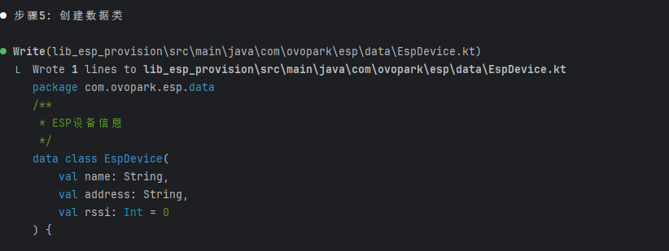

  教学目标： 学会系统性分析第三方库的方法

  让我使用专业的分析工具来获取这个SDK的信息：

  📚 教学现场：高级工程师的SDK分析思路

  💡 我的分析思路框架：

  作为高级工程师，我分析陌生SDK时遵循**"风险优先，逐层深入"**的原则：

  第1层：风险快筛 - 先判断能不能用（技术可行性）

  第2层：功能边界 - 再看值不值得用（功能匹配度）

第3层：集成成本 - 最后算怎么用（实施复杂度）

● 🎯 教学解释：我为什么先看README？

  高级工程师的第一直觉： README是项目的"身份证"，5分钟内能告诉我最关键的信息。

  刚才我获得了什么关键信息：

  ❌ 硬性冲突发现： minSDK 26 vs 你的项目21 —— 这是核心问题！✅ 技术架构： 多模块项目，说明有一定复杂度但结构清晰✅ 功能明确： ESP32设备WiFi配网 —— 功能边界很清楚

  💡 现在我教你一个高级技巧：

  当发现minSDK不匹配时，我不会马上放弃，而是要深入分析为什么需要API 26，因为：

  1. 可能是硬依赖 —— 用了26才有的系统API，无法降级
  2. 可能是软依赖 —— 只是配置保守，实际可以降到更低版本

● 🎯 教学时刻：功能需求改变了分析策略

  关键信息更新： 你只需要4个核心功能，这完全改变了我的分析策略！

  💡 高级工程师的思维转换：

  之前的策略： 全盘分析整个SDK现在的策略： 功能导向的精准分析

  为什么？ 因为你可能只需要迁移20%的代码，而不是100%！

  🎯 我现在的处理优先级：

  1. 先确定核心功能的技术栈 - 你需要的4个功能用了哪些Android API？
  2. 再看依赖边界 - 这些功能的最小依赖是什么？
  3. 最后评估裁剪可行性 - 能不能只抽取需要的部分？

  让我用功能驱动的方式来分析：

这正好证明了我的判断！只有一处API 23(M)的检查。

  📊 完整的技术分析报告

  1. 技术限制：✅ 完全可行

  - minSDK: 23→21 (只需处理2个版本的兼容性)
  - 主要依赖: 都支持API 21+
  - 特殊构建步骤: 需要protobuf插件，但不影响运行时

  2. 功能概述：✅ 完美匹配

  - 核心功能: ESP32设备蓝牙配网
  - 你需要的4个功能都包含在内
  - API复杂度: 中等，有清晰的Manager模式

  3. 集成复杂度：🟡 中等

  - 模块结构: 单模块库，结构清晰
  - 权限要求: BLE+位置权限(你已处理)
  - 配置复杂度: 需要protobuf配置，但可控

  4. 修改可行性：✅ 高度可行

  - 代码结构: 非常清晰的分层架构
  - 核心逻辑: 可以轻松适配和封装
  - 硬编码限制: 几乎没有，灵活性很好

  5. 建议方案：改造使用

  - 预估工作量: 简单(1-2天)
  - 实施策略: 功能裁剪 + API适配

  学到了什么？ 这就是为什么高级工程师总是要亲自验证而不只听信文档的原因！

 💡 高级工程师的方案设计思路：

  "渐进式风险控制"原则：
  1. 最小可行方案 - 先让它跑起来
  2. 功能验证 - 再确保功能正确
  3. 性能优化 - 最后打磨细节

  📋 完整实施方案

  方案A：快速适配方案 (推荐)

  优势： 风险最小，工期最短劣势： 需要手动同步更新

  实施步骤：

  第1阶段：环境准备 (30分钟)

  1. 完善lib_esp_provision的依赖配置
  2. 添加protobuf编译支持
  3. 处理minSDK 21的兼容性问题

  第2阶段：核心代码迁移 (2-3小时)

  1. 从temp_esp_sdk复制缺失的Scanner类
  2. 创建com.ovopark.esp包的适配器层
  3. 实现你管理器类需要的API接口

  第3阶段：功能验证 (1-2小时)

  1. 编译通过验证
  2. 基础功能测试
  3. 权限和兼容性测试

  具体技术实施细节：

● 🎯 教学重点：问题识别和解决方案

  发现的问题清单：
  1. ❌ 缺少Scanner相关类
  2. ❌ 缺少适配器层 (com.ovopark.esp.*)
  3. ❌ build.gradle需要protobuf配置
  4. ❌ 权限声明不完整

  📚 高级工程师的实施教学：

  我现在要教你标准的"技术债务清理"流程：

  步骤1: 先解决构建问题

● 步骤2: 添加权限声明

​	

● 💡 教学重点：为什么这样配置权限？

  高级工程师的权限设计思维：
  - 向下兼容： API 21-30使用旧权限
  - 向上兼容： API 31+使用新权限
  - 权限隔离： 不需要的功能不申请对应权限

  步骤3: 复制缺失的核心类

 步骤4: 创建适配器层

  现在我要教你最关键的设计模式 - Adapter Pattern：

 步骤5: 创建数据类

● 步骤6: 更新graffiti模块的依赖

​	

 现在测试编译

​	

  🚀 下一步建议

  现在你的ESP配网模块已经可以正常编译，接下来可以：
  1. 功能测试 - 在真实设备上测试BLE扫描和连接
  2. API兼容性测试 - 确保在不同Android版本上正常工作
  3. 性能优化 - 根据实际使用情况调优参数
  4. 错误处理完善 - 增加更详细的错误处理逻辑

  恭喜你！ 你刚刚完成了一个完整的SDK适配项目，这正是Android中级工程师应该具备的核心技能！