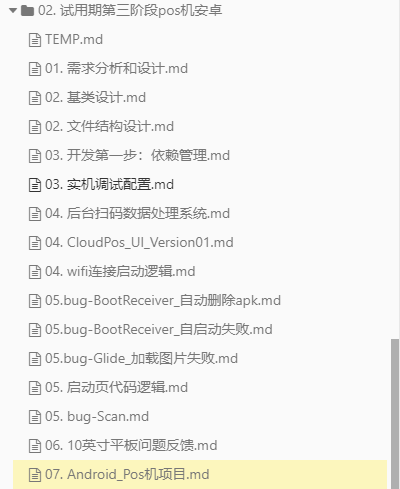

[toc]

## 01.开发流程

- 主线开发modulize是主分支，一般开发可以新建一个自己的分支，功能开发完成后在自己的分支打包提测验证好后再提交到modulize分支

- http://git-inc.ovopark.com:6780/android/ovopark

- 具体操作:

  - 克隆仓库和初始化

    - ```
      # 克隆仓库（首次操作）
      git clone <仓库URL>
      cd <项目目录>    
      
      # 切换到主分支并更新
      git checkout modulize
      git pull origin modulize
      ```
  - 创建学习分支

    - ```
      # 基于最新主分支创建学习分支
      git checkout -b test/yourname-learning  # 推荐命名格式：test/开发者-用途
      ```
  
  - 实际开发
  
    - ```
      # 开发过程中的常规操作（循环执行）
      修改代码后...
      git add .  # 添加所有修改
      git commit -m "docs: 添加学习注释"  # 提交信息需明确（推荐使用约定式提交）
      
      # 推送分支到远程（可选备份）
      git push -u origin test/yourname-learning  # 首次推送需加 -u
      ```
  
- 定期拉取主分支更新代码
  
  - ```
      # 在个人分支操作时合并主分支最新代码
    git fetch origin  # 获取远程更新
      git merge origin/modulize  # 合并到当前分支
      
      # 或使用 rebase（保持线性历史）
      git rebase modulize  # 需在 test 分支执行
    ```
  
- 打包提测
  
  - ```
      # 在 test 分支执行构建（根据项目实际命令）
    ./gradlew assembleDebug  # Android项目示例
      # 将构建产物（如apk文件）提交测试
    ```
  
- 合并到主分支
  
  - ```
      # 确保测试通过后操作
      git checkout modulize
      git pull origin modulize  # 再次确认主分支最新
      git merge test/yourname-learning --no-ff  # 保留合并记录
      
      # 解决冲突（如有）
      git mergetool  # 使用可视化工具
      git commit -m "merge: 合并学习分支"
      
    # 推送主分支
      git push origin modulize
    ```
  
- 分支清理
  
  - ```
      # 删除本地分支
    git branch -d test/yourname-learning
      
    # 选择性删除远程分支
      git push origin --delete test/yourname-learning
    ```
  

## 02.开发项目文件夹结构

- 结构如下:
- 
- TEMP
- 01表示需求刚到来时的需求分析和整体设计思路
- 02表示各个模块的设计，包含：文件结构设计，基类设计等
- 03表示开发初期环境配置，调试等遇到的问题
- 04表示feat,bug,refactor
- 05表示study
- 06表示和他人的沟通
- 07表示项目的总结，反思。