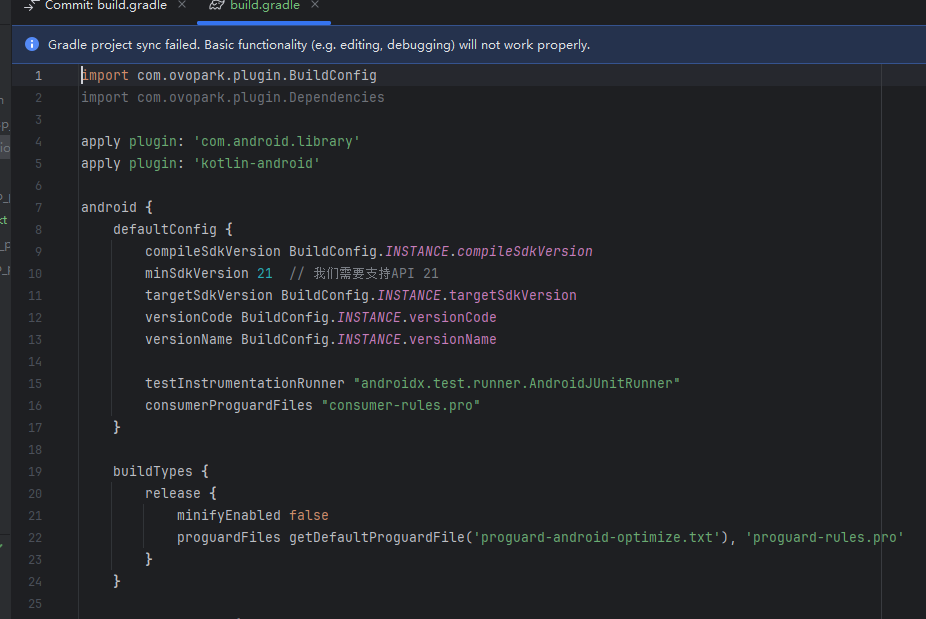
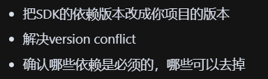
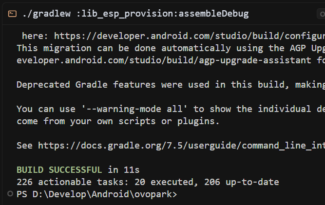
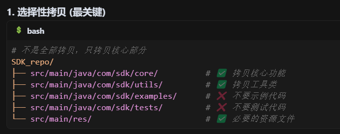
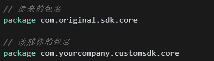
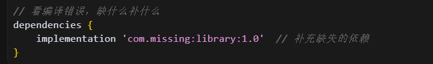
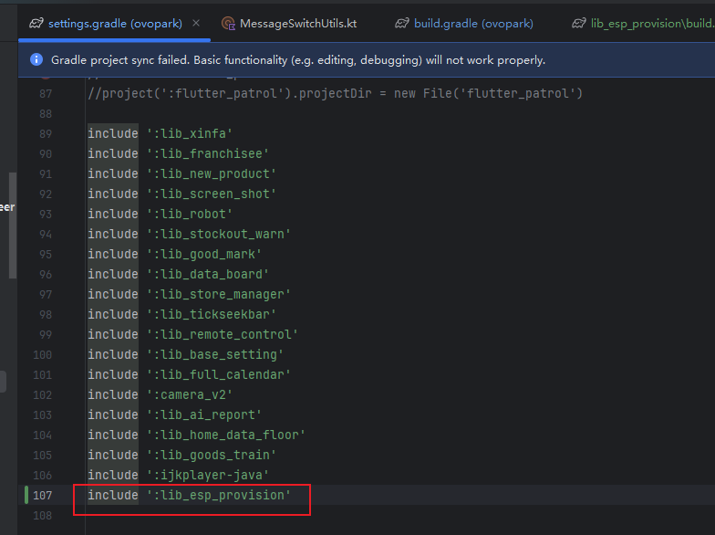
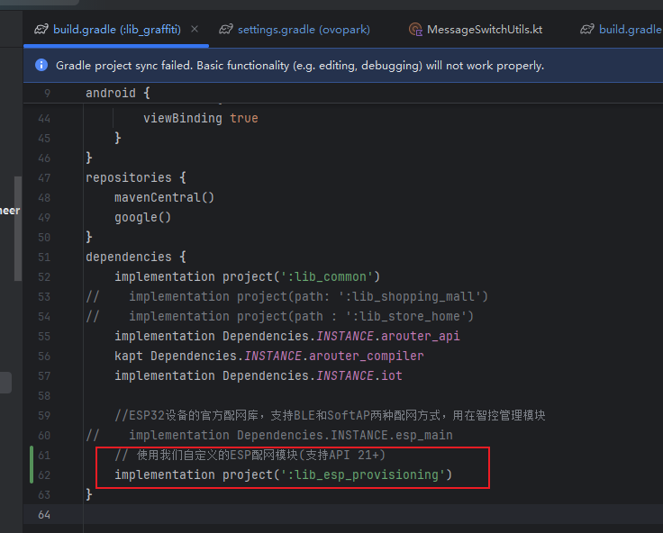

[toc]

## 01.功能概述

- **功能ID**：
- **功能名称**：
- **目标版本**：v0.2.0
- **提交人**：@panruiqi  
- **状态**：
  - [x] ⌛ 设计中 /
  - [ ] ⌛ 开发中 / 
  - [ ] ✅ 已完成 / 
  - [ ] ❌ 已取消  
- **价值评估**：  
  - [x] ⭐⭐⭐⭐⭐ 核心业务功能  
  - [ ] ⭐⭐⭐⭐ 用户体验优化  
  - [ ] ⭐⭐⭐ 辅助功能增强  
  - [ ] ⭐⭐ 技术债务清理  
- **功能描述** 
  - 

## 02.需求分析

### 2.1 思路分析

您先回答我一个问题：假如我现在有一个SDK，我需要拉取仓库下来自己编译执行，修改一些成为自己想用的，成为一个模块，请问我该做哪些步骤？请给我标准化的步骤

### 2.2 学习知识预览

这个阶段会学习到哪些知识？

## 03.实现规划

### 3.1 需求分析

### 3.2 技术调研

### 3.3 架构设计

 我的模块化策略：
  temp_esp_sdk/     ← 研究用临时目录
  lib_esp_provision/ ← 独立ESP模块
  lib_graffiti/     ← 业务封装层

  设计原则：

  - 职责单一： 每个模块专注特定功能
  - 依赖隔离： 避免循环依赖
  - 渐进验证： 先编译通过，再功能验证

### 3.4 环境初步搭建

目的：建立一个"干净的编译环境"，验证SDK能否在你的项目环境下正常构建

步骤：

- 构建一个新的module，然后把核心的build.gradle改好。
  - 
- 依赖适配
  - 
- 隔离验证：验证这个SDK单依赖能否编译通过
  - 

### 3.5 代码迁移

目的：让SDK的源码在你的新module里能编译通过，不管功能对不对

步骤：

- 选择性拷贝

  - 

- 包名适配：

  - 

- 解决编译问题

  - 解决import错误

  - 解决missing class问题

  - 解决resource找不到的问题

  - 目标：./gradlew assembleDebug 能过

- 依赖补全

  - 

### 3.6 定制化需求

目的：在保持对外API不变的前提下，替换内部实现来满足你的需求

### 3.7 集成到项目中

目的：无缝替换：让项目的其他模块在不知情的情况下使用你的定制SDK

步骤：

- Project中添加
  - 
- lib中使用
  - 

### 3.8 优化

## 04.测试方案

### 4.1 核心用例

### 4.2 性能指标

## 05.发布计划

### 5.1 阶段发布

### 5.2 回滚方案

## 06.文档记录

### 6.1 技术文档

### 6.2 学习文档

### 6.3 监控埋点

