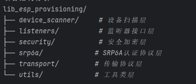

## 01.基础熟悉阶段

目的：建立SDK的基本认知，快速上手

- 基本信息收集（版本、依赖、功能特性）
    - SDK名称：lib_esp_provisioning (ESP蓝牙配网库)
    - 最低API：21 (Android 5.0)
    - 核心功能：ESP设备蓝牙配网、WiFi扫描、二维码扫描
    - 关键依赖：protobuf、EventBus、CameraX、ML Kit
- 项目结构概览（模块划分、包命名）
  - 
- 快速上手体验（最小化测试用例）

> 应该以点破面，通过Demo，看其日志，通过日志深入理解SDK

## 02.整体认知阶段

目标：建立SDK整体架构认知，理解模块间关系

- 架构图绘制

- 数据流分析：

  - ```
    🔄 配网数据流程图
    ┌─────────────────────────────────────────────────────────────┐
    │ 1. 设备发现 → 2. 建立连接 → 3. 安全握手 → 4. WiFi配网      │
    │                                                            │
    │ BLE扫描 → GATT连接 → Security握手 → 配网数据传输 → 结果确认 │
    └─────────────────────────────────────────────────────────────┘
    ```

- 设计模式识别

- 对外API梳理

  - ```
    // 1. 设备管理API
    ESPProvisionManager.getInstance(context)
    createESPDevice(transport, security)
    
    // 2. 设备扫描API  
    startBleScan(prefix, listener)
    startWifiScan(listener)
    
    // 3. 配网操作API
    provision(ssid, passphrase, listener)
    scanNetworks(listener)
    
    // 4. QR码扫描API
    scanQRCode(activity, listener)
    ```

## 03.重点认知阶段

目标：识别核心模块，建立优先级认知，能够准确评估各模块的重要性和复杂度，制定合理学习计划

核心模块识别矩阵：

| 模块                | 重要程度 | 复杂程度 | 优先级 | 功能说明               |
| ------------------- | -------- | -------- | ------ | ---------------------- |
| ESPDevice           | 🔴高      | 🔴高      | P1     | 核心设备控制和配网逻辑 |
| Security2/SRP6A     | 🔴高      | 🔴高      | P1     | 安全认证协议实现       |
| BLETransport        | 🔴高      | 🟡中      | P1     | 蓝牙通信封装           |
| ESPProvisionManager | 🔴高      | 🟡中      | P2     | 对外API管理            |
| BleScanner          | 🟡中      | 🟡中      | P2     | 设备扫描功能           |
| Protobuf Messages   | 🟡中      | 🟢低      | P3     | 协议数据结构           |

关键技术点识别 🔍

- 并发控制：ExecutorService + Semaphore

- 加密通信：Tink + SRP6A协议

- 蓝牙通信：GATT Client实现

- 协议序列化：Protocol Buffers

- 事件通信：EventBus解耦

性能关注点 ⚡

- 蓝牙连接稳定性

- 大数据量传输优化

- 内存泄漏防范

- 线程池管理

## 04.深入研究阶段

目的：深入理解核心模块，具备二次开发能力

● 逐模块深入分析


### 05.扩展学习方向

立即可行的深入方向：

1. Security2/SRP6A模块：深入理解认证协议实现

1. BLETransport模块：学习蓝牙通信的最佳实践

1. 完整配网流程：端到端追踪数据流

扩展学习方向：

1. 对比学习：分析其他IoT配网SDK的设计差异

1. 性能优化：识别潜在瓶颈，提出改进方案

1. 功能扩展：基于现有架构，设计新功能模块

这套四层递进的标准化流程，可以复制应用到任何SDK的学习中，帮助您快速建立系统性认知并达到深度理解的目标。