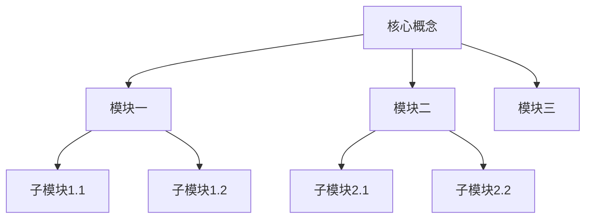

[toc]

## 01.项目概述

- **学习项目ID**：`LEARN-YYYYMMDD-001`
- **项目名称**：
- **学习周期**：YYYY.MM.DD - YYYY.MM.DD (预计X周/月)
- **负责人**：@panruiqi
- **状态**：
  - [x] 📝 规划阶段
  - [ ] 🚀 进行中
  - [ ] ✅ 已完成
  - [ ] ❌ 已终止

- **价值评估**：
  - [ ] ⭐⭐⭐⭐⭐ 核心技术能力
  - [ ] ⭐⭐⭐⭐ 项目关键依赖
  - [ ] ⭐⭐⭐ 效率提升工具
  - [ ] ⭐⭐ 扩展知识储备

- **项目描述**：
  - 

- **成果物预期**：
  - [ ] 技术文档
  - [ ] 示例代码
  - [ ] 源码分析
  - [ ] 工具库封装

## 02.知识地图

### 2.1 前置知识评估

| 知识点 | 掌握程度(1-5) | 是否需要补充学习 | 补充资源链接 |
| :----- | :------------ | :--------------- | :----------- |
|        |               |                  |              |

### 2.2 核心知识模块

### 2.3 学习路径规划

1. **入门阶段**：基础概念 → 简单应用
2. **进阶阶段**：核心原理 → 常见模式
3. **深入阶段**：源码分析 → 定制扩展
4. **实践阶段**：示例项目 → 问题解决

## 03.阶段规划

### 3.1 第一阶段：概念理解 (X周)

- **目标**：掌握基本概念和使用场景
- **学习内容**：
  - [ ] 核心概念A
  - [ ] 核心概念B
  - [ ] 基本API使用
- **实践任务**：
  - [ ] 完成XX示例
  - [ ] 编写XX笔记
- **验收标准**：
  - [ ] 能够解释核心概念
  - [ ] 能够使用基本API
- **输出物**：
  - [ ] 学习笔记
  - [ ] 示例代码

### 3.2 第二阶段：原理探究 (X周)

- **目标**：理解内部工作机制
- **学习内容**：
  - [ ] 设计原理
  - [ ] 核心流程
  - [ ] 关键类解析
- **实践任务**：
  - [ ] 绘制流程图
  - [ ] 调试关键代码
- **验收标准**：
  - [ ] 能够分析关键流程
  - [ ] 能够定位常见问题
- **输出物**：
  - [ ] 原理分析文档
  - [ ] 流程图

### 3.3 第三阶段：源码分析 (X周)

- **目标**：掌握核心实现细节
- **学习内容**：
  - [ ] 源码结构分析
  - [ ] 关键算法实现
  - [ ] 扩展点识别
- **实践任务**：
  - [ ] 注释关键源码
  - [ ] 编写分析报告
- **验收标准**：
  - [ ] 能够解释关键实现
  - [ ] 能够进行功能扩展
- **输出物**：
  - [ ] 源码分析报告
  - [ ] 功能扩展示例

### 3.4 第四阶段：实战应用 (X周)

- **目标**：在实际项目中应用所学
- **学习内容**：
  - [ ] 最佳实践整理
  - [ ] 性能优化技巧
  - [ ] 问题排查方法
- **实践任务**：
  - [ ] 完成实战项目
  - [ ] 解决X个实际问题
- **验收标准**：
  - [ ] 项目正常运行
  - [ ] 代码质量达标
- **输出物**：
  - [ ] 项目代码
  - [ ] 技术总结

## 04.资源清单

### 4.1 学习资料

| 资料类型 | 名称 | 链接 | 优先级(1-5) |
| :------- | :--- | :--- | :---------- |
| 官方文档 |      |      |             |
| 书籍     |      |      |             |
| 视频教程 |      |      |             |
| 博客文章 |      |      |             |
| 源码仓库 |      |      |             |

### 4.2 工具准备

| 工具类型 | 名称 | 用途 | 获取方式 |
| :------- | :--- | :--- | :------- |
|          |      |      |          |

## 05.时间安排

### 5.1 总体时间分配

| 阶段     | 计划时间 | 实际时间 | 偏差原因 |
| :------- | :------- | :------- | :------- |
| 第一阶段 |          |          |          |
| 第二阶段 |          |          |          |
| 第三阶段 |          |          |          |
| 第四阶段 |          |          |          |

### 5.2 里程碑计划

| 里程碑 | 预计日期 | 完成标志 | 状态 |
| :----- | :------- | :------- | :--- |
|        |          |          |      |

### 5.3 每周学习计划

| 周次  | 学习目标 | 学习内容 | 时间分配 |
| :---- | :------- | :------- | :------- |
| 第1周 |          |          |          |
| 第2周 |          |          |          |

## 06.学习追踪

### 6.1 进度记录表

| 日期 | 学习内容 | 学习时长 | 完成度(%) | 问题记录 |
| :--- | :------- | :------- | :-------- | :------- |
|      |          |          |           |          |

### 6.2 知识点掌握评估

| 知识点 | 初始理解(1-5) | 当前掌握(1-5) | 提升方法 |
| :----- | :------------ | :------------ | :------- |
|        |               |               |          |

### 6.3 遇到的难点与解决方案

| 难点描述 | 解决方案 | 参考资料 | 状态 |
| :------- | :------- | :------- | :--- |
|          |          |          |      |

## 07.成果积累

### 7.1 学习笔记索引

| 笔记标题 | 关联知识点 | 创建日期 | 链接 |
| :------- | :--------- | :------- | :--- |
|          |            |          |      |

### 7.2 代码示例索引

| 示例名称 | 演示功能 | 代码路径 | 说明 |
| :------- | :------- | :------- | :--- |
|          |          |          |      |

### 7.3 问题解决记录

| 问题描述 | 解决方案 | 相关知识点 | 日期 |
| :------- | :------- | :--------- | :--- |
|          |          |            |      |

## 08.复盘与优化

### 8.1 阶段复盘

| 阶段 | 预期目标 | 实际成果 | 差距分析 | 改进措施 |
| :--- | :------- | :------- | :------- | :------- |
|      |          |          |          |          |

### 8.2 学习方法评估

| 学习方法 | 效果评分(1-5) | 优点 | 不足 | 改进建议 |
| :------- | :------------ | :--- | :--- | :------- |
|          |               |      |      |          |

### 8.3 知识应用情况

| 应用场景 | 应用效果 | 存在问题 | 解决方案 |
| :------- | :------- | :------- | :------- |
|          |          |          |          |

## 09.项目示例

### 9.1 WMRouter学习规划示例

#### 项目概述
- **学习项目ID**：`LEARN-20240709-001`
- **项目名称**：WMRouter源码分析与应用
- **学习周期**：2024.07.09 - 2024.08.20 (预计6周)
- **状态**：📝 规划阶段

#### 阶段规划示例

**第一阶段：概念理解 (1周)**
- **学习内容**：
  - [ ] URI跳转核心设计思路
  - [ ] UriRequest、UriHandler、UriInterceptor基本概念
  - [ ] ServiceLoader模块基本用法
- **输出物**：
  - [ ] WMRouter架构概念图
  - [ ] 基本API使用示例

**第二阶段：实践应用 (2周)**
- **学习内容**：
  - [ ] URI分发流程与配置
  - [ ] 注解用法(RouterUri、RouterRegex、RouterPage)
  - [ ] ServiceLoader实际应用
- **输出物**：
  - [ ] 演示各种跳转场景的Demo应用
  - [ ] 常见配置方案总结

**第三阶段：源码分析 (2周)**
- **学习内容**：
  - [ ] 核心类源码分析
  - [ ] 注解处理器实现机制
  - [ ] 编译期代码生成逻辑
- **输出物**：
  - [ ] 源码分析文档
  - [ ] 核心流程时序图

**第四阶段：扩展应用 (1周)**
- **学习内容**：
  - [ ] 高级配置与自定义扩展
  - [ ] 性能优化与问题排查
  - [ ] 与其他路由框架对比
- **输出物**：
  - [ ] 自定义扩展示例
  - [ ] 最佳实践总结文档

## 10.附录

### 10.1 学习资源库

### 10.2 常用工具说明

### 10.3 复习计划