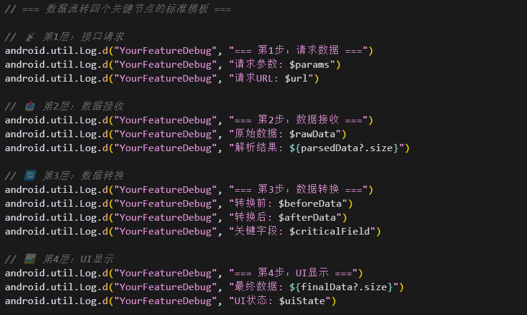
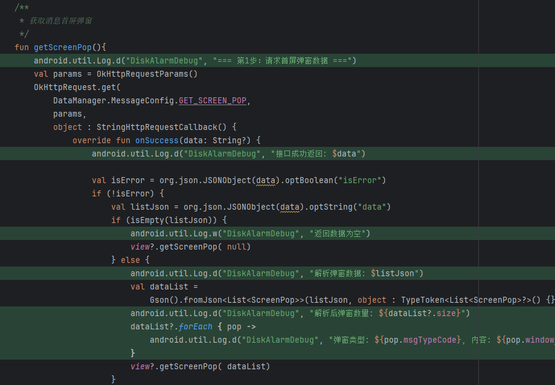
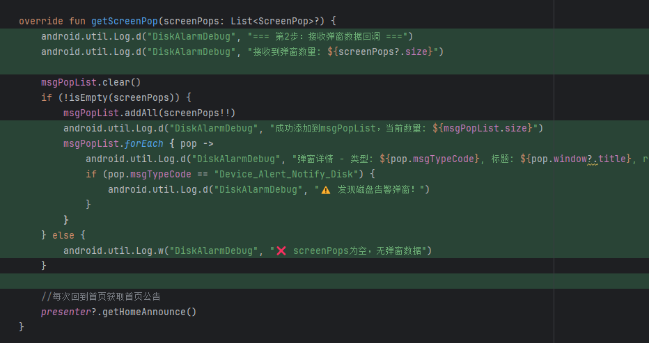
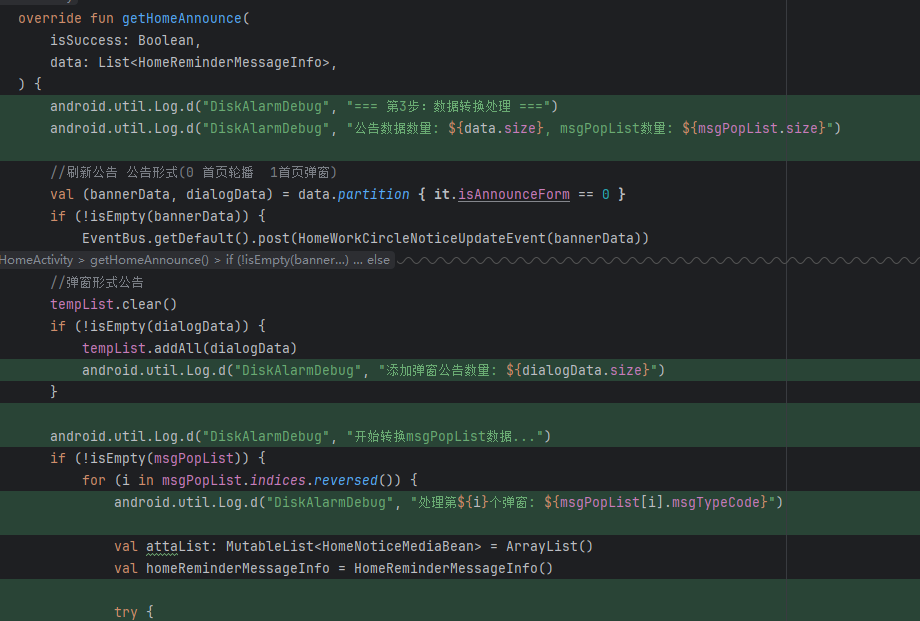
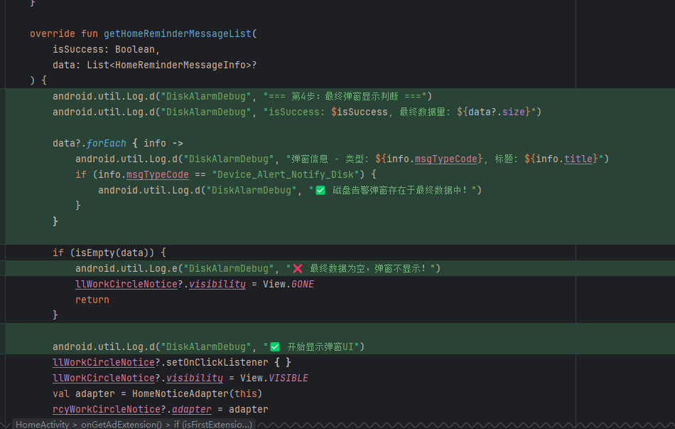

# AI调试请求标准模板

## 问题描述
**现象**：[具体描述，如：后端发送了数据，但前端没有弹窗显示]
**功能模块**：[如：首屏弹窗、消息通知、数据展示等]
**相关文件**：[如：HomeActivity.kt, MessageSwitchUtils.kt]

## 调试需求
请在以下**数据流转关键节点**添加详细日志：

### 第1层：数据请求层
- [ ] 接口调用入口
- [ ] 请求参数
- [ ] 响应结果

### 第2层：数据接收层  
- [ ] 回调方法入口
- [ ] 原始数据内容
- [ ] 数据解析结果

### 第3层：数据处理层
- [ ] 数据转换逻辑
- [ ] 类型转换过程
- [ ] 中间处理结果

### 第4层：UI显示层
- [ ] 最终数据检查
- [ ] UI状态判断
- [ ] 显示逻辑验证

## Debug TAG要求
请使用统一TAG：`"[功能名]FlowDebug"`

## 期望输出
- 完整的调试代码
- 日志查看命令
- 问题排查步骤表

## 关键模板如下



```
// === 数据流转四个关键节点的标准模板 ===

// 📡 第1层：接口请求
android.util.Log.d("YourFeatureDebug", "=== 第1步：请求数据 ===")
android.util.Log.d("YourFeatureDebug", "请求参数: $params")
android.util.Log.d("YourFeatureDebug", "请求URL: $url")

// 📥 第2层：数据接收  
android.util.Log.d("YourFeatureDebug", "=== 第2步：数据接收 ===")
android.util.Log.d("YourFeatureDebug", "原始数据: $rawData")
android.util.Log.d("YourFeatureDebug", "解析结果: ${parsedData?.size}")

// 🔄 第3层：数据转换
android.util.Log.d("YourFeatureDebug", "=== 第3步：数据转换 ===") 
android.util.Log.d("YourFeatureDebug", "转换前: $beforeData")
android.util.Log.d("YourFeatureDebug", "转换后: $afterData")
android.util.Log.d("YourFeatureDebug", "关键字段: $criticalField")

// 🖼️ 第4层：UI显示
android.util.Log.d("YourFeatureDebug", "=== 第4步：UI显示 ===")
android.util.Log.d("YourFeatureDebug", "最终数据: ${finalData?.size}")
android.util.Log.d("YourFeatureDebug", "UI状态: $uiState")
```

举例：

- 接口请求
  - 
- 数据接收
  - 
- 数据转换
  - 
- UI显示
  - 


# 数据流转问题快速排查清单

好，给出日志了，我们该怎使用他呢？

## 🔍 5分钟快速定位法

###  步骤1：查看日志 (1分钟)

```
adb logcat | grep "YourFeatureFlowDebug"
```

### 步骤2：按层排查 (4分钟)

| 层级 | 关键日志 | 正常表现 | 异常处理 |

|------|----------|----------|----------|

| **第1层：请求** | `=== 第1步：请求数据 ===` | 看到请求参数和URL | ❌ 检查调用时机和条件 |

| **第2层：接收** | `=== 第2步：数据接收 ===` | 看到数据内容和数量 | ❌ 检查网络和后端接口 |

| **第3层：转换** | `=== 第3步：数据转换 ===` | 转换前后数据完整 | ❌ 检查数据解析和类型转换 |

| **第4层：显示** | `=== 第4步：UI显示 ===` | 最终数据非空 | ❌ 检查UI逻辑和条件判断 |

### 步骤3：定位问题类型

\- **第1层失败** → 调用时机问题 (检查生命周期、触发条件)

\- **第2层失败** → 网络/接口问题 (抓包验证、检查参数)  

\- **第3层失败** → 数据处理问题 (类型转换、字段匹配)

\- **第4层失败** → UI逻辑问题 (条件判断、控件状态)


## ⚡ 常见问题模式

\1. **数据有，显示无** → 重点查第3、4层

\2. **接口有，数据无** → 重点查第1、2层  

\3. **间歇性问题** → 重点查第1层的调用条件

\4. **首次正常，后续异常** → 重点查数据清理和重置逻辑 