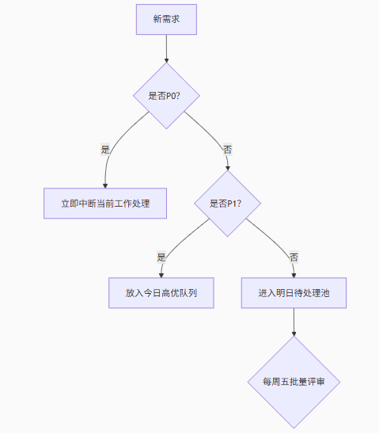

[toc]

## 00.前言

> 我们正在为Android开发者构建一套完整的需求处理规范，涵盖沟通、处理流程和团队认可机制。这套规范需要解决几个核心痛点：
>
> 1. 需求来源混乱（产品/测试/业务方直接提）
>
> 2. Bug与需求优先级冲突
>
> 3. 个人时间被碎片化
>
> 4. 团队对工作量无感知
>
> 
>
> 规范将分为三大部分：
>
> 1. 需求入口标准化（解决沟通混乱）
>
> 2. 内部处理流水线（建立个人工作秩序）
>
> 3. 团队认可机制（通过数据和可视化获得尊重）

## 01.需求入口标准化

- ```
  [!type] [Android] 需求标题
  ## 1. 业务价值（必填）
  - 解决什么用户问题？  
  - 不做会损失多少订单/用户？  
  ## 2. 技术影响（选填）
  - 涉及哪些Activity/Fragment？  
  - 是否影响现有架构？  
  ## 3. 优先级自评
  - [ ] P0（线上崩溃）  
  - [ ] P1（核心功能阻塞）  
  - [ ] P2（体验优化）  
  - [ ] P3（视觉调整）  
  ## 4. 验收标准
  - [ ] 设备兼容性要求  
  - [ ] 性能指标（如响应<200ms）  
  ## 5. 关联证据
  - 崩溃日志链接：  
  - 设计稿链接：  
  ```

> **注**：不符合模板的需求自动视为P3


## 02.需求处理流水线

- 分级响应机制

  - 

- 时间分配原则

  - | 时间段      | 专注领域        | 免打扰规则      |
    | :---------- | :-------------- | :-------------- |
    | 9:00-11:00  | P0/P1 Bug修复   | 禁用会议/IM通知 |
    | 13:00-15:00 | 功能开发        | 仅响应P0事件    |
    | 15:00-16:00 | 需求评审 & 沟通 | 开放预约        |
    | 16:00-18:00 | 技术债/重构     | 关闭群消息      |

- 

### 🚨 Android Bug分级标准（技术侧重点）

| 等级            | 响应时效 | 技术影响范围                            | 具体场景示例（Android相关）                                  | 测试提交要求                                                 |
| :-------------- | :------- | :-------------------------------------- | :----------------------------------------------------------- | :----------------------------------------------------------- |
| **P0** （致命） | ≤1小时   | **导致应用不可用**                      | 1. 启动崩溃（`Application.onCreate()`异常） 2. 主线程死锁（ANR > 5s） 3. 核心页面闪退（如`PaymentActivity`因空指针崩溃） | 必须提供： - Logcat崩溃堆栈 - 设备/OS版本 - 复现视频         |
| **P1** （阻塞） | ≤4小时   | **核心功能中断** （涉及支付/订单/数据） | 1. 支付流程阻塞（如`onActivityResult`未回调） 2. 数据不同步（购物车价格不更新） 3. 导航栈错乱（扫码返回错误页面） | 必须提供： - 复现步骤 - 涉及Fragment/Activity名称 - 网络抓包（若涉及API） |
| **P2** （高优） | ≤24小时  | **非核心功能异常** （影响用户体验）     | 1. 内存泄漏（`Activity`退出后未释放） 2. 异步线程UI更新失败（价格未刷新） 3. 动画卡顿（丢帧>30%） | 建议提供： - Profiler报告 - 截图/视频                        |
| **P3** （优化） | 排期处理 | **视觉/交互优化**                       | 1. 文字截断（`TextView` ellipsize失效） 2. 间距不对（dp单位错误） 3. 无功能影响的控制台警告 |                                                              |