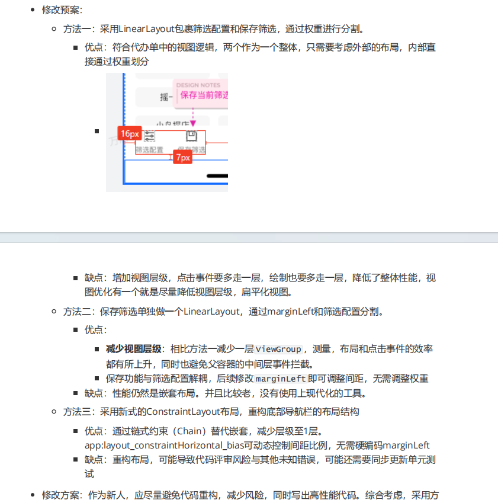
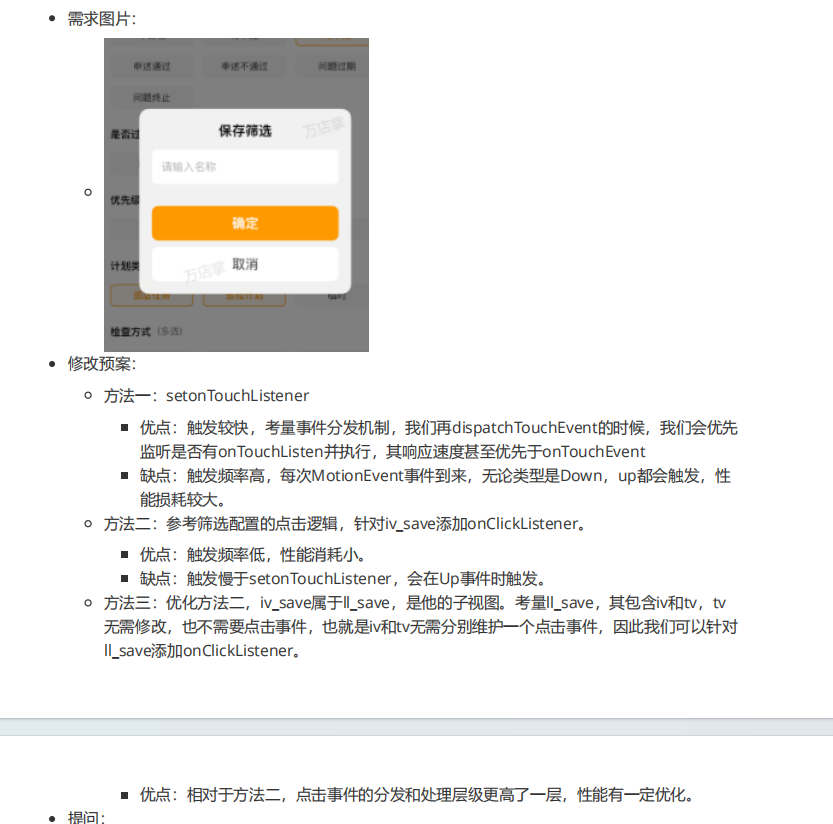

好的，哥 

我会按时完成任务，同时不仅仅局限于需求的实现，我会综合考量多种可行的方案提交给导师，跟导师沟通后选取合适的方案，同时针对已有的代码提出一定程度的改进建议。

针对代码质量，我会先采取较为保守的方法，参考过往的代码框架，采用过往的编码习惯（一定程度上的优化），不会进行大的UI或代码的重构

同时我也会积极和导师沟通我的代码编写思路，确保理论正确后，再在本地做好自测。然后上线后我也会加班监控是否有线上问题的存在。

在这个过程中我也会输出一些技术文档和新技术的应用和分享案例

同时我感觉这些评分标准和我之前与导师沟通的过程很匹配。

