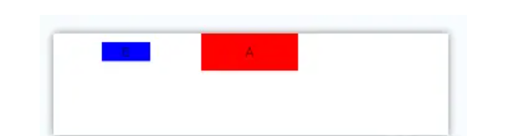
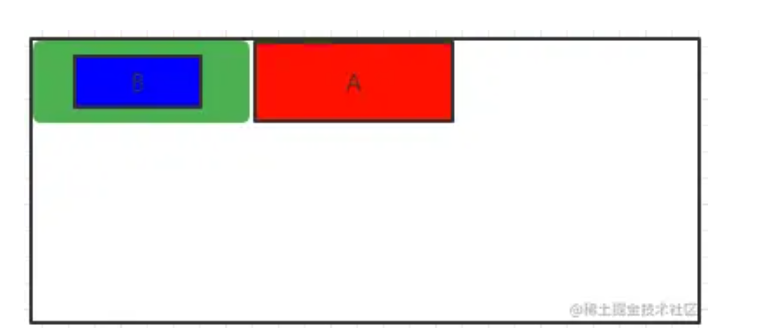
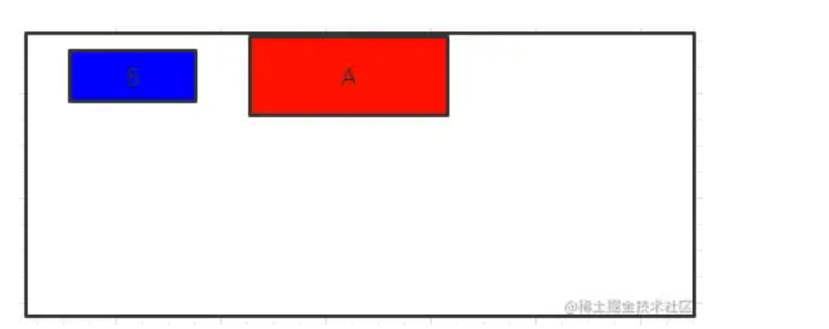
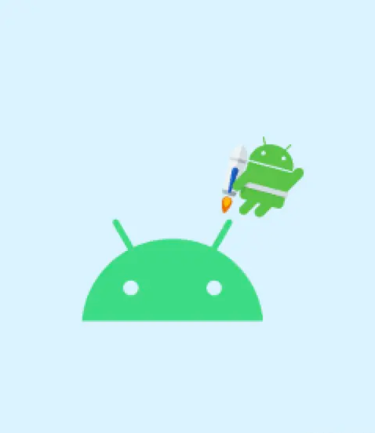

[toc]

## 前言

> 我们为什么在复杂布局的中要使用ConstraintLayout（约束布局）？
>
> 使用RelativeLayout，LinearLayout去嵌套不好吗？从功能实现上，当然不碍事，但是嵌套的ViewGroup会导致手机多次测量和绘制，从而影响性能，如果嵌套严重可能出现掉帧或卡顿。
>
> 我们使用ConstraintLayout是因为：传统布局能实现的，它能轻松实现实现。传统布局不能实现的，它也能实现。

- 例一：

  - 如图下图所示，我们分别用RelativeLayout和ConstraintLayout去实现它：

    - 

  - 使用RelativeLayout的实现如下：

    - ```
      <RelativeLayout...>
      
      
          <TextView
              android:id="@+id/txt_a"
              android:layout_centerHorizontal="true"
              .../>
      
          <RelativeLayout
              android:layout_alignTop="@+id/txt_a"
              android:layout_toLeftOf="@+id/txt_a"
              android:layout_alignBottom="@+id/txt_a"
              ...>
      
              <TextView
                  android:layout_centerInParent="true"
                  android:id="@+id/txt_b"
                  .../>
      
          </RelativeLayout>
      
      
      </RelativeLayout>
      ```

    - 没什么好说的，A水平居中。B如果想垂直居于A的中央，那么必须要一个跟A保持一致的容器，然后再垂直居于该容器中部，用图层理解如下：

      - 最外层是 RelativeLayout（根布局）
      - 红色TextView_A 在顶部且横向居中。
      - 使用绿色 RelativeLayout上边和下边和A齐平，从而保证绿色RelativeLayout高度和A一样。且宽度满屏，在A左边
      - 蓝色TextView_B 在绿色RelativeLayout里居中。

    - 

  - 使用ConstraintLayout的实现如下：

    - ```
      <androidx.constraintlayout.widget.ConstraintLayout...>
      
          <TextView
              android:id="@+id/txt_a"
              app:layout_constraintRight_toRightOf="parent"
              app:layout_constraintLeft_toLeftOf="parent"
              .../>
      
          <TextView
              app:layout_constraintRight_toLeftOf="@+id/txt_a"
              app:layout_constraintLeft_toLeftOf="parent"
              app:layout_constraintTop_toTopOf="@+id/txt_a"
              app:layout_constraintBottom_toBottomOf="@+id/txt_a"
              android:id="@+id/txt_b"
              .../>
      
      </androidx.constraintlayout.widget.ConstraintLayout>
      
      ```

    - `app:layout_constraintRight_toRightOf="parent"， app:layout_constraintLeft_toLeftOf="parent"`共同实现了居于中央

    -  图层关系也很简单：

      - 

## 01. ConstraintLayout布局的使用

### 1.1 相对定位

- 这里的对齐是指：保持一致。比如：和父布局左边对齐，那么就会在父布局左边的位置。

- ```
  <!-- 基本方向约束 -->
  <!-- 我的什么位置在谁的什么位置 -->
  app:layout_constraintTop_toTopOf=""           我的顶部和谁的顶部对齐
  app:layout_constraintBottom_toBottomOf=""     我的底部和谁的底部对齐
  app:layout_constraintLeft_toLeftOf=""         我的左边和谁的左边对齐
  app:layout_constraintRight_toRightOf=""       我的右边和谁的右边对齐
  app:layout_constraintStart_toStartOf=""       我的开始位置和谁的开始位置对齐
  app:layout_constraintEnd_toEndOf=""           我的结束位置和谁的结束位置对齐
  
  app:layout_constraintTop_toBottomOf=""        我的顶部位置在谁的底部位置
  app:layout_constraintStart_toEndOf=""         我的开始位置在谁的结束为止
  <!-- ...以此类推 -->
  ```

- > tips：如果是app:layout_constraintTop_toTopOf 和 app:layout_constraintBottom_toBottomOf=  一起使用，那么既不是顶部对齐，也不是底部对齐，而是垂直居中


### 1.2 角度定位：

- ```
  app:layout_constraintCircle=""         目标控件id
  app:layout_constraintCircleAngle=""    对于目标的角度(0-360)
  app:layout_constraintCircleRadius=""   到目标中心的距离
  ```

- 举例：jetpack图标在android图标的45度方向，距离为60dp

  - 

  - ```
    <?xml version="1.0" encoding="utf-8"?>
    <androidx.constraintlayout.widget.ConstraintLayout xmlns:android="http://schemas.android.com/apk/res/android"
        xmlns:app="http://schemas.android.com/apk/res-auto"
        xmlns:tools="http://schemas.android.com/tools"
        android:layout_width="match_parent"
        android:layout_height="match_parent"
        android:background="#DAF3FE"
        tools:context=".MainActivity"
        tools:ignore="HardcodedText">
    
        <ImageView
            android:id="@+id/android"
            android:layout_width="100dp"
            android:layout_height="100dp"
            android:src="@drawable/android"
            app:layout_constraintBottom_toBottomOf="parent"
            app:layout_constraintEnd_toEndOf="parent"
            app:layout_constraintStart_toStartOf="parent"
            app:layout_constraintTop_toTopOf="parent" />
    
        <ImageView
            android:id="@+id/jetpack"
            android:layout_width="60dp"
            android:layout_height="60dp"
            android:src="@drawable/jetpack"
            app:layout_constraintCircle="@+id/android"
            app:layout_constraintCircleAngle="45"
            app:layout_constraintCircleRadius="70dp" />
    
    </androidx.constraintlayout.widget.ConstraintLayout>
    ```

- 基线对齐：

- 百分比偏移：

  - ```
    app:layout_constraintHorizontal_bias=""   水平偏移 取值范围是0-1的小数
    app:layout_constraintVertical_bias=""     垂直偏移 取值范围是0-1的小数
    ```

    


```
 <!-- 内容部分 -->
    <androidx.cardview.widget.CardView
        android:id="@+id/cv_SplashContent"
        android:layout_width="0dp"
        android:layout_height="0dp"
        android:layout_marginTop="35dp"
        android:layout_marginLeft="24dp"
        android:layout_marginRight="24dp"
        android:layout_marginBottom="70dp"
        app:cardCornerRadius="50dp"
        app:cardElevation="4dp"
        app:layout_constraintBottom_toBottomOf="parent"
        app:layout_constraintEnd_toEndOf="parent"
        app:layout_constraintStart_toStartOf="parent"
        app:layout_constraintTop_toBottomOf="@+id/ll_SplashTitle">

        <androidx.constraintlayout.widget.ConstraintLayout
            android:layout_width="match_parent"
            android:layout_height="match_parent">

            <ProgressBar
                android:id="@+id/pb_SplashLoading"
                style="?android:attr/progressBarStyleHorizontal"
                android:layout_width="500dp"
                android:layout_height="500dp"
                android:indeterminate="false"
                android:progress="0"
                android:max="100"
                android:progressDrawable="@drawable/circular_progress"
                app:layout_constraintVertical_bias="0.35"
                app:layout_constraintBottom_toBottomOf="parent"
                app:layout_constraintEnd_toEndOf="parent"
                app:layout_constraintStart_toStartOf="parent"
                app:layout_constraintTop_toTopOf="parent" />

            <ImageView
                android:id="@+id/iv_SplashCenterLogo"
                android:layout_width="wrap_content"
                android:layout_height="wrap_content"
                android:src="@mipmap/ic_logo_red"
                app:layout_constraintBottom_toTopOf="@+id/tv_SplashLoadingMessage"
                app:layout_constraintEnd_toEndOf="@+id/pb_SplashLoading"
                app:layout_constraintStart_toStartOf="@+id/pb_SplashLoading"
                app:layout_constraintTop_toTopOf="@+id/pb_SplashLoading"
                app:layout_constraintVertical_chainStyle="packed" />

            <TextView
                android:id="@+id/tv_SplashLoadingMessage"
                android:layout_width="wrap_content"
                android:layout_height="wrap_content"
                android:text="正在启动..."
                android:textColor="@color/color_7F7F7F"
                android:textSize="30dp"
                android:layout_marginTop="10dp"
                app:layout_constraintBottom_toBottomOf="@+id/pb_SplashLoading"
                app:layout_constraintEnd_toEndOf="@+id/pb_SplashLoading"
                app:layout_constraintStart_toStartOf="@+id/pb_SplashLoading"
                app:layout_constraintTop_toBottomOf="@+id/iv_SplashCenterLogo" />

        </androidx.constraintlayout.widget.ConstraintLayout>


    </androidx.cardview.widget.CardView>
```


