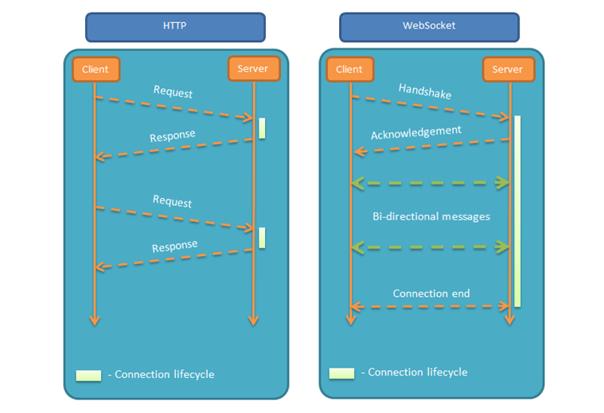
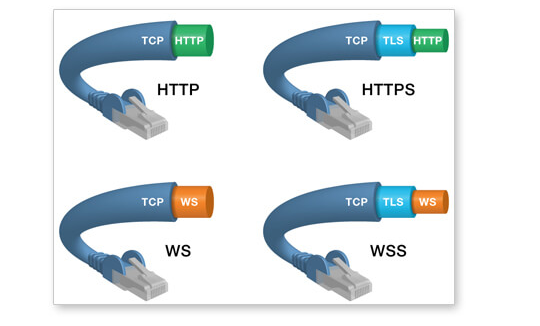

[toc]

## 前言

> 最近在开发中接触到了WebSocket
>
> 使用场景是：安卓pos机通过usb连接一个扫码枪，商户使用扫码枪扫码商品，安卓pos机需要从后端获取到用户扫码的商品的信息。
>
> 最初的解决方案：
>
> ​	我当时首先考虑的是轮询，不断向后端获取商品信息。
>
> ​	优化一次的是：扫码枪每次扫码后，发送一次系统广播，通过app接受到系统广播后再去进行轮询。一定程度上优化了轮询的效率，不会盲目轮询
>
> 后续在进行技术交流的时候，有人提议说可以用WebSocket。作为一个新人，我觉得我有必要学习一下WebSocket，看看他如何可以替代轮询，完成长时间双向通信的任务。

## 01.简介

### 1.1 为什么需要WebSocket

- 初次接触 WebSocket，我想问出一个问题：我们已经有了 HTTP 协议，为什么还需要另一个协议？它能带来什么好处？
- 答案很简单，因为 HTTP 协议有一个缺陷：通信只能由客户端发起。
  - 举例来说，我们想了解今天的天气，只能是客户端向服务器发出请求，服务器返回查询结果。HTTP 协议做不到服务器主动向客户端推送信息。
- 这种单向请求的特点，注定了**如果服务器有连续的状态变化，客户端要获知就非常麻烦**。我们只能使用["轮询"](https://www.pubnub.com/blog/2014-12-01-http-long-polling/)：每隔一段时候，就发出一个询问，了解服务器有没有新的信息。最典型的场景就是聊天室。
- 轮询的效率低，非常浪费资源（因为必须不停连接，或者 HTTP 连接始终打开）。因此，工程师们一直在思考，有没有更好的方法。WebSocket 就是这样发明的。

### 1.2 WebSocket简介

- WebSocket 协议在2008年诞生，2011年成为国际标准。所有浏览器都已经支持了。它的最大特点就是，服务器可以主动向客户端推送信息，客户端也可以主动向服务器发送信息，是真正的双向平等对话，属于[服务器推送技术](https://en.wikipedia.org/wiki/Push_technology)的一种。

- 他的工作原理如下图：

  - 

- 他还有其他特点：

  - 建立在 TCP 协议之上，服务器端的实现比较容易。

  - 与 HTTP 协议有着良好的兼容性。默认端口也是80和443，并且握手阶段采用 HTTP 协议，因此握手时不容易屏蔽，能通过各种 HTTP 代理服务器。

  - 数据格式比较轻量，性能开销小，通信高效。

  - 可以发送文本，也可以发送二进制数据。

  - 没有同源限制，客户端可以与任意服务器通信。

  - 协议标识符是`ws`（如果加密，则为`wss`），服务器网址就是 URL。

  - ```
    ws://example.com:80/some/path
    ```

- 他的通信协议结构类似下图：

  - 

- 说了这么多，其实只要记住下面几点：

  - WebSocket支持双向通信
  - 基于TCP传输协议，并复用HTTP的握手通道。

- 那么我们需要学习他的哪些东西呢？

  - 对网络应用层协议的学习来说，最重要的往往就是**连接建立过程**、**数据交换教程**。当然，数据的格式是逃不掉的，因为它直接决定了协议本身的能力。好的数据格式能让协议更高效、扩展性更好。
  - 下文主要围绕下面几点展开：
    - 如何建立连接
    - 如何交换数据
    - 数据帧格式
    - 如何维持连接

## 02.使用案例

- 先给出一个使用案例，让大家熟悉一下WebSocket。

### 2.1 Android客户端实现

- WebSocket管理类

  - ```
    class WebSocketManager(
        private val url: String,
        private val lifecycleScope: LifecycleCoroutineScope
    ) {
        private var webSocket: WebSocket? = null
        
        //连接回调方法
        private val listener = object : WebSocketListener() {
            override fun onOpen(webSocket: WebSocket, response: Response) {
                Log.d("WebSocket", "连接已建立")
                sendMessage("设备ID:${Build.MODEL}") // 发送设备标识
            }
    
            override fun onMessage(webSocket: WebSocket, text: String) {
                lifecycleScope.launch(Dispatchers.Main) {
                    handleMessage(text) // 主线程处理消息
                }
            }
    
            override fun onClosed(webSocket: WebSocket, code: Int, reason: String) {
                Log.d("WebSocket", "连接关闭: $reason")
            }
    
            override fun onFailure(webSocket: WebSocket, t: Throwable, response: Response?) {
                Log.e("WebSocket", "连接失败: ${t.message}")
                reconnect() // 自动重连
            }
        }
    
        // 建立连接
        fun connect() {
            val client = OkHttpClient.Builder()
                .pingInterval(15, TimeUnit.SECONDS) // 心跳检测
                .build()
            
            val request = Request.Builder()
                .url(url)
                .build()
            
            webSocket = client.newWebSocket(request, listener)
        }
    
        // 发送消息
        fun sendMessage(message: String) {
            webSocket?.send(message)
        }
    
        // 关闭连接
        fun disconnect() {
            webSocket?.close(1000, "正常关闭")
        }
    
        // 自动重连（指数退避策略）
        private fun reconnect(retryCount: Int = 0) {
            lifecycleScope.launch {
                delay(minOf(500L * (1 shl retryCount), 60000)) // 最大等待60秒
                connect()
            }
        }
    
        // 消息处理
        private fun handleMessage(message: String) {
            when {
                message.startsWith("SYSTEM:") -> showSystemAlert(message)
                message.startsWith("DATA:") -> updateRealtimeData(message)
                else -> Log.w("WebSocket", "未知消息类型")
            }
        }
    }
    ```

- Activity中使用

  - ```
    class MainActivity : AppCompatActivity() {
        private lateinit var webSocketManager: WebSocketManager
    
        override fun onCreate(savedInstanceState: Bundle?) {
            super.onCreate(savedInstanceState)
            webSocketManager = WebSocketManager(
                url = "ws://your-server-ip:8080/ws",
                lifecycleScope = lifecycleScope
            )
            lifecycle.addObserver(object : LifecycleEventObserver {
                override fun onStateChanged(source: LifecycleOwner, event: Lifecycle.Event) {
                    when (event) {
                        Lifecycle.Event.ON_RESUME -> webSocketManager.connect()
                        Lifecycle.Event.ON_PAUSE -> webSocketManager.disconnect()
                        else -> {}
                    }
                }
            })
        }
    
        // 发送按钮点击事件
        fun onSendClick(view: View) {
            val message = binding.editText.text.toString()
            webSocketManager.sendMessage("CHAT:$message")
        }
    }
    ```

  - Resume时调用webSocketManager.connect()建立连接

  - 点击按钮，发送编辑框的消息。

### 2.2 后端服务实现（Node.js方案）

- 服务端代码

  - ```
    const WebSocket = require('ws');
    const http = require('http');
    const uuid = require('uuid');
    
    const server = http.createServer();
    const wss = new WebSocket.Server({ server });
    
    // 客户端管理
    const clients = new Map();
    
    wss.on('connection', (ws) => {
        const clientId = uuid.v4();
        clients.set(clientId, ws);
    
        // 接收客户端消息
        ws.on('message', (message) => {
            const [msgType, content] = message.toString().split(':', 2);
            
            switch(msgType) {
                case 'CHAT':
                    broadcast(`CHAT:${clientId}:${content}`);
                    break;
                case 'DATA':
                    handleDataMessage(clientId, content);
                    break;
                default:
                    ws.send('ERROR:未知消息类型');
            }
        });
    
        // 连接关闭
        ws.on('close', () => {
            clients.delete(clientId);
            broadcast(`SYSTEM:${clientId} 已断开`);
        });
    
        // 发送欢迎消息
        ws.send(`SYSTEM:欢迎连接，你的ID是 ${clientId}`);
    });
    
    // 广播消息给所有客户端
    function broadcast(message) {
        clients.forEach(client => {
            if (client.readyState === WebSocket.OPEN) {
                client.send(message);
            }
        });
    }
    
    // 启动服务
    server.listen(8080, () => {
        console.log('WebSocket服务运行在 ws://localhost:8080');
    });
    
    ```

### 2.3 消息交互结果

- **单客户端发送聊天消息**

  - **客户端发送**：`webSocketManager.sendMessage("CHAT:大家好，今天天气不错")`

  - **服务端处理**：

    - ```
      收到消息：CHAT:大家好，今天天气不错
      解析消息类型：CHAT
      广播至3个已连接客户端
      ```

  - 其他客户端接收：

    - ```
      {
        "type": "CHAT",
        "sender": "7b3e8a9f-2c1d-4f5a-9e6b",
        "content": "大家好，今天天气不错",
        "timestamp": 20250526070345
      }
      ```

- 在这个案例中我们可以看到，客户端主动发送消息，服务端接收到后也可以主动广播消息。他们是双端通信的。

## 03.如何建立连接

- 前面提到，WebSocket复用了HTTP的握手通道。具体指的是，客户端通过HTTP请求与WebSocket服务端协商升级协议。协议升级完成后，后续的数据交换则遵照WebSocket的协议。

- 客户端申请协议升级：

  - 首先，客户端发起协议升级请求。可以看到，采用的是标准的HTTP报文格式，且只支持`GET`方法。

  - ```
    GET / HTTP/1.1
    Host: localhost:8080
    Origin: http://127.0.0.1:3000
    Connection: Upgrade
    Upgrade: websocket
    Sec-WebSocket-Version: 13
    Sec-WebSocket-Key: w4v7O6xFTi36lq3RNcgctw==
    ```

  - 重点请求首部意义如下：

    - `Connection: Upgrade`：表示要升级协议
    - `Upgrade: websocket`：表示要升级到websocket协议。
    - `Sec-WebSocket-Version: 13`：表示websocket的版本。如果服务端不支持该版本，需要返回一个`Sec-WebSocket-Version`header，里面包含服务端支持的版本号。
    - `Sec-WebSocket-Key`：与后面服务端响应首部的`Sec-WebSocket-Accept`是配套的，提供基本的防护，比如恶意的连接，或者无意的连接。

- 服务端：响应协议升级

  - 服务端返回内容如下，状态代码`101`表示协议切换。到此完成协议升级，后续的数据交互都按照新的协议来。

  - ```
    HTTP/1.1 101 Switching Protocols
    Connection:Upgrade
    Upgrade: websocket
    Sec-WebSocket-Accept: Oy4NRAQ13jhfONC7bP8dTKb4PTU=
    ```

  - `Sec-WebSocket-Accept`根据客户端请求首部的`Sec-WebSocket-Key`计算出来。

## 04.数据帧格式

- WebSocket客户端、服务端通信的最小单位是帧（frame），由1个或多个帧组成一条完整的消息（message）。
  - 发送端：将消息切割成多个帧，并发送给服务端；
  - 接收端：接收消息帧，并将关联的帧重新组装成完整的消息；
- 

## 06.最后的问题

- 是的f
- 网络本质上是数据的转发，解析和显示


