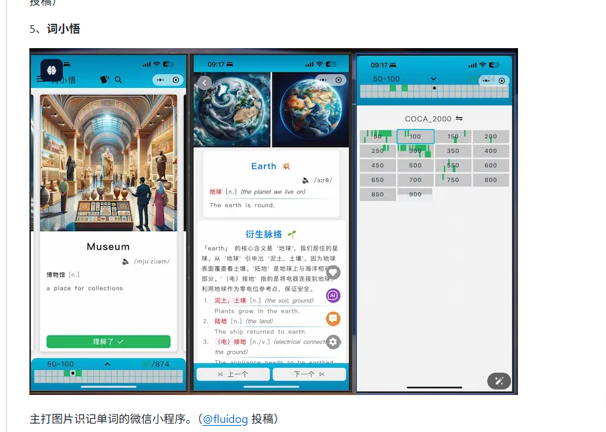

[toc]

### 2.2 账号密码

- 账号：
  - 01404潘锐琦--企业邮箱账号：panruiqi@ovopark.com  
  - AD账号（含电脑开机、企业云盘、WIKI/JIRA/VPN/堡垒机）：panruiqi 
  - 万店掌系统账号（含Web/APP/CRM)：19212064006
  - gitlab:panruiqi
  - cursor
    - 账号：ElowenSeraphiel@caa.columbia.edu
    - 密码 ：HDs_637DGHghsdg_1
- 密码：
  - Panshao123
  - Panshao12

现在我存在一个问题，就是没有gitlab的账号和密码，我跟人事沟通后，他们说他们无法开通。

