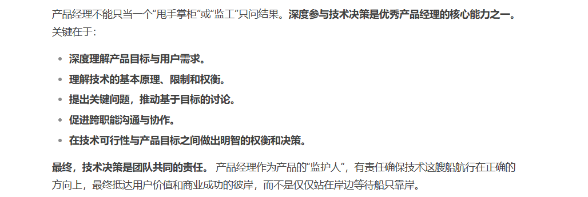

[toc]

### 2.2 账号密码

- 账号：
  - 01404潘锐琦--企业邮箱账号：panruiqi@ovopark.com  
  - AD账号（含电脑开机、企业云盘、WIKI/JIRA/VPN/堡垒机）：panruiqi 
  - 万店掌系统账号（含Web/APP/CRM)：19212064006
  - gitlab:panruiqi
  - cursor
    - 账号：ElowenSeraphiel@caa.columbia.edu
    - 密码 ：HDs_637DGHghsdg_1
  - 万店掌测试服
    - test_wyl
    - 666666
    - test.wistore.net
- 密码：
  - Panshao123
  - Panshao12

？这是两种不同实现思路的事，如果是他那边给出，他当然需要你给出图片了，这有什么问题吗？

这又不是简单的图片的事，这是职责划分的事，是否按照标准化的实现思路，后端传递图片和尺寸。我这边做处理。亦或者的

你的意思是，你作为产品经理，啥技术方案都不管呗，只要结果呗。那我和你说实现不了，你是不是只会找领导，而不是帮技术分析为啥做不了？哪方面需要得到帮助？这方面或许可以怎样优化？

那你这产品经理的专业度可能要有一点点问题吧，自己做的产品，自己好像一点都没参与进去。

