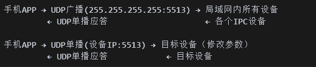
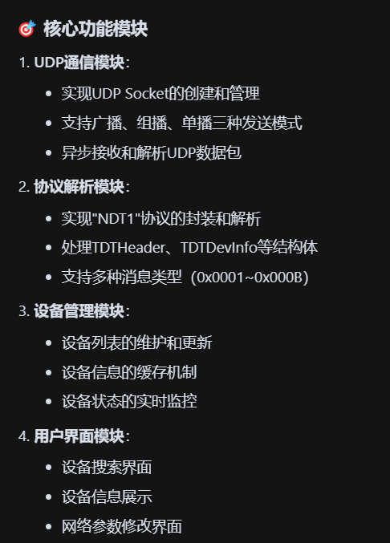

[toc]

## 01.功能概述

- **功能ID**：`FEAT-20250829-001`  
- **功能名称**：
- **目标版本**
- **提交人**：@panruiqi  
- **状态**：
  - [x] ⌛ 设计中 /
  - [ ] ⌛ 开发中 / 
  - [ ] ✅ 已完成 / 
  - [ ] ❌ 已取消  
- **价值评估**：  
  - [x] ⭐⭐⭐⭐⭐ 核心业务功能  
  - [ ] ⭐⭐⭐⭐ 用户体验优化  
  - [ ] ⭐⭐⭐ 辅助功能增强  
  - [ ] ⭐⭐ 技术债务清理  
- **功能描述** 
  - 师傅现场调试设备的时候，有的时候要修改设备的IP，这样做相当麻烦，需要电脑。我们期望在手机里实现这个功能，首先是同一网段下设备的发现，我们也可以进行设备的信息的获取，然后我们可以去修改设备的信息等。关键是这个 [搜索工具-通信协议.md](搜索工具-通信协议.md) 

## 02.需求分析

### 2.1 用户场景

- **主要场景**：  

  - 

- **边界场景**：  

### 2.2 功能范围

- ✅ 包含：
- ❌ 不包含：

## 03.技术方案

### 3.0 预分析

实现原理是什么？是UDP通过网关转发吗？

不是通过网关转发，而是直接局域网通信

从协议文档可以看出，这套系统采用的是直接UDP广播/组播的方式，而不是通过网关转发：

- 广播发现机制：
  - 手机发送UDP广播到 255.255.255.255:5513（全网段广播）
  - 或者发送UDP组播到 224.16.32.1:5510（组播地址）
  - 同网段内的所有IPC设备都能直接收到这个广播消息
- 设备响应机制：
  - 设备收到搜索请求后，直接用UDP单播回复给手机
  - 回复包含设备的IP、MAC、设备名称、型号等完整信息
- 参数修改机制：
  - 手机通过UDP单播直接发送给目标设备
  - 设备收到后直接应答成功/失败状态

- 通信流程
  - 

核心功能模块

- 

### 3.1 方案一

- 实现思路：
  - 

### 3.2 方案二

- 实现思路：

## 04.实现规划

### 4.1 技术选型

### 4.2 任务拆解

### 4.3 代码路径

## 05.兼容性设计

### 5.1 设备适配

### 5.2 冲突检查

## 06.测试方案

### 6.1 核心用例

### 6.2 性能指标

## 07.发布计划

### 7.1 阶段发布

### 7.2 回滚方案

## 08.文档记录

### 8.1 技术文档

### 8.2 用户文档

### 8.3 监控埋点

