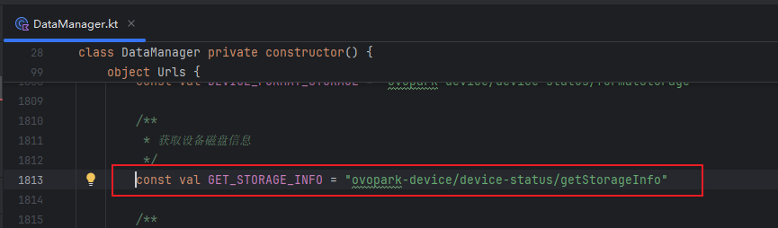
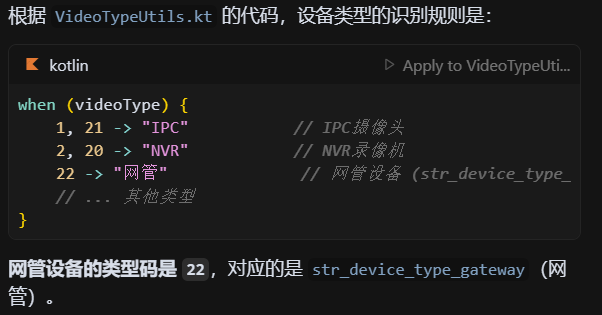
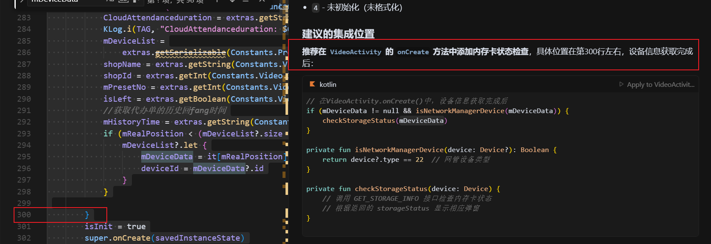
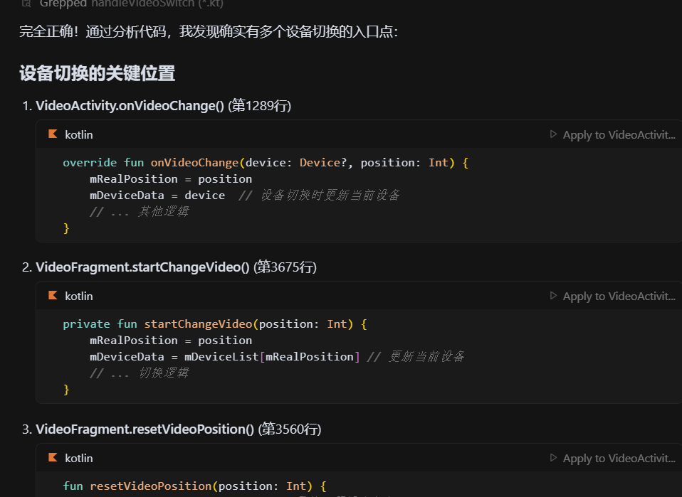
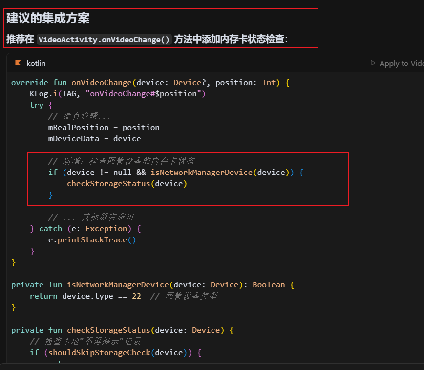

[toc]

## 01.功能概述

- **功能ID**：`FEAT-20250609-001`  
- **功能名称**：
- **目标版本**：v0.2.0
- **提交人**：@panruiqi  
- **状态**：
  - [x] ⌛ 设计中 /
  - [ ] ⌛ 开发中 / 
  - [ ] ✅ 已完成 / 
  - [ ] ❌ 已取消  
- **价值评估**：  
  - [x] ⭐⭐⭐⭐⭐ 核心业务功能  
  - [ ] ⭐⭐⭐⭐ 用户体验优化  
  - [ ] ⭐⭐⭐ 辅助功能增强  
  - [ ] ⭐⭐ 技术债务清理  
- **需求背景** 
  - 交付反馈由于客户不格式化内存卡导致网络设备没录像的问题频发，希望在视频页给出提示，让客户看视频的时候就知道自己要去格式化（必须加在视频页，加在其他页面客户是不会看的，客户只看视频）

## 02.需求分析

### 2.1 用户场景

- **主要场景**：  

  - 仅针对“网管设备”查询内存卡状态

    - 进入视频页时，判断当前设备类型是否为“网管设备”。

    - 仅对网管设备进行内存卡状态查询，NVR通道或其他类型设备不做处理

  - 查询内存卡状态并处理四种结果

    - 状态一：正常

      - 内存卡状态正常时，页面无任何提示，用户无感知。

    - 状态二：未格式化

      - 弹窗提示：“此设备内存卡未格式化，设备无法录像，请格式化内存卡”

      - 弹窗有两个按钮：

      - “格式化”：跳转到设备设置页，并引导用户点击格式化按钮

      - “取消”：关闭弹窗，停留在视频页。下次进入视频页如果状态依旧未格式化，继续弹窗。

    - 状态三：未安装

      - 弹窗提示：“未安装内存卡，设备无法录像，请联系管理员”

      - 弹窗有两个按钮：

      - “不再提示”：本地记录该设备该异常类型对当前用户不再弹窗（永久忽略，仅本地生效，其他设备/用户/异常类型不影响）

      - “取消”：关闭弹窗，停留在视频页。下次进入视频页如果状态依旧未安装，继续弹窗。

    - 状态四：异常

      - 弹窗提示：“内存卡异常，设备无法录像，请联系管理员”

      - 弹窗有两个按钮：

      - “不再提示”：本地记录该设备该异常类型对当前用户不再弹窗（永久忽略，仅本地生效，其他设备/用户/异常类型不影响）

      - “取消”：关闭弹窗，停留在视频页。下次进入视频页如果状态依旧异常，继续弹窗。

  - “不再提示”本地记录规则

    - 仅对当前用户、当前设备、当前异常类型生效。

    - 其他用户、其他设备、其他异常类型不受影响。

    - 记录建议本地持久化（如SharedPreferences/本地数据库）。

  - 跳转设置页的引导标识

    - 仅当从“未格式化”弹窗点击“格式化”跳转到设置页时，显示引导标识（如高亮、箭头、气泡等）。

    - 其他入口进入设置页不显示引导标识。

    - 可通过路由参数/intent参数传递“引导标识”状态。

  - 交互细节

    - “取消”操作仅本次有效，下次进入视频页如果状态依旧异常，继续弹窗。

    - “不再提示”操作永久生效，直到本地记录被清除。

  - 总结：

    - 只对网管设备做内存卡状态弹窗提示。

    - 异常类型分为：未格式化、未安装、异常，分别有不同弹窗和按钮逻辑。

    - “不再提示”需本地永久记录，按设备+异常类型+用户维度。

    - 跳转设置页时，需区分是否带有“引导标识”参数。

- **边界场景**：  

### 2.2 功能范围

- ✅ 包含：
- ❌ 不包含：

## 03.技术方案

### 3.0 预分析

首先，接口是什么？

- 

好，我不理解的是：进入视频页时，判断当前设备类型是否为“网管设备”。我们项目中有几种类型的视频页？我该在视频页的进入位置加吗？

- 首先是网管设备的判定
  - 
- 其次是添加位置的判定，我们至少有如下的视频播放页
  - 主要视频页面：
    - VideoActivity - 主要的视频播放页面（巡店/摇一摇视频播放）
    - VideoFragment - 视频播放Fragment
    - VideoPlayFragment - 视频播放Fragment
  - 其他视频相关页面：
    - TrainVideoPlayActivity - 培训视频播放页面
    - VideoGuidanceActivity - 视频引导页面
    - Flutter模块中的视频页面
  - 我们该在哪个位置添加呢？VideoActivity 是主要的视频播放页面。在这个位置添加吗？
  - 应该在VideoActivity中添加
  - 
- 好，现在新的问题，他内部可以切换设备，切换设备好，应该也要加判断
  - 我们内部切换设备的逻辑有如下
  - 
  - 建议的集成方案，VideoActivity中添加
  - 

好，接下来新的问题，弹窗怎么实现？

- 使用CommonUtils？

本地数据的存储呢？

- 使用EasyDataStore 工具类

### 3.1 方案一

- 实现思路：
  - 

### 3.2 方案二

- 实现思路：

## 04.实现规划

### 4.1 技术选型

### 4.2 任务拆解

### 4.3 代码路径

## 05.兼容性设计

### 5.1 设备适配

### 5.2 冲突检查

## 06.测试方案

### 6.1 核心用例

### 6.2 性能指标

## 07.发布计划

### 7.1 阶段发布

### 7.2 回滚方案

## 08.文档记录

### 8.1 技术文档

### 8.2 用户文档

### 8.3 监控埋点

