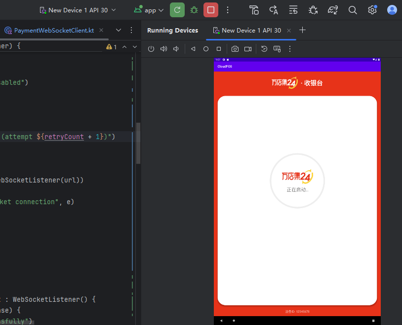
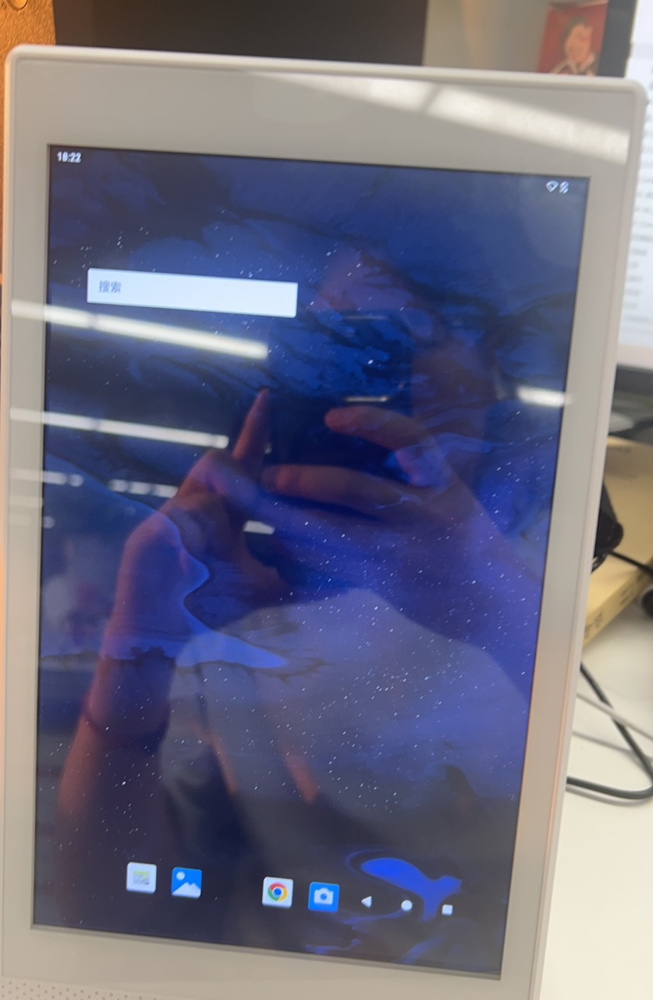
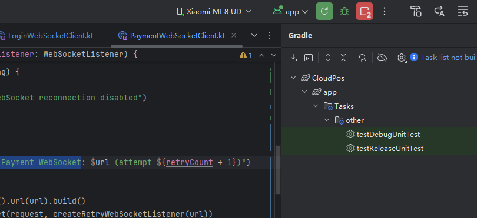
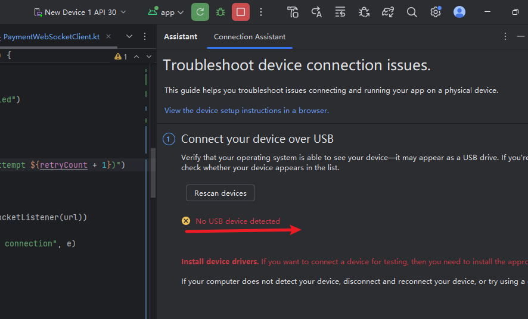
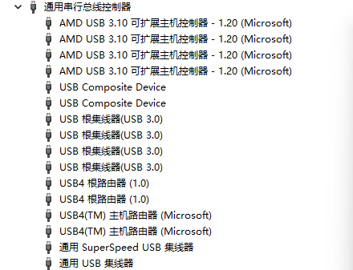
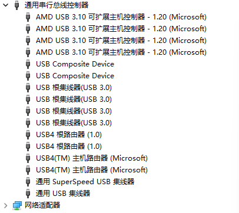
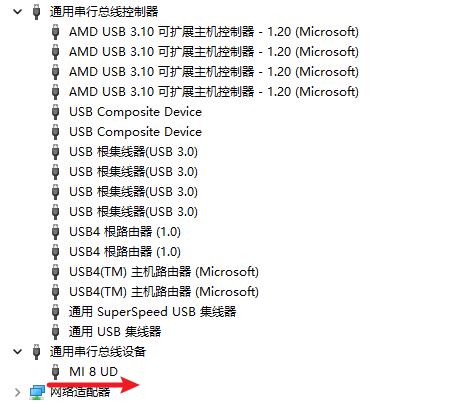
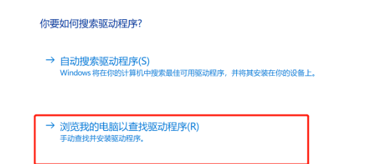

[toc]

## 01.问题

### 1.1 无法实机调试

- 现象描述：USB连接后在Android Studio中无法实机调试
  - 注意：这里实际USB线连接了，但是上面的Running Devices是虚拟机，实机无反应
  - 
  - 
- 解决方法：
  - 尝试排除usb线的问题：使用同一根usb线，连接到小米手机，可以调试
    - 
    - 
  - 方法二：没有出现，尝试重新扫描连接设备
    - 多次尝试，没有出现
    - 
  - 方法三：查看设备管理器，是否正确识别设备：
    - 插入前状态
      - 
    - 插入后状态：
      - 
    - 对比插入小米手机：小米手机正确识别，状态如下：表明系统未识别到设备
      - 

- 阶段性总结：Android Studio未识别到实机设备，同时设备管理器中也没识别到
- 问题分析：网络上搜索总结，得出可能原因如下：
  - 电脑设备驱动问题，需要更新设备驱动：更新后还是一样
    - 
  - USB连接（多次插拔已排除）
  - 检查设备设置：在设备的“开发者选项”中确保“USB调试”已打开。打开了，但是仍然同样的问题
  - 检查设备是否需要授权：当设备首次连接电脑时，设备上会弹出“允许USB调试吗？”的对话框，勾选“始终允许”并点击“确定”。
    - 没有弹出对应的弹窗
  - 防火墙/安全软件：临时禁用防火墙或安全软件，看是否阻止了ADB连接。
    - 排除问题， 以及关闭
- 目前结论：需要厂家提供支持。
  - 核心目的：Android Studio可以识别到实机设备，进行调试
  - 我可以提供的已尝试的方法和结果：参考上面。

