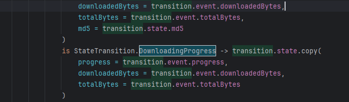
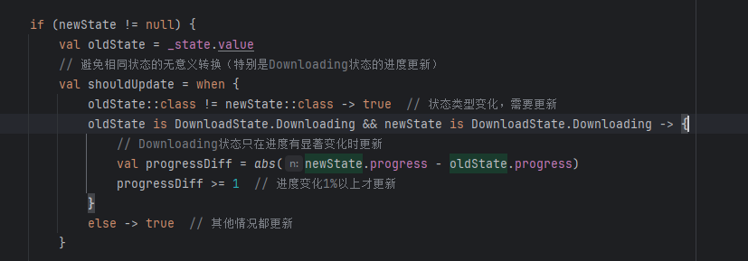

[toc]

## 01.功能概述

- **功能ID**：`FEAT-20250607-001`  
- **功能名称**：
- **目标版本**：v0.1.0
- **提交人**：@panruiqi  
- **状态**：
  - [x] ⌛ 设计中 /
  - [ ] ⌛ 开发中 / 
  - [ ] ✅ 已完成 / 
  - [ ] ❌ 已取消  
- **价值评估**：  
  - [x] ⭐⭐⭐⭐⭐ 核心业务功能  
  - [ ] ⭐⭐⭐⭐ 用户体验优化  
  - [ ] ⭐⭐⭐ 辅助功能增强  
  - [ ] ⭐⭐ 技术债务清理  
- **功能描述** 
  - OTA（Over-The-Air）远程升级模块为CloudPos应用提供完整的应用自动更新解决方案，支持版本检查、文件下载、完整性校验和自动安装。


## 02.需求分析

### 2.1 用户场景

- **主要场景**：  

  - 我们远程发布一个新的版本，用户现在需要可以远程更新安装新版本

- **边界场景**：  

### 2.2 功能范围

- ✅ 包含：
- ❌ 不包含：


## 03.技术方案

### 3.1 方案一

- 实现思路：

  - 整体：存放在/feat下

  - 结构：分为

    - Presentation：显示OTA更新对话框（现在外放到Pop模块中实现了）
    - Manager：分为UpdateManager版本检测管理器，APKDownloadManager下载安装管理器
    - Data：IUpdateRepository仓库层接口定义及实现
    - NetWork层：UpdateService（API接口）， DataModels（VersionInfo，UpdateInfo，VersionResponse）

  - 参考下图

    - ```
      ┌─────────────────────────────────────────────────────┐
      │                   Presentation Layer                │
      │  ┌─────────────────┐  ┌─────────────────────────────┐ │
      │  │  OtaUpdateDialog │  │      Layout Files           │ │
      │  │  (3种状态对话框)   │  │  • normal_update.xml        │ │
      │  └─────────────────┘  │  • force_update.xml         │ │
      │                       │  • updating.xml             │ │
      │                       └─────────────────────────────┘ │
      ├─────────────────────────────────────────────────────┤
      │                    Manager Layer                    │
      │  ┌─────────────────┐  ┌─────────────────────────────┐ │
      │  │  UpdateManager  │  │   ApkDownloadManager        │ │
      │  │  (版本检查管理)   │  │   (下载&安装管理)            │ │
      │  └─────────────────┘  └─────────────────────────────┘ │
      ├─────────────────────────────────────────────────────┤
      │                     Data Layer                      │
      │  ┌─────────────────┐  ┌─────────────────────────────┐ │
      │  │ IUpdateRepository│  │     UpdateRepository        │ │
      │  │   (接口定义)      │  │     (具体实现)               │ │
      │  └─────────────────┘  └─────────────────────────────┘ │
      ├─────────────────────────────────────────────────────┤
      │                   Network Layer                     │
      │  ┌─────────────────┐  ┌─────────────────────────────┐ │
      │  │  UpdateService  │  │       Data Models           │ │
      │  │  (API接口)      │  │  • VersionInfo              │ │
      │  └─────────────────┘  │  • UpdateInfo               │ │
      │                       │  • VersionResponse          │ │
      │                       └─────────────────────────────┘ │
      └─────────────────────────────────────────────────────┘
      ```

### 3.2 方案二

- 实现思路：

  - 这是最开始的实现方案。就是方案一去掉下载，安装管理一部分，将这一部分外包给浏览器实现，也就是版本检查管理检测到要下载的包地址，并且确认要下载时，调用浏览器，传递url信息，在浏览器中打开并执行。

### 3.3 方案三

- 方案一目前存在哪些问题？

  - 回调地狱 & 线程切换混乱

    - ```
      // 当前代码中频繁的线程切换
      CoroutineScope(Dispatchers.Main).launch {
          listener.onProgress(progress)
      }
      ```

  - 状态管理分散

    - 下载状态散落在各处，难以统一管理

    - 缺乏状态持久化，应用重启后状态丢失

- 实现思路：

## 04.实现规划

### 4.1 技术选型

方案二无法在应用内部更新，我们的Pos机希望的是用户只能操作Pos机，避免对其他位置的操控。因此采用方案一

至于方案三，这是后续才想到的方案。

### 4.2 任务拆解

- 检查更新

  - ```
     /**
         * 检查并处理版本更新
         * 
         * @param activity 当前Activity实例
         * @param broadHeading 必需参数，默认"CLOUD_POS"
         * @param deviceType 设备类型，默认"CloudPos"
         * @param type 类型，可选
         * @param showNoUpdateToast 当没有更新时是否显示提示
         * @param scope 协程作用域
         */
        fun checkUpdate(
            activity: Activity,
            broadHeading: String = "CLOUD_POS",
            deviceType: String = "CloudPos",
            type: Int? = null,
            showNoUpdateToast: Boolean = false,
            scope: CoroutineScope
        ) {
            LogManager.i("开始检查版本更新: broadHeading=$broadHeading, deviceType=$deviceType")
            
            scope.launch {
                try {
                    when (val result = updateRepository.checkUpdate(broadHeading, deviceType, type)) {
                        is Resource.Success -> {
                            withContext(Dispatchers.Main) {
                                handleUpdateResult(activity, result.data, showNoUpdateToast)
                            }
                        }
                        
                        is Resource.Error -> {
                            LogManager.e("版本检查失败: ${result.message}", result.exception)
                            if (showNoUpdateToast) {
                                withContext(Dispatchers.Main) {
                                    if (!activity.isFinishing && !activity.isDestroyed) {
                                        android.widget.Toast.makeText(
                                            activity,
                                            "检查更新失败: ${result.message}",
                                            android.widget.Toast.LENGTH_SHORT
                                        ).show()
                                    }
                                }
                            }
                        }
                        
                        is Resource.Loading -> {
                            LogManager.d("正在检查版本更新...")
                        }
                    }
                } catch (e: Exception) {
                    LogManager.e("版本检查异常: ${e.message}", e)
                    if (showNoUpdateToast) {
                        withContext(Dispatchers.Main) {
                            if (!activity.isFinishing && !activity.isDestroyed) {
                                android.widget.Toast.makeText(
                                    activity,
                                    "检查更新异常: ${e.message}",
                                    android.widget.Toast.LENGTH_SHORT
                                ).show()
                            }
                        }
                    }
                }
            }
        }
        
        
          /**
         * 处理更新检查结果
         */
        private fun handleUpdateResult(activity: Activity, versionInfo: VersionInfo, showNoUpdateToast: Boolean) {
            try {
                // 检查Activity是否仍然有效
                if (activity.isFinishing || activity.isDestroyed) {
                    LogManager.w("Activity已结束或销毁，取消显示更新对话框")
                    return
                }
                
                val needUpdate = updateRepository.needUpdate(versionInfo)
                val isForceUpdate = updateRepository.isForceUpdate(versionInfo)
                
                LogManager.i("更新检查结果: needUpdate=$needUpdate, isForceUpdate=$isForceUpdate, version=${versionInfo.version}")
                LogManager.d("版本详情: versionCode=${versionInfo.versionCode}, description=${versionInfo.description}")
                LogManager.d("下载信息: url=${versionInfo.getBestDownloadUrl()}, md5=${versionInfo.md5}")
                
                if (needUpdate) {
                    LogManager.i("显示OTA更新对话框")
      
                    // 创建UpdateInfo对象
                    val updateInfo = UpdateInfo(
                        description = versionInfo.description,
                        forceUpdate = versionInfo.getForceUpdateAsInt(),
                        versionCode = versionInfo.getVersionCodeAsInt(),
                        version = versionInfo.version,
                        md5 = versionInfo.md5,
                        url = versionInfo.getBestDownloadUrl()
                    )
      
                    // 再次检查Activity状态，确保在显示对话框前Activity仍然有效
                    if (!activity.isFinishing && !activity.isDestroyed) {
                        showOtaUpdateDialog(activity, updateInfo, isForceUpdate)
                    } else {
                        LogManager.w("准备显示对话框时发现Activity已无效")
                    }
      
                } else {
                    LogManager.i("当前已是最新版本")
                    if (showNoUpdateToast && !activity.isFinishing) {
                        android.widget.Toast.makeText(
                            activity,
                            "当前已是最新版本",
                            android.widget.Toast.LENGTH_SHORT
                        ).show()
                    }
                }
            } catch (e: Exception) {
                LogManager.e("处理更新结果异常: ${e.message}", e)
                if (showNoUpdateToast && !activity.isFinishing && !activity.isDestroyed) {
                    android.widget.Toast.makeText(
                        activity,
                        "处理更新结果异常: ${e.message}",
                        android.widget.Toast.LENGTH_SHORT
                    ).show()
                }
            }
        }
    ```

  - API获取OTA结果，包括新的版本号，版本信息，更新的URL。

  - 进行版本比对，如果需要更新，显示更新弹窗。

- 更新方法

  - ```
     /**
         * 显示OTA更新对话框 - 使用新的Popup系统
         */
        private fun showOtaUpdateDialog(activity: Activity, updateInfo: UpdateInfo, isForceUpdate: Boolean) {
            popupManager = PopupManager.getInstance(activity)
            
            if (isForceUpdate) {
                // 显示强制更新弹窗
                val config = PopupFactory.createOtaForceUpdatePopup(
                    version = updateInfo.version,
                    buildNumber = updateInfo.versionCode.toString(),
                    updateContent = updateInfo.description.ifEmpty { getDefaultUpdateContent() },
                    onConfirm = {
                        LogManager.i("用户确认强制更新")
                        popupManager?.hideCurrentPopup()
                        startUpdateDownload(activity, updateInfo)
                    }
                )
                popupManager?.showPopup(config)
            } else {
                // 显示普通更新弹窗
                val config = PopupFactory.createOtaNormalUpdatePopup(
                    version = updateInfo.version,
                    buildNumber = updateInfo.versionCode.toString(), 
                    updateContent = updateInfo.description.ifEmpty { getDefaultUpdateContent() },
                    onConfirm = {
                        LogManager.i("用户确认普通更新")
                        popupManager?.hideCurrentPopup()
                        startUpdateDownload(activity, updateInfo)
                    },
                    onCancel = {
                        LogManager.i("用户取消更新")
                        popupManager?.hideCurrentPopup()
                        saveIgnoreVersion(activity, updateInfo.version)
                    }
                )
                popupManager?.showPopup(config)
            }
        }
        
        /**
         * 开始更新下载
         */
        private fun startUpdateDownload(activity: Activity, updateInfo: UpdateInfo) {
            currentUpdateInfo = updateInfo
            apkDownloadManager = ApkDownloadManager(activity)
            
            // 显示更新中弹窗
            val config = PopupFactory.createOtaUpdatingPopup(
                version = updateInfo.version,
                buildNumber = updateInfo.versionCode.toString(),
                updateContent = updateInfo.description.ifEmpty { getDefaultUpdateContent() },
                progress = 0,
                onCancel = {
                    LogManager.i("用户取消下载")
                    apkDownloadManager?.cancelDownload()
                    popupManager?.hideCurrentPopup()
                }
            )
            popupManager?.showPopup(config)
            
            // 开始下载
            apkDownloadManager?.downloadApk(
                downloadUrl = updateInfo.url,
                md5 = updateInfo.md5,
                listener = object : ApkDownloadManager.DownloadProgressListener {
                    override fun onProgress(progress: Int) {
                        activity.runOnUiThread {
                            updateDownloadProgress(progress)
                        }
                    }
                    
                    override fun onSuccess(apkFile: java.io.File) {
                        activity.runOnUiThread {
                            LogManager.i("APK下载完成，准备安装")
                            currentApkFile = apkFile
                            popupManager?.hideCurrentPopup()
                            installApk(apkFile, activity)
                        }
                    }
                    
                    override fun onError(error: Exception) {
                        activity.runOnUiThread {
                            LogManager.e("APK下载失败: ${error.message}", error)
                            currentApkFile = null
                            popupManager?.hideCurrentPopup()
                            showDownloadErrorToast(activity, error.message ?: "下载失败")
                        }
                    }
                    
                    override fun onNeedInstallPermission() {
                        activity.runOnUiThread {
                            LogManager.w("需要安装权限")
                            // 保存APK文件路径到PreferenceManager
                            preferenceManager.savePendingApkPath(currentApkFile.toString())
                            showInstallPermissionDialog(activity)
                        }
                    }
                }
            )
            
            LogManager.i("开始下载更新: ${updateInfo.url}")
        }
    ```

- 调用pop模块显示更新弹窗，确认按钮中开始更新下载，调用APKDownloadManager进行下载管理

  - ```
    
            /**
             * 开始下载APK
             * 
             * @param downloadUrl APK下载链接
             * @param md5 文件MD5校验码（可选）
             * @param fileName APK文件名
             * @param listener 下载进度监听器
             */
            fun downloadApk(
                downloadUrl: String,
                md5: String? = null,
                fileName: String = "update.apk",
                listener: DownloadProgressListener
            ) {
                LogManager.i("开始下载APK: url=$downloadUrl, fileName=$fileName")
                
                downloadJob = CoroutineScope(Dispatchers.IO).launch {
                    try {
                        val apkFile = performDownload(downloadUrl, fileName) { progress ->
                            // 回调下载进度到主线程
                            CoroutineScope(Dispatchers.Main).launch {
                                listener.onProgress(progress)
                            }
                        }
                        
                        // 验证MD5
                        if (md5 != null && md5.isNotEmpty()) {
                            val fileMd5 = calculateMD5(apkFile)
                            if (fileMd5 != md5) {
                                LogManager.e("MD5校验失败: 期望=$md5, 实际=$fileMd5")
                                CoroutineScope(Dispatchers.Main).launch {
                                    listener.onError(Exception("MD5校验失败"))
                                }
                                return@launch
                            }
                            LogManager.i("MD5校验成功")
                        }
                        
                        // 下载成功
                        CoroutineScope(Dispatchers.Main).launch {
                            listener.onSuccess(apkFile)
                        }
                        
                    } catch (e: Exception) {
                        LogManager.e("下载APK失败: ${e.message}", e)
                        CoroutineScope(Dispatchers.Main).launch {
                            listener.onError(e)
                        }
                    }
                }
            }
      
            /**
             * 执行下载
             */
            private suspend fun performDownload(
                downloadUrl: String,
                fileName: String,
                progressCallback: (Int) -> Unit
            ): File {
                return withContext(Dispatchers.IO) {
                    val downloadDir = getDownloadDir()
                    val apkFile = File(downloadDir, fileName)
                    
                    // 如果文件已存在，删除
                    if (apkFile.exists()) {
                        apkFile.delete()
                    }
                    
                    val url = URL(downloadUrl)
                    val connection = url.openConnection() as HttpURLConnection
                    connection.connectTimeout = CONNECT_TIMEOUT
                    connection.readTimeout = READ_TIMEOUT
                    connection.requestMethod = "GET"
                    
                    try {
                        connection.connect()
                        
                        if (connection.responseCode != HttpURLConnection.HTTP_OK) {
                            throw Exception("HTTP响应错误: ${connection.responseCode}")
                        }
                        
                        val fileLength = connection.contentLength
                        val inputStream: InputStream = connection.inputStream
                        val outputStream = FileOutputStream(apkFile)
                        
                        val buffer = ByteArray(BUFFER_SIZE)
                        var totalBytesRead = 0L
                        var bytesRead: Int
                        
                        while (inputStream.read(buffer).also { bytesRead = it } != -1) {
                            outputStream.write(buffer, 0, bytesRead)
                            totalBytesRead += bytesRead
                            
                            // 计算进度
                            if (fileLength > 0) {
                                val progress = (totalBytesRead * 100 / fileLength).toInt()
                                progressCallback(progress)
                            }
                        }
                        
                        outputStream.close()
                        inputStream.close()
                        
                        LogManager.i("APK下载完成: ${apkFile.absolutePath}, 大小: ${apkFile.length()}")
                        return@withContext apkFile
                        
                    } finally {
                        connection.disconnect()
                    }
                }
            }
    ```

  - 通过Http进行下载操作，下载过程中调用更新progess的回调，下载完成后调用success回调进行安装操作

- 下载APK文件过程

  - 建立Http连接

    - ```
      val url = URL(downloadUrl)
      val connection = url.openConnection() as HttpURLConnection
      connection.connectTimeout = CONNECT_TIMEOUT
      connection.readTimeout = READ_TIMEOUT
      connection.requestMethod = "GET"
      ```

    - 创建 URL 对象，打开 HTTP 连接。

    - 设置连接超时、读取超时、请求方法为 GET。

  - 连接服务器

    - ```
      connection.connect()
      ```

    - 发起网络连接。

  - 检查响应码

    - ```
      if (connection.responseCode != HttpURLConnection.HTTP_OK) {
          throw Exception("HTTP响应错误: ${connection.responseCode}")
      }
      ```

    - 如果服务器响应不是 200（OK），抛出异常，终止下载

  - 获取文件长度和流

    - ```
      val fileLength = connection.contentLength
      val inputStream: InputStream = connection.inputStream
      val outputStream = FileOutputStream(apkFile)
      ```

    - 获取文件总长度（用于计算进度）。

    - 获取输入流（从网络读取数据），输出流（写入本地文件）。

  - 循环读取和写入

    - ```
      val buffer = ByteArray(BUFFER_SIZE)
      var totalBytesRead = 0L
      var bytesRead: Int
      
      while (inputStream.read(buffer).also { bytesRead = it } != -1) {
          outputStream.write(buffer, 0, bytesRead)
          totalBytesRead += bytesRead
      
          // 计算进度
          if (fileLength > 0) {
              val progress = (totalBytesRead * 100 / fileLength).toInt()
              progressCallback(progress)
          }
      }
      ```

    - 每次从输入流读取一块数据，写入输出流。

    - 累加已下载字节数，计算百分比进度，并通过 progressCallback(progress) 回调通知进度

- 安装过程

  - ```
      /**
         * 安装APK
         */
        fun installApk(apkFile: File, listener: DownloadProgressListener? = null) {
            try {
                LogManager.i("开始安装APK: ${apkFile.absolutePath}")
                
                // Android 8.0以上需要检查安装权限
                if (Build.VERSION.SDK_INT >= Build.VERSION_CODES.O) {
                    if (!context.packageManager.canRequestPackageInstalls()) {
                        LogManager.w("没有安装未知来源应用的权限，通知需要权限")
                        listener?.onNeedInstallPermission()
                        return
                    }
                }
                
                val intent = Intent(Intent.ACTION_VIEW).apply {
                    flags = Intent.FLAG_ACTIVITY_NEW_TASK or Intent.FLAG_ACTIVITY_CLEAR_TOP
                    
                    if (Build.VERSION.SDK_INT >= Build.VERSION_CODES.N) {
                        // Android 7.0及以上使用FileProvider
                        val apkUri = FileProvider.getUriForFile(
                            context,
                            "${context.packageName}.fileprovider",
                            apkFile
                        )
                        setDataAndType(apkUri, "application/vnd.android.package-archive")
                        addFlags(Intent.FLAG_GRANT_READ_URI_PERMISSION)
                    } else {
                        // Android 7.0以下直接使用文件URI
                        setDataAndType(Uri.fromFile(apkFile), "application/vnd.android.package-archive")
                    }
                }
                
                context.startActivity(intent)
                LogManager.i("启动APK安装")
                
            } catch (e: Exception) {
                LogManager.e("安装APK失败: ${e.message}", e)
                throw e
            }
        }
    ```

  - 检查有无安装权限，没有就跳出到系统设置页，并保存下载路径到preference中，回到Main后检测preference中是否有路径，有就继续安装流程

  - 有安装权限就跳转到安装界面

- 怎么跳转到系统安装界面的？

  -  为什么这个 Intent 会调用系统的 APK 安装器？

    - 关键在于这两点：

      ① action 和 type 的组合

      - action = Intent.ACTION_VIEW

      这表示“我要查看一个东西”。

      - type = "application/vnd.android.package-archive"

      这表示“这个东西是一个 APK 安装包”。

      ② data 是 APK 文件的 URI

      - 你传递的是一个 APK 文件的路径（content://... 或 file://...）。

    ------

    - 这三者组合起来，系统会怎么做？
      - 系统收到这个 Intent 后，会查找能处理这种“查看 APK 文件”请求的应用。
      - Android 系统自带的 Package Installer（包安装器）注册了能处理这种类型的 Intent。
      - 所以系统就会自动用 Package Installer 来响应你的请求，弹出安装界面。

    ------

  - 类比举例

    - 如果你用 ACTION_VIEW + image/* + 图片的 URI，系统会弹出图片查看器。

    - 如果你用 ACTION_VIEW + http://...，系统会弹出浏览器。

    - 如果你用 ACTION_VIEW + application/pdf，系统会弹出 PDF 阅读器。

    - 你用 ACTION_VIEW + application/vnd.android.package-archive + APK 文件，系统就会弹出安装器。

    本质上，都是 Intent 匹配机制。

    ------

  -  Intent 匹配机制（简化流程）

    - 你发出 Intent。
    - 系统查找所有能处理这个 Intent 的应用（根据 action、data、type 匹配）。
    - 找到最合适的应用（比如 Package Installer），就用它来处理。

### 4.3 代码路径


## 05.更优雅的方案实现

### 5.1 实现思路

状态机 + flow

UpdateManager

- 观察状态变化：

  - ```
     }
        
        /**
         * 观察下载状态变化
         */
        private fun observeDownloadState(activity: Activity) {
            stateObserverJob?.cancel()
            stateObserverJob = CoroutineScope(Dispatchers.Main).launch {
                apkDownloadManager?.downloadState?.collect { state ->
                    handleDownloadState(activity, state)
                }
            }
        }
        
        /**
         * 处理下载状态变化
         */
        private fun handleDownloadState(activity: Activity, state: DownloadState) {
            LogManager.d("下载状态变化: ${state::class.simpleName}")
            
            when (state) {
                is DownloadState.Downloading -> {
                    // 更新下载进度
                    updateDownloadProgress(state.progress)
                }
                
                is DownloadState.Success -> {
                    // 下载成功，准备安装
                    LogManager.i("APK下载完成，准备安装")
                    popupManager?.hideCurrentPopup()
                    installApk(activity, state.apkFile)
                }
                
                is DownloadState.Error -> {
                    // 下载出错
                    LogManager.e("APK下载失败: ${state.message}")
                    popupManager?.hideCurrentPopup()
                    
                    if (state.canRetry) {
                        // 显示重试对话框
                        showRetryDialog(activity, state)
                    } else {
                        // 显示错误信息
                        showDownloadErrorToast(activity, state.message)
                    }
                }
                
                is DownloadState.NeedInstallPermission -> {
                    // 需要安装权限
                    LogManager.w("需要安装权限")
                    popupManager?.hideCurrentPopup()
                    // 保存APK文件路径到PreferenceManager
                    preferenceManager.savePendingApkPath(state.filePath)
                    showInstallPermissionDialog(activity)
                }
                
                is DownloadState.Cancelled -> {
                    LogManager.i("下载已取消")
                    popupManager?.hideCurrentPopup()
                }
                
                else -> {
                    // 其他状态暂不处理
                }
            }
        }
    ```

  - 其观察状态机中流的变化执行对应的操作，比如：流为：Success下载成功状态，那么就去installApk安装。

ApkDownloadManager：执行下载等操作，这个过程中发生事件，触发状态机中状态流的变化（旧状态 + 事件 = 新状态）

- 比如：Update状态

  - ```
    // 优化进度更新：只在进度变化1%或时间间隔足够时才更新
                        if (fileLength > 0) {
                            val currentProgress = (totalBytesRead * 100 / fileLength).toInt()
                            val currentTime = System.currentTimeMillis()
                            
                            // 检查是否需要更新进度：进度变化>=1% 或 时间间隔>=500ms
                            if (currentProgress != lastProgress && 
                                (currentProgress - lastProgress >= 1 || currentTime - lastUpdateTime >= updateInterval)) {
                                
                                stateMachine.handleEvent(
                                    DownloadEvent.ProgressUpdate(
                                        progress = currentProgress,
                                        downloadedBytes = totalBytesRead,
                                        totalBytes = fileLength.toLong()
                                    )
                                )
                                
                                lastProgress = currentProgress
                                lastUpdateTime = currentTime
                            }
                        }
    ```

  - 此时下载中，不断触发事件：进度条更新事件。进入到状态机中，downloading状态经过更新事件触发，仍然为downloading状态

  - 

  - 此时状态是否真的更新？

    - 

  - 好的，状态开始更新，通过状态机触发，最后触发UpdateManager中的观察事件


## 05.兼容性设计

### 5.1 设备适配


### 5.2 冲突检查


## 06.测试方案

### 6.1 核心用例


### 6.2 性能指标


## 07.发布计划

### 7.1 阶段发布


### 7.2 回滚方案


## 08.文档记录

### 8.1 技术文档


### 8.2 用户文档


### 8.3 监控埋点


