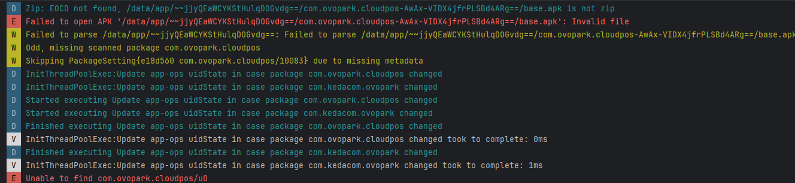

[toc]

## 01.问题记录

- **[严重级别] **
  - [x] ⚠️ 阻断 (Blocker)：系统崩溃、核心功能完全不可用
  - [ ] 🔴 严重 (Critical)：核心功能受损，无可用替代方案
  - [ ] 🟠 高 (High)：主要功能受影响，但有临时解决方案
  - [ ] 🟡 中 (Medium)：次要功能问题，影响用户体验
  - [ ] 🟢 低 (Low)：界面问题或轻微异常，不影响功能
- **问题简要描述**
  - **Bug ID**：`BUG-20240604-002`  
  - **发现日期**：2025-06-04  
  - **影响版本**：v0.4.0 (build 450)  
  - **提交人**：@panruiqi  
  - **状态**：⌛ 修复中
- **问题现象**
  - 系统日志报错：
    - 
  - 每次重启平板，应用都会被删除
  - 在Android 13设备出现
- **环境特征**
  - 设备型号: rk3562_t
  - OS版本: Android 13 (API 34)
  - 网络环境: 公司内网
  - 用户账户: primary_user (ID:0)
  - 触发时机: 系统启动时

## 02.问题分析

### 2.1 日志分析

- 不存在对应应用，无法启动，无日志

### 2.2 根本原因推理

- 是不是只是Android Studio构建的调试版本，系统不把他当成真正的发布的应用，每次重启都清除它？


## 03.代码分析

### 3.1 关联代码路径

### 3.2 可疑修改点

## 04.复现步骤


## 05.原因初步分析

### 5.1 第一次分析


### 5.2 第二次分析


## 06.解决方案尝试

### 6.1 已尝试方案

| 尝试方案     | 执行命令                                     | 结果       | 验证时间         |
| :----------- | :------------------------------------------- | :--------- | :--------------- |
| 清理包缓存   | `pm clear com.ovopark.cloudpos`              | ❌ 失败     | 2025-06-04 11:20 |
| 强制卸载     | `pm uninstall --user 0 com.ovopark.cloudpos` | ✅ 临时解决 | 2025-06-04 11:35 |
| 重建包数据库 | `rm /data/system/packages.xml`               | ⚠️ 系统崩溃 | 2025-06-04 11:50 |

### 6.2 推荐方案

```
+ 安全卸载流程：
  adb shell pm uninstall --user all com.ovopark.cloudpos
  adb reboot
  
+ 数据库修复工具：
  use PackageManager.forceVerifyPackages()
```


## 07.根本原因和修复

### 7.1 最终定位

- `/data/system/packages.xml` 中存在无效条目：

- ```
  <package name="com.ovopark.cloudpos" 
           userId="10083" 
           ...>
    <!-- 缺少关键的 <metadata> 标签 -->
  </package>
  ```

### 7.2 修复方案


## 08.经验总结

### 8.1 技术原理

### 8.2 预防措施

### 8.3 卸载规范

### 8.4 调试技巧

